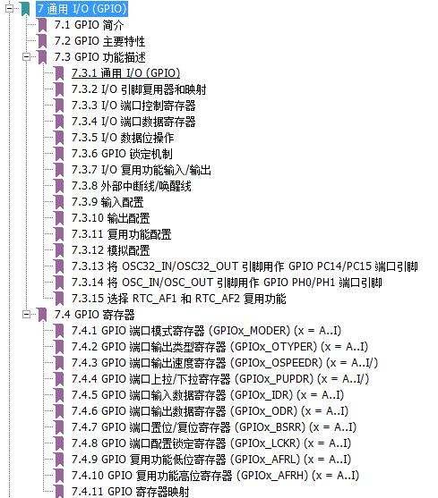
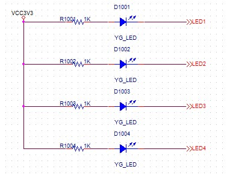
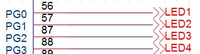
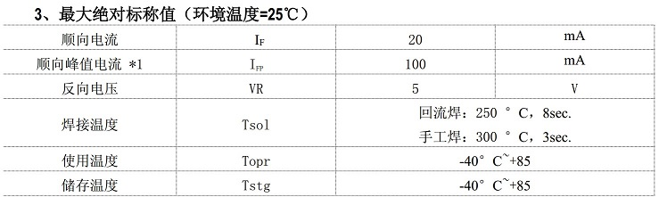

# **IO口输出-流水灯-证明程序在运行**
>**够用的硬件**
>
>**能用的代码**
>
>**实用的教程**
>
>屋脊雀工作室编撰 -20190101
>
>愿景：做一套能用的开源嵌入式驱动（非LINUX）
>
>官网：www.wujique.com
>
>github: https://github.com/wujique/stm32f407
>
>淘宝：https://shop316863092.taobao.com/?spm=2013.1.1000126.2.3a8f4e6eb3rBdf
>
>技术支持邮箱：code@wujique.com、github@wujique.com
>
>资料下载：https://pan.baidu.com/s/12o0Vh4Tv4z_O8qh49JwLjg
>
>QQ群：767214262
---

在第一部分软硬件准备中，我们通过串口将程序下载到芯片，验证硬件基本正常，但并不知道是程序下载进入是否能正常运行呢。
这次我们用一个简单的流水灯，证明程序下载到芯片后可以正常运行。
**流水灯**，就像PC软件上的HelloWord一样，每一个做单片机的工程师都会玩过。
什么叫流水灯呢？就是多个LED排成一列，做出不同的效果，其中较典型的就是LED轮流点亮，像流水一样左右流动。

## IO口
IO是Input/Output的简称，也即是输出输出的意思。
芯片要控制外部器件，或者是从外部获取状态信息，依赖的就是IO。
一个芯片的管脚，除了电源和地，基本上全部都是IO口。
（*有些芯片的部分管脚可能只能做输出或输入中的一种*）
IO最基本的功能是**输出高低电平**和**检测外部是高电平还是低电平**，也即是逻辑电路功能。
至于其它的串口，SPI等接口，也是高低电平，只不过利用电平实现了比较复杂的时序，也属于逻辑范畴。
除此外，一个管脚还可以做DAC/ADC等其它模拟电路的功能。
高低电平的电压由**芯片IO电压**决定，通常高电平是芯片的工作电压，低电平则是0V。
（**高低电平会有一定识别范围，TTL电平和CMOS电平不一样**）
以前的51单片机高电平是5V，目前更多的芯片是3.3V，还有芯片是1.8V。
>一个IO的外接电路、外接器件，要考虑两者之间的电压兼容。
例如，一个3.3V工作电压的单片机，外接一个5V的器件，通常，需要使用电平转换电路。

使用一个IO口通常需要这样配置：
1. 使能这个IO口的时钟。
2. 根据需要配置为输出或者输入
3. 设置IO口模式，是否接上下拉电阻。
4. 作为输入，读IO状态；作为输出，则设置IO口电平。

以上是基本的IO口操作，不同的芯片会有一点差别。

## STM32的IO
STM32功能强大，IO配置也较复杂，现在我们先大概看看IO结构，更多功能后续慢慢了解。
要了解STM32的IO口，请查阅《STM32F4xx中文参考手册.pdf》，在第七章，通用IO。

参考手册分4小节。
在7.3节，有下面这个STM32IO口的结构图。
从这个图，我们可以看到一个IO的输入输出通路、各种配置开关的位置。
如果你硬件比较好，还可以看到这个IO的输入输出结构是怎么样的。
IO口具体如何设置，我们在例程中再说明。


### 原理图
一个IO口是如何点亮一个LED的呢？
我们首先看LED电路原理图，一个LED跟一个电阻串联，一端接到电源，一端接到IO口。



**LED**

>LED:发光二极管，是二极管，就有正负极。当在正负极之间流过一定电流时，就能发光。电流越大，亮度越大。

在资料文件夹内有一个发光二极管的规格书。LED的规格书中有一个很重要的参数。
《黄绿 0603 (33_40mcd)\_PDF_C2289_2015-07-23.pdf》

上图是规格书中的一个表，最需要关注的是第一行，顺向电流20mA，前面说电流越大，亮度越大，但是**流过LED的电流有绝对标称值限制**，我们使用的这颗LED，就不能大于20ma。
为了限制流过LED的电流，我们在LED上串接了一个1K的电阻。
这个电阻就是通常我们所说的**限流电阻**。
当IO输出高电平3.3V时，没有电流流过，LED不发光。
当IO输出低电平0V时，电流从3.3V电源留向IO口，LED有电流流过，发光，其中电流可以简略计算：(3.3-0.6)/1K= 2.7ma。
*上面的电路使用低电平驱动LED，LED的负极接到IO，这种方式叫灌电流驱动。也可以将LED正极接到IO口，电阻接到地，这样就叫拉电流驱动。不过通常我们都是使用灌电流，原因是很多单片机的灌电流能力比拉电流能力强。比如灌电流可以做到20ma，拉电流可能只有5ma*

### 调试过程
#### 库
ST官方的标准外设库中，stm32f4xx_gpio.h和stm32f4xx_gpio.c就是操作IO的库文件。在头文件中有函数声明，如下
```c
/* Exported macro ------------------------------------------------------------*/
/* Exported functions --------------------------------------------------------*/

/*  Function used to set the GPIO configuration to the default reset state ****/
void GPIO_DeInit(GPIO_TypeDef* GPIOx);

/* Initialization and Configuration functions *********************************/
void GPIO_Init(GPIO_TypeDef* GPIOx, GPIO_InitTypeDef* GPIO_InitStruct);
void GPIO_StructInit(GPIO_InitTypeDef* GPIO_InitStruct);
void GPIO_PinLockConfig(GPIO_TypeDef* GPIOx, uint16_t GPIO_Pin);

/* GPIO Read and Write functions **********************************************/
uint8_t GPIO_ReadInputDataBit(GPIO_TypeDef* GPIOx, uint16_t GPIO_Pin);
uint16_t GPIO_ReadInputData(GPIO_TypeDef* GPIOx);
uint8_t GPIO_ReadOutputDataBit(GPIO_TypeDef* GPIOx, uint16_t GPIO_Pin);
uint16_t GPIO_ReadOutputData(GPIO_TypeDef* GPIOx);
void GPIO_SetBits(GPIO_TypeDef* GPIOx, uint16_t GPIO_Pin);
void GPIO_ResetBits(GPIO_TypeDef* GPIOx, uint16_t GPIO_Pin);
void GPIO_WriteBit(GPIO_TypeDef* GPIOx, uint16_t GPIO_Pin, BitAction BitVal);
void GPIO_Write(GPIO_TypeDef* GPIOx, uint16_t PortVal);
void GPIO_ToggleBits(GPIO_TypeDef* GPIOx, uint16_t GPIO_Pin);

/* GPIO Alternate functions configuration function ****************************/
void GPIO_PinAFConfig(GPIO_TypeDef* GPIOx, uint16_t GPIO_PinSource, uint8_t GPIO_AF);

```
我们就是通过调用这些函数控制IO口。
>函数：
C语言中的基本组成要素。
一个函数，就是一段代码的集合，通常，可以算做一个小模块。
函数有函数名、输入参数，函数实体，返回值等要素组成。
例如上面的第一个函数GPIO_DeInit，
他的参数是一个GPIO_TypeDef*指针，参数名叫做GPIOx。
函数没有返回值，所有是void。
头文件只是函数声明，函数实体在c文件中。

#### 编码调试
我们在main.c中增加如下代码
```c {.line-numbers}
/*初始化LED IO口*/
	RCC_AHB1PeriphClockCmd(RCC_AHB1Periph_GPIOG, ENABLE);

	GPIO_InitStructure.GPIO_Pin = GPIO_Pin_0 | GPIO_Pin_1 | GPIO_Pin_2| GPIO_Pin_3;
	GPIO_InitStructure.GPIO_Mode = GPIO_Mode_OUT;
	GPIO_InitStructure.GPIO_OType = GPIO_OType_PP;
	GPIO_InitStructure.GPIO_Speed = GPIO_Speed_100MHz;
	GPIO_InitStructure.GPIO_PuPd = GPIO_PuPd_UP;
	GPIO_Init(GPIOG, &GPIO_InitStructure);     
	/* Infinite loop */
	while (1)
	{
	    GPIO_ResetBits(GPIOG, GPIO_Pin_0|GPIO_Pin_1|GPIO_Pin_2|GPIO_Pin_3);
	}
```
第2行，打开了GPIOG的时钟，所有的外设都需要打开时钟才能工作。
第4行，4个IO口或操作，填入GPIO_Pin，意思就是这4个IO口同时配置，使用相同的配置。
大家可以看一下定义，每个IO定义用一个BIT。
>bit是指二进制中的一个位。
但是程序中，我们常用的是16进制
例如下面代码第2行0x0002
0x表示是16进制，值是0x0002
转换为二进制就是0000 0000 0000 0010
第2个bit为1.
```c
#define GPIO_Pin_0                 ((uint16_t)0x0001)  /* Pin 0 selected */
#define GPIO_Pin_1                 ((uint16_t)0x0002)  /* Pin 1 selected */
#define GPIO_Pin_2                 ((uint16_t)0x0004)  /* Pin 2 selected */
#define GPIO_Pin_3                 ((uint16_t)0x0008)  /* Pin 3 selected */
#define GPIO_Pin_4                 ((uint16_t)0x0010)  /* Pin 4 selected */
#define GPIO_Pin_5                 ((uint16_t)0x0020)  /* Pin 5 selected */
#define GPIO_Pin_6                 ((uint16_t)0x0040)  /* Pin 6 selected */
#define GPIO_Pin_7                 ((uint16_t)0x0080)  /* Pin 7 selected */
#define GPIO_Pin_8                 ((uint16_t)0x0100)  /* Pin 8 selected */
#define GPIO_Pin_9                 ((uint16_t)0x0200)  /* Pin 9 selected */
#define GPIO_Pin_10                ((uint16_t)0x0400)  /* Pin 10 selected */
#define GPIO_Pin_11                ((uint16_t)0x0800)  /* Pin 11 selected */
#define GPIO_Pin_12                ((uint16_t)0x1000)  /* Pin 12 selected */
#define GPIO_Pin_13                ((uint16_t)0x2000)  /* Pin 13 selected */
#define GPIO_Pin_14                ((uint16_t)0x4000)  /* Pin 14 selected */
#define GPIO_Pin_15                ((uint16_t)0x8000)  /* Pin 15 selected */
#define GPIO_Pin_All               ((uint16_t)0xFFFF)  /* All pins selected */
```
第5行，配置为输出模式。模式一共有4中，分别是输入、输出、功能、模拟。功能，就是用作外设功能，例如用作串口，SPI等。模拟就是用作模拟功能的IO，例如ADC/DAC等。
```c
typedef enum
{
  GPIO_Mode_IN   = 0x00, /*!< GPIO Input Mode */
  GPIO_Mode_OUT  = 0x01, /*!< GPIO Output Mode */
  GPIO_Mode_AF   = 0x02, /*!< GPIO Alternate function Mode */
  GPIO_Mode_AN   = 0x03  /*!< GPIO Analog Mode */
}GPIOMode_TypeDef;
```
>enum:枚举，可以简单的认为，后续我们定义的某种变量，只会有有限个值，就可以用枚举。
用枚举可以防止值越界，通常，一堆相同属性的宏定义，最好一起组合定义为枚举。
typedef：类型定义。在上面代码中的意思就是，将一个enum定义为GPIOMode_TypeDef类型
后续用GPIOMode_TypeDef定义的变量，就是这个enum类型。

第6行，配置OType,一共有2种选择
```c
typedef enum
{
  GPIO_OType_PP = 0x00,
  GPIO_OType_OD = 0x01
}GPIOOType_TypeDef;
```
第7行设置IO口速度，有四种速度选择。
```c
/* Add legacy definition */
#define  GPIO_Speed_2MHz    GPIO_Low_Speed    
#define  GPIO_Speed_25MHz   GPIO_Medium_Speed
#define  GPIO_Speed_50MHz   GPIO_Fast_Speed
#define  GPIO_Speed_100MHz  GPIO_High_Speed
```
第8行，设置上下拉模式，三种选择：
```c
typedef enum
{
  GPIO_PuPd_NOPULL = 0x00,
  GPIO_PuPd_UP     = 0x01,
  GPIO_PuPd_DOWN   = 0x02
}GPIOPuPd_TypeDef;
```
第9行，将配置配置到GPIOG，配置后，GPIOG_0，GPIOG_1，GPIOG_2，GPIOG_3，就是输出IO，PP模式，带上拉电阻。
>IO口的配置细节，可以通过查看结构体的注释了解
```c
typedef struct
{
  uint32_t GPIO_Pin;              /*!< Specifies the GPIO pins to be configured.
                                       This parameter can be any value of @ref GPIO_pins_define */

  GPIOMode_TypeDef GPIO_Mode;     /*!< Specifies the operating mode for the selected pins.
                                       This parameter can be a value of @ref GPIOMode_TypeDef */

  GPIOSpeed_TypeDef GPIO_Speed;   /*!< Specifies the speed for the selected pins.
                                       This parameter can be a value of @ref GPIOSpeed_TypeDef */

  GPIOOType_TypeDef GPIO_OType;   /*!< Specifies the operating output type for the selected pins.
                                       This parameter can be a value of @ref GPIOOType_TypeDef */

  GPIOPuPd_TypeDef GPIO_PuPd;     /*!< Specifies the operating Pull-up/Pull down for the selected pins.
                                       This parameter can be a value of @ref GPIOPuPd_TypeDef */
}GPIO_InitTypeDef;
```

我们原理图设计的是低电平点亮LED，因此在while(1)中输出低电平。
>while(1)是个死循环，不断重复大括号内的代码，直到遇到break才跳出。
为什么要while？因为CPU一直在运行，如果不是循环，就跑飞了。

下载程序后LED不闪烁，也不亮。
**万用表测，电压1.8V左右，应该是IO配置不对**。根据原理图分析代码，发现代码错误，127行，应该初始化GPIOG，错写成GPIOF，修正，重新编译后下载，LED正常点亮。
亮了之后我们就让他闪。
```c
	while (1)
	{
            GPIO_ResetBits(GPIOG, GPIO_Pin_0|GPIO_Pin_1|GPIO_Pin_2|GPIO_Pin_3);
            GPIO_SetBits(GPIOG, GPIO_Pin_0|GPIO_Pin_1|GPIO_Pin_2|GPIO_Pin_3);
	}
```
ok，代码改好了，不断输出低电平点亮，然后输出高电平熄灭，重复，重复，灯就闪了。
编译后下载进去看看效果。
闪了吗？没闪。跟刚刚有什么差别？
**调试硬件的时候要注意现象细节（例如某个灯冒烟等现象）**，如果没看到差别，把代码改回去对比一下。
差别就是**LED变暗了**。为什么？我相信很多人都体会过这个段子。
**原因是芯片跑得太快了，快到眼睛看不到亮灭的切换。**
变暗，是因为我们尽管看不到亮灭，但是实际上LED亮灭是在切换的。相当于50%时间在亮，50%时间灭，粗略来说，类似积分效果，平均算，效果相当于亮一半，结果就是暗了。。。。（其实严格来说相当于50%占空比PWM调光效果）。
那么要看出亮灭，就需要将亮灭的时间延长，延长到你的眼睛可以看到。加上延时1000ms后代码如下。
```c
	while (1)
	{
		GPIO_ResetBits(GPIOG, GPIO_Pin_0|GPIO_Pin_1|GPIO_Pin_2|GPIO_Pin_3);
		Delay(100);
		GPIO_SetBits(GPIOG, GPIO_Pin_0|GPIO_Pin_1|GPIO_Pin_2|GPIO_Pin_3);
		Delay(100);
	}
```
LED闪烁了，但是闪烁的间隔跟预想不一致。程序设计1秒闪烁，实际大概3秒才闪烁。说明Delay函数延时不正确。
原因可能有：
1 SysTick_Config配置错误，但是这个是官方的函数，**暂时**不怀疑它。
2 时钟不对，要不就是晶振搞错，要不就是软件配置错误。在上一节我们修改了时钟配置，可能没修改对。经检查，在修改晶振频率时，只顾截图，未修改。晶振修改为8M后，一切正常。
>对于错误的解决，要顺藤摸瓜。
并且优先考虑相关因素，优先最新的改动。
有形成可信的逻辑链。
例如：闪烁时间不对，不用考虑IO的问题了，因为已经正常亮灭了。
时钟不对，分析的流程应该是：软件配置对了吗？->硬件焊晶振对了吗？->软件用的官方库有bug？

### 流水灯
请各位自行实现流水灯。
同时请问，LED闪烁中延时1S中，最短延时多少就可以看到闪烁？
**可以百度电影帧率，人眼视觉残留**

### 总结
LED闪烁起来的时候，就证明程序能跑了。

---
end
---
