# **串口-重要调试手段**
>**够用的硬件**
**能用的代码**
**实用的教程**
>屋脊雀工作室编撰 -20190101
愿景：做一套能用的开源嵌入式驱动（非LINUX）
官网：www.wujique.com
github: https://github.com/wujique/stm32f407
淘宝：https://shop316863092.taobao.com/?spm=2013.1.1000126.2.3a8f4e6eb3rBdf
技术支持邮箱：code@wujique.com、github@wujique.com
资料下载：https://pan.baidu.com/s/12o0Vh4Tv4z_O8qh49JwLjg
QQ群：767214262
---

很多人喜欢用JLINK调试程序，就个人而言，只有写汇编代码时才经常使用仿真。
调试带串口的CPU，主要还是使用串口输出调试信息。
只有遇到一些很难，并且牵涉到汇编、或者寄存器异常的问题，才会使用仿真器看一下。
主要有以下考虑：
>1 串口调试信息比较直观。
2 仿真器单步调试会影响程序本来流程。
3 大工程用仿真器效率不高，特别是做LINUX的时候，更加少用仿真器了。
4 **程序是你写的，你的脑中该有程序怎么跑的一个构思存在，当实际与设计不一致时，你应该大概知道哪里有问题，而不是完全靠仿真器。**


### 串口
通常我们所说的串口，也叫UART，RS232，TLL。
*（SPI也叫串口，例如串口屏，就是屏幕接口是SPI（I2C），而不是UART）*

>通用异步收发传输器（Universal Asynchronous Receiver/Transmitter），通常称作UART，是一种异步收发传输器
串行接口简称串口，也称串行通信接口或串行通讯接口（通常指COM接口），是采用串行通信方式的扩展接口。
串行接口 (Serial Interface) 是指数据一位一位地顺序传送，其特点是通信线路简单，只要一对传输线就可以实现双向通信（可以直接利用电话线作为传输线），从而大大降低了成本，特别适用于远距离通信，但传送速度较慢。
还要一种增强串口叫USART：
**USART：（Universal Synchronous/Asynchronous Receiver/Transmitter）通用同步/异步串行接收/发送器USART是一个全双工通用同步/异步串行收发模块**
我们常说的是UART，USART需要同步时钟，经常在IC卡控制上使用。

在以前的电脑主板上，会有一个**DB9**接头，下图中红框内的，这个接口就是串口。现在的主板基本上没有串口接口了，特别是笔记本，完全没有串口。
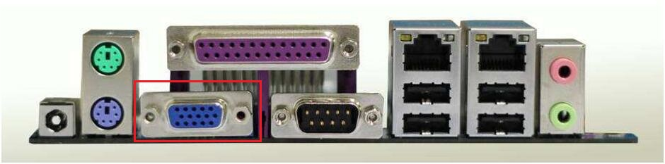
这个DB9接口的信号电平，是RS232电平，不能直接接到单片机（STM32）的串口管脚，需要通过一个RS232电平转换器。
很多开发板现在还提供了DB9接头，但是现在电脑都不带这个接口了，屋脊雀的开发板抛弃了这个大家伙。

那没有了DB9接口，如何使用串口呢？可以通过USB转串口。
STM32的串口信号接到CP2104芯片，CP2104通过USB与电脑连接。
下图就是我们的开发板底板的USB转串口电路。
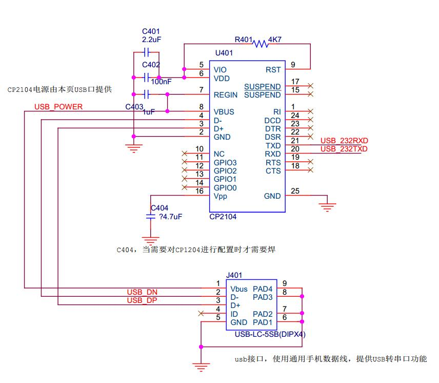

还可以通过CMSIS DAP调试器进行USB转串口。

一个完整的串口有以下信号：
>数据：
TXD（pin 3）：串口数据输出(Transmit Data)
RXD（pin 2）：串口数据输入(Receive Data)
握手：
RTS（pin 7）：发送数据请求(Request to Send)
CTS（pin 8）：清除发送(Clear to Send)
DSR（pin 6）：数据发送就绪(Data Send Ready)
DCD（pin 1）：数据载波检测(Data Carrier Detect)
DTR（pin 4）：数据终端就绪(Data Terminal Ready)
地线：
GND（pin 5）：地线
其它
RI（pin 9）：铃声指示

这个是完整的通信信号，一般我们只使用数据线与地线。
有一些外接高速模块会使用握手信号，也就是我们常说的**流控**。
在屋脊雀407开发板的外扩串口上，引出流控信号RTS、CTS，如下图：
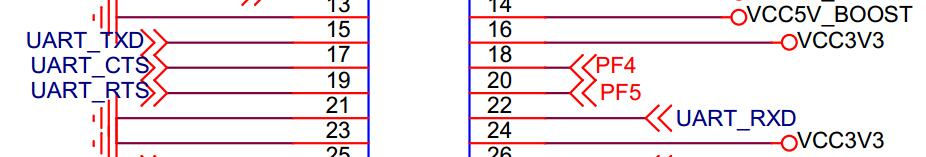

串口按位（bit）发送数据，数据格式由起始位（start bit）、数据位（data bit）、奇偶校验位（parity bit）和停止位（stop bit）组成。
在串口调试助手上软件可以看到数据格式配置。
通常数据格式是起始位1BIT、8bit数据、1bit停止位、无校验位。
波特率则是串口每秒传输的BIT速率。可以通过波特率计算串口1秒钟可传输多少数据。
>例如常用串口数据格式是10BIT一个字节，那么在115200波特率下，每秒最多传输11520个字节数据。每字节数据传输时间仅仅86.80555555555556us，是一个比较快的速度了。

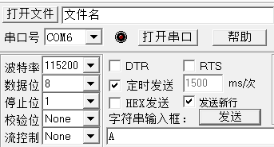

我们下面看看简单的串口通信时序，发送两个字节数据，0x55、0xaa（55aah）。
使用格式：1起始位，8数据位，1停止位。
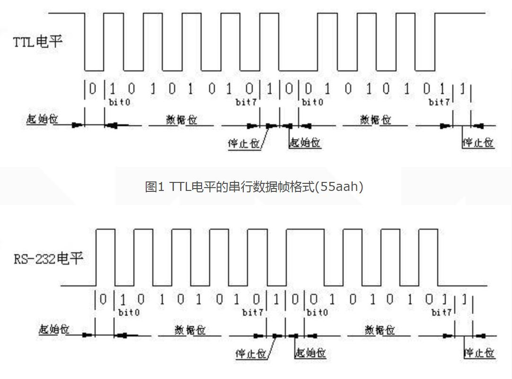

串口RX和TX的时序是一样的，一个是发送，一个是接收。
### 原理图
屋脊雀F407开发板使用了一个USB转串口芯片CP2104，芯片在底板上。这个芯片相对于其他USB转串口芯片，更加可靠，推荐大家使用。

底板通过两个IO与核心板相连，这两根IO属于串口3的TX与RX。


***这两个IO同时从DAP调试口引出，因此，DAP的串口和底板CP2104不要同时使用***。
### STM32串口
STM32芯片外设丰富，有多个串口，我们这次使用的两个管脚是PB10和PB11。

通过查看《STM32F407_数据手册.pdf》第56页，管脚功能映射表可知，PB10 AF7功能，是串口3的TX，PB11 是串口3的RX。
***TX和RX，都是对自己而言，PB10就是STM32的发送管脚，那么就要连接到CP2104的RX管脚，以后大家画芯片原理图器件也要这样命名***

从文档《STM32F407_数据手册.pdf》第17页可以看出，UART3挂在APB总线上，USART3还支持SMCARD和irDA功能。
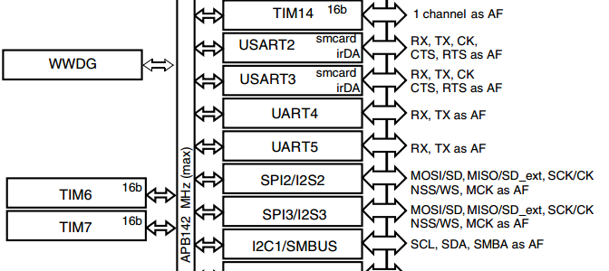

串口更详细功能要从《STM32F4xx中文参考手册.pdf》找，第26章
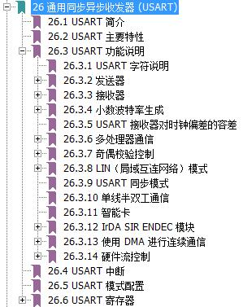

关于设备的所有信息都可以从这里找到，意法半导体是非常有良心的，提供了中文版本，就算英文不好阅读起来也没有障碍。
*在这里写再多，也比不上官方文档，尽量不添加官方文档的内容。*

>**对于STM32要吐槽的是：为什么接收硬缓冲只有1个？1个？1个？**
上面介绍串口波特率时提到，在115200的波特率下，1个字节只需要86us，如果系统处于高负载情况下，串口中断很可能被其他中断卡住而进不了，造成数据丢失。
要防止数据丢失，有以下手段：
>1. 将这个串口优先级提高到最高并且可以抢占别的中断（中断嵌套）；
>2. 通过人工努力优化程序运行逻辑，在时间线上，优化各个模块的运行时间，解决中断丢失问题（各中断尽量错开）。
>3. 使用DMA模拟硬件缓冲。
*以前ARM7芯片，通常都有8个或者16个硬BUF。*

### 串口驱动设计
在设计串口驱动之前，思考几点：
>问题1. 串口驱动给谁用？需要提供什么样的接口？
问题2. 串口驱动要实现什么功能？
问题3. 串口接收发送如何设计？(对于高速运行的程序来说，串口是一个**慢设备**)
问题4. 中断如何设计？

* 问题1
1.串口有可能直接给应用程序使用。应用程序通过串口与PC或其他设备通信。
2.可能连接一个设备模块，例如串口WIFI模块。
在APP层看，只知道WIFI，至于WIFI模块使用什么接口跟CPU连接，APP是不知道的。
因此，在这种情况下，**使用串口的是WIFI驱动。**
* 问题2
串口就是实现数据收发功能，**串口驱动不应该关心收发的内容**。你觉得在串口中断中判断回车换行 (0x0d/0x0a)合适吗？
* 问题3
由于串口是慢设备，最好的方法就是发送接收都通过缓冲区处理，如果还需要进一步提高性能，可以考虑用硬件DMA。
* 问题4
所有的中断程序都是越短越好，对串口来说，接收到数据，放入缓冲区就立刻退出中断。

我们的串口驱动程序就根据上面几点思考编写。

### 环形缓冲技术
也就是常说的RingBuf。
在stmcu论坛有一个帖子说的非常详细，请大家移步阅读。
http://www.stmcu.org/module/forum/thread-616132-1-2.html

### 编码
在文件夹建立一个mcu_dev文件夹，**用于保存CPU片上外设的驱动**。
新建两个文件mcu_uart.c、mcu_uart.h，并且添加到MDK跟SI工程，**头文件搜索路径也添加**。

代码就不解释了，在源码中有完整注释。
除了驱动代码外，在main.c中增加串口测试函数调用
```c
        mcu_uart_open(3);
	while (1)
	{
		GPIO_ResetBits(GPIOG, GPIO_Pin_0|GPIO_Pin_1|GPIO_Pin_2|GPIO_Pin_3);
		Delay(100);
		GPIO_SetBits(GPIOG, GPIO_Pin_0|GPIO_Pin_1|GPIO_Pin_2|GPIO_Pin_3);
		Delay(100);
		mcu_uart_test();
	}
```
在stm32f4xx_it.c中增加中断处理
```c
/**
  * @brief  This function handles PPP interrupt request.
  * @param  None
  * @retval None
  */
/*void PPP_IRQHandler(void)
{
}*/

/**
  * @}
  */
void USART3_IRQHandler(void)
{
	mcu_uart3_IRQhandler();    
}

```
>中断是什么，中断如何运行，在后面章节有说明。

* uart_printf实现
代码如下，注意string数组的大小，我们定义了256，也即是一次输出调试信息字符不能超过这个buf的大小。
```c
/*
使用串口输出调试信息
*/
s8 string[256];//调试信息缓冲，输出调试信息一次不可以大于256

#ifdef __GNUC__
/* With GCC/RAISONANCE, small printf (option LD Linker->Libraries->Small printf
     set to 'Yes') calls __io_putchar() */
#define PUTCHAR_PROTOTYPE int __io_putchar(int ch)
#else
#define PUTCHAR_PROTOTYPE int fputc(int ch, FILE *f)
#endif /* __GNUC__ */

PUTCHAR_PROTOTYPE
{
    /* Place your implementation of fputc here */
    /* e.g. write a character to the USART */
    USART_SendData(USART3, (uint8_t) ch);

    /* Loop until the end of transmission */
    while (USART_GetFlagStatus(USART1, USART_FLAG_TC) == RESET);
    return ch;
}

extern int vsprintf(char * s, const char * format, __va_list arg);
/**
 *@brief:      uart_printf
 *@details:    从串口格式化输出调试信息
 *@param[in]   s8 *fmt  
               ...      
 *@param[out]  无
 *@retval:     
 */
void uart_printf(s8 *fmt,...)
{
    s32 length = 0;
    va_list ap;

    s8 *pt;

    va_start(ap,fmt);
    vsprintf((char *)string,(const char *)fmt,ap);
    pt = &string[0];
    while(*pt!='\0')
    {
        length++;
        pt++;
    }

    mcu_uart_write(PC_PORT, (u8*)&string[0], length);  //写串口

    va_end(ap);
}
```

### 调试过程
* 问题1
PC发送数据给开发板，开发板的LED就不闪，也不再发送字符，说明可能**死机**了。
**因为是PC发送数据触发问题，所以应该是程序接收中断未处理好**。
经查，在USART3_IRQHandler中没有添加代码，中断根本没处理，因此串口**重复进入中断，造成卡死**（其实没死机，只是一直中断出不来，无法执行main函数）。修改好后，PC端发送串口数据，开发板不再死机。
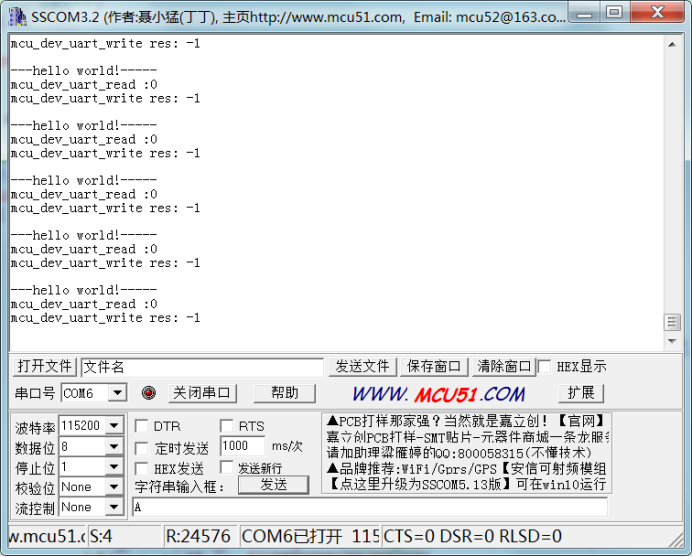
* 问题2
继续测试，发送数据，按照测试程序设计，收到A后，将A发送给电脑，但是现在收不到数据。
在串口中断mcu_uart3_IRQhandler中**增加调试信息**，收到数据则将数据打印。从调试信息看，能收到数据。
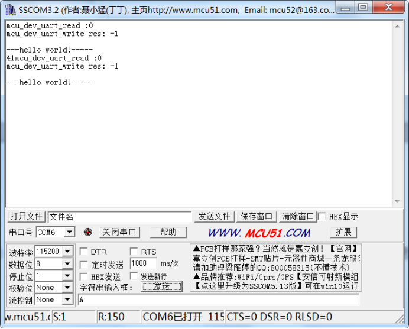
在mcu_uart_read函数内增加调试信息，每次调用都输出当前串口缓冲索引，发现收到数据的时候都是0。
这时候发现，在这个函数的前面调用了mcu_uart_open，而在OPEN中每次都会将串口缓冲两个索引清0。
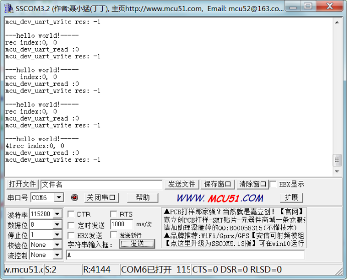
把open函数去掉
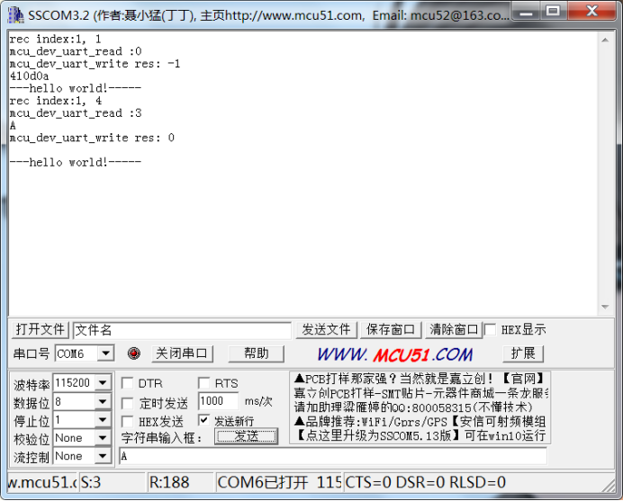
问题解决，调试串口收发已经正常。


### 调试信息使用
* **调试信息是需要管理的**

前面我们实现了用串口的printf。现在让我们来定义LOG功能。
考虑问题：
>1.LOG除了用串口输出，还可能用USB输出，LCD显示等。
2.LOG要分等级，在发布程序时，要把DEBUG LOG屏蔽。

我们在app文件夹定义一个wjq_log.c和wjq_log.h。
把uart_printf搬到这个源文件内（这个函数后面基本不用了）。
复制uart_printf函数并改造，增加LOG等级判断。
LOG等级定义如下：
```c
typedef enum
{
	LOG_DISABLE = 0,
	LOG_ERR,	//错误
	LOG_FUN,	//功能（用LOG输出算一个功能）
	LOG_INFO,	//信息，例如设备初始化等信息
	LOG_DEBUG,	//调试，正式程序通常屏蔽
}LOG_L;
```
* 常用LOG说明

**输出调试信息跟变量值**
%d,%02x,%08x等是常用输出格式
```c
wjq_log(LOG_FUN, "mcu_dev_uart_read :%d\r\n", len);
```
>%d，打印十进制格式。
%02x，打印十六进制格式，2位
%08x，打印十六进制格式，8位，打印地址时用。
%s，打印字符串

**输出当前函数名，文件名，代码行号，当前时间**
```c
wjq_log(LOG_FUN, "%s,%s,%d,%s\r\n", __FUNCTION__,__FILE__,__LINE__,__DATE__);
```
**LOG要短**
在中断中添加调试信息尽量短，串口是一个慢设备，输出太长的调试信息执行时间较长，会影响程序运行，特别是一些时间敏感的函数。
*---可以考虑将LOG做队列输出---*
**时刻记得LOG的影响**
在某些临界处，添加太多调试信息会造成程序流程跟预想不一致。因此需要对各个模块调试信息进行管理，不能一下子打开所有模块的调试信息。
### PC串口工具
常用工具有sscom32、Xshell、Docklight。特点如下：
>**sscom32**:简单易用，单片机常用。前面调试串口就是用sscom32。
**Xshell**：是一个强大的安全终端模拟软件，它支持SSH1, SSH2, 以及Microsoft Windows 平台的TELNET 协议。可以远程登录电脑等，玩Linux的应该常用。同时支持串口，Linux开发时登录命令行控制台就常用。**有个人免费版本**。
**Docklight**：支持帧格式组织解析，对于做串口协议通信很有用。

如果仅仅做调试信息LOG输出，建议使用Xshell，后面我们移植UBOOT的命令行控制台到STM32上，使用Xshell进行交互调试。
### 思考
1 目前只实现了一个串口的驱动，STM32一般会有多个串口，串口驱动要如何修改？每个串口都写一份代码会很累的。
2 现在程序都是单线程在跑，等后面添加了FREERTOS之后，驱动应该设计？需要考虑什么问题？

---
end
---
