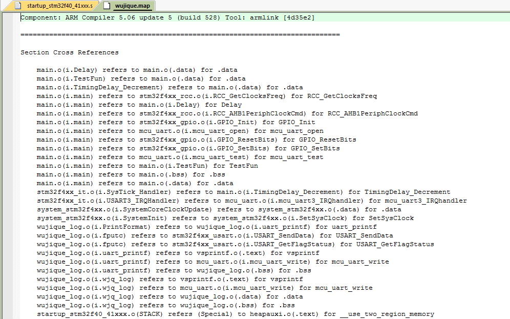
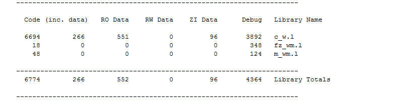
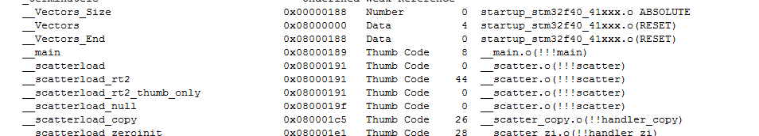

# **包罗万象的小程序**
>**够用的硬件**
>
>**能用的代码**
>
>**实用的教程**
>
>屋脊雀工作室编撰 -20190315
>
>愿景：做一套能用的开源嵌入式驱动（非LINUX）
>
>官网：www.wujique.com
>
>github: https://github.com/wujique/stm32f407
>
>淘宝：https://shop316863092.taobao.com/?spm=2013.1.1000126.2.3a8f4e6eb3rBdf
>
>技术支持邮箱：code@wujique.com、github@wujique.com
>
>资料下载：https://pan.baidu.com/s/12o0Vh4Tv4z_O8qh49JwLjg
>
>QQ群：767214262
---

我们通过IO和串口的软件开发，已经体验了嵌入式软件开发。
不知道大家有没有疑惑，为什么软件能控制硬件？反正当年我学习51的时候，有这个疑惑。
今天我们就暂停软件开发，分析单片机到底是如何**软硬件结合**的。
并通过一个基本的程序，分析单片机程序的编译，运行。

## 软硬件结合
初学者，通常有一个困惑，就是为什么软件能控制硬件？
就像当年的51，为什么只要写P1=0X55，就可以在IO口输出高低电平？
要理清这个问题，先要认识一个概念：**地址空间**。
#### 寻址空间
什么是地址空间呢？所谓的地址空间，就是PC指针的寻址范围，因此也叫寻址空间。
 >大家应该都知道，我们的电脑有32位系统和64位系统之分，为什么呢？因为32位系统，PC指针就是一个32位的二进制数，也就是0xffffffff，范围只有4G寻址空间。
 现在内存越来越大，4G根本不够，所以需要扩展，为了能访问超出4G范围的内存，就有了64位系统。
STM32是多少位的？是32位的，因此PC指针也是32位，寻址空间也就是4G。

我们来看看STM32的寻址空间是怎么样的。
在数据手册《STM32F407_数据手册.pdf》中有一个图，这个图，就是STM32的寻址空间分配。
所有的芯片，都会有这个图，名字基本上都是叫Memory map，用一个新芯片，就先看这个图。


* 最左边，8个block，每个block 512M，总共就是4G，也就是芯片的寻址空间。
* block 0 里面有一段叫做FLASH，也就是内部FLASH，我们的程序就是下载到这个地方，起始地址是0X800 0000，大家注意，这个只有1M空间。
现在STM32已经有2M flash的芯片了，超出1M的FLASH放在哪里呢？请自行查看对应的芯片手册。
* 3 在block 1 内，有两段SRAM，总共128K，这个空间，也就是我们前面说的内存，存放程序使用的变量。如果需要，也可以把程序放到SRAM中运行。
407不是有196K吗？
* 其实407有196K内存，但是有64k并不是普通的SRAM，而是放在block 0 内的CCM。这两段区域不连续，而且，CCM只能内核使用，外设不能使用，例如DMA就不能用CCM内存，否则就死机。
* block 2，是Peripherals，也就是外设空间。我们看右边，主要就是APB1/APB2、AHB1/AHB2，什么东西呢？回头再说。
* block 3、block4、block5，是FSMC的空间，FSMC可以外扩SRAM，NAND FALSH，LCD等外设。

好的，我们分析了寻址空间，我们回过头看看，软件是**如何控制硬件**的。
在IO口输出的例程中，我们配置IO口是调用库函数，我们看看库函数是怎么做的。
例如：
```c
GPIO_SetBits(GPIOG, GPIO_Pin_0 | GPIO_Pin_1 | GPIO_Pin_2| GPIO_Pin_3);
```

这个函数其实就是对一个变量赋值，对GPIOx这个结构体的成员BSRRL赋值。
```c
void GPIO_SetBits(GPIO_TypeDef* GPIOx, uint16_t GPIO_Pin)
{
  /* Check the parameters */
  assert_param(IS_GPIO_ALL_PERIPH(GPIOx));
  assert_param(IS_GPIO_PIN(GPIO_Pin));

  GPIOx->BSRRL = GPIO_Pin;
}
```
>assert_param:这个是断言，用于判断输入参数是否符合要求
GPIOx是一个输入参数，是一个GPIO_TypeDef结构体指针，所以，要用->获取其成员

GPIOx是我们传入的参数GPIOG，具体是啥？在stm32f4xx.h中有定义。
```c
#define GPIOG               ((GPIO_TypeDef *) GPIOG_BASE)
```
GPIOG_BASE同样在文件中有定义，如下：
```c
#define GPIOG_BASE            (AHB1PERIPH_BASE + 0x1800)
```
AHB1PERIPH_BASE，AHB1地址，有点眉目了吧？在进一步看看
```c
/*!< Peripheral memory map */
#define APB1PERIPH_BASE       PERIPH_BASE
#define APB2PERIPH_BASE       (PERIPH_BASE + 0x00010000)
#define AHB1PERIPH_BASE       (PERIPH_BASE + 0x00020000)
#define AHB2PERIPH_BASE       (PERIPH_BASE + 0x10000000)
```
再找找PERIPH_BASE的定义
```c
#define PERIPH_BASE           ((uint32_t)0x40000000)     
```
到这里，我们可以看出，操作IO口G，其实就是操作0X40000000+0X1800这个地址上的一个结构体里面的成员。
说白了，就是操作了这个地方的寄存器。
实质跟我们操作普通变量一样，就像下面的两句代码，区别就是变量i是SRAM空间地址，0X40000000+0X1800是外设空间地址。
```c
u32 i;
i = 0x55aa55aa;
```
这个外设空间地址的寄存器是IO口硬件的一部分。
如下图，左边的输出数据寄存器，就是我们操作的寄存器（内存、变量），它的地址就是0X40000000+0X1800+0x14.


控制其他外设也类似，就是将数据写到外设寄存器上，跟操作内存一样，就可控制外设了。
>寄存器，其实应该是内存的统称，外设寄存器应该叫做特殊寄存器。
慢慢的，所有人都把外设的叫做寄存器，其他的统称内存或RAM。
寄存器为什么能控制硬件外设呢？
因为，初略的说，一个寄存器的一个BIT，就是一个开关，
开就是1，关就是0。通过这个电子开关去控制电路，从而控制外设硬件。

## 纯软件-包罗万象的小程序
我们已经完成了串口和IO口的控制，但是我们仅仅知道了怎么用，对其他一无所知。
程序怎么跑的？代码到底放在那里？内存又是怎么保存的？
下面，我们通过一个简单的程序，学习嵌入式软件的基本要素。
### 分析启动代码
* 函数从哪里开始运行？

每个芯片都有复位功能，复位后，芯片的PC指针（一个寄存器，指示程序运行位置，对于多级流水线的芯片，PC可能跟真正执行的指令位置不一致，这里暂且认为一致）会复位到固定值，一般是0x00000000，在STM32中，复位到0X08000004。因此复位后运行的第一条代码就是0X08000004。
前面我们不是拷贝了一个**启动代码文件**到工程吗？
startup_stm32f40_41xxx.s，这个汇编文件为什么叫启动代码？因为里面的汇编程序，就是复位之后执行的程序。
在文件中，有一段数据表，称为**中断向量**，里面保存了各个**中断的执行地址**。
**复位，也是一个中断。**
芯片复位时，芯片从中断表中将Reset_Handler这个值（**函数指针**）加载到PC指针，芯片就会执行Reset_Handler函数了。（一个函数入口就是一个指针）
```c
; Vector Table Mapped to Address 0 at Reset
                AREA    RESET, DATA, READONLY
                EXPORT  __Vectors
                EXPORT  __Vectors_End
                EXPORT  __Vectors_Size

__Vectors       DCD     __initial_sp               ; Top of Stack
                DCD     Reset_Handler              ; Reset Handler
                DCD     NMI_Handler                ; NMI Handler
                DCD     HardFault_Handler          ; Hard Fault Handler
                DCD     MemManage_Handler          ; MPU Fault Handler
                DCD     BusFault_Handler           ; Bus Fault Handler
                DCD     UsageFault_Handler         ; Usage Fault Handler
```
Reset_Handler函数，先执行SystemInit函数，这个函数在标准库内，主要是初始芯片时钟。然后跳到__main执行，__main函数是什么函数？
是我们在main.c中定义的main函数吗？后面我们再说这个问题。
```c
; Reset handler
Reset_Handler    PROC
                 EXPORT  Reset_Handler             [WEAK]
        IMPORT  SystemInit
        IMPORT  __main

                 LDR     R0, =SystemInit
                 BLX     R0
                 LDR     R0, =__main
                 BX      R0
                 ENDP
```

芯片是怎么知道开始就执行启动代码的呢？或者说，我们如何把这个启动代码放到复位的位置？
这就牵涉到一个一般情况下不关注的文件wujique.sct，这个文件在wujique\prj\Objects目录下，通常把这个文件叫做**分散加载文件**，编译工具在链接时，根据这个文件放置各个代码段和变量。

在MDK软件Options菜单Linker下有关于这个菜单的设置。

把Use Memory Layout from Target Dialog前面的勾去掉，之前不可设置的框都可以设置了。点击Edit进行编辑。

在代码编辑框出现了分散加载文件内容，当前文件只有基本的内容。

>其实这个文件功能很强大，通过修改这个文件可以配置程序的很多功能，例如：
1 指定FLASH跟RAM的大小于起始位置，当我们把程序分成BOOT、CORE、APP，甚至进行驱动分离的时候，就可以用上了。
2 指定函数与变量的位置，例如把函数加载到RAM中运行。


从这个基本的分散加载文件我们可以看出：

* 第6行 ER_IROM1 0x08000000 0x00080000
定义了ER_IROM1，也就是我们说的内部FLASH，从0x08000000开始，大小0x00080000。

* 第7行 *.o (RESET, +First)
从0x08000000开始，先放置一个*.o文件， 并且用(RESET, +First)指定RESET块优先放置，RESET块是什么？
请查看启动代码，中断向量就是一个AREA，名字叫RESET，属于READONLY。
这样编译后，RESET块将放在0x08000000位置，也就是说，中断向量就放在这个地方。
DCD是分配空间，4字节，第一个就是__initial_sp，第二个就是Reset_Handler函数指针。
也就是说，最后编译后的程序，将Reset_Handler这个函数的指针（地址），放在0x800000+4的地方。
所以芯片在复位的时候，就能找到复位函数Reset_Handler。

* 第8行 *(InRoot$$Sections)
什么鬼？GOOGLE啊！回头再说。
* 第9行 .ANY (+RO)
意思就是其他的所有RO，顺序往后放。就是说，其他代码，跟着启动代码后面。
* 第11行 RW_IRAM1 0x20000000 0x00020000
定义了RAM大小。
* 第12行 .ANY (+RW +ZI)
所有的RW ZI，全部放到RAM里面。RW,ZI，也就是变量，这一行指定了变量保存到什么地址。


### 分析用户代码
到此，基本启动过程已经分析完。下一步开始分析用户代码，就从main函数开始。
1 程序跳转到main函数后:
RCC_GetClocksFreq获取RCC时钟频率；
SysTick_Config配置SysTick，在这里打开了SysTick中断，10毫秒一次。
Delay(5);延时50毫秒。
```c {.linenubers}
int main(void)
{
  GPIO_InitTypeDef GPIO_InitStructure;

 /*!< At this stage the microcontroller clock setting is already configured,
       this is done through SystemInit() function which is called from startup
       files before to branch to application main.
       To reconfigure the default setting of SystemInit() function,
       refer to system_stm32f4xx.c file */

  /* SysTick end of count event each 10ms */
  RCC_GetClocksFreq(&RCC_Clocks);
  SysTick_Config(RCC_Clocks.HCLK_Frequency / 100);

  /* Add your application code here */
  /* Insert 50 ms delay */
  Delay(5);
```

2 初始化IO就不说了，进入while(1)，也就是一个死循环，嵌入式程序，都是一个死循环，否则就跑飞了。
```c
/*初始化LED IO口*/
RCC_AHB1PeriphClockCmd(RCC_AHB1Periph_GPIOG, ENABLE);

GPIO_InitStructure.GPIO_Pin = GPIO_Pin_0 | GPIO_Pin_1 | GPIO_Pin_2| GPIO_Pin_3;
GPIO_InitStructure.GPIO_Mode = GPIO_Mode_OUT;

GPIO_InitStructure.GPIO_OType = GPIO_OType_PP;
GPIO_InitStructure.GPIO_Speed = GPIO_Speed_100MHz;
GPIO_InitStructure.GPIO_PuPd = GPIO_PuPd_UP;
GPIO_Init(GPIOG, &GPIO_InitStructure);    

/* Infinite loop */
mcu_uart_open(3);
while (1)
{
  GPIO_ResetBits(GPIOG, GPIO_Pin_0|GPIO_Pin_1|GPIO_Pin_2|GPIO_Pin_3);
  Delay(100);
  GPIO_SetBits(GPIOG, GPIO_Pin_0|GPIO_Pin_1|GPIO_Pin_2|GPIO_Pin_3);
  Delay(100);
  mcu_uart_test();

  TestFun(TestTmp2);
}
```

3 在while(1)中调用TestFun函数，这个函数使用两个全局变量，两个局部变量。
```c
/* Private functions ---------------------------------------------------------*/
u32 TestTmp1 = 5;//全局变量，初始化为5
u32 TestTmp2;//全局变量，未初始化

const u32 TestTmp3[10] = {6,7,8,9,10,11,12,13,12,13};

u8 TestFun(u32 x)//函数，带一个参数，并返回一个u8值
{
	u8 test_tmp1 = 4;//局部变量，初始化
	u8 test_tmp2;//局部变量，未初始化

	static u8 test_tmp3 = 0;//静态局部变量

	test_tmp3++;

	test_tmp2 = x;

	if(test_tmp2> TestTmp1)
		test_tmp1 = 10;
	else
		test_tmp1 = 5;

	TestTmp2 +=TestTmp3[test_tmp1];

	return test_tmp1;
}
```
然后程序就一直在main函数的while循环里面执行。
中断呢？对，还有中断。**中断中断，就是中断正常的程序执行流程。**
我们查看Delay函数，uwTimingDelay不等于0就死等？谁会将uwTimingDelay改为0？
```c
/**
  * @brief  Inserts a delay time.
  * @param  nTime: specifies the delay time length, in milliseconds.
  * @retval None
  */
void Delay(__IO uint32_t nTime)
{
  uwTimingDelay = nTime;

  while(uwTimingDelay != 0);
}

```

**搜索uwTimingDelay变量**，函数TimingDelay_Decrement会将变量一直减到0。
```c
/**
  * @brief  Decrements the TimingDelay variable.
  * @param  None
  * @retval None
  */
void TimingDelay_Decrement(void)
{
  if (uwTimingDelay != 0x00)
  {
    uwTimingDelay--;
  }
}
```

这个函数在哪里执行？经查找，在SysTick_Handler函数中运行。谁用这个函数？
```c
/**
  * @brief  This function handles SysTick Handler.
  * @param  None
  * @retval None
  */
void SysTick_Handler(void)
{
  TimingDelay_Decrement();
}
```
经查找，在中断向量表中有这个函数，也即是说这个函数指针保存在中断向量表内。
当发生中断时，就会执行这个函数。
当然，在进出中断会有保存和恢复现场的操作。这个主要涉及到汇编，暂时不进行分析了。有兴趣自己研究研究。通常，现在我们开发程序不用关心上下文切换了。
```c
__Vectors       DCD     __initial_sp               ; Top of Stack
                DCD     Reset_Handler              ; Reset Handler
                DCD     NMI_Handler                ; NMI Handler
                DCD     HardFault_Handler          ; Hard Fault Handler
                DCD     MemManage_Handler          ; MPU Fault Handler
                DCD     BusFault_Handler           ; Bus Fault Handler
                DCD     UsageFault_Handler         ; Usage Fault Handler
                DCD     0                          ; Reserved
                DCD     0                          ; Reserved
                DCD     0                          ; Reserved
                DCD     0                          ; Reserved
                DCD     SVC_Handler                ; SVCall Handler
                DCD     DebugMon_Handler           ; Debug Monitor Handler
                DCD     0                          ; Reserved
                DCD     PendSV_Handler             ; PendSV Handler
                DCD     SysTick_Handler            ; SysTick Handler
```

## 余下问题

1 __main函数是什么函数？是我们在main.c中定义的main函数吗？
2 分散加载文件中*(InRoot$$Sections)是什么？
3 ZI段，也就是初始化为0的数据段，什么时候初始化？谁初始化？

为什么这几个问题前面留着不说？因为这是同一个问题。顺藤摸瓜！

## 通过MAP文件了解代码构成
####  编译结果

程序编译后，在下方的Build Output窗口会输出信息：
```c
*** Using Compiler 'V5.06 update 5 (build 528)', folder: 'C:\Keil_v5\ARM\ARMCC\Bin'
Build target 'wujique'
compiling stm32f4xx_it.c...
...
assembling startup_stm32f40_41xxx.s...
compiling misc.c...
...
compiling mcu_uart.c...
linking...
Program Size: Code=9038 RO-data=990 RW-data=40 ZI-data=6000  
FromELF: creating hex file...
".\Objects\wujique.axf" - 0 Error(s), 0 Warning(s).
Build Time Elapsed:  00:00:32
```
>* 编译目标是wujique
>* C文件compiling，汇编文件assembling，这个过程叫编译
>* 编译结束后，就进行link，链接。
>* 最后得到一个编译结果，9038字节code，RO 990，RW 40，ZI 6000。
CODE，是代码，很好理解，那RO、RW、ZI都是什么？
>* **FromELF，创建hex文件，FromELF是一个好工具，需要自己添加到option中才能用**

####  map文件配置

更多编译具体信息在map文件中，在MDK Options中我们可以看到，所有信息都放在\Listings\wujique.map
>默认很多编译信息可能没钩，钩上所有信息会增加编译时间。


####  map文件

打开map文件，好乱？习惯就好。我们抓重点就行了。


* map 总信息

**从最后看起**，看到没？
**最后的这一段map内容，说明了整个程序的基本概况。**
有多少RO？RO到底是什么？
有多少RW?RW又是什么？
ROM为什么不包括ZI Data？为什么包含RW Data？


* Image component sizes

往上，看看Image component sizes，这个就比刚刚的总体统计更细了。
**这部分内容，说明了每个源文件的概况**
首先，是我们自己的源码，这个程序我们的代码不多，只有main.o，wujique_log.o，
和其他一些STM32的库文件。


第2部分是库里面的文件，看到没？里面有一个__main.o。
__main函数是不是我们写的main函数？明显不是，我们的main函数是放在main.o文件。
这么小的一个工程，用了这么多库，你以前关注过吗？
估计没有，除非你曾经将一个原本在1M flash上的程序压缩到能在512K上运行。


第3部分也是库，暂时没去分析这两个是什么东西。


>库文件是什么？
库文件就是别人已经别写好的代码库。
在代码中，我们经常会包含一些头文件，例如：
>```c
>#include <stdarg.h>
>#include <stdlib.h>
>#include <string.h>   
>```
>这些就是库的头文件。这些头文件保存在MDK开发工具的安装目录下。
我们经常用的库函数有：
memcpy、memcmp、strcmp等。
只要代码中包含了这些函数，就会链接库文件。


* 文件map

再往上，就是文件MAP了，也就时**每个文件中的代码段（函数）跟变量在ROM跟RAM中的位置**。
首先是ROM
在0x08000000确实放的是startup_stm32f40_41xxx.o中的RESET

每个文件有有多行，例如串口，4个函数。


然后是RAM的，main.o中的变量，放在0x20000000，总共有0x0000000c，类型是Data、RW。
串口有两种变量，data和bss，什么是bss？这两个名称，是section name，也就是段的意思。
看前面type和Attr，
**RW Data，放在.data段；RW Zero放在.bss段，RW Zero，其实就是ZI**。
到底哪些变量是RW，哪些是ZI？


* Image Symbol Table

再往上就是Image Symbol Table，就**更进一步到每个函数或者变量的信息了**。


例如，全局变量TestTmp1，是Data，4字节，分配的位置是0x20000004。

TestTmp3数组放在哪里？**放在0X080024E0这个地方**，这可是代码区额。
因为我们用const修饰了这个全局变量数组，告诉编译器，这个数组是不可以改变的，编译器就将这个数组保存到代码中了。
程序中我们经常会使用一些大数组数据，例如字符点阵，通常有几K几十K大，不可能也没必要放到RAM区，整个程序运行过程这些数据都不改变，因此通过const修饰，将其存放到代码区。

>**const的用处比较多，可以修饰变量，也可以修饰函数。**
更多用法自行学习


那局部变量存放在哪里呢？我们找到了test_tmp3，

没找到test_tmp1/test_tmp2，为什么呢？
在定义时，test_tmp3增加了static定义，意思就是静态局部变量，功能上，相当于全局变量，定义在函数内，限制了这个`全局变量`只能在这个函数内使用。
哪test_tmp1、test_tmp2放在哪里呢？
**局部变量，在编译链接时，并没有分配空间，只有在运行时，才从栈分配空间。**

```c
u8 TestFun(u32 x)//函数，带一个参数，并返回一个u8值
{
	u8 test_tmp1 = 4;//局部变量，初始化
	u8 test_tmp2;//局部变量，未初始化

	static u8 test_tmp3 = 0;//静态局部变量
```
上一部分，我们留了一个问题，哪些变量是RW，哪些是ZI？
我们看看串口变量的情况，UartBuf3放在bss段，其他变量放在.data段。
为什么数组就放在bss？bss是英文Block Started by Symbol的简称。


**到这里，我们可解释下面几个概念了：**
>Code就是代码，函数。
RO Data，就是只读变量，例如用const修饰的数组。
RW Data，就是读写变量，例如全局变量跟static修饰的局部变量。
ZI Data，就是系统自动初始化为0的读写变量，大部分是数组，放在bss段。
RO Size等于代码加只读变量。
RW Size等于读写变量（包括自动初始化为0的），这个也就是RAM的大小。
ROM Size，也就是我们编译之后的目标文件大小，也就是FLASH的大小。但是？为什么会包含RW Data呢？
因为所有全局变量都需要一个初始化的值（就算没有真正初始化，系统也会分配一个初始化空间），例如我们定义一个变量u8 i = 8;这样的全局变量，8，这个值，就需要保存在FALSH区。


我们看看函数的情况，前面我们不是有一个问题吗？__main和main是一个函数吗？
查找main后发现，main是main，放在0x08000579


__main是__main，放在0x08000189


__main到main之间发生了什么？
还记得分散加载文件中的这句吗？

```c
*(InRoot$$Sections)
```
__main就在这个段内。下图是__main的地址，在0x08000189。
__Vectors就是中断向量，放在最开始。


在分散加载文件中，紧跟RESET的就是*(InRoot$$Sections)。


而且，RESET段正好大小0x00000188。


巧合？参考PPT文档《ARM嵌入式软件开发.ppt》，或自行GOOGLE。


这一段代码都完成什么功能呢？
主要完成ZI代码的初始化，也就是将一部分RAM初始化为0。
其他环境初始化。。。。
**通常，我们不用管这一部分。**

* 其他
再往上，就是其他信息了，例如优化了哪些东西，移除了哪些函数。

## 最后
到这里，一个程序，是怎么组成的，程序是如何运行的，基本有一个总体印象了。
不过，对于中断，后面还会进行详细说明。

---
end
---
