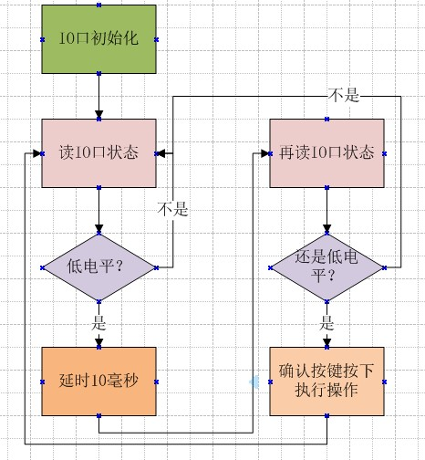

# **IO输入-按键检测**
>**够用的硬件**
>
>**能用的代码**
>
>**实用的教程**
>
>屋脊雀工作室编撰 -20190101
>
>愿景：做一套能用的开源嵌入式驱动（非LINUX）
>
>官网：www.wujique.com
>
>github: https://github.com/wujique/stm32f407
>
>淘宝：https://shop316863092.taobao.com/?spm=2013.1.1000126.2.3a8f4e6eb3rBdf
>
>技术支持邮箱：code@wujique.com、github@wujique.com
>
>资料下载：https://pan.baidu.com/s/12o0Vh4Tv4z_O8qh49JwLjg
>
>QQ群：767214262
---

前面我们已经学习了IO口输出功能，现在我们就学习IO的输入功能。

## IO口输入
所谓的IO口输入，其实非常简单，就是可以从一个IO口读取连接在IO口上的电路的电平，高电平，读到1，低电平就读到0。
下面是IO口结构图，前面我们已经看过，如果配置为输入时，只要读取`输入数据寄存器`就可以获取IO口电平了。

在IO口输出章节，我们详细说了IO口配置，其中下面两个配置只是针对输出的，输入无效：

```c
/**
  * @brief  GPIO Output type enumeration
  */  
typedef enum
{
  GPIO_OType_PP = 0x00,
  GPIO_OType_OD = 0x01
}GPIOOType_TypeDef;
#define IS_GPIO_OTYPE(OTYPE) (((OTYPE) == GPIO_OType_PP) || ((OTYPE) == GPIO_OType_OD))


/**
  * @brief  GPIO Output Maximum frequency enumeration
  */  
typedef enum
{
  GPIO_Low_Speed     = 0x00, /*!< Low speed    */
  GPIO_Medium_Speed  = 0x01, /*!< Medium speed */
  GPIO_Fast_Speed    = 0x02, /*!< Fast speed   */
  GPIO_High_Speed    = 0x03  /*!< High speed   */
}GPIOSpeed_TypeDef;
```
## 按键输入
按键输入是人机交互的一个重要输入手段，最常见的按键就是电脑键盘。
按键输入是IO口输入应用的最简单例子。然而深究起来，按键扫描并没那么简单。

#### 原理图
先看按键原理图

按键的原理比较简单，一个按键两个脚，一个脚接都IO口，一个脚接到地。
当按键按下，两端短路，IO口就接到地，就是低电平。
那没按下时，IO口啥都没接，就是高电平。
为啥是高电平呢？因为IO口在芯片内部可以配置连接一个内部上拉电阻。
如果使用了没有内部上拉电阻的IO，就只能在外部接一个电阻将IO口上拉到高电平。

>上拉电阻不能太小，当按键按下时，VCC经过电阻接到地，电流就等于VCC/电阻，太小，漏电流会很大。
普通按键按下的时间比较短，如果是一些状态开关（原理和按键类似），接地可能是一个常态，长时间漏电，
费电。
上拉电阻也不能太大，如果你整一个10M的电阻，很容易耦合干扰，IO口电平乱跳，造成假按键动作。
一般，不是低功耗的设备，4.7K挺好，
低功耗设备，1M差不多。

#### 按键扫描方式
首先，记住流水灯章节提到的问题：**芯片跑得很快**。从一个IO口读取输入电平，只是一瞬间的事。
第二，手可能会抖动。
第三，机械按键可能会抖动。

>用示波器抓按键按下的波形，波形可能如下图，可见状态变化时波形有抖动。


大概的按键流程如下：

这个流程只是判断按下的流程，按键松开同样要做抖动处理。

## 编码调试
按键属于**芯片外设备**。
我们在工程目录增加一个board_dev文件夹，在文件夹内添加两个文件：
dev_key.c、dev_key.h。
代码具体见源文件。记得添加到MDK工程，头文件路径也要添加。
我们首先调试好IO口输入，如下面代码，通过两个调试信息从串口查看IO口电平。
```c
s32 dev_key_scan(void)
{
	uint8_t sta;

	sta = GPIO_ReadInputDataBit(GPIOA, GPIO_Pin_0);
	if(sta == Bit_SET)
	{
		KEY_DEBUG(LOG_DEBUG, "key up\r\n");
	}
	else
	{
		KEY_DEBUG(LOG_DEBUG, "key down\r\n");
	}
}
```
将这个函数放到main.c的while循环中运行，在while(1)之前，要调用函数dev_key_init，对按键IO进行初始化，初始化为输入IO口。
```c
	/* Infinite loop */
	mcu_uart_open(3);
	dev_key_init();
	while (1)
	{
		dev_key_scan();
		Delay(10);

	}
```
没有按下按键时，串口输出“key up”，按住按键时输出“key down”。由于程序一直运行，LOG会连续不断输出IO口状态。
IO口调试好之后就处理防抖动。
添加防抖处理的扫描函数如下，注意定义变量的时候，使用了volatile跟static关键字。
```c {.line-numbers}
s32 dev_key_scan(void)
{
	volatile uint8_t sta;//局部变量，放在栈空间，进入函数时使用，退出后释放。
	static u8 key_sta = 1;//通过static 指定key_sta，函数退出不会释放

	sta = GPIO_ReadInputDataBit(GPIOA, GPIO_Pin_0);
	if((sta == Bit_SET) && (key_sta == 0))
	{
		Delay(5);
		sta = GPIO_ReadInputDataBit(GPIOA, GPIO_Pin_0);
		if(sta == Bit_SET)
		{
			key_sta = 1;
			KEY_DEBUG(LOG_DEBUG, "key up\r\n");
			return 1;
		}
	}
	else if((sta == Bit_RESET) && (key_sta == 1))
	{
		Delay(5);
		sta = GPIO_ReadInputDataBit(GPIOA, GPIO_Pin_0);
		if(sta == Bit_RESET)
		{
			key_sta = 0;
			KEY_DEBUG(LOG_DEBUG, "key down\r\n");
			return 0;
		}
	}
	else
	{
		/*按键没变化*/

		return -1;
	}
}
```
有个要点：
> key_sta变量定义，在函数内定义的是局部变量，但是通过一个static 关键字修饰，即使函数退出，也不释放，下次进入函数，key_sta的值就不会变。
static修饰函数内的局部变量，变量生命周期上，相当于全局变量。使用范围，相当于局部变量，只能在函数内使用。

这个扫描函数的流程完全按照前面的流程图处理：
>第6行读IO口状态
第7行判断状态是不是等于Bit_Set，也就是高电平，并且key_sta等于0，也就是说，上一次的状态是0，状态是按下。
这样做的目的是，我们只处理状态变化。
第9行，延时
第10行，再次读IO状态
第11行，判断状态是否为高电平。
第13行，将按键状态改为1，高电平，松开状态。
第18到28行是按下状态处理，原理跟松开一样。

main函数中，按键按下，点亮LED，按键松开，熄灭LED。
```c
/* Infinite loop */
	mcu_uart_open(3);
	wjq_log(LOG_INFO, "hello word!\r\n");
	dev_key_init();
	while (1)
	{
		s32 key;
		key = dev_key_scan();
		if(key == 0)
		{
			GPIO_ResetBits(GPIOG, GPIO_Pin_0 | GPIO_Pin_1 | GPIO_Pin_2| GPIO_Pin_3);
		}
		else if(key == 1)
		{

			GPIO_SetBits(GPIOG, GPIO_Pin_0 | GPIO_Pin_1 | GPIO_Pin_2| GPIO_Pin_3);

		}
		Delay(1);

	}
```
重新编译下载进去后即可验证。

## 优化改造
到此，一个大家在其他教程中常见，基本的按键扫描就实现了。
但是，能用吗？为什么？
我认为结论是**不能用**。
有以下问题：
1. 扫描过程去抖动用了**硬延时**，俗称死等，啥都没干，白白浪费CPU的时间。
2. 应用和驱动耦合在一起，耦合就是强关联。
看上面程序，应用就是main.c中的读到按键后点亮LED。驱动就是按键扫描，也就是dev_key_scan函数。应用直接通过调用驱动获取键值，属于耦合（**好的设计应该调用驱动提供的接口**）。
耦合有什么不好呢？
>1. 驱动只有应用要读按键了才进行按键扫描，多个应用怎么办？如果应用执行不及时，按键会丢失吧？。-----**驱动受制于应用**
>2. 扫描到按键直接就给应用。------**驱动拖累应用**

#### 改造后关键代码-扫描
**关键思路：每次进入scan函数，只做状态判断。**
scan函数可以放到定时器执行，等移植RTOS后，也可以放到线程内。
现在我们先放到main函数的while(1)中，这个循环内有一个Delay，也就相当于间隔10毫秒执行一次scan。
**防抖动通过多次扫描实现。**
**扫描到按键后，将键值写入按键缓冲，至于谁要用，什么时候用，驱动不管**。
具体流程请看函数注释。

```c

/**
 *@brief:      dev_key_scan
 *@details:    扫描按键
 *@param[in]   void  
 *@param[out]  无
 *@retval:     
 */
s32 dev_key_scan(void)
{
	volatile u8 sta;//局部变量，放在栈空间，进入函数时使用，退出后释放。
	static u8 new_sta = Bit_SET;
	static u8 old_sta = Bit_SET;
	u8 key_value;
	static u8 cnt = 0;

	if(KeyGd != 0)
		return -1;

	/*读按键状态*/
	sta = GPIO_ReadInputDataBit(GPIOA, GPIO_Pin_0);
	/*
		判断跟上次读的状态是不是一样，
		原因是，保证防抖过程的状态是连续一样的。
		不明白可以想象按键状态快速变化。
		这种情况我们不要认为是有按键。
	*/
	if((sta != new_sta))
	{
		cnt = 0;
		new_sta = sta;
	}
	/*
		与上次得到键值的状态比较，
		如果不一样，说明按键有变化
	*/
	if(sta != old_sta)
	{
		cnt++;

		if(cnt >= DEV_KEY_DEBOUNCE)
		{
			/*防抖次数达到，扫描到一个按键变化*/
			cnt = 0;
			key_value = DEV_KEY_PRESS;

			/*判断是松开还是按下*/
			if(sta == Bit_RESET)
			{
				KEY_DEBUG(LOG_DEBUG, "key press!\r\n");
			}
			else
			{
				key_value += DEV_KEY_PR_MASK;
				KEY_DEBUG(LOG_DEBUG, "key rel!\r\n");
			}
			/*键值写入环形缓冲*/
			KeyBuf[KeyW] = key_value;
			KeyW++;
			if(KeyW>= KEY_BUF_SIZE)
			{
				KeyW = 0;
			}
			/*更新状态*/
			old_sta = new_sta;
		}
	}
	return 0;
}
```
#### 应用驱动分离
按键驱动改造后，应用也要同步修改，修改如下。
*虽然现在扫描和点灯还是放在main中，不过这个只是当前测试而已。
而且，虽然放在一起，两个模块在逻辑上已经没有关系了。
就算没有点灯程序，按键扫描也会按照自己的设计执行。跟点灯不再强关联。*
```c
/* Infinite loop */
	mcu_uart_open(3);
	wjq_log(LOG_INFO, "hello word!\r\n");
	dev_key_init();

	dev_key_open();
	while (1)
	{
		/*驱动轮询*/
		dev_key_scan();

		/*应用*/
		u8 key;
		s32 res;

		res = dev_key_read(&key, 1);
		if(res == 1)
		{
			if(key == DEV_KEY_PRESS)
			{
				GPIO_ResetBits(GPIOG, GPIO_Pin_0 | GPIO_Pin_1 | GPIO_Pin_2| GPIO_Pin_3);
			}
			else if(key == DEV_KEY_REL)
			{

				GPIO_SetBits(GPIOG, GPIO_Pin_0 | GPIO_Pin_1 | GPIO_Pin_2| GPIO_Pin_3);
			}
		}

		Delay(1);

	}
```
## 总结
改造后的程序，完全可以用于实际项目。
在按键驱动中，增加了open和close函数，还有设备描述符。
```c
/*按键设备符*/
s32 KeyGd = -1;
```
这都是为了后续**所有设备驱动统一管理**做准备。

---
end
---
