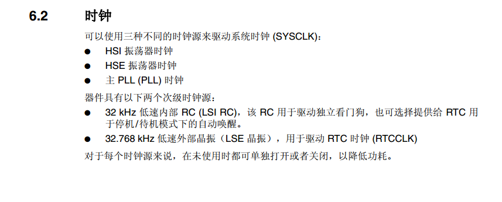

# **定时器-定时-说中断**
>**够用的硬件**
>
>**能用的代码**
>
>**实用的教程**
>
>屋脊雀工作室编撰 -20190101
>
>愿景：做一套能用的开源嵌入式驱动（非LINUX）
>
>官网：www.wujique.com
>
>github: https://github.com/wujique/stm32f407
>
>淘宝：https://shop316863092.taobao.com/?spm=2013.1.1000126.2.3a8f4e6eb3rBdf
>
>技术支持邮箱：code@wujique.com、github@wujique.com
>
>资料下载：https://pan.baidu.com/s/12o0Vh4Tv4z_O8qh49JwLjg
>
>QQ群：767214262
---


定时器是芯片上一个最重要的外设。
在写代码时，经常需要一段代码延时一定时间后执行；或者是一段程序间隔一定时间不断重复执行。
最典型的就是嵌入式操作系统，例如freertos，就需要一个定时器作为系统调度心跳时钟。
在调试按键扫描时提到，我们可以将scan函数放到定时器中执行，这也是定时器驱动程序执行的一个例子。
定时器是一个统称，实际上**定时**仅仅是定时器的一个功能。
定时器的功能通常包括：**定时、PWM输出、输入捕获、输入计数**等功能。
这次，我们先调试定时功能。
## 定时器
定时器是什么？
最简单的定时器就像一个倒计时时钟，大家的手机应该都有这个功能。
设定一个时间，例如10分钟，10分钟一到，闹铃就响起。
那单片机的定时器跟手机的定时器有什么区别呢？
1. 我们用单片机定时器，通常定时都是us/ms/s，很少定时几分钟的。
2. 单片机定时时间到了，不会直接响闹铃，一般只会在某个状态寄存器的某个bit置位，表明定时到了。如果这个定时器使能了中断，就会产生一个中断。
3. 单片机的定时器功能更多，例如重复定时，假如定时1s，如果配置为自动重复，那么只要启动定时器，每一秒都会产生`闹铃`，直到定时器被停止。
4. 设置更复杂，手机要定时10分钟，直接拨指针或者输入10就可以了。单片机要定时10S，要根据系统时钟计算，选择合适的预分频和定时计数。还要设置相关的中断开关等。

## STM32定时器
我们先看看STM32的定时器都有哪些功能。

#### 框图
使用一个芯片的定时器，先了解他的框图。
本次实验我们使用TIM5，在参考手册第15章节有详细说明。
下图是他的框图，看起来非常复杂，可见定时器功能是多么丰富。
如果我们只是当做一个定时器用，就只要关心红框内的三个框：
PSC预分频器，也就是我们设置的预分频系数，意思就是，例如我们设置为2，那么每经过2个CK_PSC时钟，CNT计数器才会变化1。
自动重载寄存器，设置的值跟CNT设置的值一样，如果我们设置为重复定时，如果是减计数，当CNT达到0，芯片会自动从重载寄存器拷贝计数值到计数器。加计数时，用CNT值跟重载寄存器比较，判断定时时间是否到。


#### 时钟
前面说到，单片机定时器跟手机定时器比，单片机设置更复杂，设置要根据系统时钟计算。
那么我们就要先了解系统的时钟，通常在参考手册内会有一个时钟树。
STM32F407芯片时钟树在6.2章节，

在本章节中，有针对定时器的说明

在system_stm32f4xx.c文件中，时钟初始化函数static void SetSysClock(void)，对PCLK1进行了4分频初始化，那么168/4=42M，预分频是2不是1，因此定时器的时钟为APB时钟倍频，42M*2=84M。
```c
#if defined(STM32F40_41xxx) || defined(STM32F427_437xx) || defined(STM32F429_439xx)
||  defined(STM32F412xG) || defined(STM32F446xx) || defined(STM32F469_479xx)    
    /* PCLK2 = HCLK / 2*/
    RCC->CFGR |= RCC_CFGR_PPRE2_DIV2;

    /* PCLK1 = HCLK / 4*/
    RCC->CFGR |= RCC_CFGR_PPRE1_DIV4;
#endif /* STM32F40_41xxx || STM32F427_437x || STM32F429_439xx  || STM32F412xG
|| STM32F446xx || STM32F469_479xx */

```
#### 初始化
下面代码为定时器初始化，前面是宏定义，大家写代码一定要多用宏定义，用宏定义的代码，修改起来更方便。
```c {.line-numbers}
#define TestTim TIM5
/*
    定时器时钟为84M,
    Tout=((SYSTEM_CLK_PERIOD)*(SYSTEM_CLK_PRESCALER))/Ft us.

	预分频,8400个时钟才触发一次定时器计数
	那么一个定时器计数的时间就是(1/84M)*8400 = 100us	  
*/
#define SYSTEM_CLK_PRESCALER    8400                  
#define SYSTEM_CLK_PERIOD       10000//定时周期


/**
 *@brief:      mcu_timer_init
 *@details:    定时器初始化
 *@param[in]   void  
 *@param[out]  无
 *@retval:     
 */
s32 mcu_timer_init(void)
{
    NVIC_InitTypeDef NVIC_InitStructure;
    TIM_TimeBaseInitTypeDef TIM_TimeBaseInitStruct;
    //打开定时器时钟
    RCC_APB1PeriphClockCmd(RCC_APB1Periph_TIM5, ENABLE);
    //复位定时器
    TIM_Cmd(TestTim, DISABLE);
    TIM_SetCounter(TestTim, 0);

    //设定TIM5中断优先级
    NVIC_InitStructure.NVIC_IRQChannel = TIM5_IRQn;
    NVIC_InitStructure.NVIC_IRQChannelPreemptionPriority = 2;//抢占优先级
    NVIC_InitStructure.NVIC_IRQChannelSubPriority = 0;      //响应优先级
    NVIC_InitStructure.NVIC_IRQChannelCmd = ENABLE;
    NVIC_Init(&NVIC_InitStructure);

    TIM_TimeBaseInitStruct.TIM_ClockDivision = TIM_CKD_DIV1;
    TIM_TimeBaseInitStruct.TIM_CounterMode = TIM_CounterMode_Up;//向上计数
    TIM_TimeBaseInitStruct.TIM_Period = SYSTEM_CLK_PERIOD - 1;  //周期
    TIM_TimeBaseInitStruct.TIM_Prescaler = SYSTEM_CLK_PRESCALER-1;//分频
    TIM_TimeBaseInitStruct.TIM_RepetitionCounter = 1;
    TIM_TimeBaseInit(TestTim, &TIM_TimeBaseInitStruct);

    TIM_ITConfig(TestTim, TIM_IT_Update, ENABLE);//打开定时器中断

    TIM_Cmd(TestTim, ENABLE);//使能定时器(启动)

		return 0;
}  
```

在初始化函数内，主要分3部分：
* 时钟
>第25行打开设备时钟。
* 定时器配置
>27行，停止定时器。
28行，复位定时器计数值。
37行，时钟分频，配置为DIV1，也就是没分频，定时器时钟为84M。
38行，计数方式，选择向上计数。
39行，计数周期，也就是要定时多少个计数的意思，使用向上计数，计数达到后产生事件。
40行，设置预分频系数，也就是决定了每个计数的时长。
41行，设置是否自动重加载，意思是：一个定时到了，是否自动开始下一个定时（不断重复）。
42行，执行配置。
46行，启动定时器。
* 中断
>31行，指定配置TIM5中断。
32行，设置抢断优先级。
33行，设置响应优先级。
34行，使能。
35行，执行配置。
44行，打开定时器中断。

**预分频系数**，也就是Prescaler。
程序中定义为8400，也就是说在84M时钟情况下，8400个时钟才触发一次定时器计数，那么一个定时器计数的时间就是(1/84M)\*8400 = 100us，那么要定时1S钟，**周期**则要设置为1x1000x1000/100=10000。
经过10000次计数后，恰好就是1S，定时器会产生一个状态事件，如果**中断使能**，则发生中断。

## 查询模式
如果没有使能中断，想要知道定时器是否已经到时间，需要一直查询定时器的状态寄存器。
如何查询？请看ST提供的库stm32f4xx_tim.c
其中有函数：
```c
/**
  * @brief  Checks whether the specified TIM flag is set or not.
  * @param  TIMx: where x can be 1 to 14 to select the TIM peripheral.
  * @param  TIM_FLAG: specifies the flag to check.
  *          This parameter can be one of the following values:
  *            @arg TIM_FLAG_Update: TIM update Flag
  *            @arg TIM_FLAG_CC1: TIM Capture Compare 1 Flag
  *            @arg TIM_FLAG_CC2: TIM Capture Compare 2 Flag
  *            @arg TIM_FLAG_CC3: TIM Capture Compare 3 Flag
  *            @arg TIM_FLAG_CC4: TIM Capture Compare 4 Flag
  *            @arg TIM_FLAG_COM: TIM Commutation Flag
  *            @arg TIM_FLAG_Trigger: TIM Trigger Flag
  *            @arg TIM_FLAG_Break: TIM Break Flag
  *            @arg TIM_FLAG_CC1OF: TIM Capture Compare 1 over capture Flag
  *            @arg TIM_FLAG_CC2OF: TIM Capture Compare 2 over capture Flag
  *            @arg TIM_FLAG_CC3OF: TIM Capture Compare 3 over capture Flag
  *            @arg TIM_FLAG_CC4OF: TIM Capture Compare 4 over capture Flag
  *
  * @note   TIM6 and TIM7 can have only one update flag.
  * @note   TIM_FLAG_COM and TIM_FLAG_Break are used only with TIM1 and TIM8.    
  *
  * @retval The new state of TIM_FLAG (SET or RESET).
  */
FlagStatus TIM_GetFlagStatus(TIM_TypeDef* TIMx, uint16_t TIM_FLAG)
```
用这个函数就可以查询定时器的各种状态了。
对应会有一个清标志函数：
```c
void TIM_ClearFlag(TIM_TypeDef* TIMx, uint16_t TIM_FLAG)
```
必须手动用这个函数清除标志，否则，就不知道下一次定时器的到来了。
## 中断
在前面章节，我们曾初步了解了芯片系统中断。现在我们再通过定时器中断看看中断的细节。
什么是中断呢？
 >通常我们的程序是按顺序执行（函数跳转和返回也是按顺序执行），顺序都是我们安排好的(我们上帝之手)。
当中断来临时，停止正在执行的程序，强行执行中断服务程序，中断服务程序运行结束后，在自动返回原来执行程序的位置继续执行。
中断和顺序程序不一样的就是，**中断发生时间不确定**。假设按键输入设置为IO中断，那么什么时候产生中断？随机的，没人知道什么时候会产生按键。

下面我们通过定时器的程序大概了解一下中断的应用。大家要注意，我们这里仅仅说应用，至于一个中断的切换返回细节，暂不做讨论。
#### NVIC
在STM32这个芯片中，或者说contex这种芯片中，与中断相关的有两部分：
1. 外设本身，比如你要使用定时器的中断，必须在定时器中使能对应的中断。
2. NVIC，嵌套向量控制器。

其中外设只要打开对应中断就行了。
NVIC就比较复杂了，NVIC是芯片控制管理所有中断的模块。
在《STM32F4xx中文参考手册.pdf》第10章有详细说明。
使用NVIC，主要内容是设置中断的优先级。
#### 优先级
contex内核有两个优先级：抢占和响应。
抢占优先级就是：如果A优先级高，B优先级低，当A发生中断，就算B正在处理中断，A也会立刻响应。
响应优先级就是：如果A响应优先级比B高，C中断正在执行，就算B先来，A也可以在C中断结束后，优先执行。前提是A和B的抢占优先级一样，并且不比C高。

通过上面分析，我们可以知道或者通常，把抢占优先级叫做主优先级，响应优先级叫做次优先级。
判断两个中断谁优先级高，先比主优先级，再比次优先级。
#### 优先级分组
哪么优先级怎么设置呢？
contex提供了多达8bit用来控制抢占优先级和响应优先级。
STM32自用了其中的低4位，这低4位如何分配给抢占和响应，需要在初始化时调用函数分配：
```c
/**
  * @brief  Configures the priority grouping: pre-emption priority and subpriority.
  * @param  NVIC_PriorityGroup: specifies the priority grouping bits length.
  *   This parameter can be one of the following values:
  *     @arg NVIC_PriorityGroup_0: 0 bits for pre-emption priority
  *                                4 bits for subpriority
  *     @arg NVIC_PriorityGroup_1: 1 bits for pre-emption priority
  *                                3 bits for subpriority
  *     @arg NVIC_PriorityGroup_2: 2 bits for pre-emption priority
  *                                2 bits for subpriority
  *     @arg NVIC_PriorityGroup_3: 3 bits for pre-emption priority
  *                                1 bits for subpriority
  *     @arg NVIC_PriorityGroup_4: 4 bits for pre-emption priority
  *                                0 bits for subpriority
  * @note   When the NVIC_PriorityGroup_0 is selected, IRQ pre-emption is no more possible.
  *         The pending IRQ priority will be managed only by the subpriority.
  * @retval None
  */
void NVIC_PriorityGroupConfig(uint32_t NVIC_PriorityGroup)
```
一共可以设置5中分组模式，什么意思呢？
例如第一种分组模式NVIC_PriorityGroup_0，这种分组模式，pre优先级没有，也就是不能设置（强制设置会出现意外），4bit都用来表示sub优先级，那么sub优先级就可以设置0~15。
如果设置为NVIC_PriorityGroup_2，pre优先级两位，可以设置0\~3，sub优先级同样2位，也可以设置0\~3。
每个系统具体如何设置中断优先级，需要根据所有中断需求合理分配。
#### 中断服务函数
一旦中断产生，就需要执行中断服务程序。
定时器的中断程序如下，这个函数就是中断服务函数。在函数我们判断了是不是Update中断，为什么要判断呢？因为定时器**中断入口**只有一个，定时器中断有多种，当中断产生时，只能通过标志区分是什么中断源。
```c
/**
 *@brief:      mcu_tim5_IRQhandler
 *@details:    定时器中断处理函数
 *@param[in]   void  
 *@param[out]  无
 *@retval:     
 */
void mcu_tim5_IRQhandler(void)
{
    if(TIM_GetITStatus(TIM5, TIM_FLAG_Update) == SET)
    {                                       
        TIM_ClearFlag(TIM5, TIM_FLAG_Update);

        mcu_tim5_test();

    }
}
```
在stm32f4xx_it.c中断响应中调用void mcu_tim5_IRQhandler(void)；
```c
void TIM5_IRQHandler(void)
{
    mcu_tim5_IRQhandler();
}
```
TIM5_IRQHandler这个函数名，是在中断向量中定义好的，**一定要一样**。
#### 中断向量
前面章节我们其实已经讨论过中断向量，我们看看定时器5的中断向量。

```c {.line-numbers}
__Vectors       DCD     __initial_sp           ; Top of Stack
                DCD     Reset_Handler          ; Reset Handler
                DCD     NMI_Handler            ; NMI Handler
                DCD     HardFault_Handler      ; Hard Fault Handler
                DCD     MemManage_Handler      ; MPU Fault Handler
                DCD     BusFault_Handler       ; Bus Fault Handler
                DCD     UsageFault_Handler     ; Usage Fault Handler
                DCD     0                      ; Reserved
                DCD     0                      ; Reserved
                DCD     0                      ; Reserved
                DCD     0                      ; Reserved
                DCD     SVC_Handler            ; SVCall Handler
                DCD     DebugMon_Handler       ; Debug Monitor Handler
                DCD     0                      ; Reserved
                DCD     PendSV_Handler         ; PendSV Handler
                DCD     SysTick_Handler        ; SysTick Handler
                ...
                DCD     SDIO_IRQHandler        ; SDIO                                            
                DCD     TIM5_IRQHandler        ; TIM5   
```
定时器5的中断函数指针在19行(文件137行)。
#### 定时器中断流程
到此，我们已经配置好定时器了，流程大概如下：
1 使能定时器时钟，并配置定时器。
2 设置NVIC定时器中断优先级。
3 打开定时器中断，启动定时器。
4 定时到后，产生时间标志，同时产生中断标志。
5 芯片从中断向量查找中断服务程序入口，执行中断服务程序。执行后返回。
6 重复4。

## 编码实验
代码见\mcu_dev目录下的mcu_timer.c和mcu_timer.h。
另外，在main函数前调用void mcu_timer_init(void)函数，初始化定时器。
```c
/* Infinite loop */
	mcu_uart_open(3);
	wjq_log(LOG_INFO, "hello word!\r\n");
	dev_key_init();
	mcu_timer_init();

	dev_key_open();
	while (1)
	{
		/*驱动轮询*/
		dev_key_scan();

		/*应用*/
		u8 key;
		s32 res;

		res = dev_key_read(&key, 1);
		if(res == 1)
		{
			if(key == DEV_KEY_PRESS)
			{
				GPIO_ResetBits(GPIOG, GPIO_Pin_0
                                    | GPIO_Pin_1 | GPIO_Pin_2| GPIO_Pin_3);
			}
			else if(key == DEV_KEY_REL)
			{

				GPIO_SetBits(GPIOG, GPIO_Pin_0
                                    | GPIO_Pin_1 | GPIO_Pin_2| GPIO_Pin_3);
			}
		}

		Delay(1);

	}
```

编译后下载进去，串口可见运行结果，从结果看，确实每秒中进入一次定时器中断。
>hello word!
tim int 1
tim int 2
tim int 3
tim int 4
tim int 1
tim int 2
tim int 3
tim int 4
tim int 1
tim int 2


## 总结
定时器功能就实现了。
请大家自行尝试将按键扫描放到定时器中，并且将定时器定时改为5毫秒一次中断。

---
end
---
