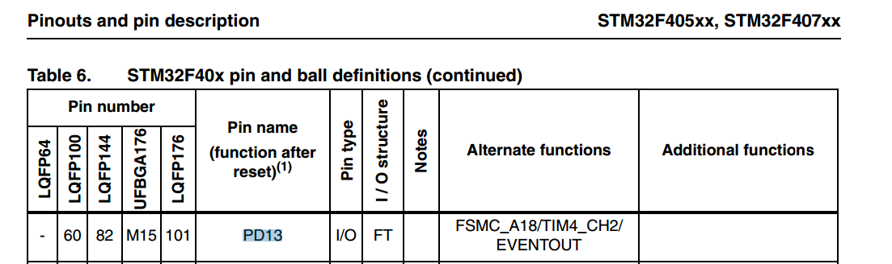
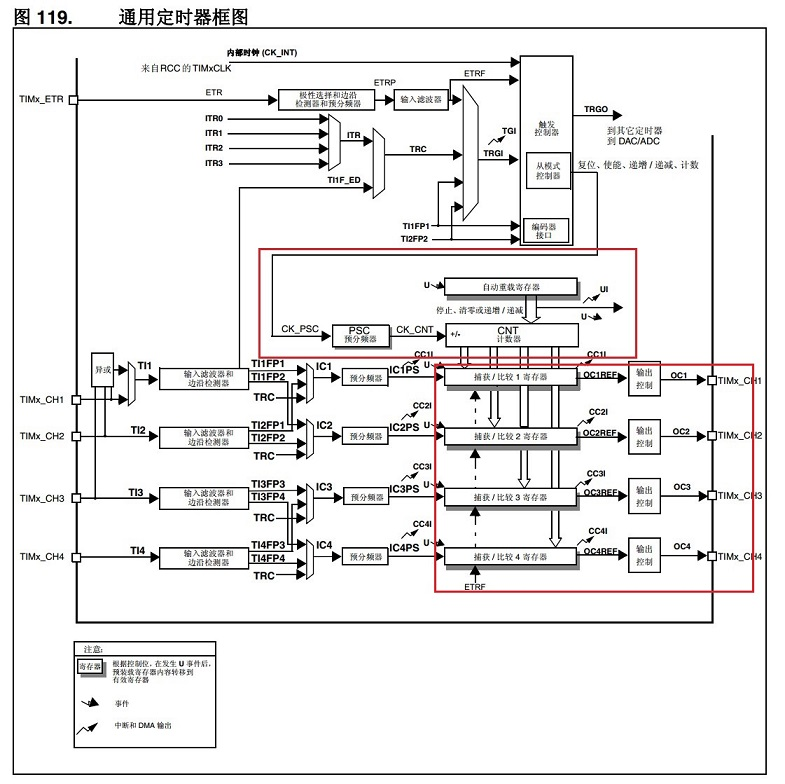
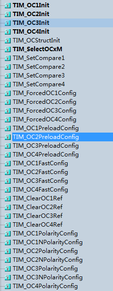

# **定时器-PWM-蜂鸣器**
>**够用的硬件**
**能用的代码**
**实用的教程**
>屋脊雀工作室编撰 -20190101
愿景：做一套能用的开源嵌入式驱动（非LINUX）
官网：www.wujique.com
github: https://github.com/wujique/stm32f407
淘宝：https://shop316863092.taobao.com/?spm=2013.1.1000126.2.3a8f4e6eb3rBdf
技术支持邮箱：code@wujique.com、github@wujique.com
资料下载：https://pan.baidu.com/s/12o0Vh4Tv4z_O8qh49JwLjg
QQ群：767214262
---


上一章节我们调试了定时器定时功能。现在我们调试定时器输出PWM功能。
## PWM
PWM（Pulse Width Modulation）是脉冲宽度调制的缩写。

简单的说就是高低电平不断切换。在流水灯章节我们曾经提过。
一个高低电平切换就是一个**周期**，在一个周期内，高电平持续时间占周期的百分比就是常说的**占空比**。
PWM常用于控制灯光和电机。通常占空比越大，电机转速越快，LED越亮（高电平驱动方式）。
## 原理图
本次我们使用一个固定频率的50%占空比PWM驱动一个电磁式蜂鸣器。

蜂鸣器选用贴片电磁式，参数如下，从表中可以看到，只要我们输出一个4000Hz的频率，就能驱动蜂鸣器。


## STM32定时器PWM
蜂鸣器beep接在PD13，在数据手册《STM32F407_数据手册.pdf》中可查到，**PD13是TIM4的CH2，因此要在这个IO上输出PWM，需要用定时器4，并且是在通道2上输出**。

上一节我们看过定时器的框图，做PWM功能，需要用到的功能比定时多了输出控制部分。
也就是下图右下角的大红框中的内容。

如何使用定时器4在PD13上输出4KHz的PWM？我们通过代码讲解。
## 编码
在board_dev文件夹创建两个新文件dev_buzzer.c、dev_buzzer.h，将这两个文件夹添加到工程。
#### IO口初始化
把一个IO口作为外设功能，只需要将对应IO口设置为**AF模式，并且使用配置函数配置为对应的外设功能**，具体见初始化函数注释。
```c
s32 dev_buzzer_init(void)
{
	GPIO_InitTypeDef GPIO_InitStructure;

	RCC_AHB1PeriphClockCmd(RCC_AHB1Periph_GPIOD, ENABLE); //---使能 GPIOD 时钟
    GPIO_PinAFConfig(GPIOD,GPIO_PinSource13,GPIO_AF_TIM4); //---管脚复用为 TIM4功能

    GPIO_InitStructure.GPIO_Pin = GPIO_Pin_13;
    GPIO_InitStructure.GPIO_Mode = GPIO_Mode_AF; //---复用功能
    GPIO_InitStructure.GPIO_Speed = GPIO_Speed_100MHz; //---速度 50MHz
    GPIO_InitStructure.GPIO_OType = GPIO_OType_PP; //---推挽复用输出
    GPIO_InitStructure.GPIO_PuPd = GPIO_PuPd_UP; //---上拉
    GPIO_Init(GPIOD,&GPIO_InitStructure);

    mcu_tim4_pwm_init(BUZZER_CLK_PERIOD,BUZZER_CLK_PRESCALER);

	return 0;
}
```
#### 定时器初始化
在初始化函数内，调用mcu_timer.c文件的mcu_tim4_pwm_init函数初始化定时器4。
```c {.line-numbers}
void mcu_tim4_pwm_init(u32 arr,u32 psc)
{
    TIM_TimeBaseInitTypeDef TIM_TimeBaseStructure;
    TIM_OCInitTypeDef TIM_OCInitStructure;

    RCC_APB1PeriphClockCmd(RCC_APB1Periph_TIM4,ENABLE);//---TIM4 时钟使能

    TIM_TimeBaseStructure.TIM_ClockDivision=TIM_CKD_DIV1;
    TIM_TimeBaseStructure.TIM_Prescaler = psc - 1; //---定时器分频
    TIM_TimeBaseStructure.TIM_CounterMode=TIM_CounterMode_Up; //---向上计数模式
    TIM_TimeBaseStructure.TIM_Period= arr - 1; //---自动重装载值
    TIM_TimeBaseInit(TIM4,&TIM_TimeBaseStructure);//---初始化定时器 4

    //----初始化 TIM4 PWM 模式
    TIM_OCInitStructure.TIM_OCMode = TIM_OCMode_PWM1; //---PWM 调制模式 1
    TIM_OCInitStructure.TIM_OutputState = TIM_OutputState_Enable; //---比较输出使能
    TIM_OCInitStructure.TIM_OCPolarity = TIM_OCPolarity_Low; //---输出极性低

	/*默认配置的是通道2*/
    TIM_OC2Init(TIM4, &TIM_OCInitStructure); //---初始化外设 TIM4
    TIM_SetCompare2(TIM4, arr/2);//---占空比50%
    TIM_OC2PreloadConfig(TIM4, TIM_OCPreload_Enable); //---使能预装载寄存器
    TIM_ARRPreloadConfig(TIM4,ENABLE);

}
```
相对前面配置定时功能，多了PWM配置。
>15行，配置定时器输出模式， 定时器输出有以下6种模式选择。
```c
/** @defgroup TIM_Output_Compare_and_PWM_modes
  * @{
  */

#define TIM_OCMode_Timing                  ((uint16_t)0x0000)
#define TIM_OCMode_Active                  ((uint16_t)0x0010)
#define TIM_OCMode_Inactive                ((uint16_t)0x0020)
#define TIM_OCMode_Toggle                  ((uint16_t)0x0030)
#define TIM_OCMode_PWM1                    ((uint16_t)0x0060)
#define TIM_OCMode_PWM2                    ((uint16_t)0x0070)
```
>16行，比较输出使能，也就是打开PWM输出功能。
17行，输出极性低，这个所谓的输出极性，也就是`控制比较寄存器`比`设置的计数`小的时候，输出0还是输出1。或者简单的理解就是，先输出低电平还是先输出高电平。
20-23行，执行配置，这个地方要注意，不同的输出通道设置，需要使用不同的函数：
我们用的是通道2，那么用的就是TIM_OC2Init、TIM_SetCompare2、TIM_OC2PreloadConfig。
在库文件中可以看到下面这些函数，定时器有4个通道，就有4套配置函数。


IO口和定时器都配置好后，只要启动定时器，就可以输出PWM了。

#### 打开和关闭的逻辑
经过初始化后，输出PWM，蜂鸣器就会响。
应用上不可能让蜂鸣器一直响，所以要提供OPEN和CLOSE接口。
如下：
```c
/**
 *@brief:      dev_buzzer_open
 *@details:    打开蜂鸣器
 *@param[in]   void  
 *@param[out]  无
 *@retval:     
 */
s32 dev_buzzer_open(void)
{
	GPIO_InitTypeDef GPIO_InitStructure;

	RCC_AHB1PeriphClockCmd(RCC_AHB1Periph_GPIOD, ENABLE); //---使能 GPIOD 时钟
    GPIO_PinAFConfig(GPIOD,GPIO_PinSource13,GPIO_AF_TIM4); //---管脚复用为 TIM4功能
    GPIO_InitStructure.GPIO_Pin = GPIO_Pin_13;
    GPIO_InitStructure.GPIO_Mode = GPIO_Mode_AF; //---复用功能
    GPIO_InitStructure.GPIO_Speed = GPIO_Speed_100MHz; //---速度 50MHz
    GPIO_InitStructure.GPIO_OType = GPIO_OType_PP; //---推挽复用输出
    GPIO_InitStructure.GPIO_PuPd = GPIO_PuPd_UP; //---上拉
    GPIO_Init(GPIOD,&GPIO_InitStructure);

    TIM_Cmd(TIM4, ENABLE); //---使能 TIM4

	return 0;
}
/**
 *@brief:      dev_buzzer_close
 *@details:    关闭蜂鸣器
 *@param[in]   void  
 *@param[out]  无
 *@retval:     
 */
s32 dev_buzzer_close(void)
{
	GPIO_InitTypeDef GPIO_InitStructure;

    TIM_Cmd(TIM4, DISABLE); //---关闭定时器 TIM4

	RCC_AHB1PeriphClockCmd(RCC_AHB1Periph_GPIOD, ENABLE); //---使能 GPIOD 时钟

	/*关闭蜂鸣器时，要将IO改为普通IO，并且输出低电平，否则蜂鸣器会造成大电流*/
    GPIO_InitStructure.GPIO_Pin = GPIO_Pin_13;
    GPIO_InitStructure.GPIO_Mode = GPIO_Mode_OUT; //---复用功能
    GPIO_InitStructure.GPIO_Speed = GPIO_Speed_100MHz; //---速度 50MHz
    GPIO_InitStructure.GPIO_OType = GPIO_OType_PP; //---推挽复用输出
    GPIO_InitStructure.GPIO_PuPd = GPIO_PuPd_UP; //---上拉
    GPIO_Init(GPIOD,&GPIO_InitStructure);
	GPIO_ResetBits(GPIOD, GPIO_Pin_13);

	return 0;
}
```
是不是跟你想的不一样？只要停止或者启动定时器不就行了吗？
功能上，确实是只要停止定时器，PWM就没有输出，蜂鸣器就不响；打开定时器，输出PWM，定时器就会响。
但是实际上会有问题，请看注释。
>因为我们关闭PWM输出，是直接停止定时器。那么在停止定时器的时候，**PWM输出的电平是随机的**，如果正好在输出高电平时停止定时器，蜂鸣器电流上的三极管就一直处于导通状态，此时电流会增大100ma。
所以关闭蜂鸣器后要将IO转为输出模式，并输出低电平。打开蜂鸣器时再将IO设置为PWM模式。

## 调试
在main函数中增加如下代码，初始化后，按下按键蜂鸣器响，松开按键蜂鸣器关。
```c
/* Infinite loop */
	mcu_uart_open(3);
	uart_printf("hello word!\r\n");
	mcu_timer_init();
	dev_key_init();
	dev_buzzer_init();
	while (1)
	{
		s32 key;
		key = dev_key_scan();
		if(key == 0)
		{
			GPIO_ResetBits(GPIOG, GPIO_Pin_0
				| GPIO_Pin_1 | GPIO_Pin_2| GPIO_Pin_3);
			dev_buzzer_open();
		}
		else if(key == 1)
		{

			GPIO_SetBits(GPIOG, GPIO_Pin_0
				| GPIO_Pin_1 | GPIO_Pin_2| GPIO_Pin_3);
			dev_buzzer_close();

		}
		Delay(1);

	}
```
- 调试过程
1 代码编写完成，编译，无错误，下载进去后，蜂鸣器不响。手头暂时没有示波器。咋办？
目前并**没有确定是软件问题还是硬件问题**，因此，**首先要确定硬件没有问题**。
前面我们已经调通了IO口输出与定时器中断，可以**利用定时器中断操作IO口翻转电平输出一个4K频率的PWM**。
经验证，蜂鸣器响，硬件无问题。
2 经查询，发现在设置PWM通道时错误，参考的代码用的是通道1，而我们用的是通道2。**初始化PWM时，每一个带OC1字符的函数或者定义都改为OC2即可。**
也即是上面mcu_tim4_pwm_init代码中的20、21、22行。
3 目前蜂鸣器是能发出声音了，但是因为暂时没有示波器，无法保证频率是否准确，占空比是否是50%，**实际项目中必须用示波器验证。**

## 总结
PWM应用非常广泛，除了控制蜂鸣器，还可以控制LED灯，或者控制LCD背光。
只要学会一种，其他都一样。

---
end
---
