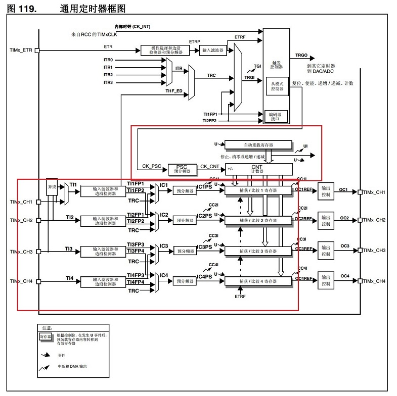
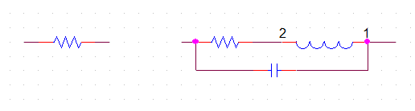
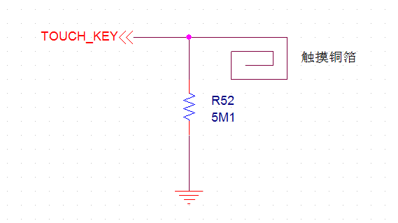
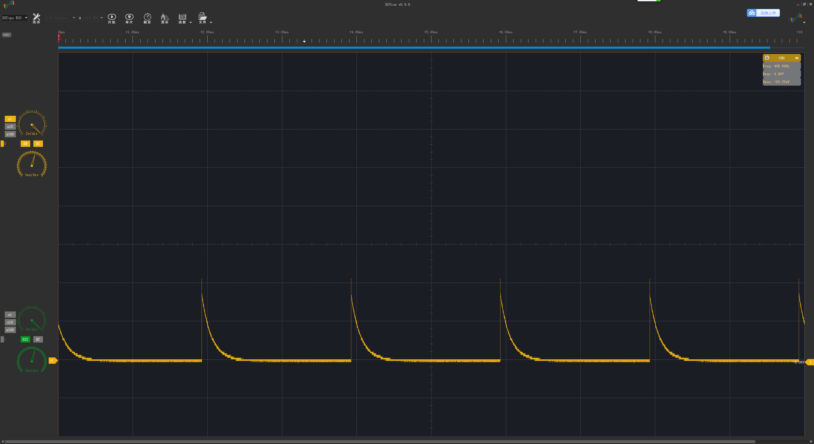
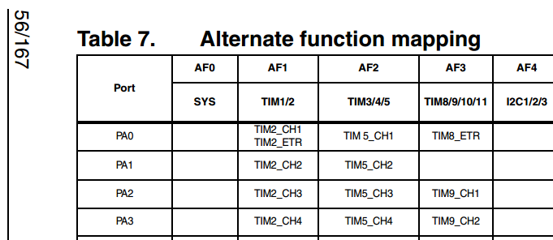

# **定时器-捕获-触摸按键**
>**够用的硬件**
**能用的代码**
**实用的教程**
>屋脊雀工作室编撰 -20190101
愿景：做一套能用的开源嵌入式驱动（非LINUX）
官网：www.wujique.com
github: https://github.com/wujique/stm32f407
淘宝：https://shop316863092.taobao.com/?spm=2013.1.1000126.2.3a8f4e6eb3rBdf
技术支持邮箱：code@wujique.com、github@wujique.com
资料下载：https://pan.baidu.com/s/12o0Vh4Tv4z_O8qh49JwLjg
QQ群：767214262
---

前面章节介绍了定时器的定时与输出PWM功能，定时器还有很多功能。
《STM32F4xx中文参考手册.pdf》中定时器就有说明。
本次我们就使用定时器的**输入捕获功能**，实现一个简单的**电容触摸按键**。
### 输入捕获
假如我们要检测一个PWM波形的高低电平时间，会怎么做呢？
如果没有输入捕获，我们可以使用一个普通定时器和一个IO输入中断实现。流程大概如下：
> * 将一个IO口配置为中断，上升沿触发。
> * 配置一个定时器，向下计数模式，例如倒计时1000毫秒
> * IO产生中断。
> * 在IO中断中，停止定时器，并且获取剩余计数值，例如是600,说明时间已经过去400毫秒。
同时配置IO为下降沿触发。再启动定时器。
> * IO产生下降沿中断。
> * 在IO中断中，停止定时器，并且获取剩余计数值，例如是300,说明时间已经过去300毫秒。
那么600-300 = 300，就是高电平时间。
也就完成了一次捕获中断，低电平同理。

定时器的输入捕获与此类似，只不过定时器硬件完成了判断IO口上升下降沿并保存时间值的功能。
 > * 首先打开定时器，向上计数模式。
 > * IO口（定时器通道）产生一个上升沿。
 > * 定时器在上升沿时将定时器的计数CNT，保存到CCRx1。
 > * IO口（定时器通道）产生一个下降沿。
 > * 定时器在下降沿时将定时器的计数CNT，保存到CCRx2。
 上升沿到下降沿时长可能超出定时器计数时限，需要做溢出处理。
 > * 那么CCRx1跟CCRx2，就是定时器捕获到的值，通过这两个值。
 可算出高电平时间，低电平同理。

不同的芯片输入捕获功能基本相同，细节上可能有所差别。
### STM32捕获中断
输入捕获，是定时器的功能，前面我们已经用了STM32定时器**定时**、**输出**两个功能。
输入捕获是定时器的输入功能，除了输入捕获，还有输入计数等其他输入功能。
输入捕获用到下图红框内的功能。


这看《STM32F4xx中文参考手册.pdf》，不再累赘。
然后通过例程代码进一步熟悉。

### 电容触摸按键原理
所谓电容式，就是利用电容的充放电检测是否触摸。
学过基本电子学的同学应该都知道，一个真正的器件，会有一个等效电路，而不仅仅是我们说的这个器件功能本身（理想电路）。
例如一个电阻，等效电路与理想电路如下：

左边是理想电阻，右边是等效电阻，除了电阻，还包含了寄生电感跟寄生电容。寄生性能在低速电路通常不用考虑，在高速电路就是一个重要指标了。
人，就是一个大电阻，也有寄生电容。当人一接触PCB板上的触摸铜箔，就改变了整个触摸电路的寄生电容。触摸电路的放电时间就会改变。
- 电容触摸按键电路

- 充放电波形
下图是触摸按键充放电波形，有几个特点：
>1. 电容很小，在IO口高电平3.3V充电，很快就会充满，所以低电平到高电平非常陡峭。
>2. 放电电阻较大，我们用的是5.1M，所以放电时间比充电时间长很多很多。
>3. 当手指触摸铜箔，电容增大，放电时间变长。


- 检测流程
>* 先用IO口输出高电平，电阻跟触摸铜箔的寄生电容就会充电。
>* 然后将IO口改为输入捕获，这时刚刚充满电的电容就会通过电阻放电，放电结束后（电压达到IO低电平识别范围）就触发输入捕获中断
>* 我们将得到的数据进行分析处理，即可区分是否有触摸

### 编码
下面进入编码设计。
#### 驱动设计
触摸按键驱动分两部分：
>1. 输入捕获相关的，放到定时器驱动，为touchkey算法提供时间流。
>2. 触摸算法处理部分，单独做一个dev_touchkey驱动，提供触摸按键api给APP使用。

对于这两个驱动的分割，有如下考虑：
1. **输入捕获就是输入捕获，捕获到时间流后，就上传给上一个模块。**
至于这个时间流的具体功能，是触摸按键呢？还是其他，例如磁条卡磁道时间流。定时器会知道吗？不知道，也不应该知道，知道也不应该管。
2. **触摸模块根据时间流数据处理后得到触摸事件。**
我们现在用的是定时器捕获，如果改为普通定时器加IO中断。触摸驱动要识别这两者吗？**不需要，而且要兼容**。无论定时捕获还是定时+IO中断，对于触摸驱动来说，就是个黑盒子，只要给我时间流数据就行了。
3. 有一种触摸按键，是直接用芯片处理的，从芯片处就已经得到了触摸按键事件。
假设现在方案是定时捕获，我们完成了驱动，量产了。然后要修改为IC方案。怎么样的驱动设计，改动最小？

#### 定时器配置
在mcu_timer驱动中增加初始化定时器输入捕获内容。
硬件使用PA3作为捕获输入，查看数据手册，PA3是TIM2的CH4，还是TIM5的CH4，是TIM9的CH2。

我们使用TIM2的CH4作为捕获定时器输入。不使用捕获中断，捕获值通过查询获取。
主要有两个函数，一个是初始化定时器捕获，一个是查询获取定时器捕获的值。代码都是对库的调用，具体配置请看源码。
```c {.line-numbers}
/**
 *@brief:      mcu_timer_cap_init
 *@details:    初始化定时器捕获，不使用中断
 *@param[in]   u32 arr  
               u16 psc  
 *@param[out]  无
 *@retval:     
 */
void mcu_timer_cap_init(u32 arr,u16 psc)
{

	TIM_TimeBaseInitTypeDef TIM_TimeBaseStructure;
	TIM_ICInitTypeDef TIM2_ICInitStructure;

	//初始化 TIM2
	RCC_APB1PeriphClockCmd(RCC_APB1Periph_TIM2, ENABLE); // 时钟使能
	TIM_TimeBaseStructure.TIM_Period = arr; //设定计数器自动重装值
	TIM_TimeBaseStructure.TIM_Prescaler =psc; //预分频器
	TIM_TimeBaseStructure.TIM_ClockDivision = TIM_CKD_DIV1;
	TIM_TimeBaseStructure.TIM_CounterMode = TIM_CounterMode_Up; //TIM 向上计数
	TIM_TimeBaseInit(TIM2, &TIM_TimeBaseStructure); // 初始化定时器 2

	//初始化通道 4
	TIM2_ICInitStructure.TIM_Channel = TIM_Channel_4; //选择输入端 IC4 映射到 TIM2
	TIM2_ICInitStructure.TIM_ICPolarity = TIM_ICPolarity_Falling; //下降沿捕获
	TIM2_ICInitStructure.TIM_ICSelection = TIM_ICSelection_DirectTI;
	TIM2_ICInitStructure.TIM_ICPrescaler = TIM_ICPSC_DIV1; //配置输入分频,不分频
	TIM2_ICInitStructure.TIM_ICFilter = 0x00;//配置输入滤波器 不滤波
	TIM_ICInit(TIM2, &TIM2_ICInitStructure);//初始化 TIM2 IC4

	TIM_ClearITPendingBit(TIM2, TIM_IT_CC4|TIM_IT_Update); //清除中断标志
	TIM_SetCounter(TIM2,0);

	TIM_Cmd(TIM2,ENABLE); //使能定时器 2
}
/**
 *@brief:      mcu_timer_get_cap
 *@details:    查询获取定时去捕获值
 *@param[in]   void  
 *@param[out]  无
 *@retval:     捕获值，超时则返回最大值
 */
u32 mcu_timer_get_cap(void)
{

	while(TIM_GetFlagStatus(TIM2, TIM_IT_CC4) == RESET)//等待捕获上升沿
	{
		if(TIM_GetCounter(TIM2) > 0xffffffff-1000)
			return TIM_GetCounter(TIM2);//超时了,直接返回 CNT 的值
	}
	return TIM_GetCapture4(TIM2);
}
```
>16~21行，是对定时器片配置。
24~29行，是对定时器输入的配置，还记得PWM实验吗？调用的是OC接口，现在调用的是IC接口，也就是input config的意思吧。

#### 触摸按键处理
创建dev_touchkey设备驱动。
因为目前没有系统，驱动设计为：定时轮询+缓冲区模式。有系统的时候也可以使用这种模式，也可以考虑修改为线程+邮箱的模式。

* 驱动伪代码流程

>1. dev_touchkey_init初始化
>2. 在main函数的while(1)中轮询dev_touchkey_task函数
>3. dev_touchkey_task中首先调用dev_touchkey_resetpad函数对按键充电。
>4. 充电完成后执行dev_touchkey_iocap，将IO转为定时器输入捕获通道。
>5. 调用mcu_timer_cap_init函数配置定时器捕获。
>6. 调用mcu_timer_get_cap获取捕获的值。
>7. 通过函数dev_touchkey_scan处理捕获值，如果确定状态变化，将事件写入TouchKeyBuf。

下面代码是触摸电容的检测流程，得到时间流后，再用scan函数处理时间流。
```c
/**
 *@brief:      dev_touchkey_task
 *@details:    触摸按键线程，常驻任务
 *@param[in]   void  
 *@param[out]  无
 *@retval:     
 */
s32 dev_touchkey_task(void)
{
	volatile u32 i = 0;
	u32 cap;

	if(TouchKeyGd != 0)
		return -1;
	//IO输出1，对电容充电
	dev_touchkey_resetpad();
	//延时一点，充电
	for(i=0;i++;i<0x12345);
	//将IO口设置为定时去输入捕获通道
	dev_touchkey_iocap();
	//开定时器捕获，如果预分频8，一个定时器计数是100ns左右 ，这个值要通过调试，
	mcu_timer_cap_init(0xffffffff, 8);
	cap = mcu_timer_get_cap();
	TOUCHKEY_DEBUG(LOG_DEBUG, "\r\n%08x---", cap);

	dev_touchkey_scan(cap);

	return 0;
}
```

scan处理流程，**设计思想可以参考按键扫描**（很多数据处理流程都可以参考按键处理）。
具体流程看代码吧。

- 应用流程
>调用dev_touchkey_read读取触摸按键事件。
```c
/**
 *@brief:      dev_touchkey_test
 *@details:    触摸按键测试程序
 *@param[in]   无
 *@param[out]  无
 *@retval:     
 */
s32 dev_touchkey_test(void)
{
	u8 tmp;
	s32 res;

	//dev_touchkey_open();

	res = dev_touchkey_read(&tmp, 1);
	if(1 == res)
	{
		if(tmp == DEV_TOUCHKEY_TOUCH)
		{
			wjq_log(LOG_FUN, "touch key test get a touch event!\r\n");
		}
		else if(tmp == DEV_TOUCHKEY_RELEASE)
		{
			wjq_log(LOG_FUN, "touch key test get a release event!\r\n");
		}
	}
	return 0;

}
```

- 缺陷
1. 使用查询方式获取捕获值，查询就相当于死等，浪费CPU时间，需要改为中断模式。
2. 充电使用硬延时，同样浪费CPU时间，可以改为定时器。
请大家尝试优化，屋脊雀会再最后提供的整体软件上优化。
#### 调试
* 第一步
**先调试获取时间流功能，获取到的时间流要能够反映触摸变化。**

测试程序如下，在main函数while循环中调用即可。

```c
/**
 *@brief:      dev_touchkey_task
 *@details:    触摸按键线程，常驻任务
 *@param[in]   void  
 *@param[out]  无
 *@retval:     
 */
s32 dev_touchkey_task(void)
{
	u32 i = 0;
	u32 cap;

	uart_printf("touchkey touch\r\n");
	//IO输出1，对电容充电
	dev_touchkey_resetpad();
	//延时一点，充电
	for(i=0;i++;i<0x12345);
	//开定时器捕获，如果预分频84，一个定时器计数是1us左右 ，这个值要通过调试，
	uart_printf("touchkey touch start cap.\r\n");
	mcu_timer_cap_init(0xffffffff, 84);
	cap = mcu_timer_get_cap();
	uart_printf("cap value:%08x\r\n", cap);
}
```
>后面驱动进行系统系统整合，这个task函数要放到一个定时器，或者是在while主循环中定时轮询。如果有操作系统，就单独创建一个线程，或者放到守护线程中运行。
而且要整改这个函数，因为现在里面有死等，系统整合后不使用死等，避免占系统时间片资源，可以通过将这个task整改为**分步骤执行**来实现。
首先充电，然后退出task。
第二次进入task，就是启动cap，然后退出。
第三次进来就是读捕获数据，然后循环重复第一步。

串口调试信息如下，从中看出手不触摸的时候，捕获值为0X3B，手放上去时，0X54。
两者之间差别不大，而且数值都较小。需要加快定时器计数，将两者的捕获值拉大，**增强识别度**。
>---hello world!-----
touchkey touch
touchkey touch start cap.
cap value:0000003b

>---hello world!-----
touchkey touch
touchkey touch start cap.
cap value:00000054

>---hello world!-----
touchkey touch
touchkey touch start cap.
cap value:00000054

>---hello world!-----
touchkey touch
touchkey touch start cap.
cap value:0000003b

将dev_touchkey_task中mcu_timer_cap_init函数的预分频改为8，将定时器速度直接加快10倍
```c
mcu_timer_cap_init(0xffffffff, 8);
```
修改后调试信息如下，可以看出，捕获值已经放大，识别度由原来的20左右变为160，考虑干扰的情况，160上下浮50，识别度已经算可以了。
如果还需要优化，可以通过修改硬件放电电阻阻值，或者增加旁路电容。
>---hello world!-----
touchkey touch
touchkey touch start cap.
cap value:00000232

>---hello world!-----
touchkey touch
touchkey touch start cap.
cap value:000002ac

>---hello world!-----
touchkey touch
touchkey touch start cap.
cap value:00000300

>---hello world!-----
touchkey touch
touchkey touch start cap.
cap value:00000234

>---hello world!-----
touchkey touch
touchkey touch start cap.
cap value:00000231

**注：以上测试数据在第一版硬件上测试**

* 第二步
**对数据进行处理并识别**

数据处理识别的方案：
>时间流cap，连续N次，与上一轮稳定状态的平均值比较，偏差超过门限，则认为是一次变化，同时保存平均值做为新的稳定状态。
根据偏差方向（变大还是变小），判断是触摸还是松开，（上电初始化后第一次变化丢弃）。

源码如下，将dev_touchkey_scan函数添加到dev_touchkey_task获取到cap之后。同时修改main函数，将原来的延时改为10毫秒，加快触摸按键扫描速度。具体见代码。
```c {.line-numbers}
#define DEV_TOUCHKEY_GATE 50//确认状态变化的门限值，根据硬件性能调节本参数到合适灵敏度即可。
#define DEV_TOUCHKEY_DATA_NUM 4//一轮稳定状态时间流个数，可以通过修改这个调节触摸扫描时间
static u16 TouchKeyLastCap = 0;//最后一次稳定的CAP平均值
/**
 *@brief:      dev_touchkey_scan
 *@details:    扫描触摸捕获的数据流
 *@param[in]   u32  
 *@param[out]  无
 *@retval:                  	
 */
s32 dev_touchkey_scan(u32 cap)
{
	static u16 average = 0;//平均值
	static u8 cap_cnt = 0;//有效捕获计数
	static u8 last_dire = DEV_TOUCHKEY_IDLE;//上一个值的方向，1位变大,触摸，2为变小，松开

	//uart_printf("--%08x-%04x-", cap, TouchKeyLastCap);
	if(cap > TouchKeyLastCap + DEV_TOUCHKEY_GATE)
	{
		if(last_dire != DEV_TOUCHKEY_TOUCH)
		{
			cap_cnt = 0;
			average = 0;
			last_dire = DEV_TOUCHKEY_TOUCH;
		}

		cap_cnt++;
		average = average + cap;
		//uart_printf("b-");
	}
	else if(cap < TouchKeyLastCap - DEV_TOUCHKEY_GATE)
	{
		if(last_dire != DEV_TOUCHKEY_RELEASE)
		{
			cap_cnt = 0;
			average = 0;
			last_dire = DEV_TOUCHKEY_RELEASE;
		}
		cap_cnt++;
		average = average + cap;
		//uart_printf("s-");
	}
	else
	{
		//uart_printf("i-");
		cap_cnt = 0;
		average = 0;
		last_dire = DEV_TOUCHKEY_IDLE;
	}

	//uart_printf("\r\n");
	if(cap_cnt >= DEV_TOUCHKEY_DATA_NUM)
	{

		if(DEV_TOUCHKEY_RELEASE == last_dire)
		{
			uart_printf("\r\n-----------------------rel\r\n");
		}
		else if(DEV_TOUCHKEY_TOUCH == last_dire)
		{
			uart_printf("\r\n-----------------------touch\r\n");
		}

		if(TouchKeyLastCap == 0)
		{
			uart_printf("\r\n-------------------init\r\n");
		}

		TouchKeyLastCap = average/DEV_TOUCHKEY_DATA_NUM;
		cap_cnt = 0;
		average = 0;
	}

}
```
我们从源码分析，
>1 TouchKeyLastCap初始化为0。
2 第18行到第49行代码，判断新的cap值跟TouchKeyLastCap的偏差，如果大于门限，认为是触摸，并且进行记录；小于，认为是松开，同时进行记录；否则认为是没变化，清记录。
3 记录大于DEV_TOUCHKEY_DATA_NUM次后，确认是变化，根据变化方向，判断触摸还是松开，同时更新平均值。

***本处理流程，在初始化时没有预先获取一个稳定状态做为非触摸状态。因此在上电的时候无论是触摸还是非触摸，在后续都可以正常识别。***
触摸着按键上电，init之后松开，正确识别为rel，后续识别正常。
>---hello world!-----
-----------------------touch
-------------------init
-----------------------rel
-----------------------touch
-----------------------rel
-----------------------touch
-----------------------rel

上电时没有触摸，init之后触摸，正常识别为touch，后续识别正常。
>---hello world!-----
-----------------------touch
-------------------init
-----------------------touch
-----------------------rel
-----------------------touch
-----------------------rel

* 第三步
**识别结果保存及接口处理**

经过上一步，已经能正常获取触摸事件。但是对于一个驱动来说，与上层的接口及数据交互方案是一个重要的驱动设计内容。
在TOUCHKEY驱动中，我们使用环形缓冲区的设计。
>1. 在dev_touchkey_scan函数中识别到事件后。将事件写入缓冲区。
>2. APP通过dev_touchkey_read接口读取事件。

dev_touchkey_scan函数修改增加如下代码
```c
		if(TouchKeyLastCap == 0)
		{
			//uart_printf("\r\n-------------------init\r\n");
		}
		else
		{
			//uart_printf("\r\n-------------------chg\r\n");
			if(last_chg != last_dire)//防止重复上报
			{
				//uart_printf("\r\n--------report\r\n");
				TouchKeyBuf[TouchKeyWrite++] = last_dire;
				if(TouchKeyWrite >= DEV_TOUCHKEY_BUF_SIZE)
				TouchKeyWrite = 0;
			}

			last_chg = last_dire;

		}
```
实现读函数如下：
```c
/**
 *@brief:      dev_touchkey_read
 *@details:    读设备，获取触摸事件
 *@param[in]   u8 *buf    
               u32 count  
 *@param[out]  无
 *@retval:     
 */
s32 dev_touchkey_read(u8 *buf, u32 count)
{
	u32 cnt = 0;

	while(1)
	{
		if(TouchKeyWrite ==  TouchKeyRead)
			break;

		if(cnt >= count)
			break;

		*(buf+cnt) = TouchKeyBuf[TouchKeyRead++];
		if(TouchKeyRead >= DEV_TOUCHKEY_BUF_SIZE)
			TouchKeyRead = 0;

		cnt++;
	}

	return cnt;

}
```
dev_touchkey_test就是一个应用。
将dev_touchkey_test放到main函数的while循环中执行。
```c

/**
 *@brief:      dev_touchkey_test
 *@details:    触摸按键测试程序
 *@param[in]   无
 *@param[out]  无
 *@retval:     
 */
s32 dev_touchkey_test(void)
{
	u8 tmp;
	s32 res;

	res = dev_touchkey_read(&tmp, 1);
	if(1 == res)
	{
		if(tmp == DEV_TOUCHKEY_TOUCH)
		{
			uart_printf("touch key test get a touch event!\r\n");
		}
		else if(tmp == DEV_TOUCHKEY_RELEASE)
		{
			uart_printf("touch key test get a release event!\r\n");
		}
	}

}
```
测试结果
>---hello world!-----
touch key test get a touch event!
touch key test get a release event!
touch key test get a touch event!
touch key test get a release event!
touch key test get a touch event!
touch key test get a release event!
touch key test get a touch event!
touch key test get a release event!

到此，touchkey设备驱动基本完成。当然，可以优化的地方还很多。
### 思考
1. 我们已经实现了发现触摸就上报，触摸离开也上报。长按呢？如何处理？**该谁处理？**
2. 对于一个应用来说，你是触摸按键还是机械按键，它并不关心。APP，触摸按键，机械按键，三者之间的关系关系如何处理？接口如何处理？

---
end
---
