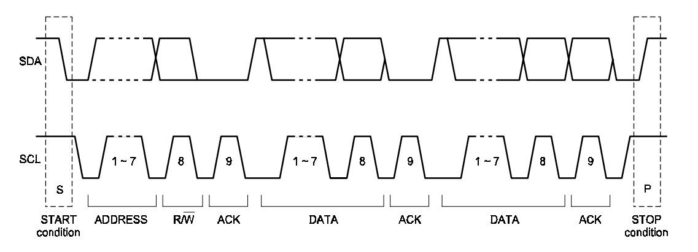
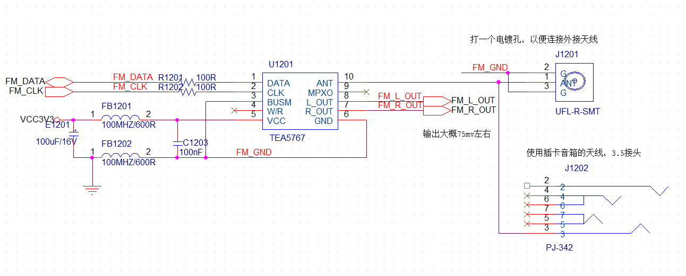
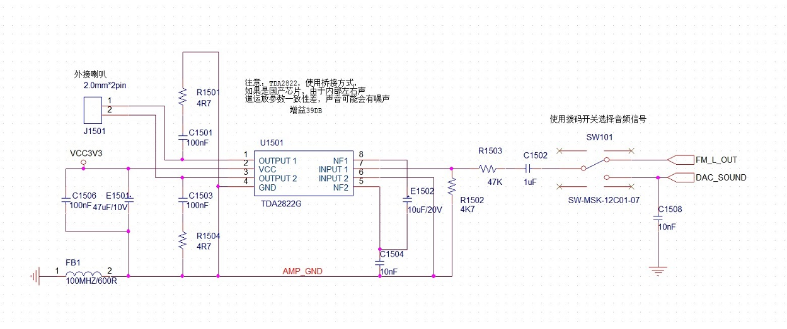
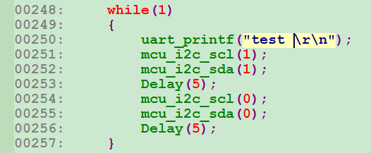
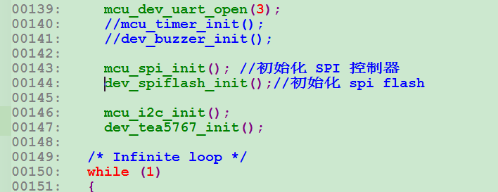
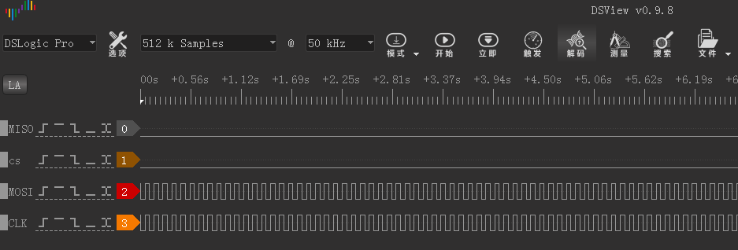
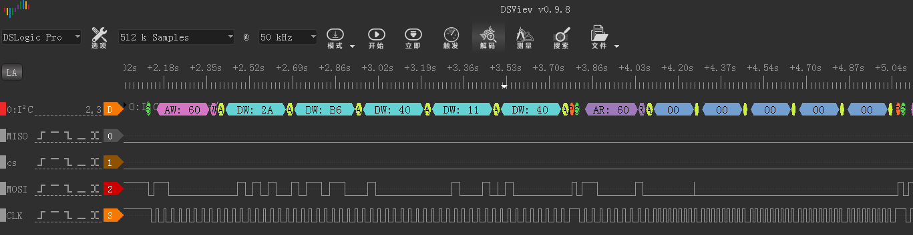
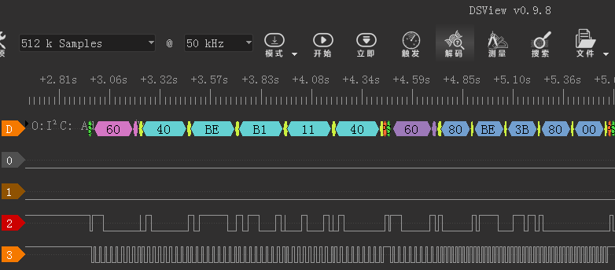

# **I2C-收音机-功放**
>**够用的硬件**
>
>**能用的代码**
>
>**实用的教程**
>
>屋脊雀工作室编撰 -20190101
>
>愿景：做一套能用的开源嵌入式驱动（非LINUX）
>
>官网：www.wujique.com
>
>github: https://github.com/wujique/stm32f407
>
>淘宝：https://shop316863092.taobao.com/?spm=2013.1.1000126.2.3a8f4e6eb3rBdf
>
>技术支持邮箱：code@wujique.com、github@wujique.com
>
>资料下载：https://pan.baidu.com/s/12o0Vh4Tv4z_O8qh49JwLjg
>
>QQ群：767214262
---

前面已经调试了IO口，定时器，串口。本章节我们调试I2C。
别的教程都是用I2C控制EPROM，实际上EPROM现在用的已经比较少了。
如果只是随便存一点数据，STM32内部FLASH就可以使用。如果要存较多数据，例如字库，一般都使用SPI FLASH。
我们用I2C做一点好玩的，控制TEA5767，一块飞利浦的收音机芯片，玩一波电波情缘。
## I2C接口
关于I2C接口，看文档《I2C总线协议.pdf》，周立功写的。
在第12页有一个时序图如下图，我们就从这个图了解I2C。


>1. I2C通信使用两根线SDA和SCL，SCL是时钟线，SDA是数据线，控制时钟的是主机。
>2. I2C通信过程看图底部英文标识：
（1）首先发送`起始信号START`，然后发送`地址ADDRESSS`，接着是`读写位R/W`，主机释放SDA线，从机使用SDA线返回`应答位ACK`。
地址有7位，紧接着的第8位是数据方向位R/ W， 0 表示发送（写），1 表示请求数据（读）。两者传输时正好组成一个字节。
（2）如果是读，主机释放SDA，由从机控制，但是时钟还是由主机控制。从机在时钟控制下，从SDA线上返回数据，一个字节后，主机控制SDA线发送ACK信号，如此循环直到读结束。
（3）如果是写，主机控制SDA线发送数据，一个字节后，释放SDA线，从机返回ACK信号，如此循环直到写结束。
（4）主机发送结束信号。
>3. I2C总线可挂载多个I2C设备，通过地址区分，地址有7位地址或10位地址，常见芯片通常是7位。
>4. 多个芯片通信时，I2C会进行仲裁（这部分个人不熟悉，需要了解可以认真看文档，或者直接找飞利浦的文档看）。

## STM32 I2C
ST的I2C复杂且不好用，口碑不好，大家都在用软件模拟。
听说是为了避开飞利浦专利。
本次我们使用IO口模拟I2C，**硬件I2C在摄像头中会使用**。

## 收音机模块
板载的收音机模块TEA5767是飞利浦的。
**使用总线操控芯片，通常也就是操作芯片里面的寄存器**
对于大部分芯片这个说法都是合适的。
TEA5767的功能，通过他的寄存器了解。
请参考微控设计网 DC版主翻译整理的《TEA5767HN低功耗立体声收音机接收器.pdf》
## 原理图
TEA5767模块通过I2C接口控制，输出双声道信号。天线使用3.5插卡音箱拉杆天线。
收音功能对电源要求较高，在电源端安排了一个100UF的钽电容，电源跟地串了磁珠。I2C信号线也串了100R电阻。

TEA5767输出声音信号只有20多mv左右，不能直接推动喇叭，需要功放放大，我们使用的功放是TDA2822。

电路使用TDA2822桥接方式，放大倍数较大。
输入端使用电阻分压，降低输入信号，防止放大过渡。
除了FM信号，另外一路DAC_SOUND也使用功放，通过拨动开关选择哪路音频信号输入到功放。

## 编码
建立两个驱动：mcu_i2c和dev_tea5767。
权且认为模拟I2C属于片上设备吧，放到mcu_dev目录。
tea5767属于板上设备，代码放到 board_dev。
代码请阅读源文件。
#### I2C关键代码
**请从GIT上下载最新的代码，此处的代码只是教程，不是最新**
I2C主要流程如下面函数，其他IO口初始化函数请自行查看代码。
```c {.line-numbers}
s32 mcu_i2c_transfer(u8 addr, u8 rw, u8* data, s32 datalen)
{
    s32 i;
    u8 ch;

    //发送起始
    mcu_i2c_start();
    //发送地址+读写标志
    //处理ADDR
    if(rw == MCU_I2C_MODE_W)
    {
        addr = ((addr<<1)&0xfe);
        //uart_printf("write\r\n");
    }
    else
    {
        addr = ((addr<<1)|0x01);
        //uart_printf("read\r\n");
    }

    //uart_printf("i2c addr:%02x\r\n", addr);
    mcu_i2c_writebyte(addr);
    mcu_i2c_wait_ack();

    i = 0;
    while(i < datalen)
    {
        //数据传输
        if(rw == MCU_I2C_MODE_W)//写
        {
            ch = *(data+i);
            //uart_printf("i2c:w:%02x\r\n", ch);
            mcu_i2c_writebyte(ch);
            mcu_i2c_wait_ack();

        }
        else if(rw == MCU_I2C_MODE_R)//读
        {
            ch = mcu_i2c_readbyte();  
            mcu_i2c_ack();
            *(data+i) = ch;
            //uart_printf("i2c:r:%02x\r\n", ch);
        }
        i++;
    }

    //发送结束
    mcu_i2c_stop();
    return 0;
}
```
>1. 输入参数addr是七位地址，不包含读写位。
>2. 参数rw为读写标志。
>3. 首先发送start信号
>4. 根据读写标志处理addr，发送addr后等待ack。
>5. 进入数据传输，读写传输流程分开。
>6. 数据传输结束后发送stop信号。

mcu_i2c_transfer的实现，可见流程是完全按照I2C波形设计的。
值得注意的是函数参数的设计：
1 地址用7位，这个是根据实际设计，I2C地址就是7位的，很多代码将地址设计为8位，将读写标志也包含，个人认为不符合要求。
2 读写标志单独做一个参数，如此无论读写，都只是用一个函数。

#### TEA5767代码设计
略
>TEA5767实际应用场景并不多，有兴趣的可自行研究。

## 调试
* 首先调试I2C

- 程序跑起来后，在等待I2C的ACK处超时。检查硬件，发现两个调试用的电阻没焊上。
- 焊上后，还是不行，上逻辑分析仪，没抓到波形。
- 加一个简单的测试程序，定时翻转两个IO口电平，用逻辑分析仪抓波形，抓不到波形。

- 查看初始化代码，发现早上测试SPI的时候，把I2C初始化屏蔽了，自己坑自己了，打开如下。

- 抓到正常翻转波形。

- 恢复程序，调试信息不再输出超时，但是读回来的数据全部是0x00，肯定不对，用逻辑分析仪抓到的协议也全部是0X00。

- 逻辑分析仪能抓到发送波形，程序应该没什么问题。
问题应该是芯片或者I2C接口，再查看，发现PCB上的两个I2C上拉电阻好像有问题，虚焊。重新焊接后，I2C通信正常。

### TEA5767
- 控制
通过I2C控制TEA5767，读写不带寄存器地址。
读，则连续读出5个字节，写，同样一次性写五个字节，但是五个字节数据意义不一样。具体见《TEA5767HN低功耗立体声收音机接收器.pdf》。
- 寻台
TEA的操作主要是寻台，提供两个函数dev_tea5767_auto_search和dev_tea5767_search。
>dev_tea5767_auto_searc
芯片自动寻台，但是寻台并不是很准，寻台成功后，要判断信号强度。以免错寻。

>dev_tea5767_search
程序寻台，直接设置一个频率，延时后读信号强度，不符合要求则再设置下一个频率。
### 测试函数
在main.c中进行测试，首先要初始化I2C接口，再打开tea5767，然后强制设置一个频率(请设置当地FM电台频率)，在循环内，当按键按下时，开始寻台。
```c {.line-numbers}
	mcu_i2c_init();

	//mcu_timer_init();
	dev_key_init();
	dev_buzzer_init();

	dev_tea5767_open();
	dev_tea5767_setfre(97100);

	while (1)
	{
		s32 key;
		key = dev_key_scan();
		if(key == 0)
		{
			GPIO_ResetBits(GPIOG, GPIO_Pin_0
                          | GPIO_Pin_1 | GPIO_Pin_2| GPIO_Pin_3);
			//dev_buzzer_open();
			dev_tea5767_search(1);
		}
		else if(key == 1)
		{

			GPIO_SetBits(GPIOG, GPIO_Pin_0
                           | GPIO_Pin_1 | GPIO_Pin_2| GPIO_Pin_3);
			dev_buzzer_close();

		}
		Delay(5);

		/*测试触摸按键*/
		dev_touchkey_task();
		dev_touchkey_test();
	}
```
>1. 板载的TEA5767毕竟是一个小模组而已，性能无法和收音机相比。
>2. 电脑电源会带来干扰，降低收音机灵敏度，用充电宝供电并且断开与电脑所有连接，效果会提升不少。
>3. 配套的天线只能做功能测试，如果效果不好，可以在天线尾端接一段导线，并且将导线挂到高处。导线并不是越长越好，太长反而会引入其他干扰。按照FM的波长，天线总长65厘米左右，实测接一段60厘米的导线效果不错。
>4. 空旷处（窗户边）肯定比室内效果要好。
>5. 网络、摄像头、USB、SD卡、TFT LCD屏等，在运行时，都会发射干扰，降低收音机灵敏度。如要解决这个问题，需要增加屏蔽措施，考虑毕竟只是一块开发板，决定不做如此复杂,而且经过测试，在收音机信号良好的情况下，干扰影响不大。
>6. 通过WM8978播放收音比TDA2822效果要好（工作室没能力调音，TDA2822单声道，WM8978立体声）。

## 思考
多I2C控制器和多个I2C外设之间的交叉组合，如何编写驱动？
在此提前说一下：
要有一点面向对象思想，I2C控制器是一个对象，I2C设备是一个对象。
更重要的是，I2C控制器驱动（代码）也是一个对象，I2C设备的驱动（代码）当然也可以认为是一个对象。
>*GITHUB仓库最新代码已经实现，请自行查阅*

---
end
---
