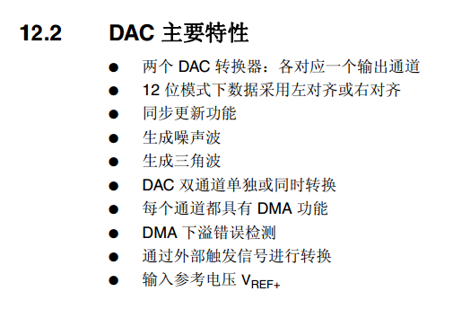

# **DAC-波形-声音的真相**
>**够用的硬件**
**能用的代码**
**实用的教程**
>屋脊雀工作室编撰 -20190101
愿景：做一套能用的开源嵌入式驱动（非LINUX）
官网：www.wujique.com
github: https://github.com/wujique/stm32f407
淘宝：https://shop316863092.taobao.com/?spm=2013.1.1000126.2.3a8f4e6eb3rBdf
技术支持邮箱：code@wujique.com、github@wujique.com
资料下载：https://pan.baidu.com/s/12o0Vh4Tv4z_O8qh49JwLjg
QQ群：767214262
---


人机交互的电子产品经常需要语音提示。如果没有语音外设，可以通过一个DAC输出波形，经简单放大后就能发出声音。
如果音源干净清晰，电路设计好，音质还是非常不错的。
台系（华邦等）的语音芯片通常就是DAC输出音乐。大家小时候用的音乐贺卡，就是用这些芯片制作的。
## DAC是什么？
DAC是数字模拟转换器（英语：Digital to analog converter，英文缩写：DAC），是一种将数字信号转换为模拟信号（以电流、电压或电荷的形式）的设备。
上面的定义比较抽象，在单片机来说，形象的说法是：
>给一个在DAC**位数**范围内的值，这个值就是数字量，DAC就根据**参考电压**，将其转换为电压值，在指定的管脚上输出一个**电压**，也即是**模拟量**。

1. **参考电压Vref**：DAC转换后输出的最高电压，DAC输出范围0~Vref。精度也是根据参考电压计算。
2. **DAC位数**：DAC的关键性能，位数即是DAC精度，也是DAC的输出步进。通常有8位、10位、12位等。例如12位，即是说可以将输出精确到：Vref/0xfff。一个12位的DAC在3.3V参考电压下，输出可以精确到0.805mv。将0X01送到DAC，管脚将输出0.805mv；将0x02送到DAC，管脚将输出1.61mv；将0xfff送到DAC，将输出Vref。

## STM32 DAC
查看《STM32F4xx中文参考手册.pdf》
STM32F4系列DAC功能特性如下：


功能框图如下，从图可以看出：
* DAC可以用软件触发、定时器触发、外部IO触发。
* DAC可以有DMA。
* 最下方的数模转换器，在控制逻辑控制之下，根据输入电压，在DAC_OUT上输出DAC电压。


硬件上使用PA5作为DAC输出测试。
在《STM32F407_数据手册.pdf》管脚描述表格中有说明PA5是DAC2的输出管脚。


## 声音
声音是一种波。在电子上，波，就是不同电压值在时间上的序列。
因此，在DAC管脚上，一直持续输出不同的电压值，即可形成一列波，这列波通过放大，通过喇叭转换，震动空气，就变成了声波。
通常的CD音乐采样频率时44.1K，属于高保真。但是实际上，只要8K的采样频率，声音还原质量就很好了。儿童玩具、声音贺卡的声音通常就是8K。
8K采样频率，每个样点间隔就是1s/8k=125us。
因此，**将一个8K采样的声音文件，每125us读取一个声音文件里面的样点，在dac上输出，就可以还原声音了**。

## 编码调试
调试分三步：
1. 先调试DAC输出正确电压。
2. 再调试播放一段内嵌在程序的声音。
3. 最后调试播放一个WAV声音文件（这一步暂时不做，等文件系统跟SD卡驱动做好后再调试，反正是纯软件调试，不影响验证硬件）。
### DAC调试
首先要让DAC能输出指定电压值。
添加mcu_dac.c和mcu_dac.h到工程。
* 初始化
```c {.line-numbers}
/**
 *@brief:      mcu_dac_open
 *@details:    打开DAC控制器
 *@param[in]   void  
 *@param[out]  无
 *@retval:     
 */
s32 mcu_dac_open(void)
{
	GPIO_InitTypeDef GPIO_InitStructure;
    DAC_InitTypeDef DAC_InitType;

    RCC_AHB1PeriphClockCmd(RCC_AHB1Periph_GPIOA, ENABLE);//----使能 PA 时钟
    RCC_APB1PeriphClockCmd(RCC_APB1Periph_DAC, ENABLE);//----使能 DAC 时钟

    GPIO_InitStructure.GPIO_Pin = GPIO_Pin_5;
    GPIO_InitStructure.GPIO_Mode = GPIO_Mode_AN;//---模拟模式
    GPIO_InitStructure.GPIO_PuPd = GPIO_PuPd_NOPULL;//---下拉
    GPIO_InitStructure.GPIO_Speed = GPIO_Speed_50MHz;
    GPIO_Init(GPIOA, &GPIO_InitStructure);//---初始化 GPIO

    DAC_InitType.DAC_Trigger=DAC_Trigger_None;  //---不使用触发功能 TEN1=0
    DAC_InitType.DAC_WaveGeneration=DAC_WaveGeneration_None;   //---不使用波形发生
    DAC_InitType.DAC_LFSRUnmask_TriangleAmplitude=DAC_LFSRUnmask_Bit0;
    DAC_InitType.DAC_OutputBuffer=DAC_OutputBuffer_Disable ;        //---输出缓存关闭
    //DAC_InitType.DAC_LFSRUnmask_TriangleAmplitude = DAC_TriangleAmplitude_4095; //噪声生成器
	DAC_Init(DAC_Channel_2,&DAC_InitType); //---初始化 DAC 通道 2    

	DAC_Cmd(DAC_Channel_2, ENABLE); //---使能 DAC 通道 2
    DAC_SetChannel2Data(DAC_Align_12b_R, 0); //---12 位右对齐数据格式   输出0

		return 0;
}
```
上面函数是打开DAC代码，其实也就是初始化配置DAC。
和前面的定时器输出和定时器输入一样，除了使用DAC外设，还需要用IO口。
>16~20行，将IO口PA5配置为模拟功能。
22行，配置DAC不使用触发。
23行，不使用波形发生器，DAC可以产生三角波等波形。
24行设置屏蔽/幅值选择，只有用波形发生器才有用。
25行禁止输出缓存。
27行执行配置。
* 输出电压
```c {.line-numbers}
/**
 *@brief:      mcu_dac_output
 *@details:    设置DAC输出值
 *@param[in]   u16 vol， 电压，单位MV，0-Vref  
 *@param[out]  无
 *@retval:     
 */
s32 mcu_dac_output_vol(u16 vol)
{

    u32 temp;

    temp = (0xfff*vol)/3300;

    MCU_DAC_DEBUG(LOG_DEBUG, "\r\n---test dac data:%d-----\r\n", temp);

    DAC_SetChannel2Data(DAC_Align_12b_R, temp);//12 位右对齐数据格式
		return 0;
}
```
13行是电压计算，原理是：
>配置值/电压 = 0XFFF/3.3V
配置值是我们要写到DAC的值，电压就是输入参数，单位是mv。
3300也就是3300mv；
0xFFF，因为我们的DAC是12位，也即是说，当我们设置DAC为0XFFF时，DAC输出3.3V。

17行调用函数将配置值写到DAC。

* 测试程序
```c
s32 mcu_dac_test(void)
{
    uart_printf("\r\n---test dac!-----\r\n");

    mcu_dac_open();
    mcu_dac_output_vol(1500);//1.5v
    while(1);
}
```
程序设计输出1.5V，测试输出管脚，电压为1.492V,基本准确，偏差0.01V，这个偏差有可能是基准电压，也就是我们的3.3V有偏差。
实测3.3V，只有3.28V，偏差0.02V。如果要求不是很严格的场合，基本算正常。
### 播放语音调试
在写语音播放代码之前要记住以下几点：
>1. 是app调用DAC声音驱动播放声音，还是DAC声音驱动去找语音数据。
>2. 根据1，请问是APP提供声音数据给DAC驱动还是DAC声音去找声音数据？
>3. 要播放一个保存在SD卡中的8K采样频率的WAV文件，请问：SD卡，8K采样，WAV，这三个参数跟DAC声音驱动是否有关？

对于这几点，个人看法如下：
>DAC声音驱动只实现将一定格式的声音数据转换为声音。
格式包含什么呢？采样频率，单声道还是多声道，多少位，这三个参数是DAC需要的。
文件格式是WAV还是PCM还是MP3，跟DAC声音驱动没关系，至于你是放在SD卡还是U盘，那更加没关系了。
这些事情，应该由**语音播放中间层**处理。

那么 DAC sound驱动要提供什么接口呢？
>init----初始化设备
open----打开设备，意味则要用这个设备
close----关闭设备
setting---设置，采样频率，声道，位宽（当然，对于DACsound来说只支持单声道，位宽也是固定的）
提供一个控制接口----控制启动播放，暂停，停止，查询状态
最后一个接口就是填充数据，如何填充？请思考。

 *以上的问题在本节暂时不处理，后面等我们做完WM8978的驱动，两个声音驱动一起分析，对于一个声音驱动应该做成什么样子，就更加清晰明了了。*
 **现在先使用最快的速度编写一套代码，让硬件发出声音，以便硬件改版，软件架构问题后续慢慢优化**。
* 语音播放流程

播放DAC语音，就是使用DAC和IO口还有定时器的配合。
1. 初始化DAC和IO。
2. 定时器设置为125us中断一次。
3. 在定时器中断中读取语音数据，并用DAC输出电压。
4. 重启定时器，循环3，直到语音播放结束。

* 声音数据准备

现在还没有调试WAV解码，也没有完成SD卡文件系统。只好将一段声音内嵌到代码内，这样也可以避免其他模块干扰，只验证DAC播放语音功能。

*如何将一段声音内嵌到代码？*

- 代码驱动说明

在board_dev文件夹创建dacsound驱动源码文件：dev_dacsound.c、dev_dacsound.h

在mcu_timer驱动中增加定时器3初始化和中断处理函数，定时125us。
*定时器前面已经学习，不再累赘*
在中断中调用dev_dacsound_timerinit函数输出DAC电压。

调用dev_dacsound_open初始化dacsound功能。
调用dev_dacsound_play开始播放，函数内开启了定时器。
然后进入主要处理函数dev_dacsound_timerinit，这个函数在定时中断中调用，125us执行一次。
```c {.line-numbers}
s32 dev_dacsound_timerinit(void)
{
    u8 data1 = 0, data2 = 0;
    s16 data = 0;
    u16 tmp;

	data1 = BeepData[soundindex++];
	data2 = BeepData[soundindex++];
	/*要注意，读到的数据是S16，正负值*/
	data = (s16)((data2 << 8) | data1);
	tmp = (data+0X7FFF)>>4;//12位DAC
	//uart_printf("%04x ", tmp);
	mcu_dac_output(tmp);

	if(soundindex >= BEEP_DATA_LEN)
	{
		uart_printf("dac sound play finish!");
		/*停止定时器*/
		mcu_tim3_stop();
	}
}
```
处理过程并不复杂，读取两个字节数据，组成一个16位数据，丢到DAC。
需要注意的是:
>1. **声音数据是s16，也就是最高位是正负标志。但是我们的DAC可不支持负数，因此需要将波形直流电平（波形水平中间线，类似X轴），由0V抬高，抬高多少呢？抬高到最高电压的一半，也就是0X7FFF，我们直接加上0X7FFF的偏移。**
>2. 我们的DAC是12位的，数据是16位的，数据右移4位匹配。
>3. **本算法有音频失真，请问原因是什么？最新处理方法请查看github上持续更新的代码。**

还要记得在stm32f4xx_it.c添加中断入口
```c
void TIM3_IRQHandler(void)
{
    mcu_tim3_IRQhandler();
}

```
- 测试
修改main.c，第3行打开dacsound，第12行，当按下按键时，播放语音。
```c {.line-numbers}
/* Infinite loop */
	mcu_uart_open(3);
	wjq_log(LOG_INFO, "hello word!\r\n");
	mcu_i2c_init();
	dev_key_init();
	//mcu_timer_init();
	dev_buzzer_init();
	dev_tea5767_init();
	dev_dacsound_init();

	dev_key_open();
	dev_dacsound_open();

	//dev_tea5767_open();
	//dev_tea5767_setfre(105700);

	while (1)
	{
		/*驱动轮询*/
		dev_key_scan();

		/*应用*/
		u8 key;
		s32 res;

		res = dev_key_read(&key, 1);
		if(res == 1)
		{
			if(key == DEV_KEY_PRESS)
			{
				//dev_buzzer_open();
				dev_dacsound_play();
				GPIO_ResetBits(GPIOG, GPIO_Pin_0
                                | GPIO_Pin_1 | GPIO_Pin_2| GPIO_Pin_3);
				//dev_tea5767_search(1);
			}
			else if(key == DEV_KEY_REL)
			{
				//dev_buzzer_close();
				GPIO_SetBits(GPIOG, GPIO_Pin_0
                                | GPIO_Pin_1 | GPIO_Pin_2| GPIO_Pin_3);
			}
		}

		Delay(1);

		/*测试触摸按键*/
		//dev_touchkey_task();
		//dev_touchkey_test();
	}
```
现在应该能听到声音了。
## 思考
现在我们仅仅是验证了DAC播放语音功能。
如何解码WAV？
dacsound提供什么接口？
使用什么机制播放？
这些问题我们等WM8978调试之后优化完成。

---
end
