# **SPI-SPI FLASH**
>**够用的硬件**
**能用的代码**
**实用的教程**
>屋脊雀工作室编撰 -20190101
愿景：做一套能用的开源嵌入式驱动（非LINUX）
官网：www.wujique.com
github: https://github.com/wujique/stm32f407
淘宝：https://shop316863092.taobao.com/?spm=2013.1.1000126.2.3a8f4e6eb3rBdf
技术支持邮箱：code@wujique.com、github@wujique.com
资料下载：https://pan.baidu.com/s/12o0Vh4Tv4z_O8qh49JwLjg
QQ群：767214262
---


前面我们调试了第一条总线——I2C总线，在嵌入式领域还有另外一条常用总线——SPI。
现在我们就来调试SPI 和 SPI FLASH 。
## SPI总线
SPI是串行外设接口（Serial Peripheral Interface）的缩写。
大概资料，百度百科
https://baike.baidu.com/item/SPI%E6%8E%A5%E5%8F%A3/2527392
1. SPI通常使用4根线连接。
（1）MOSI – 主器件数据输出，从器件数据输入（master out slave in）
（2）MISO – 主器件数据输入，从器件数据输出（master in slave out）
（3）SCLK –时钟信号，由主器件产生。
（4）NSS – 从器件使能信号，由主器件控制,通常叫CS、片选。
2. SPI根据时钟极性CPOL与时钟相位CPHA的不同，有4钟工作模式。
3. SPI使用多个片选管脚就可连接多个从设备。
## STM32 SPI控制器
*在《STM32F4xx中文参考手册.pdf》“27 串行外设接口 (SPI)”章节有详细说明*。
STM32的SPI控制器框图如下：
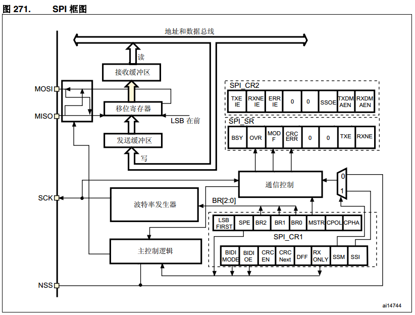
从中可以看出：
>1 移位寄存器只有一个，因为接受和发送是同时进行的。发送从右边出去，接收从左边进来。
>2 4根引脚，MOSI、MISO、SCK、NSS（CS）

SPI的大概工作过程就是：
1. 主设备将对应从设备CS拉低，使能从设备。
2. 主设备输出时钟信号，主设备移位寄存器的数据按BIT从MOSI上输出，从设备收到BIT后，保存到自己的移位寄存器，**同时**将自己移位寄存器中的数据从MISO上输出，主设备收到后保存在移位寄存器中。
如此循环，8个BIT传输结束，进行读写操作，然后进行下一个字节的传输。
3. 传输结束，将从设备片选拉高，结束。
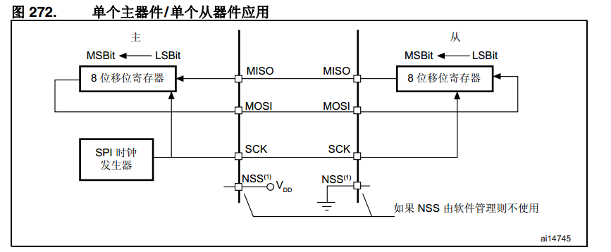
四种工作模式见参考手册图273。
4. SPI时钟在《STM32F407_数据手册.pdf》有描述，SPI3最高可以达到21Mbit/s。
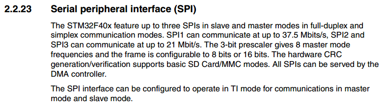
在表格11中可以看到APB1的时钟最快42M，SPI3就挂载APB1上，为了达到最快的21M，必须使用2分频。
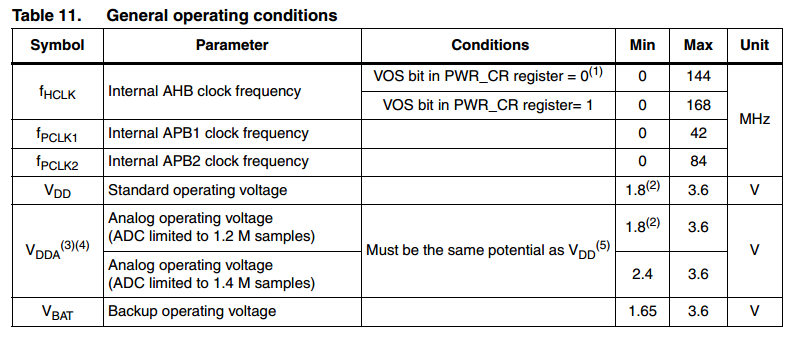

前面说到，SPI有4中工作模式，在STM32的参考手册也有说明。
1. CPOL是时钟极性，如果为1，则是先输出低再输出高。0则相反。
2. CPHA是时钟相位，如果为1，则是180度。0则是0度。
通俗的说，如果是1，就在时钟的第二个边沿采样。
如果是0，就在时钟的第一个边沿采样。

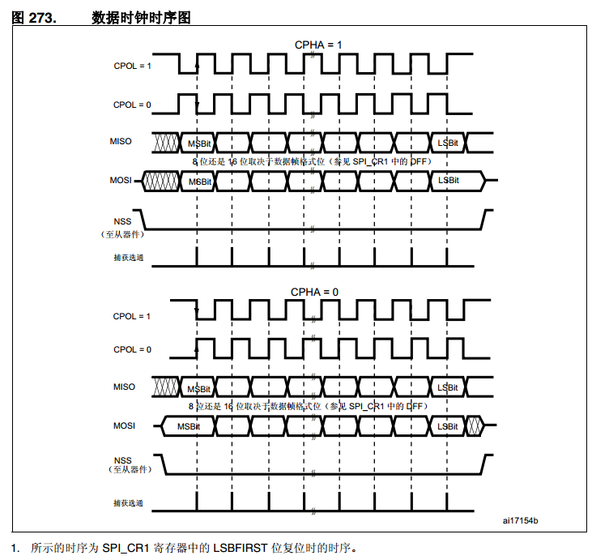

从上图也可以看到一个标准的SPI通信时序是怎么样的。
主设备输出时钟，并在MOSI上输出数据。
从设备在MISO上输出数据。
在通信期间，NSS(CS)保持低电平。

## SPI FLASH
底板使用的SPI FLASH是MX25L3206EZNI-12G 。
我们就通过这个芯片的规格书《MX25L3206E_DS_EN.pdf》学习SPI FLAHS。
1. 从名字通常能看出容量大小，32Mbit/8=4Mbyte，我们通常使用Byte，因此这个芯片只有4M，并不是32M，如果别人跟你说32M的FLASH，要搞清楚单位，很可能是32Mbit。
2. 文档开头会描述性能，软件需要关心的是：
（1）工作模式，本芯片支持Mode 0 和Mode3。
（2）1024个sector，每个sector有4K。每个sector都可以单独擦除。
（3）64个BLOCK，每个BLOCK 大小64K，也就是说，一个BLOCK有16个SECTOR。BOLOCK也可以整体擦除。
（4）可以page编程，一个page有256字节。
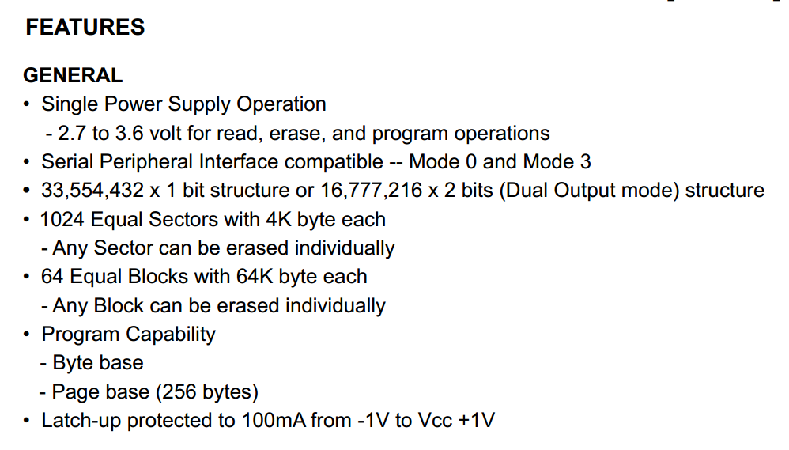
3. 之后是PERFORMANCE跟SOFTWARE FEATURES，主要是一些参数特性，例如擦除时间等。一般来说不用太关注。除非系统有要求。
比较影响性能的也就是擦除时间。有些厂家的会比较慢。其实相对CPU速度来说，擦除FLASH是一个很慢的过程。
部分FLASH会有额外性能，例如有**OTP区**，有**加密区**等等。
4. FLASH的组织需要关注一下，特别是在FLASH进行替代的时候，组织模式一定要一样。也就是说BLOCK、SECTOR、PAGE的分布要一致。有些芯片只有前面2个BLOCK可以页操作，后续的只能sector操作。
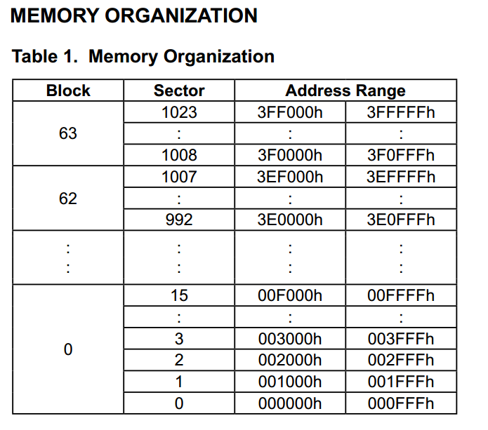
5. 之后需要认真关注的是命令。命令就是操作FLASH时主机发给FLASH的指令。如何使用后面会说明。

6. 时序分析
前面几个是SPI时序，一般不看，遇到问题挂示波器才会对比一下。
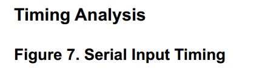
但是到后面就是命令流程了，也就是说明命令如何使用，FLASH如何操作，本处挑两个说说
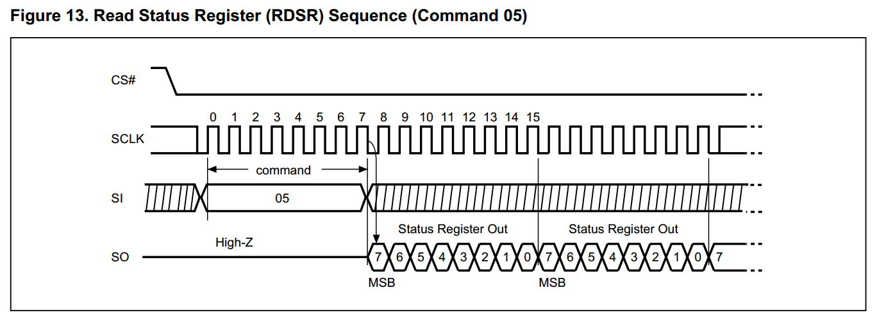
上图是读FLASH 的状态，操作过程就是：
>1. 主机拉低CS信号，使能FLASH。
>2. 主机将命令05发送给FLASH，这时候SO属于高阻状态，说明FLASH是不回数据的，主机也不需要FLASH回。主机会读到一个0XFF。
>3. 主机继续发送时钟，但是SI线上发送什么数据无所谓，通常我们发送0XFF。此时FLASH就会回数据给主机了。

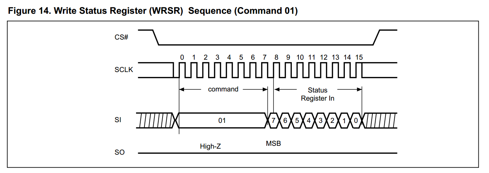
上图是写状态的，大家应该能看懂了，整个过程FLASH没有在SO线上返回数据。
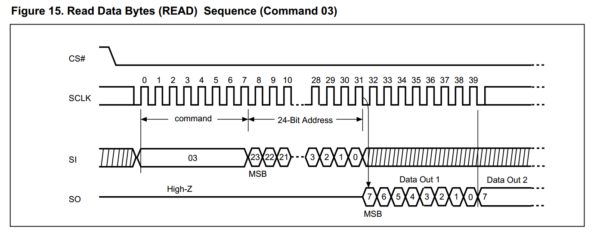
上图是读数据，与读状态不同的是，CPU要多发送24bit地址。
在FLASH的规格书中，图29说明了如何编程和擦除，其实也就是前面命令时序的组合。

7. 规格书最后就是一些性能参数，封装等信息了。基本与编程无关。
8. 除了以上特性之外，所有FLASH都共一个特性：
**FLASH上用于存储数据的每一个BIT，只能由1改写为0。**
例如原来FLASH上某个BYTE=0xff，可以将其改写为0x00-0xff的任何值。如果某个BYTE=0x0f，就只能修改为0x00-0x0f之间的值。
擦除可以将一个page、sector、block一次性全部改写为0XFF。
因此，通常在写之前都会进行读出flash、改写数据、擦除flash、写回flash，一共四步操作。完整的流程比较消耗时间。根据特性可以进行优化，例如，知道数据是0XFF，就可以直接改写。
9. 每次操作FLASH，都是先发一个命令，再进行数据通信。**在发命令前，要有一个CS的下降沿。**

## 原理图
屋脊雀F407硬件在底板和核心板上，各配置了一片SPI FLASH。
底板配置的是MX25L3206EM2I，底板的电路在SPI信号上进行了阻容滤波处理。

核心板配置的是W25Q64FVSI(或JVSI)，核心板FLASH离CPU较近，没有加阻容滤波处理，这样也能减少空间，毕竟核心板器件还是比较密集。

**这两个SPI FLASH都是接在SPI3控制器上，SPI3控制器还是外扩接口的SPI控制器，也即是说，一个SPI上可能接有3个设备或更多。**
为什么要配置两片SPI FALSH？当然不是堆硬件，是为了模拟一个情景：**多个SPI总线上挂载多个器件**，如果你写的SPI跟SPI FLASH驱动不能适应这样的场景，我觉得不是一个好程序。我们提供的源码，就是要处理这种情况。

## 驱动设计
需要设计两个驱动，一个是cpu上的SPI控制器的驱动；另外一个则是板上外设FLASH的驱动。
分别命名为mcu_spi和dev_flash。具体代码见例程。
在做驱动前我们要认识以下概念：
* **SPI 控制器**：STM32上的SPI3就是一个控制器。在程序中就是一些参数或者寄存器。
**SPI驱动**：为了用SPI3，我们会写一段代码，这段代码就是SPI驱动。
>spi驱动是为了配套SPI控制器，在STM32中有多个SPI控制器，SPI驱动有几套？

* **SPI FLASH设备**：设备就是实物，我们的硬件有两个SPI FLASH设备。
**SPI FLASH驱动**：我们写的代码，操作(读写)FLASH的代码，就是驱动。
> 我们有两个FLASH设备，写几个驱动？

### SPI驱动要怎么设计
1. SPI能干什么。

SPI属于全双工总线。
**发送时钟信号，在发送数据的同时会收到数据**。这个特性反映在SPI驱动上就是
>发送出去一个字节，就会收到一个字节。
接收一个字节，就需要发送一个字节。
**因此我们认为，SPI_WRITE或者SPI_READ这样单独读写的接口不符合SPI特性**

SPI可以运行在不同的频率和模式。
SPI的CS可以控制。

2. 用SPI的程序想要SPI干什么？

我们可能用SPI控制LCD，SPI FLASH，RF24L01等设备。
对于这些设备，有只写操作的，也有读写都要操作的。
对于CS管脚，在占用SPI控制器时，有可能要变化电平，例如SPI FALSH，在发送命令时就需要一个CS下降沿。

3. SPI驱动和SPI设备的关系

在我们的硬件上，只用一个SPI控制器SPI3，配合3根CS线。一套SPI驱动如何控制三个设备呢？
**千万不要将CS的控制放到SPI FALSH驱动中。CS属于SPI控制器的一部分。**
>*如果不将CS控制和SPI控制器绑定，配合多个CS时，编写代码很容易造成SPI控制器冲突*。

要控制多个SPI设备，在接口传入一个参数表明操作哪个接口即可。

因此接口我们设置如下：
>s32 mcu_spi_init(void);
s32 mcu_spi_open(SPI_DEV dev, SPI_MODE mode, u16 pre);
s32 mcu_spi_close(SPI_DEV dev);
s32 mcu_spi_transfer(SPI_DEV dev, u8 *snd, u8 *rsv, s32 len);
s32 mcu_spi_cs(SPI_DEV dev, u8 sta);
从上到下分别是：初始化，打开（占用），关闭（释放），传输，CS控制。

我们看看初始化代码
```c {.line-numbers}
s32 mcu_spi_init(void)
{
    GPIO_InitTypeDef GPIO_InitStructure;
    SPI_InitTypeDef SPI_InitStruct;

    //初始化片选，系统暂时设定为3个SPI，全部使用SPI3
    //DEV_SPI_3_1, 核心板上的SPI FLASH
	RCC_AHB1PeriphClockCmd(RCC_AHB1Periph_GPIOB, ENABLE);
    GPIO_InitStructure.GPIO_Pin = GPIO_Pin_14;
    GPIO_InitStructure.GPIO_Mode = GPIO_Mode_OUT;
    GPIO_InitStructure.GPIO_OType = GPIO_OType_PP;
    GPIO_InitStructure.GPIO_Speed = GPIO_Speed_50MHz;
    GPIO_InitStructure.GPIO_PuPd = GPIO_PuPd_UP;
    GPIO_Init(GPIOB, &GPIO_InitStructure);
	GPIO_SetBits(GPIOB,GPIO_Pin_14);

    //DEV_SPI_3_2, 底板的SPI FLASH
    RCC_AHB1PeriphClockCmd(RCC_AHB1Periph_GPIOG, ENABLE);
    GPIO_InitStructure.GPIO_Pin = GPIO_Pin_15;
    GPIO_InitStructure.GPIO_Mode = GPIO_Mode_OUT;
    GPIO_InitStructure.GPIO_OType = GPIO_OType_PP;
    GPIO_InitStructure.GPIO_Speed = GPIO_Speed_50MHz;
    GPIO_InitStructure.GPIO_PuPd = GPIO_PuPd_UP;
    GPIO_Init(GPIOG, &GPIO_InitStructure);
	GPIO_SetBits(GPIOG,GPIO_Pin_15);

	//DEV_SPI_3_3, 核心板外扩SPI
	GPIO_InitStructure.GPIO_Pin = GPIO_Pin_6;
    GPIO_Init(GPIOG, &GPIO_InitStructure);
	GPIO_SetBits(GPIOG,GPIO_Pin_6);

    RCC_AHB1PeriphClockCmd(RCC_AHB1Periph_GPIOB, ENABLE);

    GPIO_InitStructure.GPIO_Pin = GPIO_Pin_3|GPIO_Pin_4|GPIO_Pin_5;//---PB3~5
    GPIO_InitStructure.GPIO_Mode = GPIO_Mode_AF;//---复用功能
    GPIO_InitStructure.GPIO_OType = GPIO_OType_PP;//---推挽输出
    GPIO_InitStructure.GPIO_Speed = GPIO_Speed_100MHz;//---100MHz
    GPIO_InitStructure.GPIO_PuPd = GPIO_PuPd_UP;//---上拉
    GPIO_Init(GPIOB, &GPIO_InitStructure);//---初始化

    //配置引脚复用映射
    GPIO_PinAFConfig(GPIOB, GPIO_PinSource3, GPIO_AF_SPI3); //PB3 复用为 SPI3
    GPIO_PinAFConfig(GPIOB, GPIO_PinSource4, GPIO_AF_SPI3); //PB4 复用为 SPI3
    GPIO_PinAFConfig(GPIOB, GPIO_PinSource5, GPIO_AF_SPI3); //PB5 复用为 SPI3

    RCC_APB1PeriphClockCmd(RCC_APB1Periph_SPI3, ENABLE);// ---使能 SPI3 时钟
    // 复位SPI模块
    SPI_I2S_DeInit(SPI_DEVICE);

    SPI_InitStruct.SPI_Direction = SPI_Direction_2Lines_FullDuplex;//---双线双向全双工
    SPI_InitStruct.SPI_Mode = SPI_Mode_Master;//---主模式
    SPI_InitStruct.SPI_DataSize = SPI_DataSize_8b;//---8bit帧结构
    SPI_InitStruct.SPI_CPOL = SPI_CPOL_High;//----串行同步时钟的空闲状态为低电平
    SPI_InitStruct.SPI_CPHA = SPI_CPHA_2Edge;//---数据捕获于第1个时钟沿
    SPI_InitStruct.SPI_NSS = SPI_NSS_Soft; //---SPI_NSS_Hard; 片选由硬件管理，SPI控制器不管理
    SPI_InitStruct.SPI_BaudRatePrescaler = SPI_BaudRatePrescaler_4;  //---预分频
    SPI_InitStruct.SPI_FirstBit = SPI_FirstBit_MSB;//---数据传输从 MSB 位开始
    SPI_InitStruct.SPI_CRCPolynomial = 7;//---CRC 值计算的多项式

    SPI_Init(SPI_DEVICE, &SPI_InitStruct);

    //SPI_SSOutputCmd(SPI_DEVICE, DISABLE);
    DevSpi3Gd = -1;
    return 0;
}
```
>6~30行，初始化使用SPI3控制器的3个SPI接口的CS脚，初始化为输出，并且输出高电平。
34~44，初始化SPI控制器3个引脚，也就是把IO配置为AF功能，并且配置为SPI3的AF功能。
46，打开SPI时钟。
48，复位SPI3控制器。
50~60，配置SPI3控制器，每个配置什么意思在代码注释都说明了。

根据硬件定义3个SPI设备号，3个SPI都使用SPI3控制器
```c
typedef enum{
	DEV_SPI_NULL = 0,

	DEV_SPI_3_1 = 0X31,//核心板上的SPI使用SPI3，定义为SPI_3_1
	DEV_SPI_3_2,	//底板板上的SPI使用SPI3，定义为SPI_3_2
	DEV_SPI_3_3,		//外扩的SPI定义为SPI_3_3
}SPI_DEV;
```

传输是最关键函数
看代码，入口参数3个：
>snd和rsv是指针，发送数据从snd取，接收到的数据保存到rsv；
len是数据长度。
snd或者rsv其中一个可以为NULL，但是不能全部为0，
如果rsv为NULL，则意味着只是想发送数据，接收到的数据丢弃；
如果snd为空，则意味着只想接收数据，**函数会默认发送0XFF**：
>实际应用中，有外设是不允许默认发送0XFF的，例如触摸控制芯片XPT2046，
如果在读数据时发送0XFF，会立刻启动XTP2046AD转换，造成读到的触摸参数错乱。
最新的SPI通信代码请从GIT上提取（上面的代码会持续更新）

```c {.line-numbers}
s32 mcu_spi_transfer(u8 *snd, u8 *rsv, s32 len)
{
    s32 i = 0;
    s32 pos = 0;
    u32 time_out = 0;
    u16 ch;

    if( ((snd == NULL) && (rsv == NULL)) || (len < 0) )
    {
        return -1;
    }

    /* 忙等待 */
    time_out = 0;
    while(SPI_I2S_GetFlagStatus(SPI_DEVICE, SPI_I2S_FLAG_BSY) == SET)
    {
        if(time_out++ > MCU_SPI_WAIT_TIMEOUT)
        {
            return(-1);
        }
    }

    /* 清空SPI缓冲数据，防止读到上次传输遗留的数据 */
    time_out = 0;
    while(SPI_I2S_GetFlagStatus(SPI_DEVICE, SPI_I2S_FLAG_RXNE) == SET)
    {
        SPI_I2S_ReceiveData(SPI_DEVICE);
        if(time_out++ > 2)
        {
            return(-1);
        }
    }

    /* 开始传输 */
    for(i=0; i < len; )
    {
        // 写数据
        if(snd == NULL)/*发送指针为NULL，说明仅仅是读数据 */
        {
            //uart_printf("--1--");
            SPI_I2S_SendData(SPI_DEVICE, 0xff);
        }
        else
        {
            ch = (u16)snd[i];
            SPI_I2S_SendData(SPI_DEVICE, ch);
            //uart_printf("s%02x ", ch);
        }
        i++;

        // 等待接收结束
        time_out = 0;
        while(SPI_I2S_GetFlagStatus(SPI_DEVICE, SPI_I2S_FLAG_RXNE) == RESET)
        {
            time_out++;
            if(time_out > MCU_SPI_WAIT_TIMEOUT)
            {
                return -1;
            }    
        }
        // 读数据
        if(rsv == NULL)/* 接收指针为空，读数据后丢弃 */
        {
            //uart_printf("--2--");
            SPI_I2S_ReceiveData(SPI_DEVICE);
        }
        else
        {
            ch = SPI_I2S_ReceiveData(SPI_DEVICE);
            rsv[pos] = (u8)ch;
            //uart_printf("r%02x ", ch);
        }
        pos++;

    }

    return i;
}
```
>1. 13到21，等待SPI控制器不忙。
>2. 23-32，读走SPI控制器里面的缓存数据。
>3. 进入FOR循环开始传输。
>4. 判断输入参数snd，如果为空（0），就说明只是想读数据，没数据发送。那么我们就自作主张，发送一个0XFF过去。
>5. 发送的同时，控制器就在接收数据了，53到60行等待接收完毕。
>6. 62行开始是接收数据，如果接收缓冲为空(0)，我们就仅仅将数据读出来丢弃掉。

### SPI FALSH驱动

SPI 驱动编写要考虑两方面：
>SPI FLASH的功能实现。
>SPI FALSH驱动架构。

#### 1. 功能
FLASH功能包括，擦除，读，写，芯片ID等。
其中各操作还分page，sector，BLOCK,chip；
例如擦，可以擦1个sector，也可以擦1个BLOCK，或者是整片擦除。
读就没有要求，可以从任何地址读。
写也没有要求，可以从任何地址写。
但是为了方便APP使用，特别是文件系统，我们会封装sector擦、读、写函数。
#### 2. 架构
设计SPI FLASH架构前要考虑的问题是：
1. 多个FLASH挂在多个SPI上。我们的硬件就是两片FLASH挂在两个SPI接口上（同一个硬件SPI控制器）。
2. FALSH型号自动识别，就算硬件更换了Flash，驱动也不需要修改。

最终的SPI FLASH驱动可以做到，**一套SPI FLASH驱动，可以处理多个挂在不同SPI上的不同flash芯片。**
要实现这个目标，主要要实现下面3个小目标：
1. 驱动就是一个软件模块。
2. 对上提供操作接口。
3. 对下要求提供挂参数：哪个SPI？什么芯片？

因此我们设计驱动如下：
* 接口
```c
extern s32 dev_spiflash_readmorebyte(DevSpiFlash *dev, u32 addr, u8 *dst, u32 len);
extern s32 dev_spiflash_write(DevSpiFlash *dev, u8* pbuffer, u32 addr, u16 wlen);
extern s32 dev_spiflash_sector_erase(DevSpiFlash *dev, u32 sector_addr);
extern s32 dev_spiflash_sector_read(DevSpiFlash *dev, u32 sector, u8 *dst);
extern s32 dev_spiflash_sector_write(DevSpiFlash *dev, u32 sector, u8 *src);
extern s32 dev_spiflash_init(void);
extern s32 dev_spiflash_open(DevSpiFlash *dev, char* name);
extern s32 dev_spiflash_test(void);
```
各接口功能，看名称就知道啥意思了。
* 芯片参数定义
```c
/*SPI FLASH 信息*/
typedef struct
{
	char *name;
	u32 JID;
	u32 MID;
	/*容量，块数，块大小等信息*/
	u32 sectornum;//总块数
	u32 sector;//块大小
	u32 structure;//总容量

}_strSpiFlash;

/*
	常用的SPI FLASH 参数信息
*/
_strSpiFlash SpiFlashPraList[]=
{
	{"MX25L3206E", 0XC22016, 0XC215, 1024, 4096, 4194304},
	{"W25Q64JVSI", 0Xef4017, 0Xef16, 2048, 4096, 8388608}
};
```
对于各种芯片，抽象定义一个结构体，结构体成员包含了芯片信息。
然后定义一个列表数组，表明当前支持的芯片型号。当前我们只做了两个型号。
大家可以自己丰富这个表格。
* 设备树定义
```c
/*SPI FLASH设备定义*/
typedef struct
{
	char *name;//设备名称
	SPI_DEV spi;//挂载在哪条SPI总线
	_strSpiFlash *pra;//设备信息
}DevSpiFlash;

/*
	设备树定义
*/
#define DEV_SPI_FLASH_C 2//总共有两片SPI FLASH

DevSpiFlash DevSpiFlashList[DEV_SPI_FLASH_C]=
{
	/*有一个叫做board_spiflash的SPI FLASH挂在DEV_SPI_3_2上，型号未知*/
	{"board_spiflash", DEV_SPI_3_2, NULL},
	/*有一个叫做board_spiflash的SPI FLASH挂在DEV_SPI_3_1上，型号未知*/
	{"core_spiflash",  DEV_SPI_3_1, NULL},
};

```
设备树的意义就是**告诉驱动，什么东西挂在什么地方**。这样驱动就可以跟硬件剥离，也就能兼容更多硬件。
**具体驱动设计请看源码，后续会对文档进行更详细更新**
我们抽一个SPI FLASH驱动函数分析。
```c {.line-numbers}
/**
 *@brief:      dev_spiflash_readJTD
 *@details:    读FLASH JTD号
 *@param[in]   void  
 *@param[out]  无
 *@retval:     
 */
static u32 dev_spiflash_readJTD(DevSpiFlash *dev)
{
    u32 JID;
    s32 len = 1;
    u8 command = SPIFLASH_RDJID;
    u8 data[3];

	mcu_spi_cs(dev->spi, 0);
    len = 1;
    mcu_spi_transfer(dev->spi, &command, NULL, len);
    len = 3;
    mcu_spi_transfer(dev->spi, NULL, data, len);
	mcu_spi_cs(dev->spi, 1);

    JID = data[0];
    JID = (JID<<8) + data[1];
    JID = (JID<<8) + data[2];

    return JID;
}
```
以上是读FLASH JTD函数
>15行，拉低CS脚，使能对应的SPI FLASH设备。
17行，写数据，第3个参数为空，我们只是写命令，1个字节数据而已。
19行，读数据，读3个字节，第二个参数为空，函数将默认发送0XFF。
20行，拉高CS脚。

我们看看FLASH规格书中读JTD的时序图，大家对比代码好好体会体会。
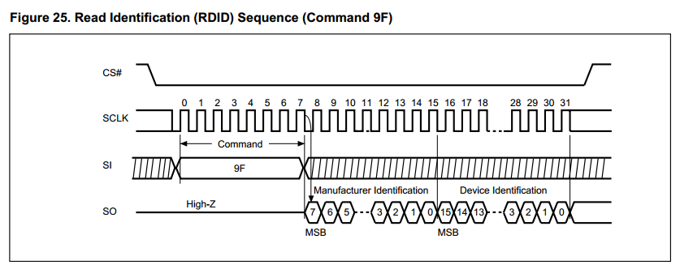

* 驱动和设备分离的好处
这样的驱动架构有什么好处呢？
请看测试程序，测试程序传入一个名称，就可以操作对应FLASH了。不用关心FLASH是什么型号，挂在什么地方。更加不会去操作CS管脚。
```c
void dev_spiflash_test_fun(char *name)
{
    u32 addr;
    u16 tmp;
    u8 i = 1;
    u8 rbuf[4096];
    u8 wbuf[4096];
    u8 err_flag = 0;

	DevSpiFlash dev;

	s32 res;

    wjq_log(LOG_FUN, ">:-------dev_spiflash_test-------\r\n");
    res = dev_spiflash_open(&dev, name);
	wjq_log(LOG_FUN, ">:-------%s-------\r\n", dev.name);
	if(res == -1)
	{
		wjq_log(LOG_FUN, "open spi flash ERR\r\n");
		while(1);
	}
    i = 0;
    for(tmp = 0; tmp < 4096; tmp++)
    {
        wbuf[tmp] = i;
        i++;
    }
    //sector 1 进行擦除，然后写，校验。
    wjq_log(LOG_FUN, ">:-------test sector erase-------\r\n", addr);

    addr = 0;
    dev_spiflash_sector_erase(&dev, addr);
    wjq_log(LOG_FUN, "erase...");

    dev_spiflash_sector_read(&dev, addr, rbuf);;//读一页回来
    wjq_log(LOG_FUN, "read...");

    for(tmp = 0; tmp < dev.pra->sector; tmp++)
    {
        if(rbuf[tmp] != 0xff)//擦除后全部都是0xff
        {
            wjq_log(LOG_FUN, "%x=%02X ", tmp, rbuf[tmp]);//擦除后不等于0XFF,坏块    
            err_flag = 1;
        }
    }

    dev_spiflash_sector_write(&dev, addr, wbuf);
    wjq_log(LOG_FUN, "write...");

    dev_spiflash_sector_read(&dev, addr, rbuf);
    wjq_log(LOG_FUN, "read...");

    wjq_log(LOG_FUN, "\r\n>:test wr..\r\n");

    for(tmp = 0; tmp < dev.pra->sector; tmp++)
    {
        if(rbuf[tmp] != wbuf[tmp])
        {
            wjq_log(LOG_FUN, "%x ", tmp);//读出来的跟写进去的不相等
            err_flag = 1;
        }
    }

    if(err_flag == 1)
        wjq_log(LOG_FUN, "bad sector\r\n");
    else
        wjq_log(LOG_FUN, "OK sector\r\n");

	dev_spiflash_close(&dev);
}
```

#### 测试
在main中初始化，按下按键则进行测试。
```c
/* Infinite loop */
	mcu_uart_open(3);
	wjq_log(LOG_INFO, "hello word!\r\n");
	mcu_i2c_init();
	mcu_spi_init();
	dev_key_init();
	//mcu_timer_init();
	dev_buzzer_init();
	dev_tea5767_init();
	dev_dacsound_init();
	dev_spiflash_init();


	dev_key_open();
	//dev_dacsound_open();
	//dev_tea5767_open();
	//dev_tea5767_setfre(105700);

	while (1)
	{
		/*驱动轮询*/
		dev_key_scan();

		/*应用*/
		u8 key;
		s32 res;

		res = dev_key_read(&key, 1);
		if(res == 1)
		{
			if(key == DEV_KEY_PRESS)
			{
				//dev_buzzer_open();
				//dev_dacsound_play();
				dev_spiflash_test();
				GPIO_ResetBits(GPIOG, GPIO_Pin_0
                                  | GPIO_Pin_1 | GPIO_Pin_2| GPIO_Pin_3);
				//dev_tea5767_search(1);
			}
			else if(key == DEV_KEY_REL)
			{
				//dev_buzzer_close();
				GPIO_SetBits(GPIOG, GPIO_Pin_0
                                  | GPIO_Pin_1 | GPIO_Pin_2| GPIO_Pin_3);
			}
		}

		Delay(1);

		/*测试触摸按键*/
		//dev_touchkey_task();
		//dev_touchkey_test();
	}
```

## 调试
* 1

 代码写好后，调用FLASH测试程序就死机。第一行调试信息都没有输出。**一进函数就死，基本上都是堆栈溢出问题，俗称栈爆了**。
 一般都是局部变量申请太大，造成堆栈溢出，或者是进函数前堆栈已经临界，函数没申请多少局部变量也会造成溢出。
测试函数申请了8K局部变量造成死机，根本原因是我们没有根据工程实际情况初始化堆栈。
```c
void dev_spiflash_test(void)
{
    u32 addr;
    u16 tmp;
    u8 i = 1;
    u8 rbuf[4096];
    u8 wbuf[4096];
    u8 err_flag = 0;
```

堆栈在启动代码startup_stm32f40_41xxx.s的开头配置，默认仅仅配置了0X400字节栈。堆的默认配置也不大，都需要根据工程实际情况修改。
```c
; Amount of memory (in bytes) allocated for Stack
; Tailor this value to your application needs
; <h> Stack Configuration
;   <o> Stack Size (in Bytes) <0x0-0xFFFFFFFF:8>
; </h>

Stack_Size      EQU     0x00000400

                AREA    STACK, NOINIT, READWRITE, ALIGN=3
Stack_Mem       SPACE   Stack_Size
__initial_sp


; <h> Heap Configuration
;   <o>  Heap Size (in Bytes) <0x0-0xFFFFFFFF:8>
; </h>

Heap_Size       EQU     0x00000200

                AREA    HEAP, NOINIT, READWRITE, ALIGN=3
__heap_base
Heap_Mem        SPACE   Heap_Size
__heap_limit
```
此处我们暂时将栈放大到16K，以便测试程序运行。
修改后测试程序正常运行。
***类似的死机问题还有一个，而且经常会出现，那么就是一退出函数就死机。这样的问题通常都是因为在函数内操作内存越界，例如野指针啊，或者是写数组超出数组范围***。
* 2

 **调试一个新IC外设，一般先调通能读芯片ID**。
读ID失败，检查程序是否有笔误，如有，修正。
检查后，还是不行，怀疑硬件问题。
将SPI通信的4条PIN全部改为IO，全部输出高电平，用万用表检测。
然后全部输出低电平，用万用表检测。
同时检测FLASH其他管脚，发现WP电平不对。
检查原理图，发现原理图上WP脚连接有误，应该连接到VCC，但是原理图原来增加了1个下拉电阻用于调试，在焊接时不应该直接焊上，样板错误焊上了。
去掉电阻再量电压，1.7V，半高电平，估计芯片有问题了。
换另外一块样板，上电后测试，电平正常。
* 3

恢复调试过程对驱动跟测试程序的修改，上电，正常读出FLASH ID。
* 4

对sector 1进行擦，写，读操作，测试FLASH。测试结果:
>hello word!
board_spiflash jid:0xc22016
board_spiflash mid:0xc215
core_spiflash jid:0xef4017
core_spiflash mid:0xef16
>:-------dev_spiflash_test-------
spi flash type:MX25L3206E
>:-------board_spiflash-------
>:-------test sector erase-------
erase...read...write...read...
>:test wr..
OK sector
>:-------dev_spiflash_test-------
spi flash type:W25Q64JVSI
>:-------core_spiflash-------
>:-------test sector erase-------
erase...read...write...read...
>:test wr..
OK sector

### 时序确认
经测试，SPI最快设置为SPI_BaudRatePrescaler_4，也就是PCLK（84M）/4=21M，SPI3理论最快速度。也可以正常通信。
使用DSLOGIC逻辑分析仪抓到的波形
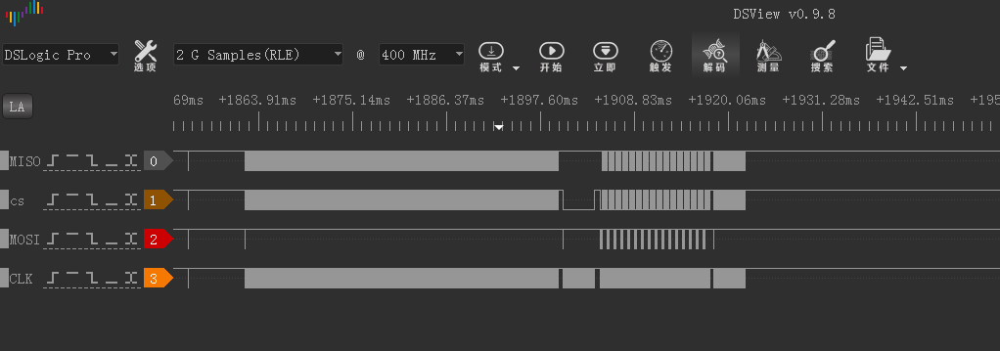
放大后可以看到时钟频率时21.05M，但是同时也发现一个问题，在两个字节之间的间隔，很大，浪费通信时间，程序需要优化。
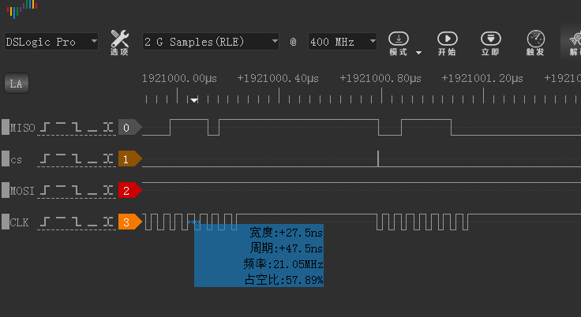
当然，系统目前还没有跑其他设备，例如I2S，USB，网口等，等全部跑起来，可能就因为干扰，SPI只能降速了。

## 思考
到此我们实现了一个基本算有点**软件架构**的SPI FLASH驱动。也为后面其他驱动编写做了一定铺垫。大家可以了解一些**LINUX设备驱动的软件架构思想**。宋宝华的书《**LINUX设备驱动开发详解 基于最新的LINUX4.0内核**》第12章。
对于SPI驱动，还要进一步改善。例如：后面我们会加上用IO口模拟SPI功能，模拟SPI跟硬件SPI如何统一接口？一个SPI LCD，既可以接到外扩的SPI3上，也可以接到模拟SPI上。LCD驱动要如何编写，才能灵活用于两种SPI？

**这些，我们都会实现。**
~~
**这些，我们都已经实现。**
**本例程附带的代码，只是为了教程服务，虽然能用，但是架构不是最好的**
**如果要用于实际项目，请从GITHUB上下载最新代码，最新代码有很好的代码架构设计**

---
end
---
