# **SDIO-TF CARD**
>**够用的硬件**
>
>**能用的代码**
>
>**实用的教程**
>
>屋脊雀工作室编撰 -20190101
>
>愿景：做一套能用的开源嵌入式驱动（非LINUX）
>
>官网：www.wujique.com
>
>github: https://github.com/wujique/stm32f407
>
>淘宝：https://shop316863092.taobao.com/?spm=2013.1.1000126.2.3a8f4e6eb3rBdf
>
>技术支持邮箱：code@wujique.com、github@wujique.com
>
>资料下载：https://pan.baidu.com/s/12o0Vh4Tv4z_O8qh49JwLjg
>
>QQ群：767214262
---


- **本SDIO例程，测试过程中会将SD卡的数据直接删除，相当于将SD卡格式化，请使用一张没有数据的SD卡进行测试。
数据丢失后果自负。**

SD卡是我们日常使用的电子设备，例如用在相机、个人数据存储。部分手机也会使用TF卡作扩展存储使用。
>SD存储卡是一种基于半导体快闪记忆器的新一代记忆设备，由于它体积小、数据传输速度快、可热插拔等优良的特性，被广泛地于便携式装置上使用，例如数码相机、个人数码助理（外语缩写PDA）和多媒体播放器等。

SD卡标准使用SDIO接口通信，也支持SPI接口。在日常使用情景，例如相机、读卡器等，都是使用SDIO通信，SDIO使用4个数据线，速度比SPI要快。
SD卡使用SDIO口通信过程遵循SD卡规范，这个规范不简单，涉及到较多的命令交互和状态转换。通常芯片厂家都会提供相关例程，用户不需要重新开发SDIO通信程序。本例程通过移植ST官方的例程实现与SD卡通信。
>关于SD卡协议细节，请自行学习研究。

## SDIO接口
SDIO：安全数字输入输出接口。
STM32F407，原生支持。
关于SDIO接口，在《STM32F4xx中文参考手册.pdf》文档有说明。
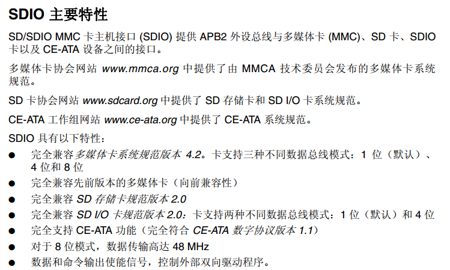

下图是SDIO框图，
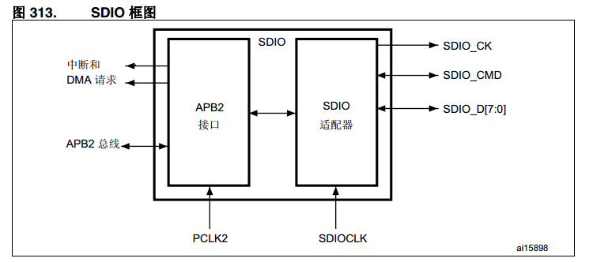

这是一个总框图，主要说明外部连接。
对于SDIO适配器，并没有详细说明。我猜测原因是，其实SDIO是一个比较复杂的设备，类似USB。
通常这种复杂外设，我们都不会自己开发驱动，都是用官方提供的例程。

1. 总线的通信基于命令和数据传输。其实这是大部分外设的相同之处。
2. SDIO接口总共有6根线（4位位宽）,其中命令只通过CMD线传输。因此在**调试的时候如果命令正常，读写数据不正常，说明仅仅是数据线问题**。

*SDID接口除了用于控制SD卡等卡之外，也可以控制SDIO接口的其他模块，例如SDIO接口的WIFI模块*

## SDIO接口存储卡
常见的卡有下面两种
SD 卡，俗称大卡。

>SD卡是由松下电器、东芝和SanDisk联合推出，1999年8月发布。

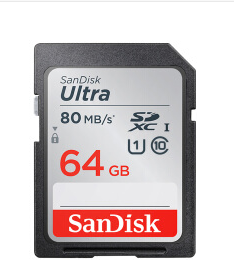
TF卡，俗称小卡，2004年标准协会更名为micro SD卡。
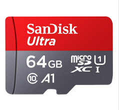

其实在SD卡之前，最先出现的是MMC卡。
下图这种就是MMC卡，只有SD卡一半大小，通常我们都用一个卡尾拼成SD卡用。
>MMC(Multi-Media Card，多媒体卡)由西门子公司Siemens和SanDisk于1997年推出。

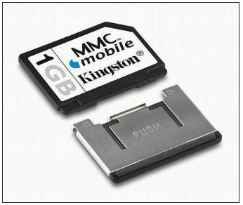

这些卡的协议基本都是兼容的。具体可以看我们资料包中提供的文档。
大部分文档是sandisk和SD卡协会编写的。
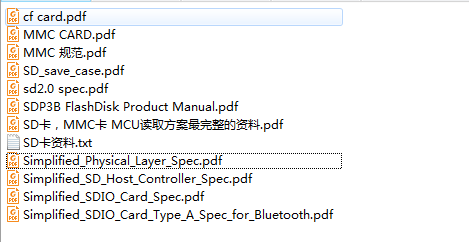
话说这些资料全英文，一时半会儿看不懂。

## 原理图
屋脊雀4074开发板选用TF卡座，减少体积，这也是当前电子产品的趋势。
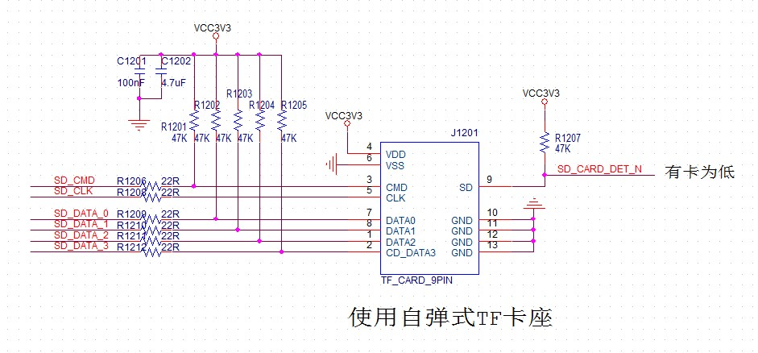

>SDIO接口使用6根管脚。
CLK是通信时钟
CMD是命令串行通信线。
DATA数据线有四根。
右边的SD_CARD_DET_N是卡插入检测
SDIO接口，CLK不需要上拉电阻，其他5根IO需要加上拉电阻。

## 驱动设计
前面说到，SDIO是一个复杂的协议，SD卡、TF卡是一个较复杂设备。要完全弄清楚，非常不容易，更加不要说自己写一套了。
通常，这种复杂的协议，我们不自己开发，都是芯片厂提供驱动代码。

前面几个章节的调试，我们直接参考标准库接口，再根据参考手册，就可以进行编码了。
但是类似USB，SD卡，网络等较复杂的设备，通常做法是从官方提供的库入手。
特别是USB通信，个人基本不可能写一套库出来，也没这个必要。
## 移植调试
在移植之前，先对官方例程进行分析学习。
#### 例程分析
在标准库下面有SD卡例程，路径如下
>STM32F4xx_DSP_StdPeriph_Lib_V1.8.0\Project\STM32F4xx_StdPeriph_Examples\SDIO\SDIO_uSDCard

在目录下有一个readme.txt文件。**看东西，先从readme入手**。
从readme中可以看出，STM32F407芯片的SDIO的驱动在
STM32F4xx_DSP_StdPeriph_Lib_V1.8.0\Utilities\STM32_EVAL\STM3240_41_G_EVAL目录下，
名字叫stm324xg_eval_sdio_sd.c和stm324xg_eval.c。
其中stm324xg_eval.c仅仅提供了较底层的初始化。
看来主要代码都在stm324xg_eval_sdio_sd.c里面。
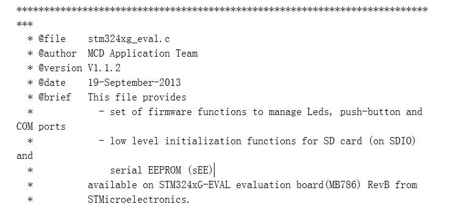
例程还包括以下文件
>路径：STM32F4xx_DSP_StdPeriph_Lib_V1.8.0\Project\STM32F4xx_StdPeriph_Examples\SDIO\SDIO_uSDCard

  - SDIO/SDIO_uSDCard/system_stm32f4xx.c   STM32F4xx system clock configuration file
  - SDIO/SDIO_uSDCard/stm32f4xx_conf.h     Library Configuration file
  - SDIO/SDIO_uSDCard/stm32f4xx_it.c       Interrupt handlers
  - SDIO/SDIO_uSDCard/stm32f4xx_it.h       Interrupt handlers header file
  - SDIO/SDIO_uSDCard/main.c               Main program
  - SDIO/SDIO_uSDCard/main.h               Main program header file

下一步，我们就浏览这六个文件，熟悉其中的流程与调用关系。
使用SI创建一个SDIO_EVAL工程，将以上提到的文件添加到工程，用SI分析程序相当方便。
***为了防止无意中修改库文件，我们把文件拷贝一份***。

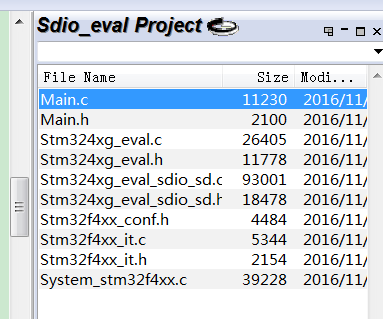
从MAIN函数入手，程序首先对SD进行初始化。然后进行块测试，分别进行擦块，单块测试，多块测试。
```c

  /*------------------------------ SD Init ----------------- */
  if((Status = SD_Init()) != SD_OK)
  {
    STM_EVAL_LEDOn(LED4);
  }

  while((Status == SD_OK) && (uwSDCardOperation != SD_OPERATION_END)
        && (SD_Detect()== SD_PRESENT))
  {
    switch(uwSDCardOperation)
    {
      /*-------------------------- SD Erase Test --------- */
      case (SD_OPERATION_ERASE):
      {
        SD_EraseTest();
        uwSDCardOperation = SD_OPERATION_BLOCK;
        break;
      }
      /*------------------- SD Single Block Test --------- */
      case (SD_OPERATION_BLOCK):
      {
        SD_SingleBlockTest();
        uwSDCardOperation = SD_OPERATION_MULTI_BLOCK;
        break;
      }       
      /*------------------- SD Multi Blocks Test --------- */
      case (SD_OPERATION_MULTI_BLOCK):
      {
        SD_MultiBlockTest();
        uwSDCardOperation = SD_OPERATION_END;
        break;
      }              
    }
  }

```
从函数SD_Error SD_Init(void)跟下去。
函数首先调用了SDIO底层初始化，然后读卡，进行Power On了，上电成功就初始化。
先看看SDIO底层初始化了什么。
```c
SD_Error SD_Init(void)
{
  __IO SD_Error errorstatus = SD_OK;

  /* SDIO Peripheral Low Level Init */
   SD_LowLevel_Init();

  SDIO_DeInit();

  errorstatus = SD_PowerON();
```
void SD_LowLevel_Init(void)函数就在前面提到过的stm324xg_eval.c文件内，也就是官方的DEMO板的初始化文件。
我个人觉得这些代码应该放到mcu_sdio驱动内。
这个文件与SD卡有关的也就四个函数，前面两个是SDIO口初始化，后面两个是SDIO使用DMA的初始化。
```c
void SD_LowLevel_DeInit(void);
void SD_LowLevel_Init(void);
void SD_LowLevel_DMA_TxConfig(uint32_t *BufferSRC, uint32_t BufferSize);
void SD_LowLevel_DMA_RxConfig(uint32_t *BufferDST, uint32_t BufferSize);
```

回到SD_Init(void)，后续调用的函数全部都在本文件了。
再回到main，看测试程序在哪里。
就放在main函数下面，这些函数我倒觉得应该放在SD卡驱动里面。当然，个人意见。
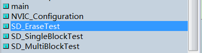
其他几个文件，前面例程已经在使用，我们就对比一下看看差异。

stm32f4xx_conf.h，有差别，但是与SD卡无关。
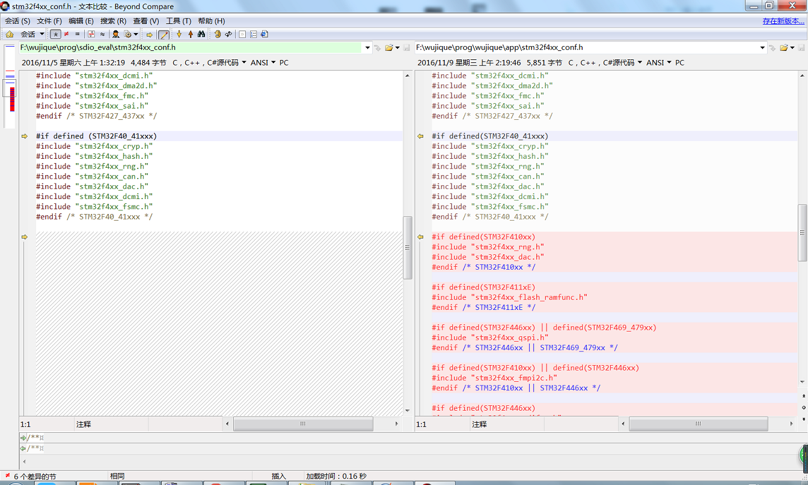

stm32f4xx_it.c，多了两个中断处理，移植的时候记得拷贝。
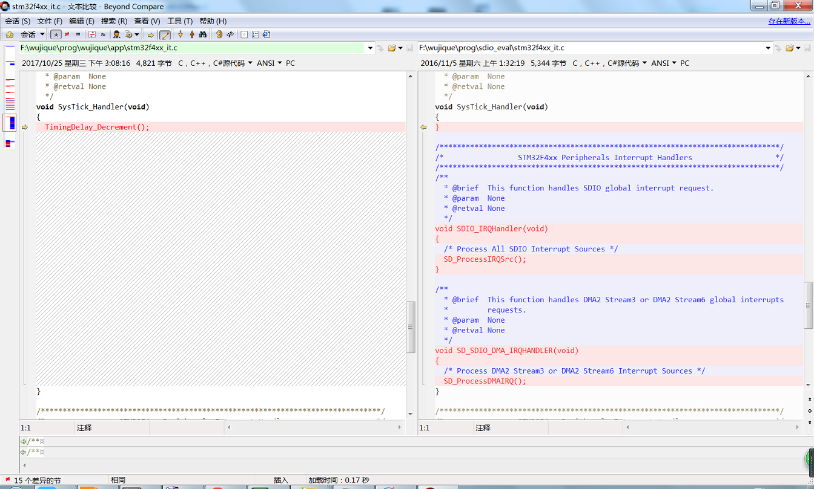

stm32f4xx_it.h多一个SDIO中断的声明，无关紧要
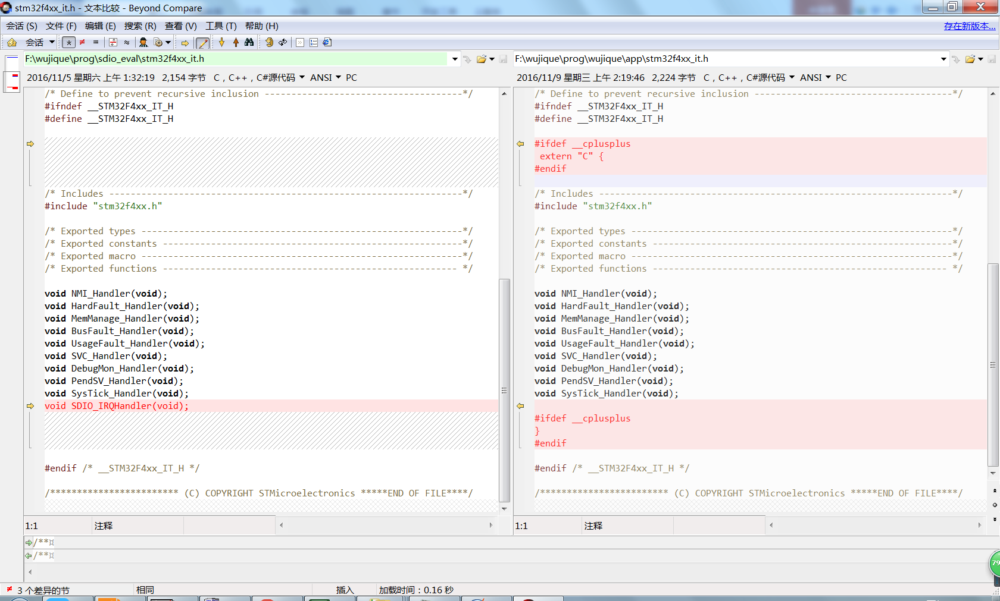

system_stm32f4xx.c，差别较大，但是很多都是为了兼容其他芯片的条件编译。
**但是这个文件主要是初始化时钟，如果移植后调试不顺利，有问题，需要回来认真分析这个文件。**
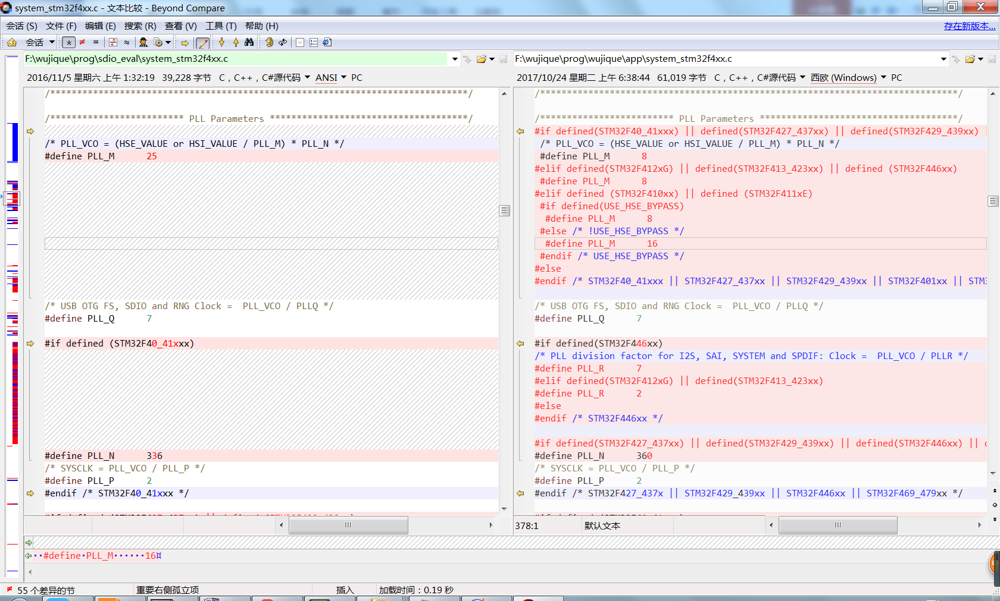

OK，下一步我们就开始移植了。

#### 移植调试过程

1. 建立一个mcu_sdio驱动，将stm324xg_eval.c里的四个函数作为mcu_sdio驱动，拷贝到mcu_sdio.c。
stm324xg_eval.h里面与SD卡相关的定义也要拷贝到mcu_sdio.h里面。

2. stm324xg_eval_sdio_sd.c跟stm324xg_eval_sdio_sd.h我们就直接使用。
作为board_dev驱动。

3. 将main.c里面的SD卡测试程序拷贝到stm324xg_eval_sdio_sd.c最后，作为驱动测试程序使用。
原来的测试程序使用了一些官方硬件上的LED，我们全部改为串口调试信息输出。

4. 有一个需要特别关注的地方就是static void NVIC_Configuration(void)函数，这个函数的第一行就设置了NVIC的分组，也就是中断优先级分组，这个是ARM核相关。关于NVIC，前面章节有说明。

5. 把stm32f4xx_it.c里面的两个中断入口拷贝到我们的stm32f4xx_it.c文件。

6. 将新文件添加到工程，编译。21个错误，一个一个解决。挑几个看看
..\mcu_dev\mcu_sdio.c(67): error:  #20: identifier "SD_DETECT_GPIO_CLK" is undefined
因为mcu_sdio.c没有包含mcu_sdio.h。增加#include "mcu_sdio.h"。
其实在我的个人认识当中，h文件应该是提供给外部使用。
**哪些仅仅是驱动内部使用的定义，最好是定义到C文件内，不让其他文件看到。减少不必要的耦合。**
7. 重新编译，还有一个错误
..\board_dev\stm324xg_eval_sdio_sd.h(39): error:  #5: cannot open source input file "stm324xg_eval.h": No such file or directory
改为包含mcu_sdio.h。
8. 又有38个错误了。
..\board_dev\stm324xg_eval_sdio_sd.h(128): error:  #20: identifier "uint32_t" is undefined
应该是没包含stm32的头文件，
官方stm324xg_eval_sdio_sd.h包含了#include "stm324xg_eval.h"，
然后stm324xg_eval.h包含了#include "stm32f4xx.h"和#include "stm32_eval_legacy.h"，我们在mcu_sdio.h中包含#include "stm32f4xx.h"。
9. 编译没有错误了。
10. 开始做硬件移植，在mcu_sdio.h第20行，例程用PH13做SD卡检测，我们都没有H口。我们用的是PC13.
11. 在mcu_sdio.c的初始化中，进行了初始化，个人认为这些**跟硬件相关的，还是放到一处用宏定义较好，方便移植修改**。
数据线，和我们的硬件一样，不需要修改。
```c
/* Configure PC.08, PC.09, PC.10, PC.11 pins: D0, D1, D2, D3 pins */
命令线，也跟我们一样。
/* Configure PD.02 CMD line */
时钟线也一样。
/* Configure PC.12 pin: CLK pin */
```

12. 那么就是检测脚不一样，我们看看这个管脚怎么用的。搜索后发现有一个SD_Detect函数在使用。
```c
/**
 * @brief  Detect if SD card is correctly plugged in the memory slot.
 * @param  None
 * @retval Return if SD is detected or not
 */
uint8_t SD_Detect(void)
{
  __IO uint8_t status = SD_PRESENT;

  /*!< Check GPIO to detect SD */
  if (GPIO_ReadInputDataBit(SD_DETECT_GPIO_PORT, SD_DETECT_PIN) != Bit_RESET)
  {
    status = SD_NOT_PRESENT;
  }
  return status;
}
```
13. SDCardState SD_GetState(void)和测试程序会使用SD_Detect。到这里看出，检测管脚就是一个普通IO口，没有使用中断等其他功能，直接修改为我们的管脚即可。
14. 重新编译，插上TF卡，下载程序运行。
初始化不成功。在初始化函数添加调试信息。
成功上电，进入初始化，卡信息也获取成功了，选卡也成功。
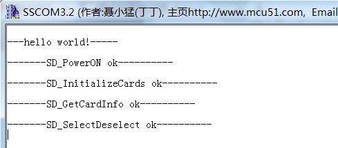
我们先看一下卡信息，卡信息结构体如下：
```c
/**
  * @brief SD Card information
  */
typedef struct
{
  SD_CSD SD_csd;
  SD_CID SD_cid;
  uint64_t CardCapacity;  /*!< Card Capacity */
  uint32_t CardBlockSize; /*!< Card Block Size */
  uint16_t RCA;
  uint8_t CardType;
} SD_CardInfo;
```
CSD跟CID是卡信息，包含比较多信息。例如卡什么卡，什么版本，V1.0，还是2.0等。
本处我们先把容量Capacity跟Block Size打印出来，看跟我们的卡是不是一致。
调试代码如下，要注意的地方是容量的处理：如果直接使用uart_printf打印容量，打印出来一个10，不正确，要拆分为两部分打印。
```c
  /*----------------- Read CSD/CID MSD registers ------------------*/
  errorstatus = SD_GetCardInfo(&SDCardInfo);
    uart_printf("\r\n-------SD_GetCardInfo ok----------\r\n");

	uint32_t *p;
	p = (uint32_t *)&(SDCardInfo.CardCapacity);
	uart_printf("\r\n-------CardCapacity:%08X----------\r\n", *(p+1));
    uart_printf("\r\n-------CardCapacity:%08X----------\r\n", *(p+0));   
    uart_printf("\r\n-------CardBlockSize:%d ----------\r\n", SDCardInfo.CardBlockSize);

    uart_printf("\r\n-------RCA:%d ----------\r\n", SDCardInfo.RCA);
    uart_printf("\r\n-------CardType:%d ----------\r\n", SDCardInfo.CardType);
```
卡信息调试LOG:
>-------dev_sdio_test----------
-------SD_PowerON ok----------
-------SD_InitializeCards ok----------
-------SD_csd.DeviceSize:15271----------
-------SD_GetCardInfo ok----------
-------CardCapacity:00000001----------
-------CardCapacity:DD400000----------
-------CardBlockSize:512 ----------
-------RCA:2 ----------
-------CardType:2 ----------

还有，刚刚等了很久发现，初始化返回结果4，数据超时。

15. 查看SD_Error SD_EnableWideBusOperation(uint32_t WideMode)，分析大概流程后加上调试信息。
应该是陷入static SD_Error SDEnWideBus(FunctionalState NewState)超时。
源码1103行
```c
    else if (SDIO_BusWide_4b == WideMode)
    {
      errorstatus = SDEnWideBus(ENABLE);
      uart_printf("SDEnWideBus:%d\r\n", errorstatus);
```
经查，在FindSCR处，源码2438行。
```c
   uart_printf("SDIO_GetResponse ok\r\n");
  /*!< Get SCR Register */
  errorstatus = FindSCR(RCA, scr);
    uart_printf("FindSCR:%d\r\n", errorstatus);
```
FindScr函数内有个while，估计程序就是卡在这里，源码2760行
```c
while (!(SDIO->STA & (SDIO_FLAG_RXOVERR | SDIO_FLAG_DCRCFAIL
  | SDIO_FLAG_DTIMEOUT | SDIO_FLAG_DBCKEND | SDIO_FLAG_STBITERR)))
{
    if (SDIO_GetFlagStatus(SDIO_FLAG_RXDAVL) != RESET)
    {
      *(tempscr + index) = SDIO_ReadData();
      index++;
    }
}
```
15. 我想骂人，我刚刚说SD卡读不到数据，硬件说他看下，回来跟我说有3个跳线电阻没焊。我想杀人。
看来以后要**先学会怀疑别人，再证明自己清白**。
16. 硬件修改后，SD卡初始化成功，但是测试失败。
>-------dev_sdio_test----------
-------SD_PowerON ok----------
-------SD_InitializeCards ok----------
-------SD_csd.DeviceSize:15271----------
-------SD_GetCardInfo ok----------
-------CardCapacity:00000001----------
-------CardCapacity:DD400000----------
-------CardBlockSize:512 ----------
-------RCA:2 ----------
-------CardType:2 ----------
-------SD_SelectDeselect ok----------
SDIO_GetResponse ok
FindSCR:0
2453 mdResp1Error:0
2468 CmdResp1Error:0
SDEnWideBus:0
-------SD_EnableWideBusOperation:0----------
-------SD_Init ok----------
-------SD_EraseTest....----------

查后，发现卡在等待传输结束的等待上。
SD_Error SD_WaitReadOperation(void)函数第一个等待就过不去。
前面读写已经没问题，**唯一的区别就是这里使用了DMA**。
这里的while(1)，就是等待中断或者DMA标志。源码349行
```c
__IO SD_Error TransferError = SD_OK;
__IO uint32_t TransferEnd = 0;//sdio中断中会赋值0x01;
__IO uint32_t DMAEndOfTransfer = 0;//DMA中断中会赋值0x01;
SD_CardInfo SDCardInfo;
```
网上百度，发现很多人说ST的DMA BUG，其中一个BUG是，在读写之前要发CMD16设置BLOCK大小，我们使用的库已经修改了这个BUG，源码1335行
```c
  /*!< Set Block Size for Card */
  SDIO_CmdInitStructure.SDIO_Argument = (uint32_t) BlockSize;
  SDIO_CmdInitStructure.SDIO_CmdIndex = SD_CMD_SET_BLOCKLEN;
  SDIO_CmdInitStructure.SDIO_Response = SDIO_Response_Short;
  SDIO_CmdInitStructure.SDIO_Wait = SDIO_Wait_No;
  SDIO_CmdInitStructure.SDIO_CPSM = SDIO_CPSM_Enable;
  SDIO_SendCommand(&SDIO_CmdInitStructure);
```
还有就是中断处理函数SD_Error SD_ProcessIRQSrc(void)，以前没有处理出错信息，现在已经处理了。
（从这里可以学一点，我们自己写的中断处理处理函数，最好也响应错误中断）
本处是DMA传输，**DMA传输一般都要求字节对齐，否则会出错或者是死机**。我们看下到底是**死机**了还是一直在**等待**。

17. 既然可能死机，我们就使用**CMSIS DAP调试**一下，发现死在中断入口了。

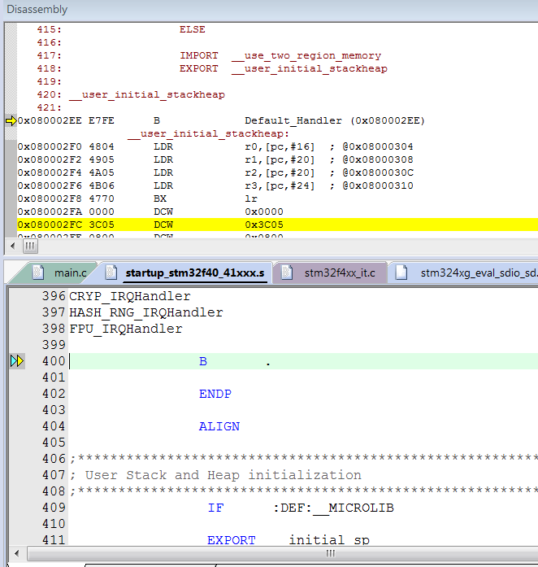

说明有一个中断源一直在进中断，或者是我们没有处理。
我们在DMA中断中增加了调试信息，但是却没有输出，很奇怪。
源码2065行
```c
void SD_ProcessDMAIRQ(void)
{
  uart_printf("-2-");
  if(DMA2->LISR & SD_SDIO_DMA_FLAG_TCIF)
  {
    DMAEndOfTransfer = 0x01;
    DMA_ClearFlag(SD_SDIO_DMA_STREAM, SD_SDIO_DMA_FLAG_TCIF|SD_SDIO_DMA_FLAG_FEIF);
  }
}

```
搜索中断入口函数void SD_SDIO_DMA_IRQHANDLER(void);
发现，这个并没有在中断向量中定义，而是在mcu_sdio.h中用宏定义。
真正的中断句柄是DMA2_Stream3_IRQHandler，在移植的时候我们并没有处理，而且也不了解这样做要如何处理。
先改回DMA2_Stream3_IRQHandler试试。mcu_sdio.h第46行
```c
#ifdef SD_SDIO_DMA_STREAM3
 #define SD_SDIO_DMA_STREAM            DMA2_Stream3
 #define SD_SDIO_DMA_CHANNEL           DMA_Channel_4
 #define SD_SDIO_DMA_FLAG_FEIF         DMA_FLAG_FEIF3
 #define SD_SDIO_DMA_FLAG_DMEIF        DMA_FLAG_DMEIF3
 #define SD_SDIO_DMA_FLAG_TEIF         DMA_FLAG_TEIF3
 #define SD_SDIO_DMA_FLAG_HTIF         DMA_FLAG_HTIF3
 #define SD_SDIO_DMA_FLAG_TCIF         DMA_FLAG_TCIF3
 #define SD_SDIO_DMA_IRQn              DMA2_Stream3_IRQn
 #define SD_SDIO_DMA_IRQHANDLER        DMA2_Stream3_IRQHandler
#elif defined SD_SDIO_DMA_STREAM6
```
18. 测试通过。SDIO硬件测试完成。
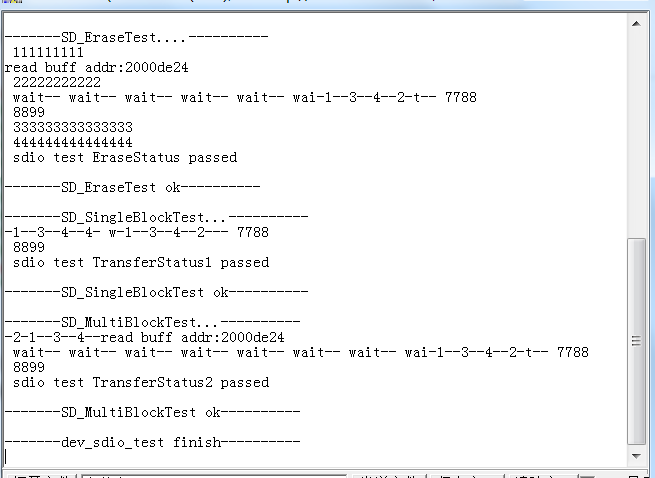
程序测试通过，那到底是不是真的测试成功了呢？
我们可以用winhex软件查看TF卡内容，开头的几个数据块，已经被我们改为0x00--00XFF顺序增加的数据了，说明操作是成功的。
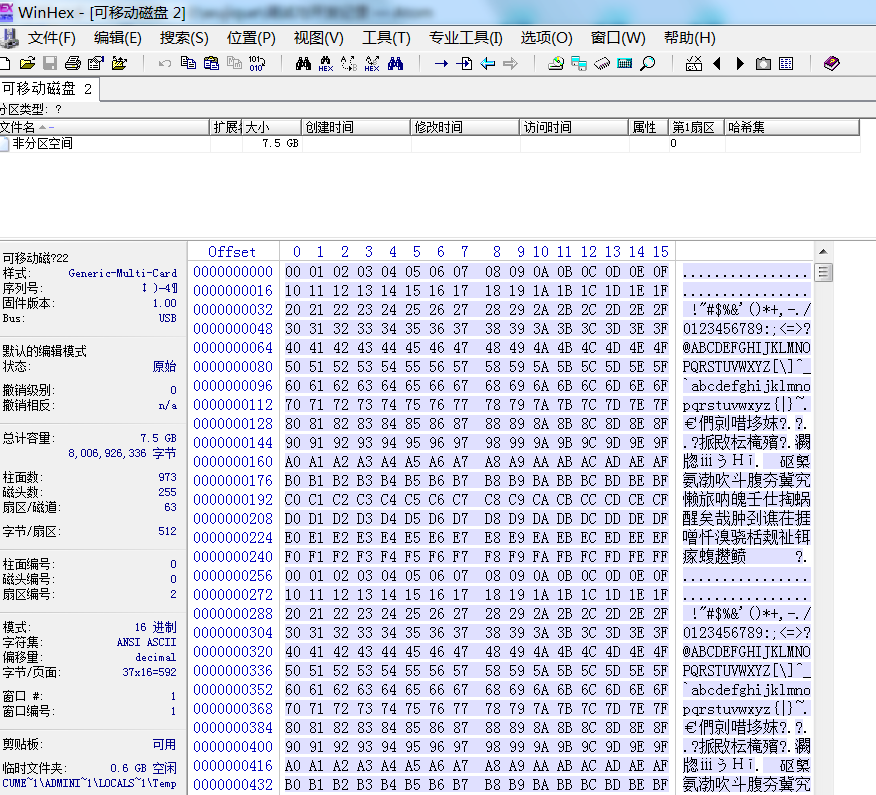

## 总结
调试SD卡这一段写了很多，主要是让大家看看平时调试的方法，很多时候就是

- 加调试信息，顺藤摸瓜。

遗留问题，SDIO驱动用了一个很大的BUF，这个要修改优化。
目前我们只是为了验证硬件，没有挂载文件系统，后续再加上。

---
end
---
