# **I2S-wm8978-音乐播放**
>**够用的硬件**
>
>**能用的代码**
>
>**实用的教程**
>
>屋脊雀工作室编撰 -20190101
>
>愿景：做一套能用的开源嵌入式驱动（非LINUX）
>
>官网：www.wujique.com
>
>github: https://github.com/wujique/stm32f407
>
>淘宝：https://shop316863092.taobao.com/?spm=2013.1.1000126.2.3a8f4e6eb3rBdf
>
>技术支持邮箱：code@wujique.com、github@wujique.com
>
>资料下载：https://pan.baidu.com/s/12o0Vh4Tv4z_O8qh49JwLjg
>
>QQ群：767214262
---

前面章节我们通过DAC播放声音，声音质量只能做到8K，再高的采样频率，CPU就比较吃力了。
内置的DAC精度也没有那么高，一些高级的随身播放器使用的独立DAC芯片通常达到24位。
为了获取较高的音乐质量，屋脊雀板载了一片WM8978，这个芯片也算是各家开发板的标配了。
由于我们还没有调试文件系统，因此我们本次只完成以下功能：

>1 将前面调通的收音机通过WM8978播放。
2 内嵌一段声音文件，通过I2S发送到WM8978播放。

功能1验证WM8978是否可用。
功能2进一步验证I2S跟WM8978是否可用。

>在开发阶段，硬件还不是稳定状态，调试软件时要尽量通过少的功能验证硬件。如果一开始上来就直接做从SD卡播放MP3文件，一旦遇到问题，需要排除的模块就太多了。

## I2S
百度百科：
>I2S(Inter—IC Sound)总线, 又称 集成电路内置音频总线，是**飞利浦公司**为数字音频设备之间的音频数据传输而制定的一种总线标准，该总线专门用于音频设备之间的数据传输，广泛应用于各种多媒体系统。它采用了沿独立的导线传输时钟与数据信号的设计，通过将数据和时钟信号分离，避免了因时差诱发的失真，为用户节省了购买抵抗音频抖动的专业设备的费用。

在飞利浦公司的I2S标准中，既规定了硬件接口规范，也规定了**数字音频数据的格式**。

I2S有3个主要信号
1. 串行时钟SCLK，也叫位时钟（BCLK），即对应数字音频的每一位数据，SCLK都有1个脉冲。SCLK的频率=2×采样频率×采样位数。
2. 帧时钟LRCK，(也称WS)，用于切换左右声道的数据。LRCK为“1”表示正在传输的是右声道的数据，为“0”则表示正在传输的是左声道的数据。LRCK的频率等于采样频率。
3. 串行数据SDATA，就是用二进制补码表示的音频数据。

* 有时为了使系统间能够更好地同步，还需要另外传输一个信号MCLK，称为主时钟，也叫系统时钟（Sys Clock），是采样频率的256倍或384倍。

I2S格式的信号无论有多少位有效数据，数据的最高位总是出现在LRCK变化（也就是一帧开始）后的第2个SCLK脉冲处。这就使得接收端与发送端的有效位数可以不同。如果接收端能处理的有效位数少于发送端，可以放弃数据帧中多余的低位数据；如果接收端能处理的有效位数多于发送端，可以自行补足剩余的位。这种同步机制使得数字音频设备的互连更加方便，而且不会造成数据错位。
随着技术的发展，在统一的 I2S接口下，出现了多种不同的数据格式。根据SDATA数据相对于LRCK和SCLK的位置不同，分为左对齐（较少使用）、I2S格式（即飞利浦规定的格式）和右对齐（也叫日本格式、普通格式）。

## STM32 I2S
stm32没有单独的I2S接口，与SPI共用，资料也在SPI章节。
#### 特性
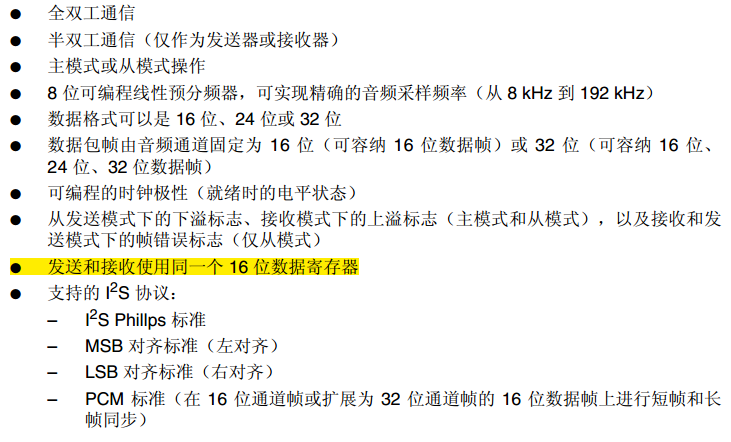
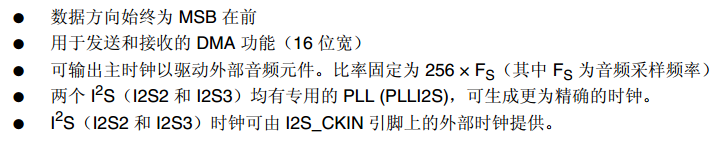

#### 结构框图
从下面框图也可以看出，I2S管脚和SPI管脚有复用。
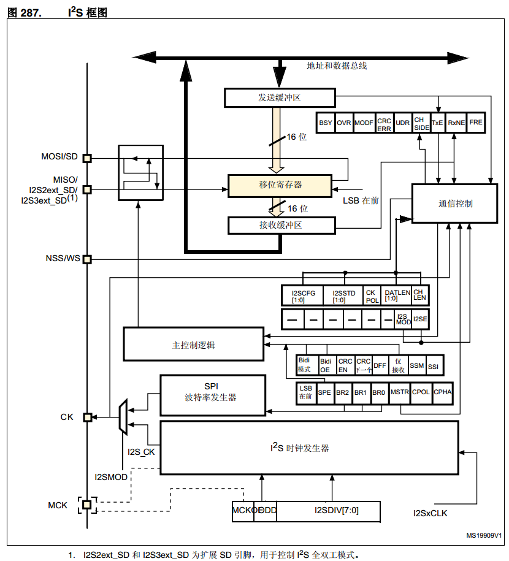

#### 全双工
I2S为了支持全双工，在全双工模式下，除了I2S2(I2S3)之外，还用到一个额外的I2S，那就是I2S2_ext（I2S3_ext）。

I2S2_ext和I2S3_ext只能工作在全双工模式下，而且只能工作在从模式。
怎么理解呢？如果从我们的硬件与WM8978通信上来说：
1 WM8978有另个功能，一个是STM32输出数据到WM8978的DAC，播放语音。另外一个是STM23从WM8978读数据，录音。
2 I2S，就是用在播音时的通信，这是一个完整的I2S。
3 I2SX_ext用在录音时的通信，因为这个I2SX_ext没有时钟，因此要配合I2S使用，也就是说I2SX_ext仅仅是一个从机接收数据的功能。

## WM8978
WM8978是一颗低功耗、高性能的立体声多媒体数字信号编解码器。该芯片内部集成了24位高性能DAC&ADC，可以播放最高192K@24bit的音频信号，并且自带EQ调节，支持3D音效等功能。不仅如此，该芯片还结合了立体声差分麦克风的前置放大与扬声器、耳机和差分、立体声线输出的驱动，减少了应用时必需的外部组件，直接可以驱动耳机（16Ω@40mW）和喇叭（8Ω/0.9W），无需外加功放电路。
- 接口
MCU可以通过I2C或者SPI控制WM8978，屋脊雀使用I2C控制。
I2S接口用于传输数据，可以双向传输，播放音乐时MCU通过I2S发送数据到WM8978，录音时MCU通过I2S读取WM8978的数据。
- 输入
WM8978支持双MIC，硬件上我们只使用一个MIC，同时接到两路MIC输入。
LINE输入不使用，留出测试点。
AUX输入接入收音机音源。
- 输出
喇叭通过2.0插座引出，配套8欧姆2W音腔喇叭。
耳机输出通过3.5音频座接耳机。
OUT3/OUT4不使用。

#### I2S传输
在WM8978资料的70页，DIGITAL AUDIO INTERFACES对音频接口有详细说明。
音频接口有4根管脚：
* ADCDAT:adc data Output
* DACDAT:dac data Input
* LRC:Data Left/Right alignment clock
* BCLK:bit clock, for synchronisation

LCR和BCLK是时钟信号，如果WM8978是主设备，则是输出；从设备，则是输入；通常我们用WM8978做从设备。

WM8978支持5中数据格式：
* Left justified
* Right justified
* I2S
* DSP mode A
* DSP mode B

在文档中有这五个模式的数据传输时序图。

第3个格式，I2S，就是我们通常说的飞利浦格式。后面我们就是用这种数据格式，我们看看他的时序图。
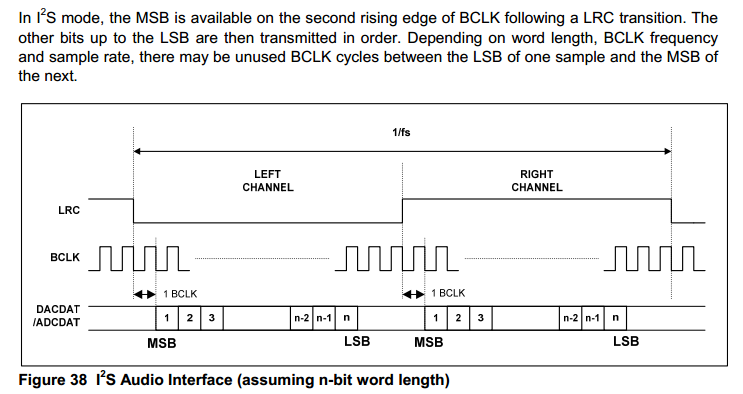

>LRC，控制数据左右声道。
BCLK，位时钟
DACDAT/ADCDAT，数据输入输出。

### 控制
WM8978怎么用？知道WM8978能做什么才知道怎么用。
规格书《WM8978_v4.5.pdf》第一页就有WM8978的框图。
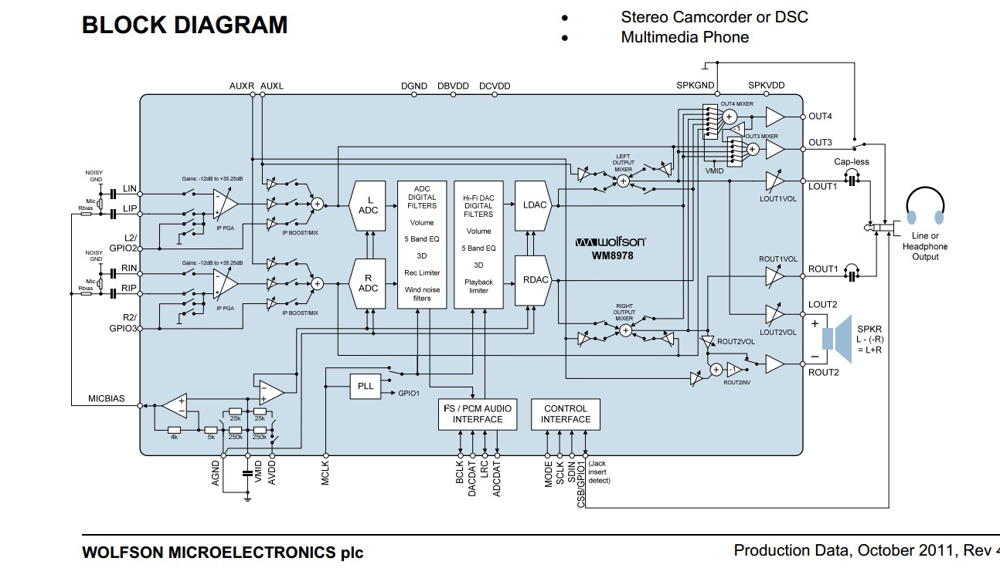
一句话说明WM8978的功能：

>将输入进行一定音效处理后输出。

- 有多少路输入？LINE输入，MIC输出，I2S输入，AUX输入。
从框图可以看到：
I2S输入数字数据，首先进行音效处理，再通过DAC转换为模拟量后送到输出端。
LINE/AUX/MIC，经过几个电子开关后送到输出端，同时还送到ADC进行采样，然后经过音效处理模块后，又通过I2S送出，其实也就是录音功能。
- 有多少路输出？喇叭，耳机，OUT3，OUT4。

我们通过I2C写WM8978的寄存器控制WM8978，实际就是控制这个框图中的各个开关、混音器、音量控制、DACADC功能。
更详细的控制可以在规格书第14页看到，一整页大图说明了音频通路。
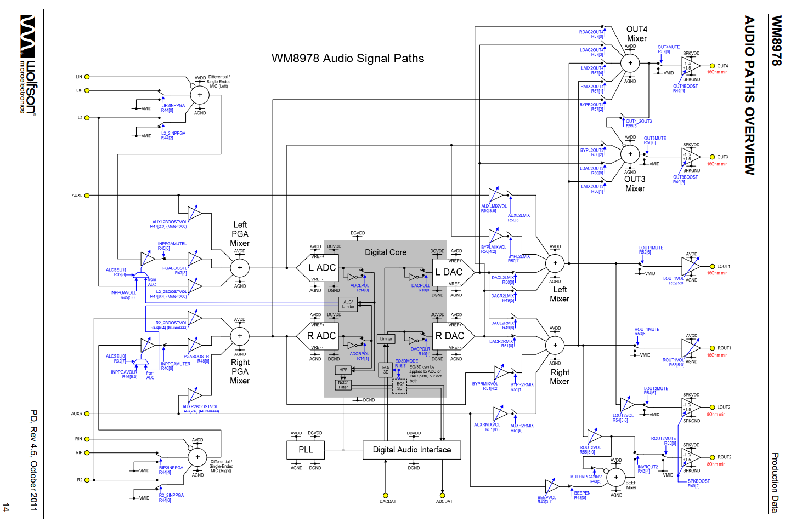
在规格书第89页，有所有的寄存器说明。

WM8978 的 IIC 接口比较特殊：
>1. 只支持写，不支持读数据；
>2. 寄存器长度为 7 位，数据长度为 9 位。
>3. 寄存器字节的最低位用于传输数据的最高位（也就是 9位数据的最高位，7位寄存器的最低位）
>4. WM8978 的 IIC地址固定为： 0x1A。

## DMA
本次实验用到DMA，在编码前我们先学习学习DMA。
#### DMA是什么
按照国际惯例，百度GOOGLE
>DMA(Direct Memory Access，直接内存存取) 是所有现代电脑的重要特色，它允许不同速度的硬件装置来沟通，而不需要依赖于 CPU 的大量中断负载。否则，CPU 需要从来源把每一片段的资料复制到暂存器，然后把它们再次写回到新的地方。在这个时间中，CPU 对于其他的工作来说就无法使用。

从这个就可以看出，DMA就是两个硬件（内存或其他存储结构）直接通信，通信过程不需要CPU干预。
>或者说，DMA是一个只有MOV指令的CPU。

对于单片机来说，就两个外设通信，不需要内核干预。
举例：
要将一段内存里面的数据通过串口发送出去。
通常我们就是编写一段程序，一个字节一个字节将数据发送到串口。
在这个过程中，CPU是一直参与传输的。
如果用了DMA，只要配置好DMA后，DMA就会自己将数据从内存传输到串口。
传输过程，CPU可以去做其他事。

#### STM32 DMA
在《STM32F4xx中文参考手册.pdf》第九章有详细介绍。
特性比较丰富，大家自己看文档，我们看看DMA的框图。
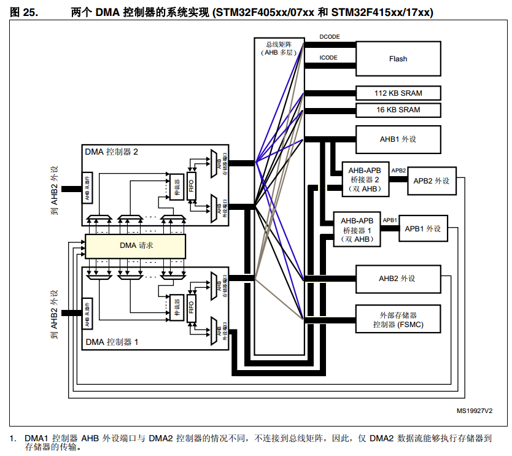
STM32有2个DMA控制器，但是DMA2有点特殊，只能存储器到存储器。

**DMA的具体应用，后面编码时我们会详细分析。**

## 原理图

下图是WM8978的原理图。

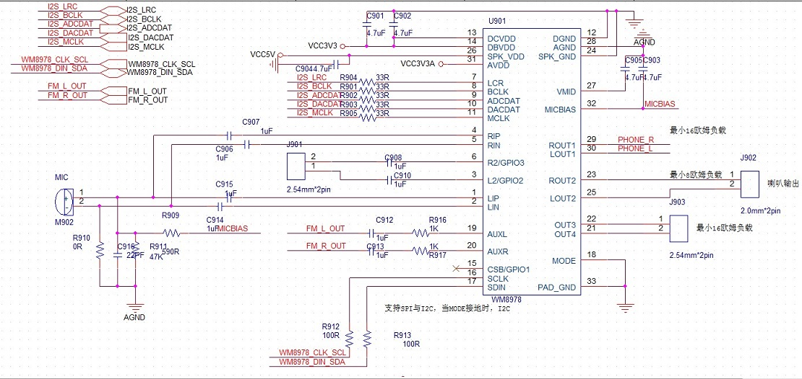
细心的朋友可能发现，前面我们说I2S通信，只要4根管脚，这里怎么多了一个MCLK呢？

>有时为了使系统间能够更好地同步，还需要另外传输一个信号MCLK，称为主时钟，也叫系统时钟（Sys Clock），是采样频率的256倍或384倍。


## WAV转换成数组
这次我们只是验证I2S硬件，不做WAV解码，直接将声音数据转换成一个数组编译到程序里面。如何转换也是一个技巧，学会后处理数据就很简单。

1. 直接将一个wav文件拖到UltraEdit就可以查看二进制。
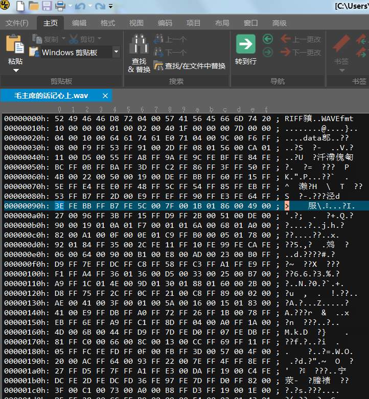
2. 全选，然后右键，选择使用十六进制格式复制。
3. 新建一个txt，粘贴到txt，保存。
4. 用UE打开刚刚创建的txt。进入编辑菜单下的列模式，下图右边列模式
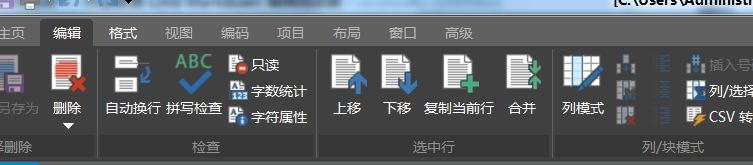
5. 通过列删除删除右边多余数据，通过列添加添加0x前缀和逗号，将数据修改为数组的格式。
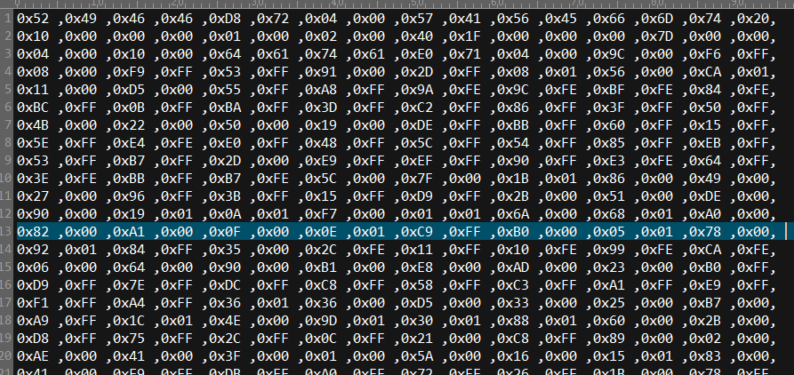
6. 修改完成后添加数组名跟大小括号。
7. 拷贝到工程的c源文件，就可以将语音编译进bin，直接下载到芯片使用。

## 编码调试
调试步骤：
1 通过I2C控制WM8978，将收音机声音从喇叭播出。
2 通过I2C控制WM8978，通过MIC采集声音从喇叭或耳机输出。
3 通过I2S播放一段内嵌语音。
#### WM8978控制-播放收音机声音和MIC功能
在board_dev文件夹创建WM8978驱动文件。
I2C接口在前面调试收音机时已经调通。根据WM8978的I2C特殊性，封装两个读写函数，开辟个数组，用来记录写到wm8978寄存器的值，读的时候就从这个数组回读。
```c
s32 dev_wm8978_writereg(u8 reg, u16 vaule);
s32 dev_wm8978_readreg(u8 addr, u16 *data);
```
其他WM8978控制主要有如下：
```c
s32 dev_wm8978_set_phone_vol(u8 volume)
s32 dev_wm8978_set_spk_vol(u8 volume)
s32 dev_wm8978_set_mic_gain(u8 gain)
s32 dev_wm8978_set_line_gain(u8 gain)
s32 dev_wm8978_set_aux_gain(u8 gain)
s32 dev_wm8978_inout(WM8978_INIPUT In, WM8978_OUTPUT Out)
```
函数名就可以看出功能，从上到下分别是：
>耳机音量设置
喇叭音量设置
MIC输入增益设置
LINE输入增益设置
AUX增益设置
输入输出通道配置

当然，上面只是基本功能，复杂音效暂时不处理。
在main函数中添加如下代码，初始化WM8978后，将收音机设置到指定频率，然后打开wm8978，就可以从喇叭或者耳机听到收音机声音。
```C
/* Infinite loop */
	mcu_uart_open(3);
	wjq_log(LOG_INFO, "hello word!\r\n");
	mcu_i2c_init();
	mcu_spi_init();
	dev_key_init();
	//mcu_timer_init();
	dev_buzzer_init();
	dev_tea5767_init();
	dev_dacsound_init();
	dev_spiflash_init();
	dev_wm8978_init();

	//dev_dacsound_open();
	dev_key_open();
	dev_wm8978_open();
	dev_tea5767_open();
	dev_tea5767_setfre(105700);

	while (1)
	{
		/*驱动轮询*/
		dev_key_scan();

		/*应用*/
		u8 key;
		s32 res;

		res = dev_key_read(&key, 1);
		if(res == 1)
		{
			if(key == DEV_KEY_PRESS)
			{
				//dev_buzzer_open();
				//dev_dacsound_play();
				//dev_spiflash_test();
				//dev_sdio_test();
				dev_wm8978_test();
				GPIO_ResetBits(GPIOG, GPIO_Pin_0 | GPIO_Pin_1
					| GPIO_Pin_2| GPIO_Pin_3);
				//dev_tea5767_search(1);
			}
```
其中，初始化WM898代码如下，先初始化I2S，再初始化默认的WM8978配置：
```c
s32 dev_wm8978_init(void)
{
	mcu_i2s_init();//初始化I2S接口
	dev_wm8978_setting_init();//配置WM8978初始化状态
	return 0;
}
```
初始化WM8978的默认配置，就是写WM8978的寄存器。
```c
static s32 dev_wm8978_setting_init(void)
{
	s32 ret = -1;

	ret = dev_wm8978_writereg(0,0x00);	// 复位WM8978
	if(ret == -1)		// 复位失败
		return ret;

	dev_wm8978_writereg(1,0x1B);

	dev_wm8978_writereg(2,0x1B0);
	dev_wm8978_writereg(3, 0x000C);	// 使能左右声道混合
	dev_wm8978_writereg(6, 0x0000);	// 由处理器提供时钟信号
	dev_wm8978_writereg(43, 0x0010);	// 设置ROUT2反相,驱动扬声器所必须
	dev_wm8978_writereg(49, 0x0006);	// 扬声器 1.5x 增益, 开启热保护

	dev_wm8978_inout(WM8978_INPUT_NULL,
						WM8978_OUTPUT_NULL);

	dev_wm8978_set_mic_gain(50);
	dev_wm8978_set_phone_vol(40);
	dev_wm8978_set_spk_vol(40);
	dev_wm8978_set_aux_gain(3);
	return ret;
}
```
然后就是打开WM8978，其实就是配置默认输入输出通道
```c
s32 dev_wm8978_open(void)
{
	dev_wm8978_inout(WM8978_INPUT_DAC|WM8978_INPUT_AUX
					|WM8978_INPUT_LMIC|WM8978_INPUT_RMIC,
		WM8978_OUTPUT_PHONE|WM8978_OUTPUT_SPK);

	return 0;
}
```
程序运行后，就可以听到收音机的声音从WM8978的喇叭跟耳机输出。
同时，MIC也正常工作了，测试MIC时，可以屏蔽掉下面两句
```c
	dev_tea5767_open();
	dev_tea5767_setfre(105700);
```
也就是关收音机。
同时请注意：MIC距离喇叭较近，有可能发生啸叫。如发生啸叫，可以调小喇叭音量，降低MIC增益，或则关闭喇叭输出，改为耳机监听MIC输入。
* 到此我们基本验证了WM8978是能工作的，下一步就验证I2S播放音乐。
#### I2S 播放音频数据
I2S驱动，参考官方例程。I2S的关键是框架设计，也即是怎么使用I2S传输数据？
软件设计要考虑限制条件：
>首先就是**速度快**，通常播放44K采样频率时，一秒钟就需要传输44*2*2(双声道16BIT)=166K数据，毫无疑问，必须使用**DMA传输**。
并且需要使用DMA双缓冲机制，双缓冲就可以做到播放时读数据。
第二，播放语音数据来源通常是SD卡或者U盘，读文件系统数据通常速度并不是很快，因此缓冲需要开辟大一点，否则语音将断断续续。

* 初始化
初始化分两部分，IO口初始化，I2S控制器初始化。
```c
/**
 *@brief:      mcu_i2s_init
 *@details:    初始化I2S接口硬件
 *@param[in]   void  
 *@param[out]  无
 *@retval:     
 */
void mcu_i2s_init (void)
{
	GPIO_InitTypeDef GPIO_InitStructure;

	/*
		LRC 	PB12
		BCLK	PB13
		ADCDAT 	PC2
		DACDAT	PC3
		MCLK	PC6
	*/
	// 初始化时钟
	RCC_AHB1PeriphClockCmd(RCC_AHB1Periph_GPIOB|RCC_AHB1Periph_GPIOC, ENABLE);

	GPIO_PinAFConfig(GPIOB,	GPIO_PinSource12,		GPIO_AF_SPI2);
	GPIO_PinAFConfig(GPIOB,	GPIO_PinSource13,		GPIO_AF_SPI2);
	GPIO_PinAFConfig(GPIOC, GPIO_PinSource2,		GPIO_AF6_SPI2);
	GPIO_PinAFConfig(GPIOC,	GPIO_PinSource3,		GPIO_AF_SPI2);
	GPIO_PinAFConfig(GPIOC,	GPIO_PinSource6,		GPIO_AF_SPI2);

	GPIO_InitStructure.GPIO_Mode = GPIO_Mode_AF;			// 复用模式
	GPIO_InitStructure.GPIO_Speed = GPIO_Speed_100MHz;	// 速度等级
	GPIO_InitStructure.GPIO_OType = GPIO_OType_PP;		// 推挽输出
	GPIO_InitStructure.GPIO_PuPd = GPIO_PuPd_NOPULL;	//	无上下拉
	GPIO_InitStructure.GPIO_Pin = GPIO_Pin_12|GPIO_Pin_13;
	GPIO_Init(GPIOB, &GPIO_InitStructure);

	GPIO_InitStructure.GPIO_Pin = GPIO_Pin_2|GPIO_Pin_3|GPIO_Pin_6;		
	GPIO_Init(GPIOC,&GPIO_InitStructure);

}
/**
 *@brief:      mcu_i2s_config
 *@details:    I2S配置
 *@param[in]   u32 AudioFreq   频率
               u16 Standard    标准
               u16 DataFormat  格式
 *@param[out]  无
 *@retval:     
 */
void mcu_i2s_config(u32 AudioFreq, u16 Standard,u16 DataFormat)
{
	I2S_InitTypeDef I2S_InitStructure;
	// 配置IIS PLL时钟
	RCC_I2SCLKConfig(RCC_I2S2CLKSource_PLLI2S);				
	RCC_PLLI2SCmd(ENABLE);// 使能PLL
	while( RCC_GetFlagStatus(RCC_FLAG_PLLI2SRDY) == 0 );// 等待配置完成

	RCC_APB1PeriphClockCmd(RCC_APB1Periph_SPI2, ENABLE);// 初始化IIS时钟

	SPI_I2S_DeInit(SPI2);

	I2S_InitStructure.I2S_AudioFreq = AudioFreq;//设置音频采样频率
	I2S_InitStructure.I2S_Standard = Standard;	//I2S Philips 标准
	I2S_InitStructure.I2S_DataFormat = DataFormat;	//数据长度16位
	I2S_InitStructure.I2S_CPOL = I2S_CPOL_Low;	// 空闲状态电平位低
	I2S_InitStructure.I2S_Mode = I2S_Mode_MasterTx;//主机发送
	I2S_InitStructure.I2S_MCLKOutput = I2S_MCLKOutput_Enable;//主时钟输出
	I2S_Init(SPI2, &I2S_InitStructure);

	I2S_Cmd(SPI2, ENABLE);	// 使能IIS
}
```
>mcu_i2s_init就是IO口初始化，很简单，只要将对应IO设置为AF功能就行了。
我们用的是I2S2，所以设置为SPI2功能即可。

>mcu_i2s_config就是I2S控制器的初始化，主要有5个配置：采样频率，通信格式，数据长度，CPOL，主机模式，MCLK时钟输出。

通过查看I2S_InitTypeDef结构体，也可以知道应该如何配置。
```c
typedef struct
{

  uint16_t I2S_Mode;        /*!< Specifies the I2S operating mode.
                              This parameter can be a value of @ref I2S_Mode */

  uint16_t I2S_Standard;    /*!< Specifies the standard used for the I2S communication.
                              This parameter can be a value of @ref I2S_Standard */

  uint16_t I2S_DataFormat;  /*!< Specifies the data format for the I2S communication.
                              This parameter can be a value of @ref I2S_Data_Format */

  uint16_t I2S_MCLKOutput;  /*!< Specifies whether the I2S MCLK output is enabled or not.
                              This parameter can be a value of @ref I2S_MCLK_Output */

  uint32_t I2S_AudioFreq;   /*!< Specifies the frequency selected for the I2S communication.
                              This parameter can be a value of @ref I2S_Audio_Frequency */

  uint16_t I2S_CPOL;        /*!< Specifies the idle state of the I2S clock.
                              This parameter can be a value of @ref I2S_Clock_Polarity */
}I2S_InitTypeDef;
```
* DMA配置
DMA前面我们大概了解了一下，其实DMA功能有点复杂。
下面我们通过程序学习学习。

```c {.line-numbers}
/**
 *@brief:      mcu_i2s_dam_init
 *@details:    初始化I2S使用的DMA通道，双缓冲模式
 *@param[in]   u16 *buffer0  
               u16 *buffer1  
               u32 len       
 *@param[out]  无
 *@retval:     
 */
void mcu_i2s_dma_init(u16 *buffer0,u16 *buffer1,u32 len)
{  
    NVIC_InitTypeDef   NVIC_InitStructure;
    DMA_InitTypeDef  DMA_str;

    RCC_AHB1PeriphClockCmd(RCC_AHB1Periph_DMA1,ENABLE);	//使IIS DMA时钟
    DMA_DeInit(DMA1_Stream4);	//恢复初始DMA配置

    DMA_str.DMA_Channel = DMA_Channel_0;  //IIS DMA通道
    DMA_str.DMA_PeripheralBaseAddr = (u32)&SPI2->DR;	//外设地址
    DMA_str.DMA_Memory0BaseAddr = (u32)buffer0;		//缓冲区0
    DMA_str.DMA_DIR = DMA_DIR_MemoryToPeripheral;	//存储器到外设模式
    DMA_str.DMA_BufferSize = len;		//数据长度
    DMA_str.DMA_PeripheralInc = DMA_PeripheralInc_Disable;	//外设非增量模式
    DMA_str.DMA_MemoryInc = DMA_MemoryInc_Enable;	//存储器增量模式
    DMA_str.DMA_PeripheralDataSize = DMA_PeripheralDataSize_HalfWord;//外设数据长度16位
    DMA_str.DMA_MemoryDataSize = DMA_MemoryDataSize_HalfWord;//存储器数据长度16位
    DMA_str.DMA_Mode = DMA_Mode_Circular;	//循环模式
    DMA_str.DMA_Priority = DMA_Priority_High;	//高优先级
    DMA_str.DMA_FIFOMode = DMA_FIFOMode_Disable; //不使用FIFO      
    DMA_str.DMA_FIFOThreshold = DMA_FIFOThreshold_1QuarterFull;	//FIFO阈值
    DMA_str.DMA_MemoryBurst = DMA_MemoryBurst_Single;	//外设突发单次传输
    DMA_str.DMA_PeripheralBurst = DMA_PeripheralBurst_Single;	//存储器突发单次传输
    DMA_Init(DMA1_Stream4, &DMA_str);	//	初始化DMA
    //配置缓冲区1
    DMA_DoubleBufferModeConfig(DMA1_Stream4,(uint32_t)buffer0, DMA_Memory_0);
    //配置缓冲区1
    DMA_DoubleBufferModeConfig(DMA1_Stream4,(uint32_t)buffer1, DMA_Memory_1);

    DMA_DoubleBufferModeCmd(DMA1_Stream4,ENABLE);	//开启双缓冲模式
    DMA_ITConfig(DMA1_Stream4,DMA_IT_TC,ENABLE);	//开启传输完成中断

    SPI_I2S_DMACmd(SPI2, SPI_I2S_DMAReq_Tx,ENABLE);	//IIS TX DMA使能.

    NVIC_InitStructure.NVIC_IRQChannel = DMA1_Stream4_IRQn;
    NVIC_InitStructure.NVIC_IRQChannelPreemptionPriority = 0;//抢占优先级
    NVIC_InitStructure.NVIC_IRQChannelSubPriority = 0;  //响应优先级
    NVIC_InitStructure.NVIC_IRQChannelCmd = ENABLE;
    NVIC_Init(&NVIC_InitStructure);
}
```


1. DMA通道 18行

  DMA通道设置。STM32有2个DMA，每个DMA的通道和stream在参考手册中都有。
  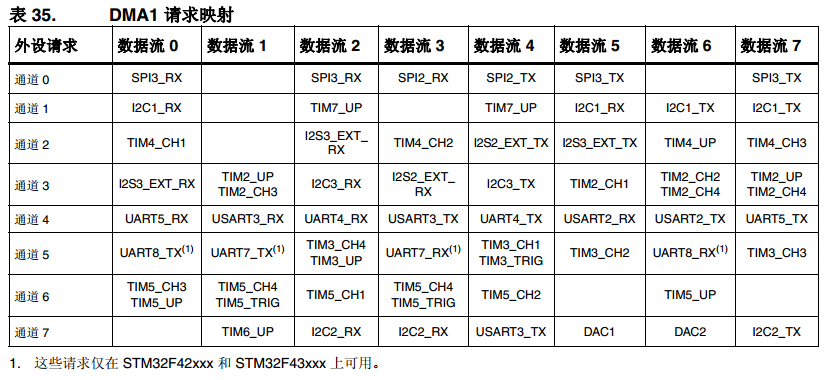

  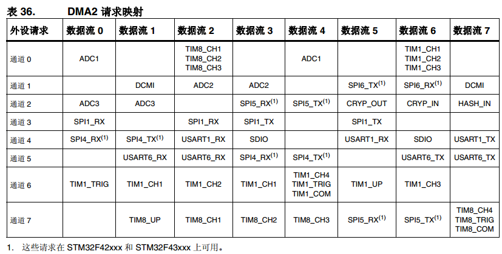
  --

2. DMA_PeripheralBaseAddr 19行
  外设地址，不一定是真正的外设地址。
  如果你是外设到内存，或者内存到外设，这里就是一个外设的地址。
  这里的外设就是前面表格中说的片上设备，SPI、串口、SDIO等等。

  如果你是memory到memory，那这个就是RAM地址或者FLASH地址，或外部RAM SRAM等地址。

3. DMA_Memory0BaseAddr 20行
  memory地址，为什么带个0呢？因为某种情况下，可以用双缓冲。我们这次做I2S播放音乐的时候我们就用双缓冲。

  其他情况通常都是单缓冲。

4. DMA_DIR 21行
  DMA方向，有3种：
  DMA_DIR_PeripheralToMemory
  DMA_DIR_MemoryToPeripheral
  DMA_DIR_MemoryToMemory

>好了，到这里就有点疑问了，配合前面设置的两个地址来看，
如果是P-M，也就是perpheral to memory，那肯定就是DMA_PeripheralBaseAddr取数据，发到DMA_Memory0BaseAddr。
如果是M-P，那就是反着来。
那M-M呢？我没找到文档哪里写，实测，是从DMA_PeripheralBaseAddr取数据，发到DMA_Memory0BaseAddr。
只有 DMA2 控制器能够执行存储器到存储器的传输。

5. DMA_BufferSize 22行
  准确的说应该是传输长度。
  如果配置不准确，传输数据就或出错，或者是一直在DMA传输，永远不结束。
  这个长度，跟后面配置字长有关：
  如果DMA_PeripheralDataSize跟DMA_MemoryDataSize相等，那就没话说了，该是多长就是多长。
  如果两者不相等，DMA_BufferSize是指DMA_PeripheralDataSize数据宽度的数据数。
  假如DMA_PeripheralDataSize是半字，DMA_MemoryDataSize是BYTE，
  DMA_BufferSize=10，就表示DMA要传输10个半字，20个BYTE。

  具体看《STM32F4xx中文参考手册.pdf》 **9.3.10 可编程数据宽度、封装/解封、字节序**
6. DMA_PeripheralInc 23行
  DMA_MemoryInc  24行
  地址是否自加。我们是将内存的一堆数据发送到I2S控制器，因此，内存自加，I2S控制器不自加。

  每次都是发送到&SPI2->DR这个寄存器地址。
7. DMA_PeripheralDataSize 25行
  DMA_MemoryDataSize 26行
  字长设置，当我把两者都设置为halfword时，发现如果传输奇数个半字，会一直处于发送，DMA不会停止。
  因此把DMA_PeripheralDataSize设置为byte，那么传输的字节数就是2*实际要传输的半字，
  那么肯定是2的倍数，就能正常。关于这个在文档中也有提及，只是还看不太明白。

  这次I2S DMA，都用半字，因此需要保证传输数据是2的整数倍。
8. DMA_Mode 27行
  是否循环。所谓的循环就是当一次传输结束后，自动重新启动一次DMA传输，配置和前一次传输一样。
  摄像头就用循环，只要配置一次，启动DMA后，一直持续不断的更新数据到屏幕上。
  需要注意的是：

  使用存储器到存储器模式时，不允许循环模式和直接模式。
9. DMA_Priority 28行

  优先级
10. DMA_FIFOMode 29行
    FIFOThreshold 30行
    是否使用FIFO，也就是是否使用直接模式。
    但是，我们的配置是disable，那么就是直接模式？

    存储器到存储器不是不允许直接模式吗？
11. DMA_MemoryBurst 31行
    DMA_PeripheralBurst 32行
    9.3.11 单次传输和突发传输
    “为确保数据一致性，形成突发的每一组传输都不可分割：在突发传输序列期间， AHB 传输会
    锁定，并且 AHB 总线矩阵的仲裁器不解除对 DMA 主总线的授权。”

    从文档看来，是保证数据完整性的，也就是说不要传到一半被别的设备打断造成数据错误？
12. DMA_Init(DMA1_Stream4, &DMA_InitStructure); 33行

    执行配置，第一个参数要选对Stream0，用哪个stream，根据表格选。
13. 35行~39行

    配置双缓冲
14. 之后
后面就是使能DMA中断，打开SPI/I2S DMA，配置NVIC中断控制器。
配置完成后，当需要时启动DMA传输即可，传输完成则产生一个中断。

* DMA中断

当DMA中断产生时，判断DMA缓冲的标志，然后设置BUF标志。在主循环中查询这个BUF标志，根据标志填充数据到对应缓冲。
```c
/**
 *@brief:      mcu_i2s_dma_process
 *@details:    I2S使用的DMA中断处理函数
 *@param[in]   void  
 *@param[out]  无
 *@retval:     

 位 19 CT：当前目标（仅在双缓冲区模式下） (Current target (only in double buffer mode))
此位由硬件置 1 和清零，也可由软件写入。
0：当前目标存储器为存储器 0（使用 DMA_SxM0AR 指针寻址）
1：当前目标存储器为存储器 1（使用 DMA_SxM1AR 指针寻址）
只有 EN 为“0”时，此位才可以写入，以指示第一次传输的目标存储区。在使能数据流
后，此位相当于一个状态标志，用于指示作为当前目标的存储区。
 */
void mcu_i2s_dma_process(void)
{
	if(DMA1_Stream4->CR&(1<<19))
	{
		/*当前目标存储器为1，我们就设置空闲BUF为0*/
		fun_sound_set_free_buf(0);
	}
	else
	{
		fun_sound_set_free_buf(1);
	}
}


```
* 双缓冲机制
1. 启动播放时，将两个缓冲都填上音源数据。
2. I2S开始传输，传输完一个缓冲，DMA产生中断，根据使用的缓冲设置要写缓冲索引。
3. 语音播放程序判断是否需要填充，填充哪个缓冲。
**千万不要在DMA中断函数内填充缓冲，通过文件系统读几K数据，卡太久中断，会出问题的。**
```c
/**
 *@brief:      fun_sound_get_buff_index
 *@details:    查询当前需要填充的BUF
 *@param[in]   void  
 *@param[out]  无
 *@retval:     
 */
static s32 fun_sound_get_buff_index(void)
{
	s32 res;

	res = SoundBufIndex;
	SoundBufIndex = 0xff;
	return res;
}
/**
 *@brief:      fun_sound_set_free_buf
 *@details:    设置空闲缓冲索引

 *@param[in]   u8 *index  
 *@param[out]  无
 *@retval:     
 */
s32 fun_sound_set_free_buf(u8 index)
{
	SoundBufIndex = index;
	return 0;
}
```
具体填充数据请看源代码。

#### 调试
WM8978 I2S功能先写一个简单的dev_wm8978_test测试函数，首先初始化WM8978，设置I2S的格式（MCU跟WM8978都要配置），初始化I2S DMA，然后预填充两个BUF，启动DMA，进行while循环，在循环中不断查询，需要就填充数据。
在main函数中，当按下按键时，就调用dev_wm8978_test播放。
>调试的时候，左声道有点杂音，仅仅是久不久有一点杂音，一开始就以为是I2S通信被干扰了。
分析过程：
首先将填充左声道的BUFF数据全部设置为0，更新程序后发现左声道竟然还有声音。
然后将两个声道的数据全部填充为0，竟然还会有一点点背景音。
不科学，从而知道不是I2S干扰，应该是填缓冲有问题，追查下去发现缓冲填错了。
当I2S使用完缓冲1的数据，就会切换到缓冲2，此时应该填充缓冲1，程序却填充缓冲2了。
修正后，填充数据0，WM8978静音:填充音源数据，左声道没杂音。

## 思考
wm8978的基本功能就调试通了。
请思考：
我们前面做了一个DAC播放语音，现在又做了一个更加高级的WM8978。这两个驱动要提供什么接口？提供给谁？
或者从上到下分析，APP要播放语音，要什么接口？硬件有两个声卡设备，怎么操作？
对于语音播放来说，仅仅实现DAC播放或者是WM8978播放时远远不够的。
等硬件验证完，文件系统也移植好的时候，我们会做一个语音播放管理程序。

---
END
---
