# **FSMC-TFT LCD调试记录**
>**够用的硬件**
**能用的代码**
**实用的教程**
>屋脊雀工作室编撰 -20190402
愿景：做一套能用的开源嵌入式驱动（非LINUX）
官网：www.wujique.com
github: https://github.com/wujique/stm32f407
淘宝：https://shop316863092.taobao.com/?spm=2013.1.1000126.2.3a8f4e6eb3rBdf
技术支持邮箱：code@wujique.com、github@wujique.com
资料下载：https://pan.baidu.com/s/12o0Vh4Tv4z_O8qh49JwLjg
QQ群：767214262
---

电子设备人机交互包含输入输出，液晶显示是输出主要方法。
屋脊雀F407开发板在核心板上有TFT LCD液晶屏接口，可以接我们接口的8080并口总线液晶屏。

>开发阶段先调试LCD显示简单的英文字符，图片与汉字显示暂时不处理。

## LCD液晶屏
>tft-lcd是薄膜晶体管液晶显示器英文thin film transistor-liquid crystal display的缩写。


本次调试的是屋脊雀设计的模块
>带四线电阻触摸屏
2.8寸
标准37PIN并口，支持8080或6800接口。
分辨率320*240
16位真彩色（65k色）。
液晶驱动芯片为ILI9341。
双接口接口：FPC30和DIP30。默认使用FPC排线连接。

本次仅仅编写显示驱动，触摸屏驱动下一章再讨论。

#### LCD组成
我们常说的LCD，其实是LCD模组，包含驱动芯片和液晶面板。
驱动芯片跟液晶面板之间有很多线连接，通过这些线控制液晶面板。
**我们开发LCD驱动，其实就是开发驱动芯片的驱动。**
常用的LCD 驱动IC非常多，但是从功能上分析，基本类似。
学会一种就可以触类旁通。
下面我们通过9341驱动学习LCD 驱动芯片的功能。

#### 时序
并口有两种时序模式：英特尔的8080时序、摩托罗拉的6800时序。
并口不仅仅用于TFT LCD，其它SDRAM等芯片也使用并口时序通信。

- 8080时序

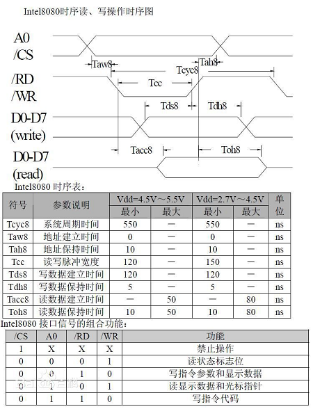

8080时序，通常有下列接口信号
>Vcc(工作主电源)
Vss(公共端)
Vee(偏置负电源,常用于调整显示对比度)
/RES,复位线。DB0~DB7,双向数据线。
D/I,数据/指令选择线(1:数据读写,0:命令读写)。
/CS,片选信号线(如果有多片组合,可有多条片选信号线)。
/WR, MPU向LCD写入数据控制线。
/RD, MPU从LCD读入数据控制线。

- 6800时序

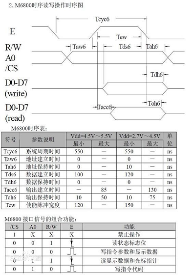

上图即为摩托罗拉的6800时序
>在这种模式下,Vcc、Vss、Vee、/RES、DB0~DB7、D/I的功能同模式(1),其他信号线为:
R/W,读写控制(1:MPU读, 0:MPU写)。
E,允许信号(多片组合时,可有多条允许信号线)。

#### ILI9341
《ILI9341_DS_V1.09_20110315.pdf》
打开这个文档即可看到文档标题
>a-Si TFT LCD Single Chip Driver
240RGBx320 Resolution and 262K color

从标题就可以看出这个驱动IC的性能：
>可以支持240*320像素，只是表明驱动IC的性能，不代表LCD模组像素大小，LCD像素可能会小于320*240。
RGB
262K色

在第9页有9341这颗芯片的框图
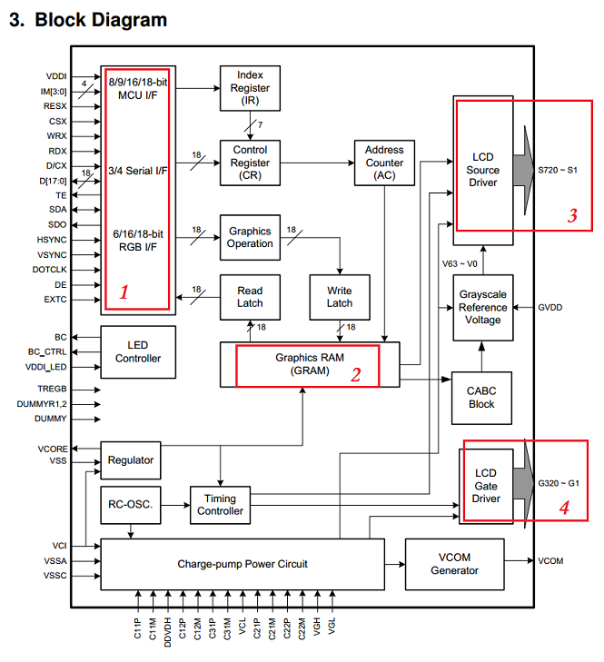
主要有以下说明：
1. 左上红框1，说明这颗IC支持多种通信接口，RGB接口、串口、MCU接口。
其中MCU接口就是我们常说的并口，通常是6800或8800时序。
但是模组用什么接口，支持什么接口，不同厂家设计的不一样。
所以用9341的LCD模组，接口可能会不同。
2. 中间红框2，就是芯片的显存，使用LCD就是将显示数据写到这个地方。
3. 右上红框和右下红框，就是这颗芯片跟液晶面板的连线 。

通常显示驱动IC就分两部分：控制，显示。
1. 对于显示，其实就是读写驱动IC里面的显示缓冲区，操作上跟读写外部SRAM基本一样。
但是接口上有区别，在下面FSMC部分有说明。

2. 控制部分就是读写驱动IC内的命令寄存器，在文档中对每一个命令的操作流程都有说明。
过程跟SPI FLASH的控制过程类似。
控制又可以分为两部分：初始化、显示过程可控制。
>初始化一般都是由厂家提供，我们作为用户，用就行了。有问题找原厂。
显示过程的控制大概有：设置显示区域、设置扫描方向、设置屏幕方向、打开或关闭显示、开始填充数据等几个命令。

#### 数据格式
9341支持多种接口，不同接口的数据格式是不一样的。
本次我们用的LCD模组是16BIT并口。格式说明在文档的7.6.5章节
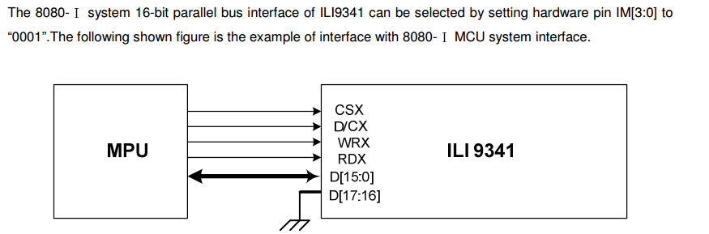
在这种接口模式下，数据有两种格式：65K色、256K色。我们只用65K色。
那么一次发送的数据格式就是:RGB565格式。
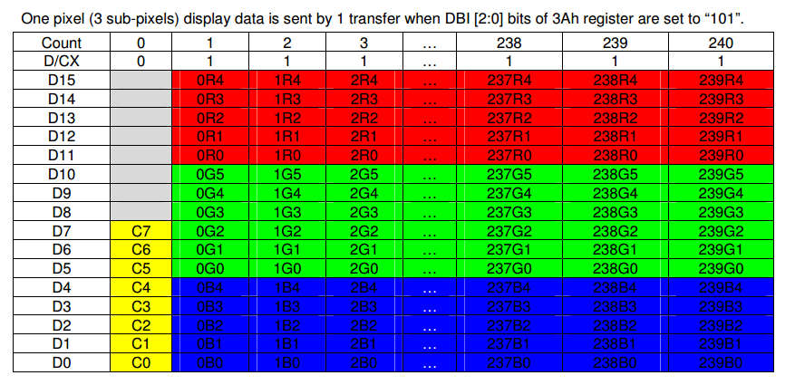
看上图，第0个字节只有低8位有效，这个字节是命令。
从第1个字节开始，就是显示数据，每个数据16位，从高位到低位分3部分:红色数据5bit、绿色数据6bit、蓝色数据5bit。
#### 显示流程
通常显示流程如下图。
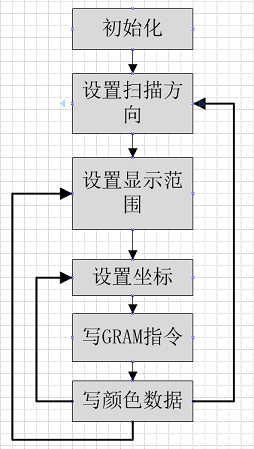
1. 初始化包括硬件复位和LCD控制初始化，初始化流程比较复杂，通常由模组厂家提供。
2. 设置扫描方向，当持续刷新显示数据时，控制器自动移动GRAM指针的方向。
有两个：page和colum.
3. 设置显示范围，也就是显示窗口的意思，假如一个320*240的屏幕，要显示一张100X100的图片，我们就可以设置一个100X100的显示窗口。
4. 坐标，也就是开始写GRAM的位置，必须在显示窗口范围内。例如我们设置了一个100*100的窗口，左上角坐标是（1,1）。显示坐标设置为(1,1)。
然后开始写GRAM指令，后面传输的显示数据就会自动在这个窗口内顺序刷新。

***上面说的几点，不同的控制器有一点差别***

#### 命令
1. 设置扫描方向
9341使用36H命令控制扫描方向。简单说就是连续读写GRAM时，GRAM指针增长方向。
在8.2.29有命令说明，其中关键的是MY/MX/MV：这3个bit控制memory读写方向。
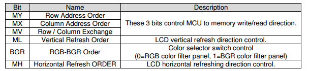

2. 设置column范围
2AH命令设置column范围，SC是column起始，EC就是结束。
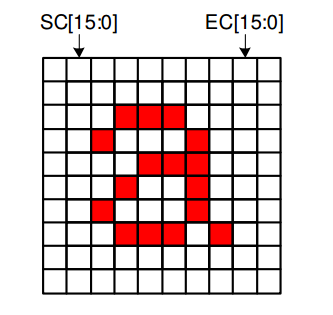

那可设范围是多大呢？请看下面。
根据MADCTL第5个BIT，column不能超过0xEF/0x13f。也就是不能超过239/319。
啥意思？也就是**意味着，可以通过MADCTL第5个BIT调换column和page**。
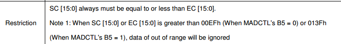

3. 设置page范围
2BH命令设置page范围，SP是page起始地址，EP是page结束地址。

2B命令和2A命令类似。


**很多人说这两个命令时用于设置扫描起始地址，这是不对的。这两个命令时用于设置扫描窗口范围。当设置窗口时，起始地址默认为(sc,sp)**

4. 写GRAM指令
命令2CH用于开始写GRAM。

5. 写数据
紧跟2C命令后面的数据都是显示数据，直接写到GRAM中，GRAM指针移动根据前面几个指令的设置决定。

## FSMC
要了解FSMC接口，我们打开《STM32F4xx中文参考手册.pdf》，翻到第32章：灵活的静态存储控制器。
>FSMC 能够连接同步、异步存储器和 16 位 PC 存储卡。
所有外部存储器共享地址、数据和控制信号，但有各自的片选信号。
FSMC 一次只能访问一个外部器件。

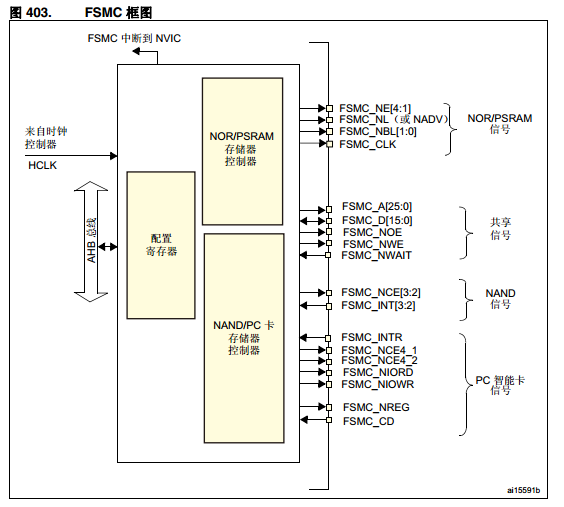
上面是FSMC框图，从中可以看出，FSMC将设备分为两部分，**NOR/PSRAM**和**NAND/PC**。
两者有各自的控制器，共用地址线信号线等信号（见框图右边第二个大括号）。
其中，控制信号还细分为三种：NOR/PSRAM信号、NAND信号、PC智能卡信号。
前面说到，操作TFT LCD就是操作驱动IC里面的显示缓冲区，跟操作SRAM一样。
**因此我们将TFT LCD接在NOR/PSRAM存储器控制器上，使用FSMC_NE4作为片选信号。**
但是LCD与SRAM还是有区别的，LCD没有地址线，多一根RS线用于区分数据线上的是显示数据还是命令。
如果我们将RS接到FSMC的某根地址线上，当我们操作一个地址，让这根线为高电平，就相当于向LCD写数据；当操作另外一个地址，是低电平时，则是命令了。
那么这个地址如何定呢？继续往下看
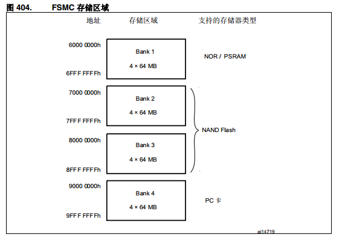
上图是FSMC地址的划分，PSRAM在Bank1
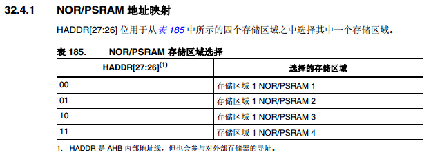
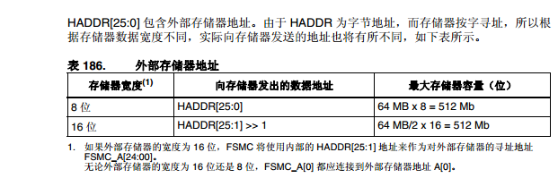
在框图中，FSMC_NE信号有4根，就分别对应其中的四个存储区域。
每个区域64M，偏移地址分别是
		0x000 0000
		0X400 0000
		0X800 0000
		0XC00 0000

对于8位跟16位，HADDR内部连接不一样，但是FSMC与外部器件依然是A0连接A0，也就是说：
**位宽对总线地址线连接无影响，在内部控制器已经处理**。

>现在我们将RS接在FSMC_A15上。
使用的FSMC_NE4，空间就是BANK1的存储区域4。
基地址是0x6000 0000+0xc00 0000，
RS接在FSMC_A15上，那么在地址线上，我们希望的信号是A15出现0和1的变化，以便群命令和数据。
但是，犹豫我们用的是16位位宽，地址会右移1位。也就是说，程序中操作A15地址的变化，才会在硬件信号A15上出现变化。
那么区分命令和数据的地址位，就是(1 0000 0000 0000 0000H).
从而数据地址是0x6c01 xxxx，命令地址是0x6c00 xxxx.
这只是其中的一组地址，只要地址的A16位是0和1的区别，并且地址在0x6c00 0000~0x7000 0000之间，都是符合的。

更多FSMC信息，例如寄存器使用、总线时序等，请参考芯片参考手册，同时分析源码。
## 原理图
- 接口

>1脚背光电源（5V），
2脚背光控制
3脚LCD复位信号
4、5、6、7触摸屏控制信号
8，LCD电源
9、30，地线
10~25是双向数据线
26 CS，TFTLCD片选信号。
27 RS,命令/数据标志（ 0，命令； 1，数据）。
28 WR，控制向TFTLCD写入数据。
29 RD，从TFTLCD 读取数据。

- Lcd原理图

上图只是LCD的原理图，不包含触摸屏控制。
左边信号是控制信号。右边是电源和背光。
我们用的LCD默认就是16BIT并口了，不需要IM选择。

## 编码调试
知识点已经介绍完，下一步就是开始驱动编写，编写驱动前，先进行驱动设计。
#### 驱动设计
通常的显示流程：
>APP要在LCD上显示一个字符，调用**显示接口**，显示接口根据传入的**字符内码**查找**点阵字库**，组成显示数据，将显示数据**刷新到指定的LCD**。

根据这个流程，显示要分两层，
1. 中间层是处理数据，类似GUI层，主要负责处理显示内容，包含查找字符点阵，画圆画线。
2. 底层就是LCD驱动，仅仅负责将显示数据写到LCD，不关心显示内容。

这样理想的LCD驱动框架到后面我们在实现。
当前主要是验证硬件，只做LCD驱动，并做几个简单的显示接口，可以显示英文，暂时不做中文显示。

在进行LCD驱动设计时，请考虑以下问题：
>1. lcd驱动对下使用FSMC接口操作驱动IC，对上应该提供什么接口？提供什么功能？对上，对谁？
>2. 2.8寸的LCD，很可能有很多不同的驱动IC驱动，如何兼容不同的IC？
>3. 如果一个设备有两个2.8寸的LCD，驱动如何设计？
>4. 后续会做0.96 OLED跟12864 COG LCD驱动，跟当前的TFT LCD驱动什么关系？

>我认为LCD只是提供显示缓冲显示功能，或者说，提供一个个点显示功能。如果是黑白屏，就是一个点显示黑还是白，如果是彩屏，就是一个点显示什么颜色。
LCD驱动，不应该提供显示字符，划线等功能，因为这些功能应该是GUI负责。这是需要认识的一个很关键的地方。
假设系统做各种字体的显示，中文，英文，阿拉伯文。首先要有字库，还需要有对字库的处理，将点阵转换为LCD显示缓冲。这些都不是LCD驱动负责。

#### FSMC调试
我们在官方的例程中找FSMC的例程作为参考。在标准库目录下STM32F4xx_DSP_StdPeriph_Lib_V1.8.0\Project\STM32F4xx_StdPeriph_Examples\FSMC下有两个例程
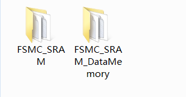
通过读文件夹内的readme文件可知道，第一个例程是如何通过读写将一个外部SRAM作为数据存储，第二个例程是如何将外部SRAM做为一个外部的memory，包括作为堆和栈。
很明显，我们应该参考第一个例程。

>@par How to use it ?
In order to make the program work, you must do the following:
 - Copy all source files from this example folder to the template folder under
   Project\STM32F4xx_StdPeriph_Templates
 - Open your preferred toolchain
 - Select the project workspace related to the STM32F40_41xxx device and add
   the following files in the project source list:
   - Utilities\STM32_EVAL\STM3240_41_G_EVAL\stm324xg_eval.c
   - Utilities\STM32_EVAL\STM3240_41_G_EVAL\stm324xg_eval_fsmc_sram.c      
 - Rebuild all files and load your image into target memory
 - Run the example

根据SDIO例程移植的经验，很容易看出，stm324xg_eval_fsmc_sram.c才是我们要的源码。
当然，例程里面的其他文件我们也需要跟我们工程的文件对比一下。
```c
 /* Initialize the SRAM memory */
  SRAM_Init();

  /* Fill the buffer to send */
  Fill_Buffer(aTxBuffer, BUFFER_SIZE, 0x250F);

  /* Write data to the SRAM memory */
  SRAM_WriteBuffer(aTxBuffer, WRITE_READ_ADDR, BUFFER_SIZE);  

  /* Read back data from the SRAM memory */
  SRAM_ReadBuffer(aRxBuffer, WRITE_READ_ADDR, BUFFER_SIZE);

  /* Check the SRAM memory content correctness */   
  for (uwIndex = 0; (uwIndex < BUFFER_SIZE) && (uwWriteReadStatus_SRAM == 0); uwIndex++)
  {
    if (aRxBuffer[uwIndex] != aTxBuffer[uwIndex])
    {
      uwWriteReadStatus_SRAM++;
    }
  }
```
main.c，很简单，初始化SRAM，写，读，校验。
首先将stm324xg_eval_fsmc_sram.h跟stm324xg_eval_fsmc_sram.c拷贝到mcu_dev目录下，并添加到MDK跟SI的工程。
源代码就只有三个函数，就是在main函数中调用的函数。
在.c文件中包含库文件，.h文件中对stm324xg_eval.h的包含去掉。编译通过。
```c
/* Includes -----*/
#include "stm32f4xx.h"
#include "stm324xg_eval_fsmc_sram.h"
```

#### 显示IC驱动调试
虽然说我们有驱动IC规格书，通常上还是需要LCD厂家提供驱动例程，特别是初始化代码。
创建驱动文件dev_ILI9341.c跟dev_ILI9341.h，保存在board_dev文件夹内。
- 按照经验，首先调试到成功读取驱动IC的ID。

先根据硬件，修改FSMC驱动里面的配置。我们参考SRAM_Init函数，重写一个LCD FSMC初始化函数
```c {.line-numbers}
/**
 *@brief:      mcu_fsmc_lcd_Init
 *@details:    LCD使用的FSMC初始化
 *@param[in]   void  
 *@param[out]  无
 *@retval:     
 */
void mcu_fsmc_lcd_Init(void)
{
  FSMC_NORSRAMInitTypeDef  FSMC_NORSRAMInitStructure;
  FSMC_NORSRAMTimingInitTypeDef  w,r;
  GPIO_InitTypeDef GPIO_InitStructure;

  /* Enable GPIOs clock */
  RCC_AHB1PeriphClockCmd(RCC_AHB1Periph_GPIOD | RCC_AHB1Periph_GPIOE |
						 RCC_AHB1Periph_GPIOG, ENABLE);

  /* Enable FSMC clock */
  RCC_AHB3PeriphClockCmd(RCC_AHB3Periph_FSMC, ENABLE);

/*-- GPIOs Configuration -----------------------------------------------------*/
/*
 +-------------------+--------------------+------------------+------------------+
PD0	<-> FSMC_D2  
PD1	<-> FSMC_D3  
PD4	<-> FSMC_NOE
PD5	<-> FSMC_NWE
PD8	<-> FSMC_D13  
PD9	<-> FSMC_D14
PD10 <-> FSMC_D15
PD14 <-> FSMC_D0   
PD15 <-> FSMC_D1   

PE7	<-> FSMC_D4    
PE8	<-> FSMC_D5   
PE9	<-> FSMC_D6  
PE10 <-> FSMC_D7   
PE11 <-> FSMC_D8   
PE12 <-> FSMC_D9   
PE13 <-> FSMC_D10  
PE14 <-> FSMC_D11  
PE15 <-> FSMC_D12  

PG5 <-> FSMC_A15 |
PG12 <-> FSMC_NE4 |
*/

  /* GPIOD configuration */
  GPIO_PinAFConfig(GPIOD, GPIO_PinSource0, GPIO_AF_FSMC);
  GPIO_PinAFConfig(GPIOD, GPIO_PinSource1, GPIO_AF_FSMC);
  GPIO_PinAFConfig(GPIOD, GPIO_PinSource4, GPIO_AF_FSMC);
  GPIO_PinAFConfig(GPIOD, GPIO_PinSource5, GPIO_AF_FSMC);
  GPIO_PinAFConfig(GPIOD, GPIO_PinSource8, GPIO_AF_FSMC);
  GPIO_PinAFConfig(GPIOD, GPIO_PinSource9, GPIO_AF_FSMC);
  GPIO_PinAFConfig(GPIOD, GPIO_PinSource10, GPIO_AF_FSMC);
  GPIO_PinAFConfig(GPIOD, GPIO_PinSource14, GPIO_AF_FSMC);
  GPIO_PinAFConfig(GPIOD, GPIO_PinSource15, GPIO_AF_FSMC);

  GPIO_InitStructure.GPIO_Pin = GPIO_Pin_0| GPIO_Pin_1|GPIO_Pin_4|GPIO_Pin_5 |
				GPIO_Pin_8|GPIO_Pin_9|GPIO_Pin_10|GPIO_Pin_14|GPIO_Pin_15;
  GPIO_InitStructure.GPIO_Mode = GPIO_Mode_AF;
  GPIO_InitStructure.GPIO_Speed = GPIO_Speed_100MHz;
  GPIO_InitStructure.GPIO_OType = GPIO_OType_PP;
  GPIO_InitStructure.GPIO_PuPd	= GPIO_PuPd_NOPULL;

  GPIO_Init(GPIOD, &GPIO_InitStructure);


  /* GPIOE configuration */
  GPIO_PinAFConfig(GPIOE, GPIO_PinSource7 , GPIO_AF_FSMC);
  GPIO_PinAFConfig(GPIOE, GPIO_PinSource8 , GPIO_AF_FSMC);
  GPIO_PinAFConfig(GPIOE, GPIO_PinSource9 , GPIO_AF_FSMC);
  GPIO_PinAFConfig(GPIOE, GPIO_PinSource10 , GPIO_AF_FSMC);
  GPIO_PinAFConfig(GPIOE, GPIO_PinSource11 , GPIO_AF_FSMC);
  GPIO_PinAFConfig(GPIOE, GPIO_PinSource12 , GPIO_AF_FSMC);
  GPIO_PinAFConfig(GPIOE, GPIO_PinSource13 , GPIO_AF_FSMC);
  GPIO_PinAFConfig(GPIOE, GPIO_PinSource14 , GPIO_AF_FSMC);
  GPIO_PinAFConfig(GPIOE, GPIO_PinSource15 , GPIO_AF_FSMC);

  GPIO_InitStructure.GPIO_Pin = GPIO_Pin_7 |
				GPIO_Pin_8|GPIO_Pin_9|GPIO_Pin_10|GPIO_Pin_11|
				GPIO_Pin_12|GPIO_Pin_13|GPIO_Pin_14|GPIO_Pin_15;

  GPIO_Init(GPIOE, &GPIO_InitStructure);

  /* GPIOG configuration */
  GPIO_PinAFConfig(GPIOG, GPIO_PinSource5 , GPIO_AF_FSMC);
  GPIO_PinAFConfig(GPIOG, GPIO_PinSource12 , GPIO_AF_FSMC);

  GPIO_InitStructure.GPIO_Pin = GPIO_Pin_5  |GPIO_Pin_12;		

  GPIO_Init(GPIOG, &GPIO_InitStructure);

/*-- FSMC Configuration ------------------------------------------------------*/
  w.FSMC_AddressSetupTime = 15;
  w.FSMC_AddressHoldTime = 0;
  w.FSMC_DataSetupTime = 15;
  w.FSMC_BusTurnAroundDuration = 0;
  w.FSMC_CLKDivision = 0;
  w.FSMC_DataLatency = 0;
  w.FSMC_AccessMode = FSMC_AccessMode_A;

  r.FSMC_AddressSetupTime = 16;
  r.FSMC_AddressHoldTime = 0;
  r.FSMC_DataSetupTime = 24;
  r.FSMC_BusTurnAroundDuration = 0;
  r.FSMC_CLKDivision = 0;
  r.FSMC_DataLatency = 0;
  r.FSMC_AccessMode = FSMC_AccessMode_A;

  FSMC_NORSRAMInitStructure.FSMC_Bank = FSMC_Bank1_NORSRAM4;
  FSMC_NORSRAMInitStructure.FSMC_DataAddressMux = FSMC_DataAddressMux_Disable;
  FSMC_NORSRAMInitStructure.FSMC_MemoryType = FSMC_MemoryType_SRAM;
  FSMC_NORSRAMInitStructure.FSMC_MemoryDataWidth = FSMC_MemoryDataWidth_16b;
  FSMC_NORSRAMInitStructure.FSMC_BurstAccessMode = FSMC_BurstAccessMode_Disable;
  FSMC_NORSRAMInitStructure.FSMC_AsynchronousWait = FSMC_AsynchronousWait_Disable;
  FSMC_NORSRAMInitStructure.FSMC_WaitSignalPolarity = FSMC_WaitSignalPolarity_Low;
  FSMC_NORSRAMInitStructure.FSMC_WrapMode = FSMC_WrapMode_Disable;
  FSMC_NORSRAMInitStructure.FSMC_WaitSignalActive = FSMC_WaitSignalActive_BeforeWaitState;
  FSMC_NORSRAMInitStructure.FSMC_WriteOperation = FSMC_WriteOperation_Enable;
  FSMC_NORSRAMInitStructure.FSMC_WaitSignal = FSMC_WaitSignal_Disable;
  FSMC_NORSRAMInitStructure.FSMC_ExtendedMode = FSMC_ExtendedMode_Enable;
  FSMC_NORSRAMInitStructure.FSMC_WriteBurst = FSMC_WriteBurst_Disable;
  FSMC_NORSRAMInitStructure.FSMC_ReadWriteTimingStruct = &r;
  FSMC_NORSRAMInitStructure.FSMC_WriteTimingStruct = &w;

  FSMC_NORSRAMInit(&FSMC_NORSRAMInitStructure);

  /*!< Enable FSMC Bank1_SRAM4 Bank */
  FSMC_NORSRAMCmd(FSMC_Bank1_NORSRAM4, ENABLE);

}
```
>15/19行，打开设备时钟。
48~92，配置对应的IO口为FSMC功能
94~109，设置FSMC时序
111，选择BANK
113，设置类型，LCD可以设置为SRAM。
114，设置数据宽度。

在《ILI9341_DS_V1.09_20110315.pdf》第18章，有对时序说明，例如下图就是8080-I时序图。
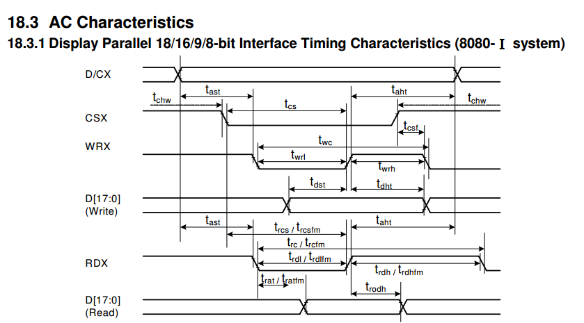

配置好之后，编写ILI6341驱动初始化，读取设备ID。读取ID的命令为0XD3，具体见下图。
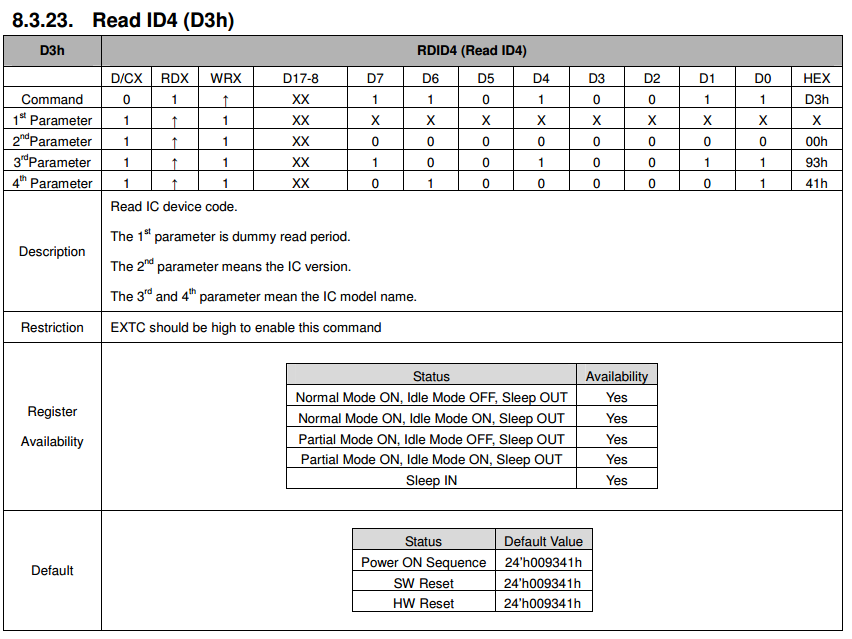

初始化代码如下（只是读ID，不是完整初始化）

```c
u16 *LcdReg = (u16*)0x6C000000;
u16 *LcdData = (u16*)0x6C010000;

s32 dev_ILI9341_init(void)
{
	u16 data;

	//初始化背光控制管脚

	//初始FSMC
	mcu_fsmc_lcd_Init();
	uart_printf("init finish!\r\n");
	//延时50毫秒
	Delay(5);

  /*
  LcdReg = 0x0000;//首先使用命令写入要读的寄存器的地址
	data = *LcdData;//读寄存器
	uart_printf("read reg:%04x\r\n", data);
  */
	*LcdReg = 0x00d3;

	data = *LcdData; //dummy read
	data = *LcdData; //读到 0X00
	data = *LcdData; //读取 93
	data<<=8;
	data |= *LcdData; //读取 41

	uart_printf("read reg:%04x\r\n", data);

	return 0;
}
```

为了方便操作，将命令跟数据地址定义为一个u16指针，初始化为对应的地址。
程序首先初始化FSMC，然后按照D3命令流程进行操作。
将dev_ILI9341_init添加到main函数中，对LCD进行初始化。
下载到硬件后，发现读到的ID是0X00。调试很久，都没能读取ID。
在网上查询，发现一个信息，就是MDK会对程序进行优化，需要增加一些额外的代码。我们先看下是不是程序被优化掉了。
用CMSIS DAP进行调试，在函数加断点。
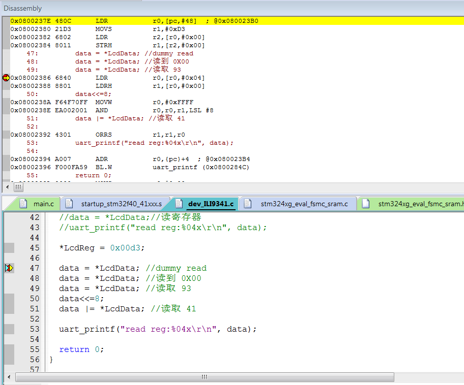
如图，47/48/49三行读数据的代码，编译后被优化成读一次了。编译器估计是想，连续读三次没有意义。
如何防止优化呢？**不需要添加额外代码**，编译器功能是很强大的，只需要在定义指针处，添加**volatile**关键字即可。如下

```
volatile u16 *LcdReg = (u16*)0x6C000000;
volatile u16 *LcdData = (u16*)0x6C010000;
```

编译后使用CMSIS DAP进行调试，查看汇编代码，区别很明显，每次读操作都执行了。
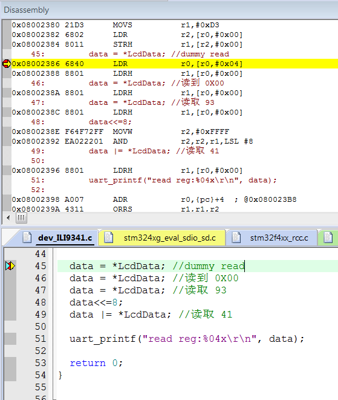
调试信息也可以看到，成功读取到ID
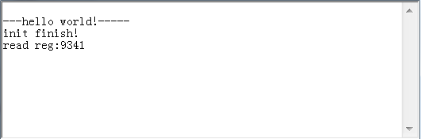
对于TFT LCD与FSMC的调试，在硬件上已经完成。
下一步就是如何实现TFTLCD提供给上一层的功能与接口了。

#### 驱动接口定义
在参考屏厂提供的代码时发现，为了兼容多种驱动IC，他们的代码变得如此混乱。

**我们决定重新设计。**

通过使用**函数指针**的方式，调用不同的驱动IC函数，而不是在一个函数内通过if-else选择不同驱动IC代码。
每个LCD驱动对外接口和功能设计，经讨论，主要提供以下功能:
```c
	s32 (*init)(void);
	s32 (*draw_point)(u16 x, u16 y, u16 color);
	s32 (*color_fill)(u16 sx,u16 ex,u16 sy,u16 ey, u16 color);
	s32 (*fill)(u16 sx,u16 ex,u16 sy,u16 ey,u16 *color);
	s32 (*onoff)(u8 sta);
	s32 (*prepare_display)(u16 sx, u16 ex, u16 sy, u16 ey);
	void (*set_dir)(u8 scan_dir);
	void (*backlight)(u8 sta);
```

>1. 初始化
>2. 画点
>3. 将一个矩形区域显示为同一种颜色。
>4. 将一个区域根据输入的颜色显示，点颜色不一样。
>5. 开关显示
>6. 准备显示区域（摄像头显示需要，其实就是接口4的准备过程）
>7. 设置扫描方向
>8. 背光控制

#### 坐标定义
在开始写显示程序是，我们先要对坐标进行定义。并且将用户跟驱动IC进行统一。
* 用户角度

有横屏竖屏，无论横竖，人眼角度左上角是原点。
坐标使用XY轴概念。例如：
>一个320*240的彩屏，竖屏的时候，X轴就是240短边，Y轴就是320长边。
如果是一个COG12864的黑白屏，默认就是横屏，128长边就是X轴，64短边就是Y轴，如果设置为竖屏，则短边是X轴。

* 驱动IC

没有横屏竖屏的概念，只有扫描方向，也不使用XY轴，而是使用**COLUM**跟**PAGE**（我们简称CP坐标概念）。
不同的扫描方向，不会改变原点位置，也不改变XY方向，只是改变了显示数据的组织顺序。
不同的驱动IC，能设置的扫描方向不一样，同样的扫描方向设置，真正出来的效果也不一样。
**因此每个驱动IC都需要将XY轴转换为自己的CP坐标。**

**所有对外接口提供的是XY轴坐标，驱动内部自行转换。**

* 参数

所有函数都是给人用的，所以坐标使用XY坐标。
按照下面参数顺序：
sx：X轴起始，ex：X轴结束坐标；
sy：Y轴起始，ey：Y轴结束坐标；
例如：
```
s32 drv_ILI9325_color_fill(u16 sx,u16 ex,u16 sy,u16 ey,u16 color)
```
我们定义了一个函数设置屏幕方向：
```
void dev_lcd_setdir(u8 dir, u8 scan_dir)
```
dir就是横屏还是竖屏，scan_dir就是扫描方向。
这个函数名并没有使用驱动IC的关键字，就像前面说的，**横屏还是竖屏不是驱动IC关心的事**。
在这个函数内，根据横屏竖屏对scan_dir进行映射，映射转换之后再设置驱动IC。

#### 显示字符
显示字符函数是从TSLIB移植过来的，只是为了显示基本英文字符。
每个像素对应一个GRAM内存，只要按照字符排列将对应的GRAM设置为对应颜色，就是显示字符了。

#### 液晶识别
很多开发板提供液晶驱动，都是在初始化函数内尝试读ID，根据读到的ID进行**if-else**选择不同驱动IC的初始化。
这样的代码组织非诚不好。
我们的组织方式如下：
```c
s32 dev_lcd_init(void)
{
	s32 ret = -1;

	/*初始化8080接口，包括背光信号*/
	bus_8080interface_init();

	if(ret != 0)
	{
		/*尝试初始化9341*/
		ret = drv_ILI9341_init();
		if(ret == 0)
		{
			LCD.drv = &TftLcdILI9341Drv;//将9341驱动赋值到LCD
			LCD.dir = H_LCD;//默认竖屏
			LCD.height = 320;
			LCD.width = 240;
		}
	}

	#ifdef TFT_LCD_DRIVER_9325
	if(ret != 0)
	{
		/* 尝试初始化9325 */
		ret = drv_ILI9325_init();
		if(ret == 0)
		{
			LCD.drv = &TftLcdILI9325Drv;
			LCD.dir = H_LCD;
			LCD.height = 320;
			LCD.width = 240;
		}
	}
	#endif
	/*设置屏幕方向，扫描方向*/
	dev_lcd_setdir(H_LCD, L2R_U2D);
	LCD.drv->onoff(1);//打开显示
	bus_8080_lcd_bl(1);//打开背光
	LCD.drv->color_fill(0, LCD.width, 0, LCD.height, YELLOW);

	return 0;
}
```
在**LCD初始化函数**中调用**驱动IC初始化函数**，如果返回成功，则说明是这个驱动IC的LCD。
这样的组织方式有什么不一样呢？
1. 有层次，LCD_INIT不知道各个驱动IC是怎么初始化的，只是调用函数。
2. 解耦合，每个驱动IC的初始化，只是识别自己的ID，不与其它驱动IC的代码纠缠在一起。
#### 测试
测试函数如下，LCD的初始化不在测试函数初始化，在main函数中初始化。
```c {.line-numbers}
void dev_lcd_test(void)
{

	while(1)
	{		
		LCD.drv->color_fill(0,LCD.width,0,LCD.height,BLUE);
		Delay(100);
		LCD.drv->color_fill(0,LCD.width/2,0,LCD.height/2,RED);
		Delay(100);
		LCD.drv->color_fill(0,LCD.width/4,0,LCD.height/4,GREEN);
		Delay(100);

		put_string_center (LCD.width/2+50, LCD.height/2+50,
			   "ADCD WUJIQUE !", 0xF800);
		Delay(100);
	}

}
```
到此，LCD调试结束，至于各种花哨的显示，属于应用范畴。
各位可以尝试修改dev_lcd_setdir(H_LCD, L2R_U2D)；看看不同的屏幕方向，不同的扫描方向，都是什么效果。
**要看清扫描方向的区别，请在在fill函数内加延时**
### 总结
1. 本文档除了介绍LCD如何使用，更加希望大家能知道LCD驱动架构如何设计。
2. 本文档对应的代码并不是最完善的代码，只是为了测试硬件。

如果要用于实际项目，请到github或者官网下载最新代码。最新代码兼容了各种LCD。
并且有一套很好的代码架构。
关于LCD驱动设计，同时可以参考我们编写的《LCD驱动应该怎么写？.pdf》

---
end
---
