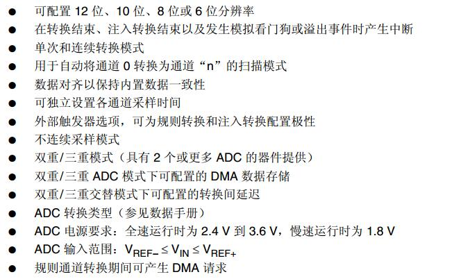
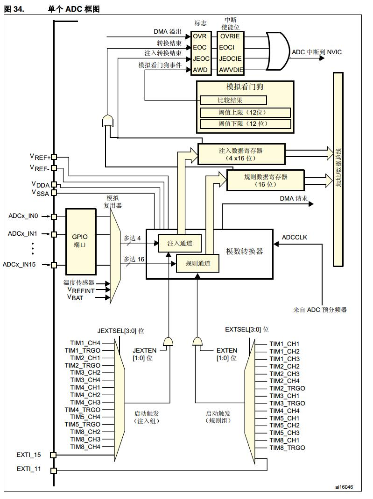
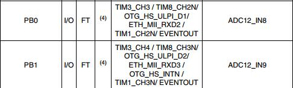
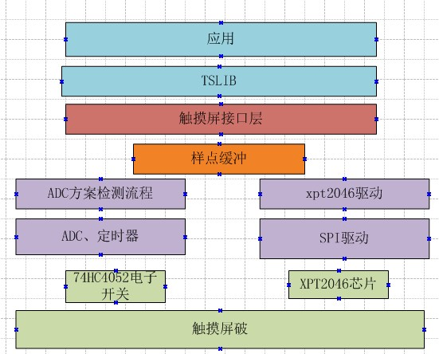
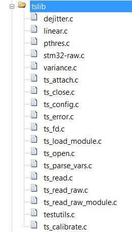
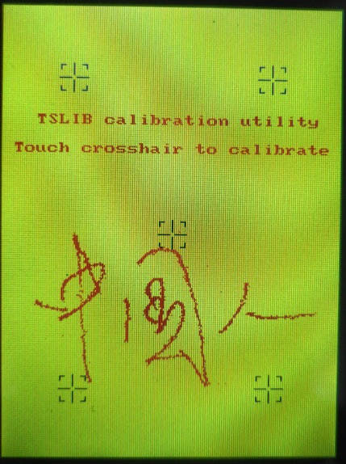

# **ADC-TSLIB-电阻式触摸屏调试**
>**够用的硬件**
>
>**能用的代码**
>
>**实用的教程**
>
>屋脊雀工作室编撰 -20190101
>
>愿景：做一套能用的开源嵌入式驱动（非LINUX）
>
>官网：www.wujique.com
>
>github: https://github.com/wujique/stm32f407
>
>淘宝：https://shop316863092.taobao.com/?spm=2013.1.1000126.2.3a8f4e6eb3rBdf
>
>技术支持邮箱：code@wujique.com、github@wujique.com
>
>资料下载：https://pan.baidu.com/s/12o0Vh4Tv4z_O8qh49JwLjg
>
>QQ群：767214262
---

上一节已经将TFT LCD调通，这块LCD表面带了一块四线电阻式触摸屏。
现在，就让我们来调试触摸功能。
为了能深刻领会触摸屏检测方法，我们这次用内部ADC进行触摸屏检测。
下一节我们再使用XPT2046控制触摸屏。
## ADC
前面我们已经调试了DAC，ADC就是反过来：**将IO口上的电压（模拟信号）转换为数字值**。
同样有参考电压，ADC也有位数（精度）。
百度百科：
>ADC，Analog-to-Digital Converter的缩写，指模/数转换器或者模数转换器。是指将连续变化的模拟信号转换为离散的数字信号的器件。真实世界的模拟信号，例如温度、压力、声音或者图像等，需要转换成更容易储存、处理和发射的数字形式。模/数转换器可以实现这个功能，在各种不同的产品中都可以找到它的身影。
与之相对应的DAC，Digital-to-Analog Converter，它是ADC模数转换的逆向过程

## STM32 ADC
#### 简介
12位ADC是逐次趋近型模数转换器。它具有多达19个复用通道，可测量来自16个外部源、两个内部源和VBAT通道的信号。这些通道的A/D转换可在单次、连续、扫描或不连续采样模式下进行。ADC的结果存储在一个左对齐或右对齐的16位寄存器中。
#### 特性
STM32的ADC功能强大，主要特性如下：

本次我们只会用到最简单的单次转换功能。

#### 框图


从框图可以看出：

1. 有两种触发：注入组、规则组。所谓的注入组，就像中断，可以打断规则组的转换。
2. 支持DMA和中断。
3. 左边输入多达16路。

在屋脊雀STM32F407硬件，使用PB0跟PB1作为ADC转换输入。
**查数据手册可知PB0是ADC12_IN8，PB1是ADC12_IN9**。


## 电阻触摸屏
四线电阻屏部分内容参考网络文章电阻式触摸屏的基本结构和驱动原理，网址
http://article.cechina.cn/2009-03/200937110119.htm

>四线电阻式触摸屏的结构如图1，在玻璃或丙烯酸基板上覆盖有两层透平，均匀导电的ITO层，分别做为X电极和Y电极，它们之间由均匀排列的透明格点分开绝缘。其中下层的ITO与玻璃基板附着，上层的ITO附着在PET薄膜上。X电极和Y电极的正负端由“导电条”（图中黑色条形部分）分别从两端引出，且X电极和Y电极导电条的位置相互垂直。引出端X-，X+，Y-，Y+一共四条线，这就是四线电阻式触摸屏名称的由来。
![触摸屏原理1][1]
当有物体接触触摸屏表面并施以一定的压力时，上层的ITO导电层发生形变与下层ITO发生接触，如下图2：
![触摸屏压原理][2]
该结构可以等效为相应的电路，如图3：
![触摸屏等效电路][3]

我们将图三转化为原理图
![触摸屏等效电路原理图][4]

>1. 在Y+加上VCC，Y-接地，不同的触摸点，R_Y+与R_Y-的分压就不一样，通过X+或者X-，就可以检测出Y轴上的分压值。
>2. 在X+加上VCC，X-接地，不同的触摸点，R_X+与R_X-的分压就不一样，通过Y+或者Y-，就可以检测出X轴上的分压值。
>3. 在X+加上VCC，Y+接地，不同的触摸压力，R_touch阻值不一样，压力越大，阻值越小，通过X-和Y-，就可以检测出R_TOUCH两端的分压值。

通过上面列出三步，我们就可以计算出一次触摸的触摸力度、X坐标、Y坐标。
这就是四线触摸屏的基本原理。
## 方案原理说明
![屋脊雀触摸屏电路][5]
上图为我们使用的LCD上的触摸屏处理电路路。
使用了一片74HC4052“两路四选一模拟开关”作为电子开关，用于切换触摸屏四根线连接到哪里：电压、地、ADC。

>TP-X-、TP-X+、TP-Y-、TP-Y+就是电阻屏的四根线。
ADC-TPX、ADC-TPY则为两个ADC的输入信号。
TP-S0、TP-S1为电子开关选择信号。

74HC4052的逻辑
>在第6脚使能脚为0时,
S1=0, S0=0：AN连到A0，BN连到B0;
S1=0, S0=1：AN连到A1，BN连到B1;
S1=1, S0=0：AN连到A2，BN连到B2;
S1=1, S0=1：AN连到A3，BN连到B3;
使能脚为1，则全部断开。

根据上一节分析的触摸屏原理，要获取触摸信号，我们程序的流程如下：
>1. s1=0，s0=0，这时TP-X-接地，TP-X+接VCC3V3，通过ADC-TPY对TP-Y+上的电压转换，就可以得到X轴上的坐标。
>2. s1=0，s0=1，这时TP-Y-接地，TP-Y+接VCC3V3，通过ADC-TPX对TP-X+上的电压转换，就可以得到Y轴上的坐标。
>3. s1=1，s0=0，这时TP-X-接地，TP-Y-接VCC3V3，通过ADC-TPY对TP-Y+上的电压转换，ADC-TPX对TP-X+上的电压转换，就可以算出R_TOUCH上的压降。因为R_TOUCH较小，为了防止当R_Y-跟R_X-也叫小的时候产生大电流，在VCC3V3跟TP-Y-之间串接了一个10K电阻。

## TsLib
根据上一节的分析，通过ADC我们已经能获取到触摸点的坐标与压力值。但是是否就可以使用触摸屏了呢？
可以非常肯定的说，不行。主要有下面两个问题：
>1. 由于不同的触摸压力，加上触摸屏本身的离散性，ADC得到的坐标会飘，也就是常说的飞点。
>2. 触摸屏与LCD虽然物理上是对应的，触摸坐标与显示坐标之间却不是对应的，**并且不是普通的线性比例关系。**

由于有上面两个原因，**对采样得到的数据进行普通的滤波加权，再按线性比例转换为显示屏坐标，效果会很差。**
很庆幸的是，在开源界有一个叫做tslib的程序
>Tslib是一个开源的程序，能够为触摸屏驱动获得的采样提供诸如滤波、去抖、校准等功能，通常作为触摸屏驱动的适配层，为上层的应用提供了一个统一的接口。

最新的tslib库在github上
https://github.com/kergoth/tslib
由于TSLIB主要是LINUX平台的库，包含了很多LINUX框架代码。对源码我们就不做太多分析。
同时，我们并没有基于最新的库做移植，而是使用更早的1.4版本。1.4源码文件如下。
![TSLIB文件结构][6]
在网络有一篇文章对TSLIB的工作流程做了分析
http://blog.csdn.net/evilcode/article/details/7493704
一些关键信息如下：

>pthres 为Tslib 提供的触摸屏灵敏度门槛插件；
variance 为Tslib 提供的触摸屏滤波算法插件；
dejitter 为Tslib 提供的触摸屏去噪算法插件；
linear 为Tslib 提供的触摸屏坐标变换插件。

>在tslib 中为应用层提供了2 个主要的接口ts_read()和ts_read_raw()，其中ts_read()为正常情况下的接口，ts_read_raw()为校准情况下的接口。

>正常情况下，tslib 对驱动采样到的设备坐标进行处理的一般过程如下：
raw device --> pthres --> variance --> dejitter --> linear --> application

## 驱动程序设计
触摸屏程序架构如下：


1. 蓝色是应用层。主要就是TSLIB库。
2. 褐色是接口封装层，主要功能是将两种不同的驱动方案封装统一接口。
触摸屏接口设计如下：
```c
s32 dev_touchscreen_init(void)
s32 dev_touchscreen_open(void)
s32 dev_touchscreen_close(void)
s32 dev_touchscreen_read(struct ts_sample *samp, int nr)
s32 dev_touchscreen_write(struct ts_sample *samp, int nr)
s32 dev_touchscreen_ioctrl(void)
```
其中dev_touchscreen_read提供给上层使用。TSLIB使用这个接口从缓冲读样点。
dev_touchscreen_write提供给下层使用。触摸检测程序（ADC方案或者XPT2046驱动），检测到样点后用这个函数写到缓冲区。
样点结构体如下，这是tslib中定义的，包含x轴坐标、y轴坐标、压力、时间戳，时间戳我们不用，屏蔽掉。
```c
struct ts_sample //触摸屏一个样点
{
	int		x;
	int		y;
	unsigned int	pressure;
	//struct timeval	tv;//时间，移植到STM32平台，应该不需要
};
```
3. 橙色是样点缓冲，是上层与底层联系。通过使用样点华冲，应用层和驱动层能做到解耦合。
4. 浅紫色就是两种不同方案的驱动代码，他们获取到样点后都填入缓冲。
5. 绿色是硬件。

## 编码调试记录
调试ADC触摸屏检测方案分三步：
1. ADC转换功能。
2. 触摸检测流程。
3. TSLIB（校准和测试）。
#### 调试ADC基本功能
在mcu_dev目录下添加mcu_adc.c和mcu_adc.h。
首先调试ADC，跑通。
>只要ADC转换可以完成，读到数据就可了，数据是否准确，暂时不用处理。

* 初始化

```c {.line-numbers}
void mcu_adc_init(void)
{
    ADC_InitTypeDef ADC_InitStructure;
    ADC_CommonInitTypeDef ADC_CommonInitStructure;
    GPIO_InitTypeDef GPIO_InitStructure;

    RCC_AHB1PeriphClockCmd(RCC_AHB1Periph_GPIOB, ENABLE);//使用GPIOB时钟

    GPIO_InitStructure.GPIO_Pin = GPIO_Pin_0 | GPIO_Pin_1;
    GPIO_InitStructure.GPIO_Mode = GPIO_Mode_AN;//---模拟模式
    GPIO_InitStructure.GPIO_PuPd = GPIO_PuPd_NOPULL;//---不上下拉
    GPIO_Init(GPIOB, &GPIO_InitStructure);//---初始化 GPIO

    RCC_APB2PeriphClockCmd(RCC_APB2Periph_ADC2, ENABLE);//使能ADC 时钟

    ADC_CommonInitStructure.ADC_Mode = ADC_Mode_Independent;//独立模式
    //两个采样阶段之间的延迟 5 个时钟
    ADC_CommonInitStructure.ADC_TwoSamplingDelay = 	ADC_TwoSamplingDelay_20Cycles;
    ADC_CommonInitStructure.ADC_DMAAccessMode = ADC_DMAAccessMode_Disabled; //DMA 失能
    ADC_CommonInitStructure.ADC_Prescaler = ADC_Prescaler_Div8;//预分频 6分频。
    ADC_CommonInit(&ADC_CommonInitStructure);//初始化

    ADC_StructInit(&ADC_InitStructure);
    ADC_InitStructure.ADC_Resolution = ADC_Resolution_12b;//12 位模式
    ADC_InitStructure.ADC_ScanConvMode = DISABLE;//非扫描模式
    ADC_InitStructure.ADC_ContinuousConvMode = DISABLE;//非连续转换
    ADC_InitStructure.ADC_ExternalTrigConvEdge = ADC_ExternalTrigConvEdge_None;//禁止触发检测，使用软件触发
    //本值是触发源，我们已经禁止触发，因此本值无意义
    ADC_InitStructure.ADC_ExternalTrigConv = ADC_ExternalTrigConv_T1_CC1;
    ADC_InitStructure.ADC_DataAlign = ADC_DataAlign_Right;//右对齐
    ADC_InitStructure.ADC_NbrOfConversion = 1;//1 个转换在规则序列中, 也就是说一次转换一个通道
    ADC_Init(ADC2, &ADC_InitStructure);//ADC 初始化

    #ifdef MCU_ADC_IRQ
    NVIC_InitTypeDef NVIC_InitStructure;

    NVIC_InitStructure.NVIC_IRQChannel = ADC_IRQn;
    NVIC_InitStructure.NVIC_IRQChannelPreemptionPriority = 1;//抢占优先级
    NVIC_InitStructure.NVIC_IRQChannelSubPriority = 1;      //响应优先级
    NVIC_InitStructure.NVIC_IRQChannelCmd = ENABLE;
    NVIC_Init(&NVIC_InitStructure);

   ADC_ITConfig(ADC2,  ADC_IT_EOC,  ENABLE);//打开ADC EOC中断
   ADC_ClearFlag(ADC2, ADC_FLAG_EOC);
   #endif

  ADC_Cmd(ADC2, ENABLE);
}
/**
```
初始化分4部分：
1. 7到12行，初始化IO，将对应的IO配置为ADC功能。
2. 14到21行，ADC通用配置
3. 23到32行，ADC转换配置。
4. 34到45行，如果使用中断，就配置中断。

* 转换（查询方式）

第10行设置转换通道组。
第11行启动转换，在while内查询标志，ADC_FLAG_EOC标志置位就说明转换结束了。
54行调用ADC_GetConversionValue函数读取转换结果。
```c {.line-numbers}
u16 mcu_adc_get_conv(u8 ch)
{
	u16 adcvalue;
	FlagStatus ret;

	//设置指定 ADC 的规则组通道，一个序列，采样时间
	MCU_ADC_DEBUG(LOG_DEBUG, "str--");
	ADC_ClearFlag(ADC2, ADC_FLAG_OVR);

	ADC_RegularChannelConfig(ADC2, ch, 1, ADC_SampleTime_480Cycles );
	ADC_SoftwareStartConv(ADC2); 	//使能指定的 ADC 的软件转换启动功能

	while(1)//等待转换结束
	{
		ret = ADC_GetFlagStatus(ADC2, ADC_FLAG_EOC);
		if(ret == SET)
		{
			MCU_ADC_DEBUG(LOG_DEBUG, "ADC_FLAG_EOC\r\n");
			break;
		}
		ret = ADC_GetFlagStatus(ADC2, ADC_FLAG_AWD);
		if(ret == SET)
		{
			MCU_ADC_DEBUG(LOG_DEBUG, "ADC_FLAG_AWD\r\n");

		}
		ret = ADC_GetFlagStatus(ADC2, ADC_FLAG_JEOC);
		if(ret == SET)
		{
			MCU_ADC_DEBUG(LOG_DEBUG, "ADC_FLAG_JEOC\r\n");

		}
		ret = ADC_GetFlagStatus(ADC2, ADC_FLAG_JSTRT);
		if(ret == SET)
		{
			MCU_ADC_DEBUG(LOG_DEBUG, "ADC_FLAG_JSTRT\r\n");

		}

		ret = ADC_GetFlagStatus(ADC2, ADC_FLAG_STRT);
		if(ret == SET)
		{
			MCU_ADC_DEBUG(LOG_DEBUG, "ADC_FLAG_STRT\r\n");

		}

		ret = ADC_GetFlagStatus(ADC2, ADC_FLAG_OVR);
		if(ret == SET)
		{
			MCU_ADC_DEBUG(LOG_DEBUG, "ADC_FLAG_OVR\r\n");

		}
	}
	adcvalue = ADC_GetConversionValue(ADC2);
	return adcvalue;
}
```
* 转换（中断模式）

分两部分：启动转换、中断服务。
启动如下，其实也就是查询模式一样。
```c {.line-numbers}
s32 mcu_adc_start_conv(u8 ch)
{
	ADC_RegularChannelConfig(ADC2, ch, 1, ADC_SampleTime_480Cycles );
	ADC_SoftwareStartConv(ADC2); 	//使能指定的 ADC 的软件转换启动功能
	return 0;
}
```
中断服务，其实跟查询模式while循环一样。
```c {.line-numbers}
void mcu_adc_IRQhandler(void)
{
	volatile u16 adc_value;
	FlagStatus ret;
	ITStatus itret;

	itret = ADC_GetITStatus(ADC2, ADC_IT_EOC);
	if( itret == SET)
    {    

		ret = ADC_GetFlagStatus(ADC2, ADC_FLAG_EOC);
		if(ret == SET)
		{
			//uart_printf("ADC_FLAG_EOC t\r\n");
			adc_value = ADC_GetConversionValue(ADC2);
			MCU_ADC_DEBUG(LOG_DEBUG, "-%d ", adc_value);
			//dev_ts_adc_task(adc_value);

		}

		ret = ADC_GetFlagStatus(ADC2, ADC_FLAG_AWD);
		if(ret == SET)
		{
			MCU_ADC_DEBUG(LOG_DEBUG, "ADC_FLAG_AWD t\r\n");

		}
		ret = ADC_GetFlagStatus(ADC2, ADC_FLAG_JEOC);
		if(ret == SET)
		{
			MCU_ADC_DEBUG(LOG_DEBUG, "ADC_FLAG_JEOC t\r\n");

		}
		ret = ADC_GetFlagStatus(ADC2, ADC_FLAG_JSTRT);
		if(ret == SET)
		{
			MCU_ADC_DEBUG(LOG_DEBUG, "ADC_FLAG_JSTRT t\r\n");

		}

		ret = ADC_GetFlagStatus(ADC2, ADC_FLAG_STRT);
		if(ret == SET)
		{
			//uart_printf("ADC_FLAG_STRT t\r\n");

		}

		ret = ADC_GetFlagStatus(ADC2, ADC_FLAG_OVR);
		if(ret == SET)
		{
			MCU_ADC_DEBUG(LOG_DEBUG, "ADC_FLAG_OVR t\r\n");
			ADC_ClearFlag(ADC2, ADC_FLAG_OVR);
		}

		ADC_ClearITPendingBit(ADC2, ADC_IT_EOC);
    }
}
```
从上可以看出，其实中断模式就是将查询模式拆成两部分。
中断服务要在stm32f4xx_it.c中调用。
```c
void ADC_IRQHandler(void)
{
	mcu_adc_IRQhandler();
}
```
* 测试程序

测试程序，支持查询和中断模式，通过宏MCU_ADC_IRQ控制。
```c {.line-numbers}
s32 mcu_adc_test(void)
{
	mcu_adc_init();

#ifndef MCU_ADC_IRQ/*查询模式*/
	u16 adc_value;

	wjq_log(LOG_FUN, "mcu_adc_test check\r\n");

	while(1)
	{
		adc_value = mcu_adc_get_conv(ADC_Channel_8);

		wjq_log(LOG_FUN, "ADC_Channel_8:%d\r\n", adc_value);
		Delay(1000);

		adc_value = mcu_adc_get_conv(ADC_Channel_9);
		wjq_log(LOG_FUN, "ADC_Channel_9:%d\r\n", adc_value);
		Delay(1000);
	}
#else/*中断模式*/
	wjq_log(LOG_FUN, "mcu_adc_test int\r\n");

	while(1)
	{		
		wjq_log(LOG_FUN, "r ");
		mcu_adc_start_conv(ADC_Channel_8);
		Delay(1000);
		wjq_log(LOG_FUN, "d ");
		mcu_adc_start_conv(ADC_Channel_9);
		Delay(1000);
	}

#endif
}
```
在main函数中调用就可以测试了。
* 测试结果

ADC是12位的，只要转换结果在0-4096范围内，ADC工作就是正常的。
>mcu_adc_test int
r 3403 d 1482 r 3401 d 3755 r 3399 d 3754 r 1794 d 3752 r 1814 d 3760 r 2752 d 3758 r 3407 d 2440 r 3398 d 2389 r 3405 d 1719 r 2462 d 2696 r 3398 d 1614 r 3402 d 2227 r 3399 d 1593 r 3395

#### 调试触摸屏检测流程

在board_dev目录增加触摸屏驱动文件dev_touchscreen.c和dev_touchscreen.h。代码根据前面分析的触摸屏检测流程实现。

* 74HC4052硬件测试

首先使用ADC查询模式测试，验证电路切换功能是否正常。
先检测触摸屏压力
>用笔压触摸屏，检测到电压变化。理论上，在Y+上检测到的电压应该大于等于X+上的电压。
当压触摸屏时，Y+将变小，但是不会小于X+。压力越大，越靠近X+。

再调试X轴的检测
>如果没有触摸，检测到一个不准确的值。当有触摸时，电压值与触摸位置基本成线性关系。因此算法上必须要先判断压力，再检测坐标。

再调试Y轴的检测
>与X轴类似

以上三步调通后，开始调试整个流程，并且要加快采样速度。
三步都调通的测试代码如下：
```c
s32 dev_touchscreen_test(void)
{
	u16 adc_x_value;
	u16 adc_y_value;
	u16 pre;//压力差

	dev_touchscreen_init();
	dev_touchscreen_open();

	while(1)
	{
		Delay(1000);
		/*  检测压力 */
		DEV_TP_PRESS_SCAN;
		adc_y_value = mcu_adc_get_conv(ADC_Channel_9);
		adc_x_value = mcu_adc_get_conv(ADC_Channel_8);
		pre = adc_y_value-adc_x_value;
		TS_DEBUG(LOG_FUN,"touch pre:%d, %d, %d\r\n",
		            adc_x_value, adc_y_value, pre);


		if(adc_x_value + 200 > adc_y_value)//200为测试阀门，实际中要调试
		{
			/* 检测X轴*/
			DEV_TP_SCAN_X;
			adc_x_value = mcu_adc_get_conv(ADC_Channel_9);
			//uart_printf("ADC_Channel_8:%d\r\n", adc_x_value);

			/* 检测Y轴*/
			DEV_TP_SCAN_Y;
			adc_y_value = mcu_adc_get_conv(ADC_Channel_8);
			//uart_printf("ADC_Channel_8:%d\r\n", adc_y_value);

			TS_DEBUG(LOG_FUN,"----------get a touch:%d, %d, %d\r\n",
			          adc_x_value, adc_y_value, pre);

		}
}
```
调试信息如下，可以看出X+的电压基本接近0，在没触摸时，Y+跟X+的差距非常大。
>touch pre:69, 221, 152
----------get a touch:1738, 2193, 152
touch pre:59, 223, 164
----------get a touch:1741, 2191, 164
touch pre:61, 229, 168
----------get a touch:1741, 2188, 168
touch pre:2, 4064, 4062
touch pre:9, 4065, 4056
touch pre:2, 4071, 4069
touch pre:9, 4068, 4059

#### 使用中断方式检测触摸屏
使用ADC终端的触屏检测流程如下：
>开一个定时器，10-50毫秒启动一次触摸屏压力检测。
ADC结果在ADC中断中处理，如果检测到压下，则启动坐标检测。
采样得到的样点写入样点缓冲。并且连续检测。
因为用最快速度画过触摸屏，大约只需要50毫秒，50毫秒/320个点，一个点才150us。
因此有触摸时，连续转换。为了节省系统开销，只好用ADC中断。

修改Touchscreen驱动，编写使用ADC中断的转换流程。
创建了一个TASK函数，在函数中处理ADC转换的各个步骤。这个函数在ADC中断中调用，每当采样到一个样点，就传入触摸屏处理流程。
```c
void mcu_adc_IRQhandler(void)
{
	volatile u16 adc_value;
	FlagStatus ret;
	ITStatus itret;

	itret = ADC_GetITStatus(ADC2, ADC_IT_EOC);
	if( itret == SET)
	{    

		ret = ADC_GetFlagStatus(ADC2, ADC_FLAG_EOC);
		if(ret == SET)
		{
			//uart_printf("ADC_FLAG_EOC t\r\n");
			adc_value = ADC_GetConversionValue(ADC2);
			MCU_ADC_DEBUG(LOG_DEBUG, "%d ", adc_value);

			dev_ts_adc_task(adc_value);

		}
```
在这个流程中，有一个地方比较关键，也就是压力的判断，压力差小于250，算下笔，压力差大于2000，算起笔，200到2000，是一个过渡，会抖动，丢弃。当然，250跟2000是假设，具体根据硬件调试情况配置。

然后修改dev_touchscreen_test函数如下，在main中调用。
```c
	struct ts_sample s;
	s32 ret;
	u8 pensta = 1;//没接触

	dev_touchscreen_init();
	dev_touchscreen_open();

	while(1)
	{
		ret = dev_touchscreen_read(&s,1);
		if(ret == 1)
		{
			if(s.pressure != 0 && pensta == 1)
			{
				pensta = 0;
				wjq_log(LOG_FUN, "pen down\r\n");
				wjq_log(LOG_FUN, ">%d %d %d-\r\n", s.pressure, s.x, s.y);
			}
			else if(s.pressure == 0 && pensta == 0)
			{
				pensta = 1;
				wjq_log(LOG_FUN, "\r\n--------pen up--------\r\n");

			}
		}
	}
```
运行测试程序后，触摸四个角的样点分别如下：
左上角
>pen down
>34 870 679-
--------pen up--------

左下角
>pen down
>117 857 3375-
--------pen up--------

右下角
>pen down
>146 3234 3369-
--------pen up--------

右上角
>pen down
>50 2991 709-
--------pen up--------

从数据可以看出，坐标基本符合方向。
* TASK函数说明
整个代码最重要的函数就是s32 dev_ts_adc_task(u16 dac_value)，这个函数由ADC中断调用，实现完整的触摸屏检测。
```c {.line-numbers}
s32 dev_ts_adc_task(u16 dac_value)
{
	static u16 pre_y, pre_x;
	static u16 sample_x;
	static u8 pendownup = 1;
	struct ts_sample tss;

	if(TsAdcGd != 0)
		return -1;

	if(TouchScreenStep == 0)//压力检测第一步ADC转换结束
	{
		pre_y = dac_value;
		TouchScreenStep	= 1;
		mcu_adc_start_conv(ADC_Channel_8);
	}
	else if(TouchScreenStep == 1)
	{
		pre_x = dac_value;
		//TS_DEBUG(LOG_DEBUG, "--press :%d %d\r\n", pre_y, pre_x);

		if(pre_x + DEV_TP_PENDOWN_GATE > pre_y)
		{
			TouchScreenStep	= 2;
			DEV_TP_SCAN_X;
			mcu_tim7_start(2);
		}
		else if(pre_x + DEV_TP_PENUP_GATE < pre_y)
		{//没压力，不进行XY轴检测
			/* 起笔只上送一点缓冲*/
			if(pendownup == 0)
			{
				pendownup = 1;
				tss.pressure = 0;//压力要搞清楚怎么计算
				tss.x = 0xffff;
				tss.y = 0xffff;
				dev_touchscreen_write(&tss,1);

			}
			TouchScreenStep	= 0;

			DEV_TP_PRESS_SCAN;
			//打开一个定时器，定时时间到了才进行压力检测
			mcu_tim7_start(100);
		}
		else
		{
			/*上下笔的过渡，丢弃*/
			TouchScreenStep	= 0;

			DEV_TP_PRESS_SCAN;

			mcu_tim7_start(20);
		}
	}
	else if(TouchScreenStep == 2)
	{
		sample_x =  dac_value;

		TouchScreenStep	= 3;
		DEV_TP_SCAN_Y;
		mcu_tim7_start(2);
	}
	else if(TouchScreenStep == 3)//一轮结束，重启启动压力检测
	{
		//压力要搞清楚怎么计算
		tss.pressure = DEV_TP_PENDOWN_GATE-(pre_y - pre_x);
		tss.x = sample_x;
		tss.y = dac_value;
		dev_touchscreen_write(&tss,1);
		//TS_DEBUG(LOG_DEBUG, "tp :%d, %d, %d\r\n",
		//     tss.pressure, tss.x, tss.y);
		pendownup = 0;

		TouchScreenStep	= 0;
		DEV_TP_PRESS_SCAN;
		mcu_tim7_start(2);
	}
	else//异常，启动压力检测
	{
		TouchScreenStep	= 0;
		DEV_TP_PRESS_SCAN;
		mcu_tim7_start(100);
	}

	return 0;
}
```
1. 函数流程根据触摸屏检测流程分步骤执行，整个大流程是循环模式。
2. 11到16行为第0步，读取Y轴电压，然后启动X轴ADC检测。*这一步其实属于第1步，前面有一步启动压力检测，并开始检测Y轴电压。*
3. 17到55行，第1步，这一步比较复杂。读到X轴电压后，进行压力判断。
22行到27行，压下，启动X轴坐标检测。
28到44行，松开，上送一点起笔，重新配置到压力检测，也就是第0步。
46到54行，压力过渡区，重新配置到压力检测，也就是第0步。
4. 56到63行，读X轴坐标转换结果，配置为Y轴坐标检测。
5. 64到75，读取Y轴坐标转换结果，写入缓冲，重新配置到压力检测，也就是第0步。
6. 77到82，处理异常。
>这段代码跟前面原理分析一致，大家好好体会整个处理过程。

#### 与TSLIB联合

stm32-raw.c是tslib跟dev_touchscreen.c的接口文件。
ts_input_read函数调用dev_touchscreen_read函数读取样点。

```c
static int ts_input_read(struct tslib_module_info *inf,
			 struct ts_sample *samp, int nr)
{
	struct tslib_input *i = (struct tslib_input *)inf;
	struct tsdev *ts = inf->dev;
	int ret = nr;

	//uart_printf(" ts input read\r\n");
	ret = dev_touchscreen_read(samp, nr);
	#if 0
	if((samp->pressure != 0) && (ret == nr))
	{
		uart_printf("stm32 raw:%d, %d, %d\r\n", samp->pressure, samp->x, samp->y);
	}
	#endif

	return ret;
}
```
要分析tslib，可以从ts_config.c入手。
由于TSIB比较复杂，后续有一个文档专门解释tslib。
在此，直接提供源码，不做解释。
测试函数如下：
```c
/* Infinite loop */
	mcu_uart_open(3);
	wjq_log(LOG_INFO, "hello word!\r\n");
	mcu_i2c_init();
	mcu_spi_init();
	dev_key_init();
	//mcu_timer_init();
	dev_buzzer_init();
	dev_tea5767_init();
	dev_dacsound_init();
	dev_spiflash_init();
	dev_wm8978_init();
	dev_lcd_init();

	//dev_dacsound_open();
	dev_key_open();
	//dev_wm8978_open();
	//dev_tea5767_open();
	//dev_tea5767_setfre(105700);

	#if 0
	mcu_adc_test();
	#endif

	#if 0
	dev_touchscreen_test();
	#endif

	#if 1
	dev_touchscreen_init();
	dev_touchscreen_open();
	ts_calibrate();
	ts_calibrate_test();
	#endif
	while (1)
	{
```

1. dev_touchscreen_init初始化。
2. dev_touchscreen_open打开设备
3. ts_calibrate 校准
4. ts_calibrate_test测试。

测试效果如图：

线条还算流畅。
## 总结
1. 测试中触摸屏还是出现飞点，请分析解决。
2. 触摸屏驱动如何提供接口给APP使用？也就是TSLIB要提供什么接口？

---
end
---

[1]: pic/1.png
[2]: pic/2.png
[3]: pic/3.png
[4]: pic/4.png
[5]: pic/5.png
[6]: pic/6.png
