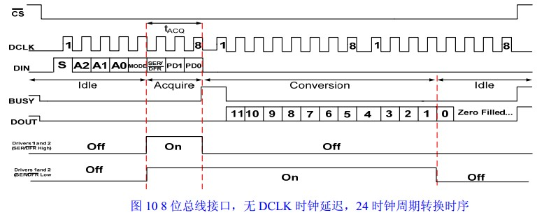
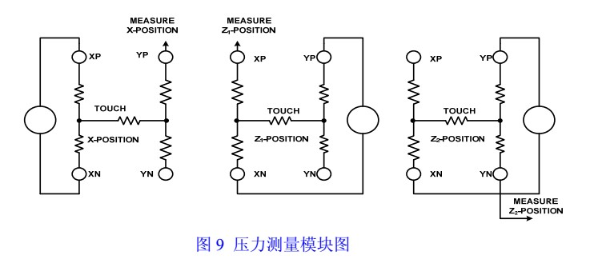
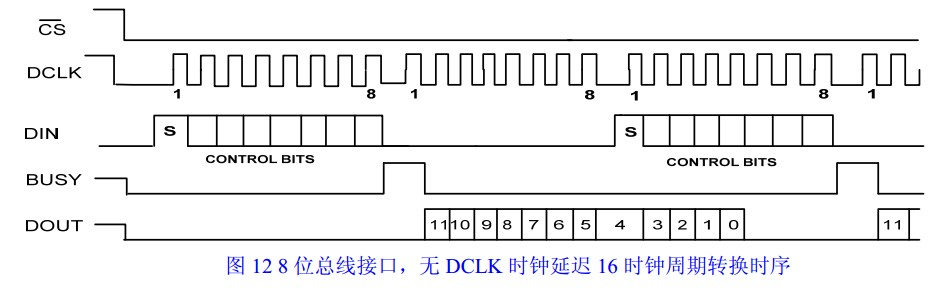
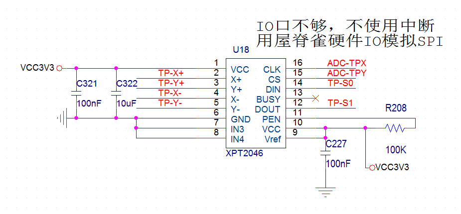
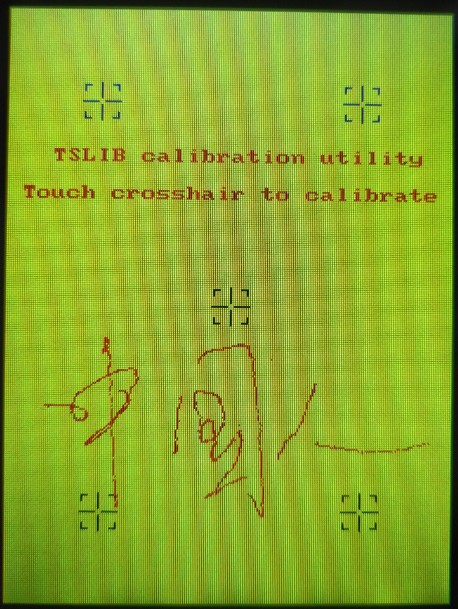

# **模拟SPI-XPT2046-电阻式触摸屏调试**
>**够用的硬件**
>
>**能用的代码**
>
>**实用的教程**
>
>屋脊雀工作室编撰 -20190101
>
>愿景：做一套能用的开源嵌入式驱动（非LINUX）
>
>官网：www.wujique.com
>
>github: https://github.com/wujique/stm32f407
>
>淘宝：https://shop316863092.taobao.com/?spm=2013.1.1000126.2.3a8f4e6eb3rBdf
>
>技术支持邮箱：code@wujique.com、github@wujique.com
>
>资料下载：https://pan.baidu.com/s/12o0Vh4Tv4z_O8qh49JwLjg
>
>QQ群：767214262
---

上一节我们调试了触摸屏，用的是STM32内置ADC方案。
现在就让我们调试常见的XPT2046方案。

## XPT2046
XPT2046是什么？很多朋友可能认为XPT2046是一个触摸屏检测IC，这不是很准确。
XPT2046是一个ADC转换芯片，支持4线电阻屏的AD转换。**它并没有实现电阻屏检测流程。**
>XPT2046 是一款 4 导线制触摸屏控制器，内含 12 位分辨率 125KHz转换速率逐步逼近型 A/D 转换器。XPT2046支持从 1.5V 到 5.25V 的低电压 I/O 接口。XPT2046 能通过执行两次 A/D 转换查出被按的屏幕位置， 除此之外，还可以测量加在触摸屏上的压力。内部自带 2.5V参考电压可以作为辅助输入、温度测量和电池监测模式之用，电池监测的电压范围可以从 0V 到 6V。XPT2046片内集成有一个温度传感器。

* 工作原理

我们直接从数字接口时序看其工作原理：

DIN是输入数据，首先发送一个字节到XPT2046，这个字节叫命令字：

>bit7：S，启动标志，固定为1
bit6-bit4：A2/A1/A0,通道选择，差分模式跟单端不一样，差分模式如下：
>* 001，测Y轴
011，测Z1
100，测Z2
	101，测X轴		

>bit3 ：MODE,1 =8位ADC，0 =12位ADC
>bit2：SEF/DFR，单端模式还是差分模式，XY轴跟压力可以用差分，最好用差分；其他功能只能用单端模式。
	bit1-bit0：PD1/PD0, 工作模式： 11，总是处于供电状态；00，在变换之间进入低功耗

发送完命令字后，XPT2046开始转换，BUSY管脚变高。
当BUSY管脚变低时，XPT2046转换结束。
通过DOUT读数据，转换数据是12位（位数可设置，我们用12位）。
分两字节读取，第一字节返回BIT11-BIT5，也就是说，第1字节低7位有效，最高位无效。第二字节返回BIT4-BIT0，高5位有效，低3位无效。
下图是XPT2046压力测试原理，可见Z1，Z2测试位置跟我们用内置ADC的原理一样。

按照上节说的触摸屏转换原理。使用XPT2046的转换流程就是：

>测Z2通道, 测试压力Y轴电压。
>测Z1通道, 测试压力X轴电压。
>测X通道, 测试位置X轴电压。
>测Y通道, 测试位置Y轴电压。

为了加快转换数据读取速度，XPT2046提供了其他通信时序。

与前面时序的区别就是：在读最后一个字节数据时，启动下一次转换。
需要注意的是，**读第一个字节时必须发送0X00，不能发送其他数据**。

## 硬件原理
用XPT2046方案的LCD，接口跟用ADC方案的一样。
下图是XPT2046原理图，电阻屏四根线接到2、3、4、5管脚。
SPI 时钟CLD接到原来的ADC-TPX脚，
SPI 片选接到ADC-TPY,
SPI DIN接到TP-SO,
SPI DOUT接到TP-SI。
这四个管脚不是硬件SPI控制器的管脚，需要用IO模拟实现SPI功能。


## 驱动架构设计
整体架构上一节已经说明。
驱动的大概流程就是：
>启动定时器，定时时间为1ms。
在定时中断内用VSPI接口控制XPT2406转换，并读取数据。
对数据按照ADC同样的方法处理。
识别到样点就填入缓冲。

#### 模拟SPI（VSPI）设计
用STM32内置SPI控制器的SPI驱动我们已经完成。
模拟SPI就按照硬件控制器的接口实现。
* 接口（与硬件SPI统一）
VSPI也是SPI，接口当然跟SPI一样
```c
static s32 mcu_vspi_init(void)
static s32 mcu_vspi_open(SPI_DEV dev, SPI_MODE mode, u16 pre)
static s32 mcu_vspi_close(SPI_DEV dev)
static s32 mcu_vspi_transfer(SPI_DEV dev, u8 *snd, u8 *rsv, s32 len)
static s32 mcu_vspi_cs(SPI_DEV dev, u8 sta)
```
同时将原来的硬件SPI控制器接口函数加上h标志，例如：
```c
static s32 mcu_hspi_init(void);
```

对于上层来说，模拟SPI还是硬件SPI，都是SPI，因此原来的接口就是统一对外接口，在接口内通过判断，决定调用VSPI接口还是HSPI接口。例如：
```c
s32 mcu_spi_open(SPI_DEV dev, SPI_MODE mode, u16 pre)
```

* 多个VSPI的统一

后续我们的外扩IO口可能会接SPI设备，也是需要用IO口模拟SPI的。
前面我们说过驱动和设备的关系。**多个VSPI设备肯定只用一套VSPI代码**。
为了实现这个目的，我们定义了VSPI设备对象，如下：
```c
typedef struct
{
	char *name;
	SPI_DEV dev;
	s32 gd;

	u32 clkrcc;
	GPIO_TypeDef *clkport;
	u16 clkpin;

	u32 mosircc;
	GPIO_TypeDef *mosiport;
	u16 mosipin;

	u32 misorcc;
	GPIO_TypeDef *misoport;
	u16 misopin;

	u32 csrcc;
	GPIO_TypeDef *csport;
	u16 cspin;
}DevVspiIO;
```
当要使用一个VSPI设备时，只需要定义一个设备实体，并添加到VPSI列表即可：
```c
DevVspiIO DevVspi1IO={
		"VSPI1",
		DEV_VSPI_1,
		-2,//未初始化

		VSPI1_RCC,
		VSPI1_CLK_PORT,
		VSPI1_CLK_PIN,

		VSPI1_RCC2,
		VSPI1_MOSI_PORT,
		VSPI1_MOSI_PIN,

		VSPI1_RCC2,
		VSPI1_MISO_PORT,
		VSPI1_MISO_PIN,

		VSPI1_RCC,
		VSPI1_CS_PORT,
		VSPI1_CS_PIN,
	};

/*无用的虚拟SPI设备，占位用*/		
DevVspiIO DevVspiNULL={
		"VSPI0",
		DEV_VSPI_0,
		-2,//未初始化;
		};

DevVspiIO *DevVspiIOList[]={
	&DevVspiNULL,

	#ifdef SYS_USE_VSPI1
	&DevVspi1IO,
	#endif

	};
```
如上，DevVspi1IO就是我们定义的VSPI1设备，然后添加到DevVspiIOList数组。
以后就可以通过mcu_spi_open等spi接口操作这个VSPI设备了。

* VSPI实现

VSPI的代码就请看源码，不累述。
#### 定时器改造
XPT2046需要定时转换，跟ADC使用定时器一样，也使用定时器7。
但是在ADC中，定时器执行一次就停止了，下一次由TASK启动。
XPT需要连续启动。
我们改造定时器7的代码，让它能用于这两种情况。
```c
s32 mcu_tim7_start(u32 Delay_10us, void (*callback)(void), u8 type)
。。。
/**
 *@brief:      mcu_tim6_IRQhandler
 *@details:    定时器中断处理函数
 *@param[in]   void  
 *@param[out]  无
 *@retval:     
 */
void mcu_tim7_IRQhandler(void)
{
    if(TIM_GetITStatus(TpTim, TIM_FLAG_Update) == SET)
    {                                       
        TIM_ClearFlag(TpTim, TIM_FLAG_Update);
		if(Tim7Type == 1)
			TIM_Cmd(TpTim, DISABLE);//停止定时器

		Tim7Callback();

    }
}
```
在mcu_tim7_start函数增加两个参数：
>callback：中断服务程序回调，当定时器中断发生时，就执行这个callback函数。
type：类型，是一次还是重复。

mcu_tim7_IRQhandler同步改造。
原来ADC方案用到mcu_tim7_start的地方也同步改造。

#### XTP2046驱动说明

只有一个关键函数dev_xpt2046_task，
```c {.line-numbers}
void dev_xpt2046_task(void)
{

	static u16 pre_y, pre_x;
	static u16 sample_y, sample_x;

	static u8 pendownup = 1;
	struct ts_sample tss;

	u8 stmp[4];
	u8 rtmp[4];

	if(DevXpt2046Gd != 0)
		return;
	/*

	整个流程分四步
	读Z1,Z2，用于计算压力
	读X,Y轴，用于计算坐标

	1 使用了快速16CLK操作法，过程100us左右。
	经测试，中间不需要延时。
	2 没有使用下笔中断，通过压力判断是否下笔。但是有点疑惑，理论上接触电阻应该很小的，
	 用ADC方案，正常，用XPT2046方案，感觉接触电阻比较大，不知道是哪里没有理解对。

	3 快速CLK操作，也就是在读最后一个字节的时候同时发送下一个转换命令。
	一定要第一个字节发送0X00，第二个字节发送命令。如果第一个字节不是00，而且正好BIT7是1，
	芯片会重新启动转换，读回来的电压值就都不对了。

	4 实测，不需要延时，如果你的SPI时钟较快，请注意延时等待转换结束。
	5 理论上还可以节省一个字节的发送时间，请自行优化。
	*/

	/*------------------------*/

	stmp[0] = XPT2046_CMD_Z2;
	mcu_spi_transfer(XPT2046_SPI, stmp, NULL, 1);
	//vspi_delay(100);
	stmp[0] = 0x00;
	stmp[1] = XPT2046_CMD_Z1;
	mcu_spi_transfer(XPT2046_SPI, stmp, rtmp, 2);
	pre_y = ((u16)(rtmp[0]&0x7f)<<5) + (rtmp[1]>>3);
	/*------------------------*/
	//vspi_delay(100);
	stmp[0] = 0x00;
	stmp[1] = XPT2046_CMD_X;
	mcu_spi_transfer(XPT2046_SPI, stmp, rtmp, 2);
	pre_x = ((u16)(rtmp[0]&0x7f)<<5) + (rtmp[1]>>3);
	/*------------------------*/
	//vspi_delay(100);
	stmp[0] = 0x00;
	stmp[1] = XPT2046_CMD_Y;
	mcu_spi_transfer(XPT2046_SPI, stmp, rtmp, 2);
	sample_x = ((u16)(rtmp[0]&0x7f)<<5) + (rtmp[1]>>3);
	/*------------------------*/
	//vspi_delay(100);
	stmp[0] = 0x00;
	stmp[1] = 0X00;
	mcu_spi_transfer(XPT2046_SPI, stmp, rtmp, 2);
	sample_y = ((u16)(rtmp[0]&0x7f)<<5) + (rtmp[1]>>3);

	/*
		算压力
		简化算法
		实际：
		R触摸电阻=Rx面板*（X位置/4096）*(Z2/Z1-1)
	*/
	if(pre_x +  DEV_XPT2046_PENDOWN_GATE > pre_y)
	{
		/*有压力*/
		tss.pressure = 200;//DEV_XPT2046_PENDOWN_GATE - rpress;
		tss.x = sample_x;
		tss.y = sample_y;
		dev_touchscreen_write(&tss,1);
		//uart_printf("%d,%d,%d\r\n", tss.pressure, tss.x, tss.y);
		pendownup = 0;
	}
	else if(pre_x + DEV_XPT2046_PENUP_GATE < pre_y)//没压力，不进行XY轴检测
	{
		/* 起笔只上送一点缓冲*/
		if(pendownup == 0)
		{
			pendownup = 1;
			tss.pressure = 0;//压力要搞清楚怎么计算
			tss.x = 0xffff;
			tss.y = 0xffff;
			dev_touchscreen_write(&tss,1);
		}

	}
	else
	{
		//uart_printf("--press :%d %d\r\n", pre_y, pre_x);
		/*上下笔的过渡，丢弃*/

	}

}
```
1. 36到60行，读取压力跟坐标值。在ADC方案中，这些电压值通过多步读取，XPT2046就直接一次性读取了。**如果想优化性能，减少没有触摸时读数据时间，可以按照ADC方案，判断到压力后再读取坐标。**
2. 68行之后的就跟ADC方案类似了，判断压力的三个状态，进行分别数据处理。

#### XPT2046跟ADC方案的兼容
修改下面三个接口函数，通过宏控制使用ADC方案还是XPT2046方案。具体修改见代码。
```c
/*
	触摸屏方案选择
*/
//#define SYS_USE_TS_ADC_CASE
#define SYS_USE_TS_IC_CASE

extern s32 dev_touchscreen_init(void);
extern s32 dev_touchscreen_open(void);
extern s32 dev_touchscreen_close(void);
```
#### 测试
测试程序跟上一节一样，测试效果如下图，跟ADC测试效果是有差别的：**线条细，飞点少。**
原因有两个：
>一是ADC采样率更高，同样时间得到的样点比XPT2046多，毕竟XPT2046是1毫秒采样一个样点。
二是内置的ADC稳定性我们还没有处理，或者是我们的电子开关电路没调试好。

但是并不是说XPT2046效果就比ADC好，当快速划线时，由于XPT2046采样率只有1K，会出现断线。
可以通过加快采样率，或者是在应用层软件连线解决。

## 总结
了解触摸屏原理后，使用XTP2046做触摸检测并不复杂。
通过本章节，我们初步了解了同一个功能使用两种方案应该如何设计驱动程序。

---
end
---
