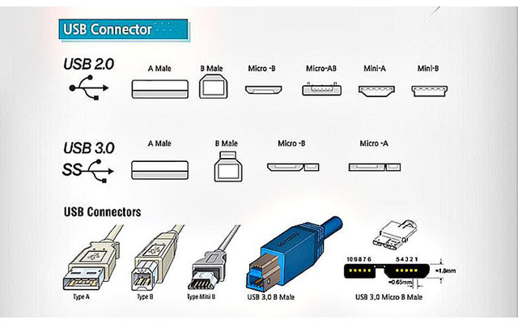
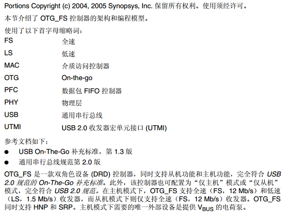
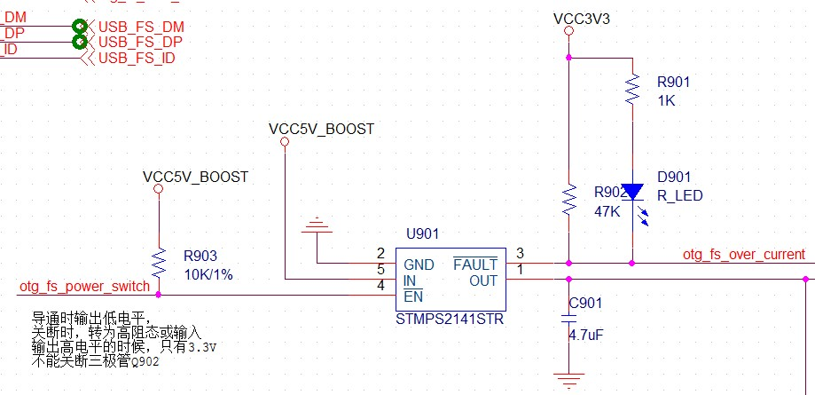
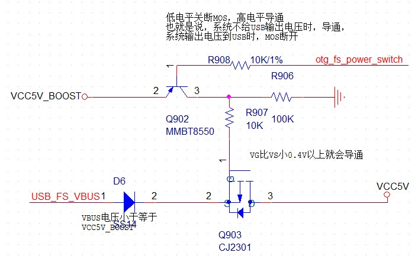
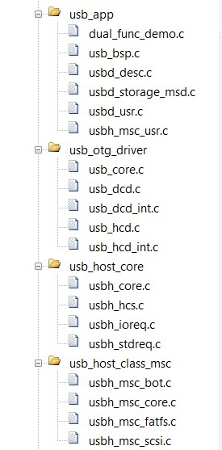
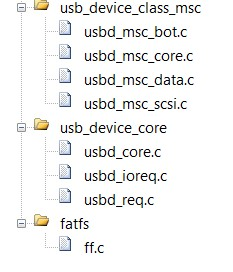

# **USB 调试记录**
>**够用的硬件**
**能用的代码**
**实用的教程**
>屋脊雀工作室编撰 -20190101
愿景：做一套能用的开源嵌入式驱动（非LINUX）
官网：www.wujique.com
github: https://github.com/wujique/stm32f407
淘宝：https://shop316863092.taobao.com/?spm=2013.1.1000126.2.3a8f4e6eb3rBdf
技术支持邮箱：code@wujique.com、github@wujique.com
资料下载：https://pan.baidu.com/s/12o0Vh4Tv4z_O8qh49JwLjg
QQ群：767214262
---

前面有几节在讨论移植官方例程时都提到过USB例程。
现在就让我们开始移植USB例程。

## USB
USB大家都不陌生，但是USB有很多概念，估计大家不一定都能分清楚。
>USB，是英文Universal Serial Bus（通用串行总线）的缩写。

### 协议版本
**USB1.1**
普遍的USB规范，其高速方式的传输速率为12Mbps，低速方式的传输速率为1.5Mbps（b是Bit的意思），1MB/s（兆字节/秒）=8MBPS（兆位/秒），12Mbps=1.5MB/s。
**USB2.0**
由USB1.1规范演变而来的。它的传输速率达到了480Mbps。
USB 2.0标准将USB接口速度划分为三类，从高到低分别为480Mbps、12Mbps和1.5Mbps。
High-speed 25Mbps～400Mbps(最大480Mbps) 视频、存储、照片和宽带
Full-speed 500Kbps～10Mbps(最大12Mbps) 宽带、音频和耳麦
Low-speed 10Kbps～100Kbps(最大1.5Mbps) 键盘、鼠标和游戏外设
**USB OTG**
基本兼容USB2.0协议。通过一根ID线，确认HOST还是SLAVE。
**USB3.0**
USB3.0 —— 也被认为是SuperSpeedUSB。
实际传输速率大约是3.2Gbps（即320MB/S)。理论上的最高速率是5.0Gbps（即500MB/S）。
USB3.0 引入全双工数据传输。5根线路中2根用来发送数据，另2根用来接收数据，还有1根是地线。
### 设备分类
**HOST**
主机，通常的电脑就是HOST设备。
**SLAVE**
从机，U盘，鼠标键盘等外设就是SLAVE设备。
**OTG**
OTG就是On The Go，正在进行中的意思。既能充当HOST，亦能充当SLAVE。现在的智能手机，大部分都是OTG设备了。

### 硬件接口
先来一个图（图片出自网络），图中是各种USB接口：

**Type-A**
电脑上的基本都是Type-A接口。
**Type-B**
打印机，或者以前一些老的开发板会使用B口。
**Type-c**
新智能手机流行接口。支持3.0协议。
**Mini-USB**
2.0协议定义的接口类型，以前MP3常用，5PIN，支持OTG
**Micro-USB**
Micro USB是USB 2.0标准的一个便携版本，在TYPE-C之前，智能手机使用Micro接口。5PIN，支持OTG。我们的硬件，3个USB接头都是Micro接口。
**以上接口类型，全部有公头母座之分**

### 设备类型
一个USB设备，使用USB线，根据USB规范通信。为了规范，还对这些设备的行为进行了分类，定义了子协议，也就区分了不同的设备。
USB定义了种类代码信息，它被用来识别设备的功能，根据这些功能，以加载设备驱动。这种信息包含在名为基类，子类和协议的3个字节里。
这些类，也就是我们常常听说的：HID、CDC等。
|BaseClass|DescriptorUsage|Description|
|---|---|---|
|00h|Device|Useclass information in the Interface Descriptors|
|02h|Both|Communications and CDC Control|
|03h|Interface|HID(HumanInterface Device)|
其他更多请参考USB关于USB Class Codes的文档。

## STM32F407 USB
STM32F407有两个USB接口：FS（全速）、HS高速。而且两个USB都是OTG接口。高速USB需要外接USB芯片。
本次我们调试的是全速USB。
#### USB简介

#### USB框图


## ST USB 协议栈
要熟悉一个软件，最快的速度还是**阅读官方文件**。
下面路径可以下载STM32 USB例程，文档名称UM1021。包含一个PDF跟一个75M的例程。
http://www.stmcu.org/document/detail/index/id-213598
>CD00289278.pdf
stm32_f105-07_f2_f4_usb-host-device_lib.zip

ST官方推广时，会针对某些外设进行介绍，我们可以通过这些文档大概了解STM32的外设使用情况。
在下面路径，左边资料栏里，有每年新IC发布时的培训资料。
http://www.stmcu.org/document/list/index/category-466

我们可以找到2012年USB的培训资料
>USB培训_Part1_协议.pdf
USB培训_Part2_USB_IP及其库的使用.pdf
USB培训_Part3_USB_OTG_IP及其库的使用.pdf

这些资料请自行消化。*建议先看培训资料*。

#### USB库说明
从CD00289278.pdf看起。

#### 例程文件结构

官方例程文件结构

其中
>Libraries中，有3个USB库，分别是Device、HOST、OTG。
Project目录下有3种例程，分别对应Device、HOST、Host_Device。

**我们移植Host_Device里面的OTG工程DRD**。

#### DRD例程大概流程

* 主流程
Demo_Init初始化，然后就进入while，Demo_Process函数。
```c
int main(void)
{
  __IO uint32_t i = 0;

  /*!< At this stage the microcontroller clock setting is already configured,
  this is done through SystemInit() function which is called from startup
  file (startup_stm32fxxx_xx.s) before to branch to application main.
  To reconfigure the default setting of SystemInit() function, refer to
  system_stm32fxxx.c file
  */  

  Demo_Init();

  while (1)
  {

    Demo_Process();

    if (i++ == 0x10000)
    {
      STM_EVAL_LEDToggle(LED1);
      STM_EVAL_LEDToggle(LED2);
      STM_EVAL_LEDToggle(LED3);
      STM_EVAL_LEDToggle(LED4);
      i = 0;
    }      
  }
}
```
Demo_Init函数中USB相关的只有下面几句代码，调用USBH_Init初始化为HOST模式。
```C
USBH_Init(&USB_OTG_Core,
#ifdef USE_USB_OTG_FS
            USB_OTG_FS_CORE_ID,
#elif defined USE_USB_OTG_HS
            USB_OTG_HS_CORE_ID,
#endif                
            &USB_Host,
            &USBH_MSC_cb,
            &USR_USBH_MSC_cb);

  USB_OTG_BSP_mDelay(500);
  DEMO_UNLOCK();

```
Demo_Process函数，如果是HOST模式，调用USBH_Process处理。
Demo_Application是USB应用层流程，也是主要流程。
```c
void Demo_Process (void)
{
  if(demo.state == DEMO_HOST)
  {
    if(HCD_IsDeviceConnected(&USB_OTG_Core))
    {
      USBH_Process(&USB_OTG_Core, &USB_Host);
    }
  }
  Demo_Application();

}
```
Demo_Application函数中，根据流程步骤进行处理
```c
switch (demo.state)
{
case  DEMO_IDLE:
break;
case  DEMO_WAIT:
break;
case  DEMO_HOST:
break;
case  DEMO_DEVICE:
break;    
```
在DEMO_WAIT步骤中，等待用户选择HOST模式还是DEVICE模式。
DEMO_HOST步骤跟DEMO_DEVICE步骤又分别处理USB状态。

这整个就是一个状态机。

整个主流程只是应用层的。

#### USB协议栈大概
哪么USB是怎么处理的呢？USB协议大部分使用回调函数。
在选择模式后，就会初始化USB。例如HOST模式:
```c
USBH_Init(&USB_OTG_Core,
#ifdef USE_USB_OTG_FS
          USB_OTG_FS_CORE_ID,
#elif defined USE_USB_OTG_HS
          USB_OTG_HS_CORE_ID,
#endif                
          &USB_Host,
          &USBH_MSC_cb,
          &USR_USBH_MSC_cb);
```
USBH_MSC_cb和USR_USBH_MSC_cb就是回调函数列表，cb就是call back的意思。
这两个结构体分别是：
```c
USBH_Class_cb_TypeDef  USBH_MSC_cb =
{
  USBH_MSC_InterfaceInit,
  USBH_MSC_InterfaceDeInit,
  USBH_MSC_ClassRequest,
  USBH_MSC_Handle,
};

USBH_Usr_cb_TypeDef USR_USBH_MSC_cb =
{
  USBH_USR_Init,
  USBH_USR_DeInit,
  USBH_USR_DeviceAttached,
  USBH_USR_ResetDevice,
  USBH_USR_DeviceDisconnected,
  USBH_USR_OverCurrentDetected,
  USBH_USR_DeviceSpeedDetected,
  USBH_USR_Device_DescAvailable,
  USBH_USR_DeviceAddressAssigned,
  USBH_USR_Configuration_DescAvailable,
  USBH_USR_Manufacturer_String,
  USBH_USR_Product_String,
  USBH_USR_SerialNum_String,
  USBH_USR_EnumerationDone,
  USBH_USR_UserInput,
  USBH_USR_MSC_Application,
  USBH_USR_DeviceNotSupported,
  USBH_USR_UnrecoveredError

};
```
我们看USR里面的函数，有初始化，复位设备，断开设备，电流溢出等处理函数。
当USB协议栈发生这些消息是，就会回调这些函数处理。

#### bsp  
与硬件相关的操作放在usb_bsp.c文件内。
```c
void USB_OTG_BSP_Init(USB_OTG_CORE_HANDLE *pdev)
void USB_OTG_BSP_EnableInterrupt(USB_OTG_CORE_HANDLE *pdev)
void USB_OTG_BSP_DriveVBUS(USB_OTG_CORE_HANDLE *pdev, uint8_t state)
void  USB_OTG_BSP_ConfigVBUS(USB_OTG_CORE_HANDLE *pdev)
static void USB_OTG_BSP_TimeInit ( void )
。。。。
```
大概有两部分：硬件初始化和VBUS控制。VBUS就是控制是否输出电压到USB口，当HOST模式时，就需要提供电源。

#### 三节
从上面分析可以看出，USB大概分3节：**应用、协议栈、底层BSP**。
我们要管的是两头：应用层和底层。
应用层就是Demo_Application。
底层就是BSP硬件相关的，底层只要根据硬件修改一次就可以了。

## 硬件说明
#### 接口
接口使用Micro接口，电气信号如下图

5根信号线
|信号|定义说明|
|---|---|
|Vbus|电源，5V，2.0协议允许500毫安电流。3.0则要求1A。当作为HOST设备时，对外供电|
|D-|差分数据传输线，HOST设备内置15K下来电阻，当没有设备接入时，为低电平。低速设备会接一个1.5K下来电阻|
|D+|差分数据传输线，HOST设备内置15K下来电阻，当没有设备接入时，为低电平。高速设备会接1.5k上拉电阻|
|ID|低电平，作为HOST设备;高电平则作为SLAVE设备|
|GND|地线|
对于信号线的具体使用，需要深入了解USB协议，特别是握手协议，才更深入了解。我们不深入探讨。
#### OTG供电逻辑
我们的核心板只提供了一个micro USB插座，HOST或DEVICE都是通过这个座子连接。
供电电路如下：



接U盘，STM32作为HOST，otg_fs_power_switch输出低电平，升压得到的5V通过U901输出，供电给U盘，同时Q903 MOS管关断，防止USB_FS_VBUS反向倒灌到系统5V电源。
接电脑，STM32作为DEVICE，otg_fs_power_switch转输入或者高阻态，U901关断，Q903导通，USB_FS_VBUS供电给核心板使用。电路没加保险丝，当LCD，摄像头等都接上时，电流会大于500ma，直接接电脑可能会过流，建议通过带电源的HUB接到电脑。

## 移植调试过程

1 首先将STM32_USB-Host-Device_Lib_V2.2.0\Libraries下的USB库拷贝到我们工程的StLib目录下


2 例程工程跟readme文件
STM32_USB-Host-Device_Lib_V2.2.0\Project\USB_Host_Device_Examples\DRD
>2.2.0例程里面没有MDK工程，只有IAR工程，如果没安装IAR，可以看2.1.0库里面的例程。

工程主要有3部分：
* USB应用

* 文件系统

* usb库


3 在MDK工程中建立USB文件组织结构并添加对应文件
在MDK中我们将文件如下组织


4 在我们MDK工程app目录下，建立usb目录，并将例程目录Project\USB_Host_Device_Examples\DRD下的inc跟src文件夹拷贝过来。
inc目录有以下文件,第一个文件和usb开头的文件是我们需要的，其他文件在前面例程已经添加，没有什么差异就删除。


SRC目录有以下文件，main.c跟stm32fxxx_it.c的代码需要移植。
其他文件拷贝到usb_app目录


main.c很简单，主要代码都在dual_func_demo.c
stm32fxxx_it.c有三个中断函数需要处理，移植到我们自己的stm32fxxx_it.c
>EXTI1是电流检测IO口中断
TIM2_IRQHandler不知道用来做什么，估计是超时管理，细节回头再研究。
OTG_FS_IRQHandler是USB的主要中断。

5 将相关文件添加到MDK工程


记得添加头文件路径。

6 查看app\usb\inc下的文件，根据实际情况配置。
也可以先编译一次，根据错误提示修改。
主要修改点：
>1 usb_conf.h中根据不同的官方硬件，包含了不同的头文件，把这些包含全部屏蔽。
2 在usb_conf.h中打开USE_USB_OTG_FS宏定义
3 经常搞不懂的VBUS应用，在现在的工程内已经没有定义。
在usb_conf_template.h范例里面还有//#define VBUS_SENSING_ENABLED。

7 修改usb_bsp.c，根据硬件配置修改。
过流检测我们用PE2。
电源开关控制，用的是PC0。
过流检测中断函数也需要修改到IO中断2（EXTI_Line2）。
```c
/**
  * @brief  EXTI2_IRQHandler
  *         This function handles External line 1 interrupt request.
  * @param  None
  * @retval None
  */
void EXTI2_IRQHandler(void)
{
  if(EXTI_GetITStatus(EXTI_Line2) != RESET)
  {
      USB_Host.usr_cb->OverCurrentDetected();
      EXTI_ClearITPendingBit(EXTI_Line2);
  }
}
```
其中ID/DP/DN也要修改。
在main函数中调用dual_func_demo.c文件内的usb_main函数。

***更多修改细节，可以通过对比官方例程，有些小地方修改过没记录***


#### U盘测试
通过一根OTG转接线，将U盘接到核心板上的micro接口。

修改Demo_Application函数内的case DEMO_WAIT，强制设置为HOST模式。
```c
	/*选择HOST还是DEVICE*/
  case  DEMO_WAIT:
	demo.state = DEMO_HOST;  
    demo.Host_state = DEMO_HOST_IDLE;
	//demo.state = DEMO_DEVICE;            
    //demo.Device_state = DEMO_DEVICE_IDLE;   
    break;
```
通过一个OTG转接头，插上U盘。识别金士顿U盘，U盘内有一个wav文件。
```
Board : wujique stm32f407.
Device: STM32F407.
USB Host Library v2.2.0.
USB Device Library v1.2.0.
USB OTG Driver v2.2.0
STM32 Std Library v1.5.0.
> Full speed device detected
> Mass storage device connected
> Manufacturer : Kingston
> Product : DataTraveler 2.0
> Serial Number : 5B811D00168F
> Enumeration completed
> USB Host Full speed initialized.
> File System initialized.
> Disk capacity : 1998585344 Bytes
   |__STEREO~1.WAV
```

#### 读卡器测试
使用一根手机数据线将核心板连到电脑。

1 实现sd卡的diso接口。
参考usbh_msc_fatfs.c文件，在stm324xg_eval_sdio_sd.c实现要SD卡的操作函数，并添加到diskio.c文件内。
```c {.line-numbers}
extern DSTATUS SD_disk_initialize (
                         BYTE drv		/* Physical drive number (0) */
                           );
extern DSTATUS SD_disk_status (
                     BYTE drv		/* Physical drive number (0) */
                       );
extern DRESULT SD_disk_read (
                   BYTE pdrv,			/* Physical drive number (0) */
                   BYTE *buff,			/* Pointer to the data buffer to store read data */
                   DWORD sector,		/* Start sector number (LBA) */
                   UINT count			/* Sector count (1..255) */
                     );
extern DRESULT SD_disk_write (
                    BYTE pdrv,			/* Physical drive number (0) */
                    const BYTE *buff,	/* Pointer to the data to be written */
                    DWORD sector,		/* Start sector number (LBA) */
                    UINT count			/* Sector count (1..255) */
                      );

extern DRESULT SD_disk_ioctl (
                    BYTE drv,		/* Physical drive number (0) */
                    BYTE ctrl,		/* Control code */
                    void *buff		/* Buffer to send/receive control data */
                      );
```
2 修改Demo_Application函数内的case DEMO_WAIT，强制设置为DEVIC模式。
```c
	/*选择HOST还是DEVICE*/
  case  DEMO_WAIT:
	//demo.state = DEMO_HOST;  
    //demo.Host_state = DEMO_HOST_IDLE;
	demo.state = DEMO_DEVICE;            
    demo.Device_state = DEMO_DEVICE_IDLE;   
    break;
```

3 编译下载，用MICRO线将开发板连到电脑，电脑能识别到SD卡内的文件。LOG如下：
```
Board : wujique stm32f407.
Device: STM32F407.
USB Host Library v2.2.0.
USB Device Library v1.2.0.
USB OTG Driver v2.2.0
STM32 Std Library v1.5.0.
> Single Lun configuration.
> microSD is used.
> Device In suspend mode.

-------SD_PowerON ok----------
-------SD_InitializeCards ok----------
-------SD_csd.DeviceSize:15701----------
-------SD_GetCardInfo ok----------
-------CardCapacity:00000001----------
-------CardCapacity:EAB00000----------
-------CardBlockSize:512 ----------
-------RCA:8597 ----------
-------CardType:2 ----------
-------SD_SelectDeselect ok----------
SDIO_GetResponse ok
FindSCR:0
SDEnWideBus:0
-------SD_EnableWideBusOperation:0----------
> MSC Interface started.
```

## 总结
当前代码有以下问题需要解决：
1 能不能自动识别HOST/DEVICE?
2 如果系统在使用SD卡，能同时运行读卡器程序吗？

---
end
---
