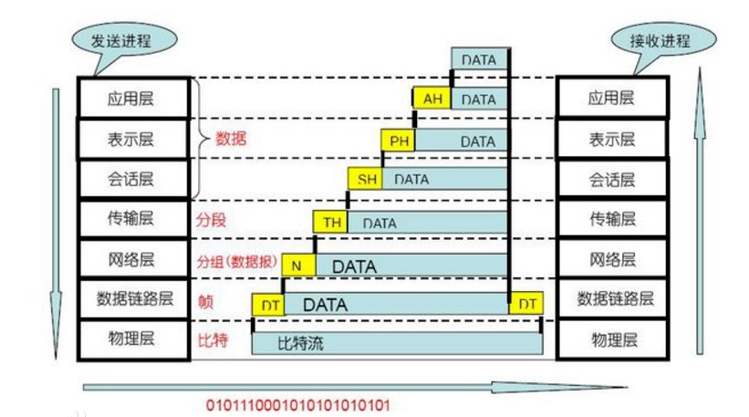

# **ETH LAN8720 调试记录**
>**够用的硬件**
>
>**能用的代码**
>
>**实用的教程**
>
>屋脊雀工作室编撰 -20190101
>
>愿景：做一套能用的开源嵌入式驱动（非LINUX）
>
>官网：www.wujique.com
>
>github: https://github.com/wujique/stm32f407
>
>淘宝：https://shop316863092.taobao.com/?spm=2013.1.1000126.2.3a8f4e6eb3rBdf
>
>技术支持邮箱：code@wujique.com、github@wujique.com
>
>资料下载：https://pan.baidu.com/s/12o0Vh4Tv4z_O8qh49JwLjg
>
>QQ群：767214262
---

本节我们开始调试网络功能。
主要分三部分:STM32以太网控制器、PHY芯片LAN8720、LWIP协议栈。

## STM32 MAC控制器
#### 框图

1. STM32的以太网是基于DMA控制器的。
2. 介质访问控制，也就是我们通常说的MAC控制器。这个是以太网功能的核心部分。
3. 以太网提供3种接口：SMI、MII、RMII。
4. SMI叫做站管理接口。用来访问PHY的寄存器。
5. MII&RMII功能一样，都是MAC控制器跟PHY进行数据传输的接口。RMII是精简的MII，用更少的IO口。
6. 框图里面的外部PHY并不包含在STM32芯片内，我们外部的LAN8720就是这个外部PHY。
7. 在PHY外，应该还有一个带变压器的网口。

#### 特性
在《STM32F4xx中文参考手册.pdf》中列出了以太网的3种特性
1. MAC内核特性
2. DMA特性
3. PTP特性

细节请看文档。

#### RMII接口
精简介质独立接口（RMII）只要用7个引脚(MII需要16个)，因此我们选用这个接口控制PHY芯片。
RMII有以下特性：
>支持10/100M运行速率
参考时钟必须是50MHz
相同的参考时钟必须从外部提供给MAC和外部PHY
提供独立的2位宽的发送和接收数据路径


图中的REF_CLK是共用的参考时钟，50MHz。
我们用LAN8720方案，这个时钟由LAN8720提供给STM32 MAC控制器。

## LAN8720A芯片
LAN8720A是低功耗的10/100M以太网PHY芯片，支持通过RMII接口和MAC层通信。
#### 特性
* 10/100M
* 支持RMII接口
* 支持全双工和半双工
* 使用外部25M晶振，生成50MHz参考时钟给MAC层使用
* 支持自协商模式
* 支持HP Auto-MDIX自动翻转
* 支持SMI串行管理接口

#### 框图
* 内部框图


* 应用图

左边10/100M网络控制器就是STM32内部的MAC控制器。
右边的RJ45就是网口。
下边框图说明LAN8720需要一个外部晶振。


更多请参考《LAN8720A.pdf》文档。
## LWIP
现在我们天天上网，基本上都知道，有一种TCP/IP协议。
协议是什么？最底层的协议就是数据传输的格式。可以相当于网络上的一种语言。
高级的协议，就是一种行为规范。
以太网世界设备几十亿，如果没有行为规范，机器之间就无法正常进行通信。
不理解的话可以想象在一间房子里面有10个不同国家的人，各自都在胡言乱语。

#### 网络七层协议
国际标准化组织ISO 于1981年正式推荐了一个网络系统结构----七层参考模型，叫做开放系统互连模型(Open System Interconnection，OSI)。
由于这个标准模型的建立,使得各种计算机网络向它靠拢，大大推动了网络通信的发展。
OSI 参考模型将整个网络通信的功能划分为七个层次，见图。
它们由低到高分别是物理层(PH)、数据链路层(DL)、网络层(N)、传输层(T)、会话层(S)、表示层(P)、应用层(A)。
每层完成一定的功能，每层都直接为其上层提供服务，并且所有层次都互相支持。
第四层到第七层主要负责互操作性，而一层到三层则用于创造两个网络设备间的物理连接。


#### TCP/IP协议
>Transmission Control Protocol/Internet Protocol的简写，中译名为传输控制协议/因特网互联协议，又名网络通讯协议，是Internet最基本的协议、Internet国际互联网络的基础，由网络层的IP协议和传输层的TCP协议组成。TCP/IP 定义了电子设备如何连入因特网，以及数据如何在它们之间传输的标准。协议采用了4层的层级结构，每一层都呼叫它的下一层所提供的协议来完成自己的需求。通俗而言：TCP负责发现传输的问题，一有问题就发出信号，要求重新传输，直到所有数据安全正确地传输到目的地。而IP是给因特网的每一台联网设备规定一个地址。

TCP/IP协议只使用了4层结构，跟OSI的对应关系如下图。


#### LWIP
LwIP是Light Weight (轻型)IP协议，有无操作系统的支持都可以运行。
LwIP实现的重点是在保持TCP协议主要功能的基础上减少对RAM 的占用，它只需十几KB的RAM和40K左右的ROM就可以运行，这使LwIP协议栈适合在低端的嵌入式系统中使用。
lwIP协议栈主要关注的是怎么样减少内存的使用和代码的大小，这样就可以让lwIP适用于资源有限的小型平台例如嵌入式系统。
为了简化处理过程和内存要求，lwIP对API进行了裁减，可以不需要复制一些数据。

#### 学习
我们本次只是移植官方以太网的例子。不会对LWIP做深入学习。
因为TCP/IP协议太复杂了。以前公司做无线通信的同事，每天都抗一本书看，对，就是下面这本，他说这书是一套，总共更有3本。

如果大家想学习网络协议，可以买这个书看看。
如果只是想了解LWIP的使用，那就先从例程上学习学习，再看看LWIP的结构跟接口就可以了。
***以后我们会单独出一个对于LWIP的使用说明***

## 原理说明

1. 原理图分两部分：PHY芯片LAN8720A、HR911105A（带变压器RJ45网口）。
2. PHY芯片通过RMII接口与STM32内部MAC层通信。
3. LAN8720需要一个25M的晶振。
4. STM32通过一个SMI接口控制LAN8720。
5. 第10脚可以配置LAN8720地址。

## 移植调试
ST提供了ETH例程《STM32F4x7_ETH_LwIP_V1.1.1》。
在Libraries文件夹内有STM32F4x7_ETH_Driver库文件。
Project文件夹内有两个文件夹，FreeRTOS是带操作系统的例程，Standalone则是不带操作系统的例程。
目前我们还没有移植操作系统，先用不带操作系统的例程测试硬件。
我们选择里面的**tcp_echo_server**例程。
在app文件夹建立一个eth文件，用于存放网络应用。
把例程中src和inc文件夹内的相关文件拷贝到eth。例程的main.c跟main.h改名eth_app。

* C文件


* 头文件


* 将文件添加到工程

lwip文件较多，一共34个。
lwip-1.4.1\src\api目录下8个。
lwip-1.4.1\src\core目录下16个。
lwip-1.4.1\src\core\ipv4目录下8个。
lwip-1.4.1\src\netif目录下的etharp.c
lwip-1.4.1\port\STM32F4x7\Standalone目录下的ethernetif.c

#### 修改
1. 修改ETH_GPIO_Config函数，根据我们的硬件配置GPIO。
2. 修改所有DP83848_PHY_ADDRESS，改为ETH_PHY_ADRESS，在stm32f4x7_eth_bsp.h宏定义
```c
//#define DP83848_PHY_ADDRESS       0x01 /* Relative to STM324xG-EVAL Board */
#define LAN8720A_PHY_ADDRESS       0x00 /* Relative to WUJIQUE F407 Board */

#define ETH_PHY_ADRESS				LAN8720A_PHY_ADDRESS
```
3. 打开宏，使用DHCP，DHCP就是自动获取IP的意思。
```c
#define USE_DHCP       /* enable DHCP, if disabled static address is used */
```
4. 打开接口定义，我们用的是RMII模式，原来例程用的是MII模式
```
/* wujique F407硬件使用RMII接口*/
#define RMII_MODE  // User have to provide the 50 MHz clock by soldering a 50 MHz
                     // oscillator (ref SM7745HEV-50.0M or equivalent) on the U3
                     // footprint located under CN3 and also removing jumper on JP5.
                     // This oscillator is not provided with the board.
                     // For more details, please refer to STM3240G-EVAL evaluation
                     // board User manual (UM1461).


//#define MII_MODE
```
对源码移植过程大概修改上面这些，具体修改了什么，可以跟原来例程对比。

#### 修改系统滴答
网络需要一个Time_Get_LocalTime函数，其实是一个系统滴答。
我们代码中一直使用一个Delay函数，我们修改这个Delay，改为**滴答形式**。

main函数开始初始化系统滴答，改为1MS
```c
  /* SysTick end of count event each 10ms */
  RCC_GetClocksFreq(&RCC_Clocks);
  SysTick_Config(RCC_Clocks.HCLK_Frequency / 1000);
```
将原来的延时函数改为下面三个函数：
Delay还是延时；
Time_Get_LocalTime获取系统滴答；
Time_Update放到SysTick_Handler函数内，替换原来的函数。

```c
/* this variable is used to create a time reference incremented by 10ms */
__IO uint32_t LocalTime = 0;
uint32_t timingdelay;

/**
  * @brief  Inserts a delay time.
  * @param  nCount: number of 10ms periods to wait for.
  * @retval None
  */
void Delay(uint32_t nCount)
{
  /* Capture the current local time */
  timingdelay = LocalTime + nCount;  

  /* wait until the desired delay finish */  
  while(timingdelay > LocalTime)
  {     
  }
}

uint32_t Time_Get_LocalTime(void)
{
	return LocalTime;
}

/**
  * @brief  Updates the system local time
  * @param  None
  * @retval None
  */
void Time_Update(void)
{
  LocalTime += SYSTEMTICK_PERIOD_MS;
}
```

#### 读芯片ID
到现在，大家应该都熟悉外设调试流程了：**可以读ID的芯片，肯定是先调试能读取ID，再调试其他功能**。
在函数ETH_BSP_Config内增加读ID功能，初始化ETH后就读。
```c
  /* Configure the GPIO ports for ethernet pins */
  ETH_GPIO_Config();

  /* Configure the Ethernet MAC/DMA */
  ETH_MACDMA_Config();

    uart_printf("read phy id\r\n");
	ID1 = ETH_ReadPHYRegister(ETH_PHY_ADRESS, 0X02);
	ID2 = ETH_ReadPHYRegister(ETH_PHY_ADRESS, 0X03);
	uart_printf("PHY ID:%02x %02x\r\n", ID1, ID2);

```
修改完之后成功读取ID。

#### 获取IP
接上网线，通过路由器分配IP地址。
>hello word!
ETH_BSP_Config
read phy id
PHY ID:07 c0f1
PHY_BSR: 782d
phy ETH_LINK_FLAG
     Looking for    
     DHCP server    
     please wait...
IP address assigned
  by a DHCP server  
  192.168.2.169

成功获取IP地址

#### 通信测试
我们移植的是tcp_echo_server，也就是一个TCP协议自动回显的server。
在函数tcp_echoserver_init();中有以下初始化代码
```c {.line-numbers}
void tcp_echoserver_init(void)
{
  /* create new tcp pcb */
  tcp_echoserver_pcb = tcp_new();

  if (tcp_echoserver_pcb != NULL)
  {
    err_t err;

    /* bind echo_pcb to port 7 (ECHO protocol) */
    err = tcp_bind(tcp_echoserver_pcb, IP_ADDR_ANY, 7);

    if (err == ERR_OK)
    {
      /* start tcp listening for echo_pcb */
      tcp_echoserver_pcb = tcp_listen(tcp_echoserver_pcb);

      /* initialize LwIP tcp_accept callback function */
      tcp_accept(tcp_echoserver_pcb, tcp_echoserver_accept);
    }
    else
    {
      /* deallocate the pcb */
      memp_free(MEMP_TCP_PCB, tcp_echoserver_pcb);
      printf("Can not bind pcb\n");
    }
  }
  else
  {
    printf("Can not create new pcb\n");
  }
}
```
其中第11行代码，将tcp绑定到**端口7**。

我们运行网络调试助手，设置如下图，

>协议选择Tcp Client
IP地址选择开发板获取到的地址
使用端口7

点击**链接**
连接成功后点击发送，
开发板会显数据给电脑。
测试成功。
勾上左下角数据流循环发送，点击发送，就可以重复发送，测试是否会出现丢包。

## 总结
ST提供的例程有多种，大家可以尝试其他例程。

---
end
---
