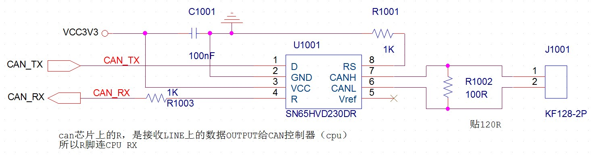

# **can总线调试记录**
>**够用的硬件**
>
>**能用的代码**
>
>**实用的教程**
>
>屋脊雀工作室编撰 -20190101
>
>愿景：做一套能用的开源嵌入式驱动（非LINUX）
>
>官网：www.wujique.com
>
>github: https://github.com/wujique/stm32f407
>
>淘宝：https://shop316863092.taobao.com/?spm=2013.1.1000126.2.3a8f4e6eb3rBdf
>
>技术支持邮箱：code@wujique.com、github@wujique.com
>
>资料下载：https://pan.baidu.com/s/12o0Vh4Tv4z_O8qh49JwLjg
>
>QQ群：767214262
---

本节将向大家介绍如何使用STM32F4自带的CAN控制器实现两个开发板之间的CAN通信。
## CAN
CAN是控制器局域网络(Controller Area Network, CAN)的简称，是由以研发和生产汽车电子产品著称的德国BOSCH公司开发的，并最终成为国际标准（ISO 11898），是国际上应用最广泛的现场总线之一。 在北美和西欧，CAN总线协议已经成为汽车计算机控制系统和嵌入式工业控制局域网的标准总线，并且拥有以CAN为底层协议专为大型货车和重工机械车辆设计的J1939协议。

百度百科
>CAN 是Controller Area Network 的缩写（以下称为CAN），是ISO国际标准化的串行通信协议。在汽车产业中，出于对安全性、舒适性、方便性、低公害、低成本的要求，各种各样的电子控制系统被开发了出来。由于这些系统之间通信所用的数据类型及对可靠性的要求不尽相同，由多条总线构成的情况很多，线束的数量也随之增加。为适应“减少线束的数量”、“通过多个LAN，进行大量数据的高速通信”的需要，1986 年德国电气商博世公司开发出面向汽车的CAN 通信协议。此后，CAN 通过ISO11898 及ISO11519 进行了标准化，在欧洲已是汽车网络的标准协议。
CAN 的高性能和可靠性已被认同，并被广泛地应用于工业自动化、船舶、医疗设备、工业设备等方面。现场总线是当今自动化领域技术发展的热点之一，被誉为自动化领域的计算机局域网。它的出现为分布式控制系统实现各节点之间实时、可靠的数据通信提供了强有力的技术支持。

#### 特点
* 完成对通信数据的成帧处理
集成了CAN协议的物理层和数据链路层功能，可完成对通信数据的成帧处理，包括位填充、数据块编码、循环冗余检验、优先级判别等项工作。
* 使网络内的节点个数在理论上不受限制
CAN协议的一个最大特点是废除了传统的站地址编码，而代之以对通信数据块进行编码。采用这种方法的优点可使网络内的节点个数在理论上不受限制，数据块的标识符可由11位或29位二进制数组成，因此可以定义2或2个以上不同的数据块，这种按数据块编码的方式，还可使不同的节点同时接收到相同的数据，这一点在分布式控制系统中非常有用。数据段长度最多为8个字节，可满足通常工业领域中控制命令、工作状态及测试数据的一般要求。同时，8个字节不会占用总线时间过长，从而保证了通信的实时性。CAN协议采用CRC检验并可提供相应的错误处理功能，保证了数据通信的可靠性。CAN卓越的特性、极高的可靠性和独特的设计，特别适合工业过程监控设备的互连，因此，越来越受到工业界的重视，并已公认为最有前途的现场总线之一。
* 可在各节点之间实现自由通信
CAN总线采用了多主竞争式总线结构，具有多主站运行和分散仲裁的串行总线以及广播通信的特点。CAN总线上任意节点可在任意时刻主动地向网络上其它节点发送信息而不分主次，因此可在各节点之间实现自由通信。CAN总线协议已被国际标准化组织认证，技术比较成熟，控制的芯片已经商品化，性价比高，特别适用于分布式测控系统之间的数据通讯。CAN总线插卡可以任意插在PC AT XT兼容机上，方便地构成分布式监控系统。
* 结构简单
只有2根线与外部相连，并且内部集成了错误探测和管理模块。
* 传输距离和速率
CAN总线特点：(1) 数据通信没有主从之分，任意一个节点可以向任何其他（一个或多个）节点发起数据通信，靠各个节点信息优先级先后顺序来决定通信次序，高优先级节点信息在134μs通信; (2) 多个节点同时发起通信时，优先级低的避让优先级高的，不会对通信线路造成拥塞; (3) 通信距离最远可达10KM(速率低于5Kbps)速率可达到1Mbps(通信距离小于40M）；（4) CAN总线传输介质可以是双绞线，同轴电缆。CAN总线适用于大数据量短距离通信或者长距离小数据量，实时性要求比较高，多主多从或者各个节点平等的现场中使用。

#### 通信
典型的CAN通信网络如下图。


>所有CAN节点通过CANH和CANL连接到CAN网络上。
前面我们学习串口的时候知道，串口是发送和接收交叉相连。
CAN节点并没有所谓的发送和接收，所有的CAN节点，都是CANH与CANH相连，CANL与CANL相连。


那么CAN是如何通信的呢？
* 物理层

请看下图：
当CANH等于CANL，电平都是2.3V，叫做隐性电平。
当CANH为高电平，CANL为低电平时（两者之差大于0.9V），叫做显性电平。
按照规定，隐性代表逻辑1，显性代表逻辑0。


电平说清楚了，但是这个没有接收发送管脚，如何通信呢？

* 数据链路层

前面说到CAN特点的时候，我们提到过：CAN协议不仅仅实现了物理层连接，还实现了数据链路层的功能。
什么叫数据链路层？
在调试网络功能的时候我们提到过OSI的数据链路层。
>数据链路层是OSI参考模型中的第二层，介乎于物理层和网络层之间。数据链路层在物理层提供的服务的基础上向网络层提供服务，其最基本的服务是将源自网络层来的数据可靠地传输到相邻节点的目标机网络层。为达到这一目的，数据链路必须具备一系列相应的功能，主要有：如何将数据组合成数据块，在数据链路层中称这种数据块为帧（frame），帧是数据链路层的传送单位；如何控制帧在物理信道上的传输，包括如何处理传输差错，如何调节发送速率以使与接收方相匹配；以及在两个网络实体之间提供数据链路通路的建立、维持和释放的管理。

通俗的说，数据链路层的功能就是保证数据传输的可靠性，并且管理数据传输。
例如数据丢包了，要不要重发？重发几次？
为了达到这个功能，通常需要对原始数据进行封装处理。也就是所谓的帧。
不过大家要搞清楚，数据链路层不是应用层，数据链路只负责数据传输，不关心数据内容和数据功能。

例如前面的串口，它只是一个物理层的。如果用于两个设备之间的通信，为了保证通信的可靠性，我们需要加上一定的机制，例如握手，重发，校验，数据头数据尾等。这些，就是数据链路层功能。

#### 协议
CAN 总线是一个**广播类型**的总线，所以任何在总线上的节点都可以监听总线上传输的数据。
也就是说总线上的传输不是点到点的，而是一点对多点的传输，这里多点的意思是总线上所有的节点。
但是总线上的节点如何知道那些数据是传送给自己的呢？
CAN总线的硬件芯片提供了一种叫做**本地过滤**的功能，通过这种本地过滤的功能可以过滤掉一些和自己无关的数据，而保留一些和自己有关的信息。

>协议就是数据链路层的实现。

* 帧类型

CAN协议有以下4中帧：


>**更信息规范请查阅资料中的<CAN BUS规范v2.0+中文版.pdf>**

## STM32 CAN
STM32带的CAN控制器叫**基本扩展CAN外设**，又称bxCAN。支持2.0A和B版本协议。

#### 特性


上图是CAN的应用拓扑结构。
红框1里面是CAN芯片，也就是我们的VP230芯片。
红框2就是STM32芯片的CAN控制器。

#### 框图

>STM32有两个CAN，CAN1做主bxCAN，can2做从bxCAN。

#### 过滤器
>关于过滤器的说明在文档<7.4，标识符筛选>。

STM32 CAN外设一个重要的功能就是硬件过滤功能。
前面提到，CAN使用的是广播方式通信，一个节点会收到总线上的所有数据（所有帧）。
但是并不是所有消息都是我需要的。有了过滤器，就可以在软件不干预的情况下丢弃那些我不要的数据。
>每组过滤器包括了2个可配置的32位寄存器：CAN_FxR0和CAN_FxR1。
这些过滤器相当于关卡，每当收到一条报文时，CAN要先将收到的报文从这些过滤器上"过"一下，
能通过的报文是有效报文，收进相关联FIFO（FIFO1或FIFO2），
不能通过的是无效报文(不是发给"我"的报文)，直接丢弃。

我们从配置看看过滤器功能。
```c
/**
  * @brief  CAN filter init structure definition
  */
typedef struct
{
  uint16_t CAN_FilterIdHigh; /*!< Specifies the filter identification number (MSBs for a 32-bit
                                configuration, first one for a 16-bit configuration).
                                This parameter can be a value between 0x0000 and 0xFFFF */

  uint16_t CAN_FilterIdLow; /*!< Specifies the filter identification number (LSBs for a 32-bit
                                configuration, second one for a 16-bit configuration).
                                This parameter can be a value between 0x0000 and 0xFFFF */

  uint16_t CAN_FilterMaskIdHigh; /*!< Specifies the filter mask number or identification number,
                                according to the mode (MSBs for a 32-bit configuration,
                                first one for a 16-bit configuration).
                                This parameter can be a value between 0x0000 and 0xFFFF */

  uint16_t CAN_FilterMaskIdLow; /*!< Specifies the filter mask number or identification number,
                                according to the mode (LSBs for a 32-bit configuration,
                                second one for a 16-bit configuration).
                                This parameter can be a value between 0x0000 and 0xFFFF */

  uint16_t CAN_FilterFIFOAssignment; /*!< Specifies the FIFO (0 or 1) which will be assigned
                                     to the filter.
                                    This parameter can be a value of @ref CAN_filter_FIFO */

  uint8_t CAN_FilterNumber; /*!< Specifies the filter which will be initialized.
                             It ranges from 0 to 13. */

  uint8_t CAN_FilterMode;    /*!< Specifies the filter mode to be initialized.
                            This parameter can be a value of @ref CAN_filter_mode */

  uint8_t CAN_FilterScale;  /*!< Specifies the filter scale.
                            This parameter can be a value of @ref CAN_filter_scale */

  FunctionalState CAN_FilterActivation; /*!< Enable or disable the filter.
                            This parameter can be set either to ENABLE or DISABLE. */
} CAN_FilterInitTypeDef;
```
上面就是一个CAN过滤器的配置。
* CAN_FilterMode 过滤模式。有两种掩码模式和列表模式。
```c
#define CAN_FilterMode_IdMask       ((uint8_t)0x00)  /*!< identifier/mask mode */
#define CAN_FilterMode_IdList       ((uint8_t)0x01)  /*!< identifier list mode */
```
* CAN_FilterNumber 过滤器编号，STM32有14个过滤器。
* CAN_FilterScale 设置过滤器刻度，16位或32位。
* CAN_FilterFIFOAssignment 设置使用过滤器的接收FIFO，有两个：0和1。请看框图右上角。读数据时需要指定FIFO的。
* CAN_FilterIdHigh、CAN_FilterIdLow 叫做FilterId
* CAN_FilterMaskIdHigh、CAN_FilterMaskIdLow 叫它FilterMaskId

>这四个值，对应过滤器的2个32位寄存器：CAN_FxR1、CAN_FxR2
>1. 如果CAN_FilterScale是16位：
>那么CAN_FilterMaskIdLow<<16+CAN_FilterIdLow设置到CAN_FR1。
>CAN_FilterMaskIdHigh<<16+CAN_FilterIdHigh设置到CAN_FR2。
>2. 如果CAN_FilterScale是32位：
>  CAN_FilterMaskIdHigh<<16 + CAN_FilterMaskIdLow 设置到CAN_FR2。
>
>  CAN_FilterIdHigh<<16 + CAN_FilterIdLow 设置到CAN_FR1
>
>  查看设置函数可见上述细节
>```c
>void CAN_FilterInit(CAN_FilterInitTypeDef* CAN_FilterInitStruct)
>```

按工作模式和宽度，一个过滤器组可以变成以下几中形式之一：

|Scale|Mode|过滤器数量|FxR1|FxR2|
|-|-|-|-|-|
|32|掩码|1|要判断的位的值|那些位需要判断|
|32|列表|2|过滤器1的判断值|过滤器2的判断值|
|16|掩码|2|过滤器0，[31-16]位指定要关心的位，[15-0]位指定这些位的标准值。|过滤器1，[31-16]位指定要关心的位，[15-0]位指定这些位的标准值|
|16|列表|4|[15-0]位配置过滤器0，FxR1的[31-16]位配置过滤器1。[15-0]位配置过滤器2，FxR2的[31-16]位配置过滤器3|

* 每组过滤器组必须关联且只能关联一个FIFO。复位默认都关联到FIFO_0。
* 每个FIFO的所有过滤器都是并联的，只要通过了其中任何一个过滤器,该报文就有效。
* 如果一个报文既符合FIFO_0，又符合FIFO_1，显然，根据操作顺序，它只会放到FIFO_0中。

**更多的CANX相关请查看文档**

## VP230芯片
VP230是SN65HVD230DR的俗称，是一款TI出的CAN芯片。
我们选用这块芯片的原因是：**工作电压3.3V，且可以和常用的5V CAN芯片TJA1050通信**。

## 原理图


## 移植官方例程
官方CAN例程有两个:CAN_LoopBack(回环测试);CAN_Networking(组网模式)。
所谓的回环模式就是将自身发送的消息作为接收的消息来处理并存储。
我们移植组网模式。

#### 例程分析
在CAN例程内，并没有任何CAN相关的文件。


查看main.c，CAN_Config配置CAN后，进入while循环。
循环中如果判断到按键按下，在else分支就会将键值赋值到发送消息。
然后调用CAN_Transmit发送消息。
```c {.line-numbers}
/* CAN configuration */
  CAN_Config();

  while(1)
  {
    while(STM_EVAL_PBGetState(BUTTON_KEY) == KEY_PRESSED)
    {
      if(ubKeyNumber == 0x4)
      {
        ubKeyNumber = 0x00;
      }
      else
      {
        LED_Display(++ubKeyNumber);
        TxMessage.Data[0] = ubKeyNumber;
        CAN_Transmit(CANx, &TxMessage);
        /* Wait until one of the mailboxes is empty */
        while((CAN_GetFlagStatus(CANx, CAN_FLAG_RQCP0) !=RESET) || \
              (CAN_GetFlagStatus(CANx, CAN_FLAG_RQCP1) !=RESET) || \
              (CAN_GetFlagStatus(CANx, CAN_FLAG_RQCP2) !=RESET));

        while(STM_EVAL_PBGetState(BUTTON_KEY) != KEY_NOT_PRESSED)
        {
        }
      }
    }
  }
```

分析CAN_Config函数。
13~25行，配置对应IO为CAN功能。
32~48，can基本配置，具体意思看注释
50~60，滤波器设置，R1和R2都设置为0，也就是所有报文都能通过滤波器。
62~67， 初始化一组发送消息
70行，使能CAN中断。
```c {.line-numbers}
/**
  * @brief  Configures the CAN.
  * @param  None
  * @retval None
  */
static void CAN_Config(void)
{
  GPIO_InitTypeDef  GPIO_InitStructure;

  /* CAN GPIOs configuration **************************************************/

  /* Enable GPIO clock */
  RCC_AHB1PeriphClockCmd(CAN_GPIO_CLK, ENABLE);

  /* Connect CAN pins to AF9 */
  GPIO_PinAFConfig(CAN_GPIO_PORT, CAN_RX_SOURCE, CAN_AF_PORT);
  GPIO_PinAFConfig(CAN_GPIO_PORT, CAN_TX_SOURCE, CAN_AF_PORT);

  /* Configure CAN RX and TX pins */
  GPIO_InitStructure.GPIO_Pin = CAN_RX_PIN | CAN_TX_PIN;
  GPIO_InitStructure.GPIO_Mode = GPIO_Mode_AF;
  GPIO_InitStructure.GPIO_Speed = GPIO_Speed_50MHz;
  GPIO_InitStructure.GPIO_OType = GPIO_OType_PP;
  GPIO_InitStructure.GPIO_PuPd  = GPIO_PuPd_UP;
  GPIO_Init(CAN_GPIO_PORT, &GPIO_InitStructure);

  /* CAN configuration ********************************************************/  
  /* Enable CAN clock */
  RCC_APB1PeriphClockCmd(CAN_CLK, ENABLE);

  /* CAN register init */
  CAN_DeInit(CANx);

  /* CAN cell init */
  CAN_InitStructure.CAN_TTCM = DISABLE; //非时间出发通信模式
  CAN_InitStructure.CAN_ABOM = DISABLE; //软件自动离线管理
  CAN_InitStructure.CAN_AWUM = DISABLE; //睡眠模式通过软件唤醒
  CAN_InitStructure.CAN_NART = DISABLE; //禁止报文自动传送
  CAN_InitStructure.CAN_RFLM = DISABLE; //报文不锁定，新的覆盖旧的
  CAN_InitStructure.CAN_TXFP = DISABLE; //优先级由报文标识符决定
  CAN_InitStructure.CAN_Mode = CAN_Mode_Normal; //模式设置为普通模式
  CAN_InitStructure.CAN_SJW = CAN_SJW_1tq; //重新同步跳跃宽度为1个时间单位

  /* CAN Baudrate = 1 MBps (CAN clocked at 30 MHz) 这里是设置CAN波特率*/
  CAN_InitStructure.CAN_BS1 = CAN_BS1_6tq; //时间段1占用6个时间单位
  CAN_InitStructure.CAN_BS2 = CAN_BS2_8tq; //时间段2占用8个时间单位
  CAN_InitStructure.CAN_Prescaler = 2;//分频系数
  CAN_Init(CANx, &CAN_InitStructure);

  /* CAN filter init  设置滤波器*/
  CAN_FilterInitStructure.CAN_FilterNumber = 0; //使用滤波器组0
  CAN_FilterInitStructure.CAN_FilterMode = CAN_FilterMode_IdMask; //
  CAN_FilterInitStructure.CAN_FilterScale = CAN_FilterScale_32bit;
  CAN_FilterInitStructure.CAN_FilterIdHigh = 0x0000;
  CAN_FilterInitStructure.CAN_FilterIdLow = 0x0000;
  CAN_FilterInitStructure.CAN_FilterMaskIdHigh = 0x0000;
  CAN_FilterInitStructure.CAN_FilterMaskIdLow = 0x0000;
  CAN_FilterInitStructure.CAN_FilterFIFOAssignment = 0;
  CAN_FilterInitStructure.CAN_FilterActivation = ENABLE;
  CAN_FilterInit(&CAN_FilterInitStructure);

  /* Transmit Structure preparation 消息初始化*/
  TxMessage.StdId = 0x321;
  TxMessage.ExtId = 0x01;
  TxMessage.RTR = CAN_RTR_DATA;
  TxMessage.IDE = CAN_ID_STD;
  TxMessage.DLC = 1;

  /* Enable FIFO 0 message pending Interrupt 初始化中断*/
  CAN_ITConfig(CANx, CAN_IT_FMP0, ENABLE);
}

```
其中的发送数据结构是库定义的
```c
/**
  * @brief  CAN Tx message structure definition  
  */
typedef struct
{
  uint32_t StdId;  /*!< Specifies the standard identifier.
                        This parameter can be a value between 0 to 0x7FF. */

  uint32_t ExtId;  /*!< Specifies the extended identifier.
                    This parameter can be a value between 0 to 0x1FFFFFFF. */

  uint8_t IDE;     /*!< Specifies the type of identifier for the message that
                        will be transmitted. This parameter can be a value
                        of @ref CAN_identifier_type */

  uint8_t RTR;     /*!< Specifies the type of frame for the message that will
                        be transmitted. This parameter can be a value of
                        @ref CAN_remote_transmission_request */

  uint8_t DLC;     /*!< Specifies the length of the frame that will be
                        transmitted. This parameter can be a value between
                        0 to 8 */

  uint8_t Data[8]; /*!< Contains the data to be transmitted. It ranges from 0
                        to 0xFF. */
} CanTxMsg;
```

CAN的配置到底什么意思，看stm32f4xx_can.h就可以知道大概了。

在CONFIG之前就调用了NVIC配置初始化CAN的中断优先级
```c
/**
  * @brief  Configures the NVIC for CAN.
  * @param  None
  * @retval None
  */
static void NVIC_Config(void)
{
  NVIC_InitTypeDef  NVIC_InitStructure;

  NVIC_InitStructure.NVIC_IRQChannel = CAN1_RX0_IRQn;
  NVIC_InitStructure.NVIC_IRQChannelPreemptionPriority = 0x0;
  NVIC_InitStructure.NVIC_IRQChannelSubPriority = 0x0;
  NVIC_InitStructure.NVIC_IRQChannelCmd = ENABLE;
  NVIC_Init(&NVIC_InitStructure);
}
```
其中在中断处理如下:
收到数据后，判断STDID和IDE DLC标志。
```c
/**
  * @brief  This function handles CAN1 RX0 request.
  * @param  None
  * @retval None
  */
void CAN1_RX0_IRQHandler(void)
{
  CAN_Receive(CAN1, CAN_FIFO0, &RxMessage);

  if ((RxMessage.StdId == 0x321)&&(RxMessage.IDE == CAN_ID_STD)
      && (RxMessage.DLC == 1))
  {
    LED_Display(RxMessage.Data[0]);
    ubKeyNumber = RxMessage.Data[0];
  }
}

```
接收数据的格式也是在stm32f4xx_can.h中有定义。

#### 移植
>1. 将main.c里面的CAN控制器配置代码拷贝到我们工程mcu_can.c.
>2. 将stm32f4xx_it.c中的CAN1_RX0_IRQHandler接收中断拷贝到我们的stm32f4xx_it.c。
>3. 修改IO口配置。使用PB8/PB9，通过查数据手册，可知是CAN1。

- 另外，官方例程代码层次不是很好，我们重新划分。

具体见代码。

## 测试
本次测试需要两块开发板进行测试。
接线同向接线，也即是CANH连接CANH，CANL连接CANL。
测试程序如下：
```c
int mcu_can_test(void)
{
	uint8_t data = 0;
  /* NVIC configuration */
  NVIC_CAN_Config();

  /* CAN configuration */
  mcu_can_config();

  while(1)
  {
	#if 1/* 测试发送端，发送后等待接收端响应 */
	Delay(1000);
	data++;
	/* Transmit Structure preparation */
	TxMessage.StdId = 0x321;
	TxMessage.ExtId = 0x01;
	TxMessage.RTR = CAN_RTR_DATA;
	TxMessage.IDE = CAN_ID_STD;
	TxMessage.DLC = 1;

    TxMessage.Data[0] = data;
    CAN_Transmit(CANx, &TxMessage);

    /* Wait until one of the mailboxes is empty */
    while((CAN_GetFlagStatus(CANx, CAN_FLAG_RQCP0) !=RESET) || \
          (CAN_GetFlagStatus(CANx, CAN_FLAG_RQCP1) !=RESET) || \
          (CAN_GetFlagStatus(CANx, CAN_FLAG_RQCP2) !=RESET));

	uart_printf("can transmit :%02x\r\n", data);

	while(1)
	{
		if(CanRxFlag == 1)
		{
			CanRxFlag = 0;

			if ((RxMessage.StdId == 0x321)&&(RxMessage.IDE == CAN_ID_STD)
                           && (RxMessage.DLC == 1))
			{

				uart_printf("can rep :%02x\r\n", RxMessage.Data[0]);

			}

			break;
		}
	}

	#else
	/*  测试接收端，接收到数据后返回给发送端 */
	if(CanRxFlag == 1)
	{
		CanRxFlag = 0;

		if ((RxMessage.StdId == 0x321)&&(RxMessage.IDE == CAN_ID_STD)
                    && (RxMessage.DLC == 1))
		{
			uart_printf("can receive :%02x\r\n", RxMessage.Data[0]);
			/* Transmit Structure preparation */
			TxMessage.StdId = 0x321;
			TxMessage.ExtId = 0x01;
			TxMessage.RTR = CAN_RTR_DATA;
			TxMessage.IDE = CAN_ID_STD;
			TxMessage.DLC = 1;

			TxMessage.Data[0] = RxMessage.Data[0];
			CAN_Transmit(CANx, &TxMessage);

			/* Wait until one of the mailboxes is empty */
			while((CAN_GetFlagStatus(CANx, CAN_FLAG_RQCP0) !=RESET) || \
			      (CAN_GetFlagStatus(CANx, CAN_FLAG_RQCP1) !=RESET) || \
			      (CAN_GetFlagStatus(CANx, CAN_FLAG_RQCP2) !=RESET));

				}
		    uart_printf("can send rep ok\r\n");
	}
	#endif
  }
}
```
while循环内的代码使用条件编译，分别是接收与发送。
测试时使用两块开发板，一个下载发送的代码，一块下载接收代码。
接收端先启动，发送端后启动。
发送端调试信息如下：
>hello word!
can transmit :01
can rx message
can rep :01
can transmit :02
can rx message
can rep :02

接收端调试信息如下：
>hello word!
can rx message
can receive :01
can send rep ok
can rx message
can receive :02
can send rep ok

发送端发送01，接收端收到01后返回rep，回显01，接收端收到rep:01。
流程重复，发送的数据不断加1 。

## 总结
1. CAN的基本应用不难，如果真正应用在项目中，需要考虑更多的协议处理，例如仲裁。
2. 通过CAN的学习，希望大家有数据链路层的概念。以后做项目，每一种通信，最好加上数据链路层，这样可以保证数据传输的可靠性。

---
end
---
