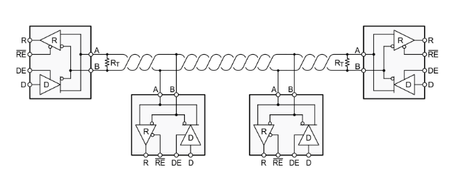

# **RS485-串口驱动改造**
>**够用的硬件**
**能用的代码**
**实用的教程**
>屋脊雀工作室编撰 -20190101
愿景：做一套能用的开源嵌入式驱动（非LINUX）
官网：www.wujique.com
github: https://github.com/wujique/stm32f407
淘宝：https://shop316863092.taobao.com/?spm=2013.1.1000126.2.3a8f4e6eb3rBdf
技术支持邮箱：code@wujique.com、github@wujique.com
资料下载：https://pan.baidu.com/s/12o0Vh4Tv4z_O8qh49JwLjg
QQ群：767214262
---

上一节我们调试了CAN总线，常见的总线还有RS-485总线。
本节我们一起调试407的485总线。
## RS485
惯例，百度百科：
>RS-485又名TIA-485-A, ANSI/TIA/EIA-485或TIA/EIA-485。
RS485是一个定义平衡数字多点系统中的驱动器和接收器的电气特性的标准，该标准由电信行业协会和电子工业联盟定义。使用该标准的数字通信网络能在远距离条件下以及电子噪声大的环境下有效传输信号。RS-485使得廉价本地网络以及多支路通信链路的配置成为可能。
RS485有两线制和四线制两种接线，四线制只能实现点对点的通信方式，现很少采用，现在多采用的是两线制接线方式，这种接线方式为总线式拓扑结构，在同一总线上最多可以挂接32个节点。
在RS485通信网络中一般采用的是主从通信方式，即一个主机带多个从机。

#### 总线网络
一个典型的RS485网络通常如下图：

>多个端点用**双绞线**连接在一起。
>两端有两个匹配电阻，通常是120欧姆。
>这些端点中只有一个做主机。剩下的都是从机。

#### 电平
RS485与CAN有点类似，都是用两根线之间的压差传输数据。
两线之间压差为+(2~6)V，逻辑1。
两线之间压差为-(2~6)V，逻辑0。

#### 协议
RS485仅仅规定了接收端和发送端的电气特性。它并没有规定或推荐任何数据协议。
和CAN对比一下就知道，RS485只是定义了物理层，没有定义数据链路层。

RS485可以认为是一个半双工的串口。
以前调试的串口，用的是RS232电平（连接方式/物理层）。现在调试的就是一个用RS485电平（连接方式/物理层）的串口。
并且是一个半双工的串口。
#### 特点
由于使用了RS485连接方式，相对于RS232的优点就是：
1. 传输距离远，在低速率时，最远可以传输1200米。
2. 可以通在网络上连接多个节点。
3. 相对RS232，电压更低，更安全。
4. 使用双绞线，差分传输，抗干扰能力强。

## SP3485E
SP3485E是EXAR公司的485芯片，有以下特点：
1. 3.3V工作电压。
2. 10Mbsps。
3. 最多支持32个节点。
4. 输出短路保护。

## 原理图


* TX接在PA9上，RX接在PA10上，与**外扩串口**、**USB**、**摄像头**共用。使用RS485时，这三个外设不要使用。
* RX&TX连接到串口。
* RE是接收发送控制管脚（485是半双工）

## 驱动设计与调试
在dev_board建立dev_rs485驱动文件。
RS485驱动基于串口驱动。在前面做串口驱动程序时，并没有考虑多个串口的情况。因此在设计RS485驱动前，要先改造串口驱动。
### 串口驱动改造
怎么改造？思考下面情景
- 3个串口：
>uart1用来输出调试信息，那么它的上一层就是LOG功能。
uart2用于485，上一层是485外设驱动。
uart3用于8266 wifi模块，上一层则是8266驱动程序。

- 串口需要什么？或者说一个设备基于什么设备？
>1 串口控制器。
2 硬件IO口。
3 硬件RAM（接收发送缓冲）
4 中断
5 不需要时间片轮询。

- 串口驱动要提供什么接口？
>1. 初始化（**重要，不能跟打开混为一谈**）
>2. 打开
>3. 关闭
>4. 读数据（接收）
>5. 写数据（发送）

- 串口工作情景在时间角度上，在数据流转角度上是怎么样的？
>1 中断接收到数据，保存在缓冲。上一层调用读数据接口，读的其实是接收缓冲内的数据。
2 上一层调用写数据时，将数据通过串口发送出去。
阻塞发送？还是通过中断发送？
这个是可以考虑的，一般情况阻塞发送问题也不大。但是接收肯定不能轮询等待接收。
理由就是：**接收，是别人发给你的，你不知道什么时候有数据来。发送，是我要发的，我知道什么时候发。**


综上考虑
我们抽象设计一个串口设备（一个结构体）。
```c
/*
@bref：串口设备
*/
typedef struct  
{
	/* 硬件相关*/
	/*
		STM IO 配置需要太多数据，可以直接在代码中定义， 或者用宏定义
		如果是更上一层设备驱动，例如FLASH ，就可以在设备抽象中定义一个用哪个SPI的定义。
	*/

	USART_TypeDef* USARTx;

	/*RAM相关*/
	s32 gd;	//设备句柄 小于等于0则为未打开设备

	u16 size;// buf 大小
	u8 *Buf;//缓冲指针
	u16 Head;//头
	u16 End;//尾
	u8  OverFg;//溢出标志
}_strMcuUart;
```
>1. 理论上，硬件相关的应该定义在设备结构体内。串口，基本上写了就不改了，因此，直接定义到代码内也可以。
>2. USARTx 串口号。
>3. gd 设备控制符，设备句柄。
>4. size 缓冲大小
>5. Buf 缓冲指针，指向接收缓冲。
>6. Head、End 环形缓冲头尾指针。
>7. OverFg 溢出标志

同时用枚举定义串口设备
```c
typedef enum {
  MCU_UART_1 =0,
  MCU_UART_2,
  MCU_UART_3,
  MCU_UART_MAX,
}
McuUartNum;
```
串口设备这样定义后，接口就改成如下：
```c
extern s32 mcu_uart_open (McuUartNum comport);
extern s32 mcu_uart_close (McuUartNum comport);
extern s32 mcu_uart_write (McuUartNum comport, u8 *buf, s32 len);
extern s32 mcu_uart_read (McuUartNum comport, u8 *buf, s32 len);
extern s32 mcu_uart_set_baud (McuUartNum comport, s32 baud);
extern s32 mcu_uart_tcflush (McuUartNum comport);
```
>每个接口有一个comport参数，在操作串口时，通过这个参数传入串口设备编号，就能操作串口了。

经过这样改造，串口驱动就可以支持多个串口了。
如果需要支持多平台，就还需要将初始化中相关的硬件参数也抽象到串口设备结构体内。

#### RS485驱动
485驱动就很简单了。
功能跟串口类似（本来就是基于串口驱动），因此接口定义如下：
```c
extern s32 dev_rs485_init(void);
extern s32 dev_rs485_open(void);
extern s32 dev_rs485_close(void);
extern s32 dev_rs485_read(u8 *buf, s32 len);
extern s32 dev_rs485_write(u8 *buf, s32 len);
extern s32 dev_rs485_ioctl(void);
```
标准设备接口。

设备初始化，就初始化IO，并且配置为接收模式。
```c
/**
 *@brief:      dev_rs485_init
 *@details:    初始化485设备
 *@param[in]   void  
 *@param[out]  无
 *@retval:     
 */
s32 dev_rs485_init(void)
{
	GPIO_InitTypeDef GPIO_InitStructure;

	RCC_AHB1PeriphClockCmd(RCC_AHB1Periph_GPIOG,ENABLE); //使能 PG时钟
	//PG8 推挽输出， 485 模式控制
	GPIO_InitStructure.GPIO_Pin = GPIO_Pin_8; //GPIOG8
	GPIO_InitStructure.GPIO_Mode = GPIO_Mode_OUT;//输出
	GPIO_InitStructure.GPIO_Speed = GPIO_Speed_100MHz; //速度 100MHz
	GPIO_InitStructure.GPIO_OType = GPIO_OType_PP; //推挽输出
	GPIO_InitStructure.GPIO_PuPd = GPIO_PuPd_UP; //上拉
	GPIO_Init(GPIOG, &GPIO_InitStructure); //初始化 PG8

	//初始化设置为接收模式
	GPIO_ResetBits(GPIOG, GPIO_Pin_8);

	return 0;
}
```
打开设备的时候才打开串口
```c
/**
 *@brief:      dev_rs485_open
 *@details:    打开RS485设备
 *@param[in]   void  
 *@param[out]  无
 *@retval:     
 */
s32 dev_rs485_open(void)
{
	mcu_uart_open(DEV_RS485_UART);
	mcu_uart_set_baud(DEV_RS485_UART, 9600);
	return 0;
}
```
跟串口不一样的就是发送，要将485设置为发送模式，并且是阻塞发送。发送结束后切回接收模式。
```c
/**
 *@brief:      dev_rs485_write
 *@details:    rs485发送数据
 *@param[in]   u8 *buf  
               s32 len  
 *@param[out]  无
 *@retval:     
 */
s32 dev_rs485_write(u8 *buf, s32 len)
{
	s32 res;

	GPIO_SetBits(GPIOG, GPIO_Pin_8);//设置为发送模式
	res = mcu_uart_write(DEV_RS485_UART, buf, len);
	GPIO_ResetBits(GPIOG, GPIO_Pin_8);//发送结束后设置为接收模式

	return res;
}
```

***更多请查看代码***

#### 调试
>1 下程序，接收端没有接收到
2 看原理图，串口跟485芯片的地方不知道为什么加了3个电阻，先去掉。
3 去掉电阻后还是不行。
4 详细对原理图，发现硬件RX跟TX接反。

测试代码与CAN类似，接收端跟发送端使用不同程序。发送端循环发送字符串"rs485 test"，接收端收到字符串后通过调试串口输出。
```c
s32 dev_rs485_test(void)
{
	u8 buf[20];
	u8 len;
	s32 res;

	dev_rs485_init();
	dev_rs485_open();

	#if 0// 发送端测试
	while(1)
	{
		Delay(1000);
		res = dev_rs485_write("rs485 test\r\n", 13);
		uart_printf("dev rs485 write:%d\r\n", res);
	}
	#else//接收端测试
	while(1)
	{
		Delay(20);
		len = dev_rs485_read(buf, sizeof(buf));
		if(len > 0)
		{
			buf[len] = 0;
			uart_printf("%s", buf);
			memset(buf, 0, sizeof(buf));
		}
	}
	#endif
}
```

## 总结
RS485是一个简单的设备。
本节更希望大家了解串口驱动的改造。

---
end
---
