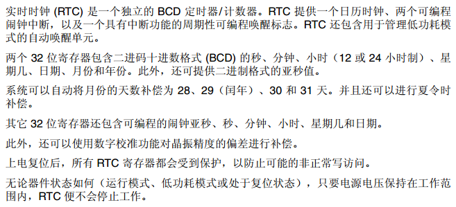
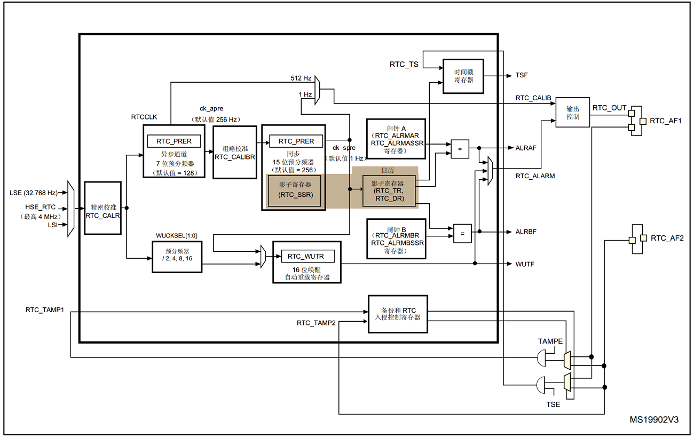
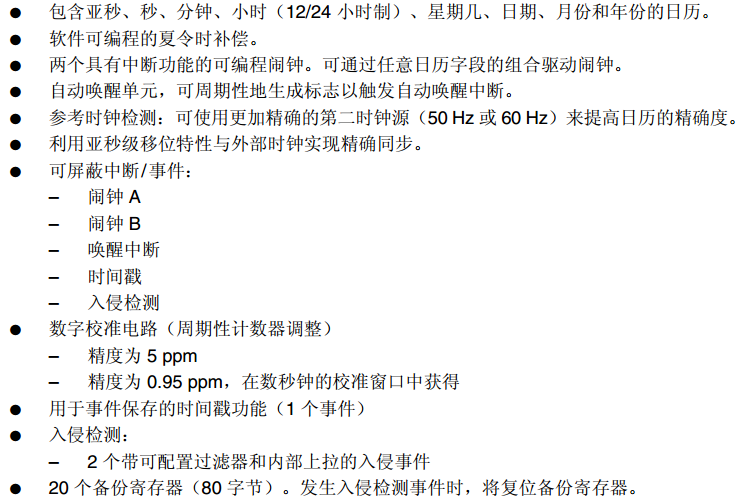

# **RTC**
>**够用的硬件**
>
>**能用的代码**
>
>**实用的教程**
>
>屋脊雀工作室编撰 -20190101
>
>愿景：做一套能用的开源嵌入式驱动（非LINUX）
>
>官网：www.wujique.com
>
>github: https://github.com/wujique/stm32f407
>
>淘宝：https://shop316863092.taobao.com/?spm=2013.1.1000126.2.3a8f4e6eb3rBdf
>
>技术支持邮箱：code@wujique.com、github@wujique.com
>
>资料下载：https://pan.baidu.com/s/12o0Vh4Tv4z_O8qh49JwLjg
>
>QQ群：767214262
---

本章我们调试STM32F407的内置实时时钟(RTC)，同时介绍与RTC相关的BKP功能。

## RTC

RTC = Real-Time Clock，实时时钟。
实时时钟有两种方式：芯片内置、CPU外置。
外置的RTC通常会选用一款芯片，例如PCF8563、DS1302。
当前大部分单片机芯片都有内置的RTC。

RTC通常有以下特点：
1. 低功耗。
2. 使用纽扣电池供电。
3. 主进入睡眠后，RTC依然运行。
4. 时钟32.768K

## STM32 RTC


#### 框图


#### 特性

#### 备份寄存器BKP

>细节在<23.3.13 入侵检测>

STM32F407 RTC附带两个入侵检测输入。与入侵检测配套RTC系统包含20个备份寄存器（80字节）。发生入侵检测事件时，将复位备份寄存器。
只要RTC后备电池正常，RTC和备份寄存器区就会一直工作。不会在系统复位或电源复位时复位，也不会从器件待机模式唤醒时复位。

#### 写操作
RTC 寄存器和备份寄存器都属于后备区，每次写操作前，需要先解锁后备区，以防后备区数据被串改。

***更多资料请查看中文参考手册23章***

## 编码调试
本节我们仅验证RTC能正常工作。

#### 编码
RTC初始化函数
```c {.line-numbers}
/**
 *@brief:      mcu_rtc_init
 *@details:    复位时初始化RTC
 *@param[in]   void  
 *@param[out]  无
 *@retval:     
 */
s32 mcu_rtc_init(void)
{

	RTC_InitTypeDef RTC_InitStructure;
	volatile u32 cnt = 0;

  	RCC_APB1PeriphClockCmd(RCC_APB1Periph_PWR|RCC_AHB1Periph_BKPSRAM, ENABLE);
	/*操作RTC寄存器，需要使能备份区*/
	PWR_BackupAccessCmd(ENABLE);

	if(RTC_ReadBackupRegister(RTC_BKP_DR0)!=0x55aa)
	{
		wjq_log(LOG_DEBUG, " init rtc\r\n");
		/*开启LSE时钟*/
		RCC_LSEConfig(RCC_LSE_ON);
		/*等待RCC LSE时钟就绪*/
		while (RCC_GetFlagStatus(RCC_FLAG_LSERDY) == RESET)
		{
			cnt++;
			if(cnt>0x2000000)
			{
				wjq_log(LOG_ERR, "lse not rdy\r\n");
				return -1;

			}
		}		

		RCC_RTCCLKConfig(RCC_RTCCLKSource_LSE);
		RCC_RTCCLKCmd(ENABLE);
                //RTC异步分频系数(1~0X7F)
                RTC_InitStructure.RTC_AsynchPrediv = 0x7F;
                //RTC同步分频系数(0~7FFF)
                RTC_InitStructure.RTC_SynchPrediv  = 0xFF;
                //RTC设置为,24小时格式
                RTC_InitStructure.RTC_HourFormat   = RTC_HourFormat_24;
                RTC_Init(&RTC_InitStructure);

		RTC_TimeTypeDef RTC_TimeStructure;

		RTC_TimeStructure.RTC_H12 = RTC_H12_AM;
		RTC_TimeStructure.RTC_Hours = 0;
		RTC_TimeStructure.RTC_Minutes = 0;
		RTC_TimeStructure.RTC_Seconds = 0;
		RTC_SetTime(RTC_Format_BIN, &RTC_TimeStructure);

		RTC_DateTypeDef RTC_DateStructure;
		RTC_DateStructure.RTC_Date = 1;
		RTC_DateStructure.RTC_Month = RTC_Month_January;
		RTC_DateStructure.RTC_WeekDay = RTC_Weekday_Thursday;
		RTC_DateStructure.RTC_Year = 0;//已1970年为起点，
		RTC_SetDate(RTC_Format_BIN, &RTC_DateStructure);

		RTC_WriteBackupRegister(RTC_BKP_DR0,0x55aa);	//标记已经初始化过了
	}

	wjq_log(LOG_INFO, " init rtc finish\r\n");
	return 0;
}
```
>14行，打开RTC时钟
16行，解锁BKP区
19~59行，配置RTC。并不是每次都配置RTC，因此我们用一个BKP寄存器记录是否已经配置。
22行，开启LSE时钟，LSE时钟就是外部RTC晶振，32.768K。STM32也支持使用内部时钟。
24~33，等待LSE时钟稳定。
38~41，配置RTC时钟。
45~56，配置时间，分两部分，日期和时间。
58行，写BKP标志，只要RTC不断电，下次初始化就不会再初始化RTC了。

设置获取时间函数，这四个函数都是调用库函数而已。
```c
s32 mcu_rtc_set_time(u8 hours, u8 minutes, u8 seconds)
s32 mcu_rtc_set_date(u8 year, u8 weekday, u8 month, u8 date)
s32 mcu_rtc_get_date(void)
s32 mcu_rtc_get_time(void)
```

#### 测试

测试函数大概如下，在main函数中初始化RTC，在while（1）循环中按下按键后打印当前RTC时钟。
```c
int main(void)
{
  GPIO_InitTypeDef GPIO_InitStructure;

	/* Configure the NVIC Preemption Priority Bits */
  NVIC_PriorityGroupConfig(NVIC_PriorityGroup_1);

  /* SysTick end of count event */
  RCC_GetClocksFreq(&RCC_Clocks);
  SysTick_Config(RCC_Clocks.HCLK_Frequency / (1000/SYSTEMTICK_PERIOD_MS));

  /* Add your application code here */
  /* Insert 5 ms delay */
  Delay(5);

	/* Infinite loop */
	mcu_uart_init();
	mcu_uart_open(PC_PORT);
	wjq_log(LOG_INFO, "hello word!\r\n");
	mcu_rtc_init();
	dev_key_init();

	dev_key_open();
	while (1)
	{
		/*驱动轮询*/
		dev_key_scan();
		eth_loop_task();

		/*应用*/
		u8 key;
		s32 res;
		res = dev_key_read(&key, 1);
		if(res == 1)
		{
			if(key == DEV_KEY_PRESS)
			{
				/*读时间*/
				mcu_rtc_get_date();
				mcu_rtc_get_time();
				/*设置时间*/
				//mcu_rtc_set_date(2018, 2, 4, 17);
				//mcu_rtc_set_time(2, 47, 0);
			}
			else if(key == DEV_KEY_REL)
			{

			}
		}
		Delay(1);

	}
}
```

* 测试1

没有初始化过的RTC：新硬件，或者是旧硬件扣下纽扣电池，并等待电容放完电（可以短路RTC电源快速放电）
上电后调试信息会看到，程序进入RTC初始化。
>hello word!
 init rtc
 init rtc finish
bus_vspi_init VSPI1
vspi init finish!
board_spiflash jid:0xc22016
board_spiflash mid:0xc215
core_spiflash jid:0xef4017
core_spiflash mid:0xef16

* 测试2

经第一步后，直接按复位键复位系统，可见RTC没有进入初始化。
>hello word!
 init rtc finish
bus_vspi_init VSPI1
vspi init finish!
board_spiflash jid:0xc22016
board_spiflash mid:0xc215
core_spiflash jid:0xef4017
core_spiflash mid:0xef16

* 测试3

按下按键，查看系统时间，可见时间走走动。
>1970, 1, 1, 4
0, 1, 34
1970, 1, 1, 4
0, 1, 40
1970, 1, 1, 4
0, 1, 42
1970, 1, 1, 4
0, 1, 47

* 测试4

拔掉外电，只保留纽扣电池，放一段时间，再重新上电，可见RTC正常运行，并没有复位。
>hello word!
 init rtc finish
bus_vspi_init VSPI1
vspi init finish!
board_spiflash jid:0xc22016
board_spiflash mid:0xc215
core_spiflash jid:0xef4017
core_spiflash mid:0xef16
1970, 1, 1, 4
0, 8, 41
1970, 1, 1, 4
0, 8, 42
1970, 1, 1, 4
0, 8, 43
1970, 1, 1, 4
0, 8, 44

## 总结
本次我们验证了RTC的硬件和基本功能。
其实RTC还有很丰富的功能，例如闹钟，大家可以自行实验。

---
end
---
