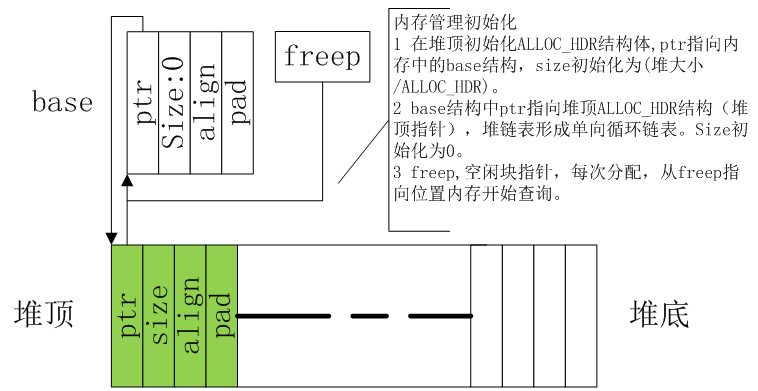
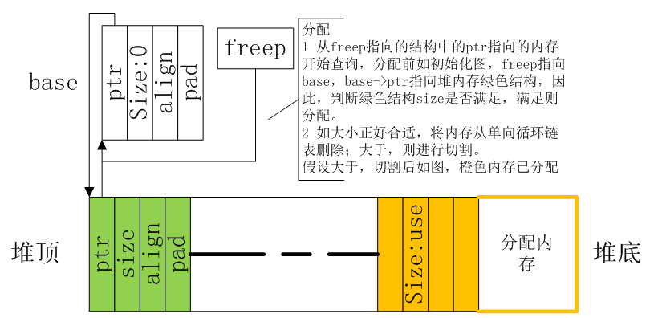
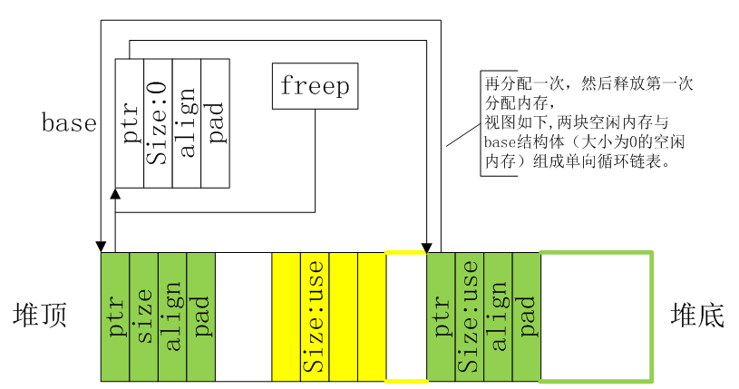

# **内存管理**
>**够用的硬件**
**能用的代码**
**实用的教程**
>屋脊雀工作室编撰 -20190101
愿景：做一套能用的开源嵌入式驱动（非LINUX）
官网：www.wujique.com
github: https://github.com/wujique/stm32f407
淘宝：https://shop316863092.taobao.com/?spm=2013.1.1000126.2.3a8f4e6eb3rBdf
技术支持邮箱：code@wujique.com、github@wujique.com
资料下载：https://pan.baidu.com/s/12o0Vh4Tv4z_O8qh49JwLjg
QQ群：767214262
---

前面已经将所有的硬件驱动实现，验证了硬件功能。但是每一个硬件都是单独测试的，而且并不完善。下一步，我们需要对各个驱动进行整合完善。在整合之前，需要做一些基础工作。其中之一就是实现**内存管理**。
什么叫内存管理呢？为什么要做内存管理？
前面我们已经大概了解了程序中的变量
现在我们复习一下：**局部变量**、**全局变量**。
>局部变量在进入函数时从栈空间分配，退出函数前释放。
>全局变量则在整个程序运行其中一直使用。在程序编译时就已经分配了RAM空间。

那还有没有第三种变量呢？可以说没有。
但是如果从**生存周期**上看，是有的：
**一个变量，在多个函数内使用，但是又不是整个程序运行期间都使用。**
或：
**一个变量，在一段时间内使用，不是整个程序运行生命周期都要用，但是用这个变量的函数会退出，然后重复进入**
（用static定义的局部变量相当于全局变量）

如果不使用动态内存管理，这样的变量就只能定义为全局变量。
如果将这些变量定义为指针，当要使用时，通过内存管理分配，使用完后就释放，这就叫做**动态分配**。
举个实际的例子：
>一个设备，有三种通信方式：串口，USB，网络，在通信过程每个通信方式需要1K RAM。
经过分析，3种通信方式不会同时使用。
那么，如果不使用动态内存，则需要3K变量。
如果使用内存管理动态分配，则只需要1K内存就可以了。
（这个只是举例，如果简单的系统，确定三种方式不同时使用，可以直接复用内存）

通信方式只是举例，其实一个系统中，并不是所有设备都一直使用，如果使用动态内存管理，RAM的**峰值**用量将会大大减少。

## 内存管理方案

**不发明车轮，只优化轮胎。**

内存管理是编程界的一个大话题，有很多经典的方案。很多人也在尝试写新的方案。
内存分配模块我们使用K&R C examples作为基础，然后进行优化。
K&R是谁？就是写《C程序设计语言》的两个家伙。如果你没有这本书，真遗憾。
这本书的8.7章节，<实例--存储分配程序>，介绍了一种基本的存储分配方法。
代码见alloc.c，整个代码只有120行，而且**结构很美**。

## K&R 内存管理方案分析
下面我们结合代码分析这种内存分配方案。
代码在wujique\Utilities\alloc文件夹。

#### 内存分析

* 初始化

在malloc函数中，如果是第一次调用就会初始化内存链表。
代码原来是通过获取堆地址，在堆上建立内存池。我们把他改为更直观的数组定义方式。
内存建立后的内存视图如下：


内存分配的最小单元是：
```c
typedef struct ALLOC_HDR
{
  struct
  {
    struct ALLOC_HDR *ptr;
    unsigned int size;/*本快内存容量*/
  } s;
  unsigned int align;
  unsigned int pad;
} ALLOC_HDR;
```
这也就是内存管理结构体。在32位ARM系统上，这个结构体是16字节。
* 第一次分配

每次分配，就是在一块可以分配的空间尾部切割一块出来，切割的大小是16字节的倍数，而且会比需要的内存多一块头。
这块头在内存释放时需要使用。这一块，也就是内存管理的开销。


* 分配释放后

经过多次分配释放后，内存可能如下图，
绿色是两块不连续的空闲块，黄色是分配出去的块。
分配出去的块，已经不在内存链表里面。


#### 缺点
一般情况上面的代码已经能满足需求。
但是，有以下缺陷：

- 缺点1：容易碎片化

分配使用`首次适应法`，也即是找到一块大于等于要分配内存的空闲块，立刻进行分配。这种方法的优点是速度较快，缺点是容易内存碎片化，分配时将很多大块内存切割成小内存了。
经过多次分配后，很可能出现以下情况：
>空闲内存总量还有10K，但是却被分散在10个块内，而且没有大容量的内存块，再申请2K内存就出现失败。
如果对时间并不是那么敏感，我们可以使用`最适合法`，也即是遍历空闲链表，查找一个最合适的内存（**大于要分配内存且容量最小的空闲块**），减少大内存被切碎的概率。
需要注意的是，最适合法，除了会增加分配时间，**不会减少内存碎片数量，只是增加了空闲内存的集中度**。
假设经过多次分配后，空闲总量还是10K，也是分散在10个空闲块，但是在这10个空闲块中，会有5K的大块，再申请2K的时候，就可以申请到2K内存了。

- 缺点2：内存消耗

内存分配方案使用了一个结构体，每次分配的最小单位就是这个结构体的大小16字节。
```c
typedef struct ALLOC_HDR
{
  struct
  {
    struct ALLOC_HDR *ptr;
    unsigned int size;/*本快内存容量*/
  } s;
  unsigned int align;
  unsigned int pad;
} ALLOC_HDR;
```
一次分配，最少就是2个结构体（一个结构体用于管理分配出去的内存，其余结构体做为申请内存），也就是32字节。
如果代码有大量小内存申请，例如申请100次8个字节
>需求内存：100X8=800字节
实际消耗内存100X32 = 3200字节
利用率只有800/3200 =25%

**如果内存分配只有25%的使用率，对于小内存嵌入式设备来说，是致命的方案缺陷。**

如何解决呢？
我们可以参考LINUX内存分配方案SLAB。
在LINUX中，有很多模块需要申请固定大小的内存（例如node结构体），为了加快分配速度，系统会使用malloc先从大内存池中申请一批node结构体大小的内存，作为一个slab内存池。当需要分配node结构体时，就直接从slab内存池申请。
同理，可以将内存分配优化为：
需要小内存时，从大块内存池分配一块大内存，例如512，使用**新算法管理**，用于小内存分配。
当512消耗尽，再从大内存池申请第二块512字节大内存。
当小内存释放时，判断小块内存池是否为空，如为空，将小块内存池释放回大内存池。
`那如何管理这个小内存池呢？`

- 缺点3：没有管理已分配内存

内存分配没有将已分配内存管理起来。
我们可以对已分配内存进行统一管理：
>1 已分配内存在头部有原来的结构体，通过ptr指针，将所有已分配内存连接在已分配链表上。
>2 利用不使用的align跟pad成员，记录分配时间跟分配对象(记录哪个驱动申请的内存)

通过上面优化后，就可以**统计已经分配了多少内存，还有多少空闲内存，哪个模块申请了最多内存**等数据。

## 使用
1 将代码中的所有free改为为wjq_free，malloc改为wjq_malloc。
>串口缓冲用了free跟malloc.
fatfs的syscall.c 用了
lwip的mem.h用了。

2 修改启动代码, 栈跟堆改小。不用库的malloc，堆可以完全不要。栈，还是要保留，但是不需要那么大，如果函数内用到比较大的局部变量，改为动态申请。
```c
Stack_Size      EQU     0x00002000

                AREA    STACK, NOINIT, READWRITE, ALIGN=3
Stack_Mem       SPACE   Stack_Size
__initial_sp

; <h> Heap Configuration
;   <o>  Heap Size (in Bytes) <0x0-0xFFFFFFFF:8>
; </h>

Heap_Size       EQU     0x00000010

                AREA    HEAP, NOINIT, READWRITE, ALIGN=3
__heap_base
Heap_Mem        SPACE   Heap_Size
__heap_limit
```

3 内存池开了80K，编译不过
>linking...
.\Objects\wujique.axf: Error: L6406E: No space in execution regions with .ANY selector matching dev_touchscreen.o(.bss).
.\Objects\wujique.axf: Error: L6406E: No space in execution regions with .ANY selector matching mcu_uart.o(.bss).
.\Objects\wujique.axf: Error: L6406E: No space in execution regions with .ANY selector matching etharp.o(.bss).
.\Objects\wujique.axf: Error: L6406E: No space in execution regions with .ANY selector matching mcu_can.o(.bss).
.\Objects\wujique.axf: Error: L6406E: No space in execution regions with .ANY selector matching netconf.o(.bss).

先把内存池改小，编译通过之后，分析 map文件，用了较多全局变量的统统改小或者改为动态申请。
分析map文件，还可以检查还有没有使用库里面的malloc。
>Code (inc. data)   RO Data    RW Data    ZI Data      Debug   Object Name

       124         32          0          4      40976       1658   alloc.o
        16          0          0          0          0       2474   def.o
        96         34       8640          4          0       1377   dev_dacsound.o
       300         36          0          0          0       2751   dev_esp8266.o
       204         38          0          1          0       1446   dev_key.o
       436         98          0         10         16       3648   dev_touchkey.o
       310         18          0         14       3000       3444   dev_touchscreen.o
       932         18          0          4          0      15981   dhcp.o
         0          0          0          0       3964       5933   dual_func_demo.o
       280         14         12          0        200       5963   etharp.o
         0          0          0          0          0      35864   ethernetif.o
         0          0          0          0          0       3820   inet.o
        98          0          0          0          0       2022   inet_chksum.o
         0          0          0          0          0       4163   init.o
       168          4          0         20          0       4763   ip.o
         0          0          4          0          0       6463   ip_addr.o
       386          4          0          0          0       4118   ip_frag.o
       264         38          0          8         16     383399   main.o
        84          8          0          0          0       1410   mcu_adc.o
        60         32          0          1         68       1511   mcu_can.o
        12          0          0          0          0        521   mcu_dac.o
       128         14          0          0          0       2352   mcu_i2c.o
        28          8          0          1          0        630   mcu_i2s.o
       336         92          0          0          0       2689   mcu_rtc.o
       430         86          0          1          0       4396   mcu_timer.o
      1564         82          0          0        328       9072   mcu_uart.o
       504         20          0         12          0       4510   mem.o
        56         10          0          0       9463       3250   memp.o
       120         14          0          0          0       1651   misc.o
         0          0          0          0         56       1066   netconf.o
       118          0          0          0          0       4267   netif.o
       684          0          0          0          0       6971   pbuf.o
        36          8        392          0       8192        824   startup_stm32f40_41xxx.o

从上面数据可以看出以下源文件用了较多RAM。
>alloc.o 内存池
dev_touchscreen.o 触摸屏缓冲
dual_func_demo.o USB，应该能优化
memp.o 什么鬼？又一个内存池？应该是要优化掉
startup_stm32f40_41xxx.o 启动代码，是栈跟堆用的RAM.

由于编译器的优化，项目没用到的代码没有编译进来，上面的map数据并不完整。
等后面我们做完全部测试程序，所有用到的代码都会参与连接，到时还需要优化一次。

## 总结
内存管理暂时到此，等后面所有功能都完成后，再进行一次优化。
如果对内存分配时间有更高要求，可使用伙伴内存分配法。
大家可以参考《都江堰操作系统与嵌入式系统设计》，这个文档里面的一些软件设计策略非常好。
http://www.djyos.com/?page_id=50

**最新内存管理请查看屋脊雀在github上托管的代码**

---
end
---
