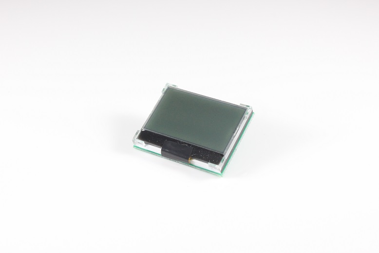

# **COG LCD & OLED LCD 调试记录**
>**够用的硬件**
**能用的代码**
**实用的教程**
>屋脊雀工作室编撰 -20190101
愿景：做一套能用的开源嵌入式驱动（非LINUX）
官网：www.wujique.com
github: https://github.com/wujique/stm32f407
淘宝：https://shop316863092.taobao.com/?spm=2013.1.1000126.2.3a8f4e6eb3rBdf
技术支持邮箱：code@wujique.com、github@wujique.com
资料下载：https://pan.baidu.com/s/12o0Vh4Tv4z_O8qh49JwLjg
QQ群：767214262
---

前面我们调试过彩屏，彩屏显示效果很好，但是价格高。
而且在一些低主频的单片机上带不动，如果换SPI的彩屏，240x320像素太大，刷屏慢。
在很多场合，人机交互界面并不需要那么复杂。简单的交互，只要一块128*64像素的单色屏就足够了。

## LCD种类

液晶LCD有很多种类，很早之前，**12864**就是一种屏幕的通称。这种屏幕是绿色的，很大，非常笨重，通常在工业仪器上使用。
现在常用的液晶除了**TFT**，就是**COG**和**OLED**。
#### COG lcd
很多人可能不知道COG LCD是什么，我觉得跟现在开发板销售有关：大家都出大屏，玩酷炫界面。离实际应用太远。
单片机产品使用的LCD其实更常见的是COG LCD。

所谓的COG LCD：
>COG是Chip On Glass的缩写，就是驱动芯片直接绑定在玻璃上，透明的。

实物如下图：

显示效果

这种LCD通常像素不高，常用的有128X64，128X32。
一般只支持黑白显示，也有灰度屏。
接口通常是SPI，I2C。也有号称支持8位并口的，不过基本不会用。3根IO能解决的问题，没必要用8根吧？
常用的驱动IC：STR7565。
#### OLED lcd
买过开发板的应该基本用过。新技术，大家都感觉高档，手环智能手表等时尚产品多是用OLED。OLED目前屏幕较小，大一点的都很贵。
在控制上跟COG LCD类似，区别是两者的显示方式不一样。从程序角度看，最大的差别就是：OLED LCD不用控制背光。
实物如下图，

裸屏


常见的是SPI和I2C接口。
常见驱动IC：SSD1615。

## 接口

#### 硬件接口
COG屏跟OLED屏，内置控制器不同，但是基本上都支持I2C，SPI通信。
这次调试的模块使用SPI通信。

上图是COG LCD信号
>1脚A0，选择命令或数据通信。
3脚SDA，相当于SPI的 mosi
4脚时钟
5脚片选
6脚复位信号
9脚背光


上图是OLED模块接口，跟COG接口是兼容的。
这两个LCD，可以接到我们核心板的外扩SPI接口上，使用SPI3控制器。
外扩接口信号如下图：

LCD的1脚接到外扩接口的1脚即可。

#### 控制
spi接口的LCD控制其实跟TFT LCD的控制逻辑相似。
SPI上的数据也分命令和显示数据，由A0脚的电平决定。
OLED和COG LCD的初始化，通常也是由模组厂提供。

## 驱动设计

#### 硬件接口

COG跟OLED，也是LCD，那么功能应该跟TFT lcd是一致的。
驱动提供的接口也应该一致，都是下面的接口：
```c
typedef struct  
{
	u16 id;

	s32 (*init)(void);
	s32 (*draw_point)(u16 x, u16 y, u16 color);
	s32 (*color_fill)(u16 sx,u16 ex,u16 sy,u16 ey, u16 color);
	s32 (*fill)(u16 sx,u16 ex,u16 sy,u16 ey,u16 *color);
	s32 (*onoff)(u8 sta);
	s32 (*prepare_display)(u16 sx, u16 ex, u16 sy, u16 ey);
	void (*set_dir)(u8 scan_dir);
	void (*backlight)(u8 sta);
}_lcd_drv;
```
>如果某种LCD不支持某些接口，执行空操作即可。
例如OLED就没有背光控制。

#### 层次

在调试TFT LCD的时候，在驱动中实现了一些显示函数，例如：
```c
s32 dev_lcd_drawpoint(u16 x, u16 y, u16 color)
void put_string_center(int x, int y, char *s, unsigned colidx)
...
```
dev_lcd开头的函数，其实应该归类为GUI层（或者LCD panel层），而不是LCD 驱动层。
当时为了方便，暂时放在TFT LCD源码内。现在添加了COG跟OLED驱动，要将LCD中间层的分离出来。
函数层次应该如下：

因此我们将这些函数抽取出来，单独做一个dev_lcd.c的源码。

#### LCD PANNEL接口跟LCD驱动连通

这个框架其实非常简单：
1 在dev_lcd_init函数内**选择**要初始化的LCD，
```c
/* 初始化OLED LCD */
		ret = drv_ssd1615_init();
		if(ret == 0)
		{
			LCD.drv = &OledLcdSSD1615rv;
			LCD.dir = W_LCD;
			LCD.height = 64;
			LCD.width = 128;
		}
```
2 初始化之后将对应LCD的驱动_lcd_drv指针赋值到LCD结构体，LCD结构体如下，第一个结构体成员就是驱动，另外四个是相关参数。
```c
struct _strlcd_obj
{
	_lcd_drv *drv;

	u8  dir;	//横屏还是竖屏控制：0，竖屏；1，横屏。
	u8  scandir;//扫描方向
	u16 width;	//LCD 宽度
	u16 height;	//LCD 高度

};
```
3 当应用程序调用函数时，例如put_char，在函数内通过LCD结构体内的drv指针调用对应的LCD驱动函数。

####  COG/OLED驱动

STR7565跟SSD1615非常类似，两个驱动除了初始化外，其他驱动函数共用。
* 硬件接口

我们定义一个LCD接口，叫做bus_seriallcd，主要基于SPI3控制器，还有命令数据选择脚、复位管脚，COG还有背光控制管脚。
这个接口，封装以下接口给LCD驱动使用：
```c
void bus_seriallcd_IO_init(void)
s32 bus_seriallcd_bl(u8 sta)
s32 bus_seriallcd_init()
s32 bus_seriallcd_open()
s32 bus_seriallcd_close()
s32 bus_seriallcd_write_data(u8 *data, u16 len)
s32 bus_seriallcd_write_cmd(u8 cmd)
```
* 显存

COG 跟 OLED每个点的显示数据只用一个BIT表示。

如上图的说明，str7565芯片内部显存65\*132bit，我们的64\*128液晶，并没有全部用完。
不同的液晶使用的显存不一样，要根据实际情况做**偏移**，我们的液晶从（0.0）开始，因此不需要做偏移。
显示一个点用一个位，但是我们操作一次是写一个字节，为了操作方便，我们开辟一片**显示缓存**，用于记录当前LCD显示内容。
```c
struct _cog_drv_data
{
	u8 gram[8][128];
};
```
修改显示内容时先将数据组织到显存，再通过刷屏函数更新到LCD。
***一个像素点占显存的一个BIT，但是SPI一次传输的是1个字节8个BIT。***
刷屏函数如下：
```c
/**
 *@brief:      drv_ST7565_refresh_gram
 *@details:       刷新指定区域到屏幕上
                  坐标是横屏模式坐标
 *@param[in]   u16 sc  
               u16 ec  
               u16 sp  
               u16 ep  
 *@param[out]  无
 *@retval:     static
 */
static s32 drv_ST7565_refresh_gram(u16 sc, u16 ec, u16 sp, u16 ep)
{
	struct _cog_drv_data *gram;
	u8 i;

	//uart_printf("drv_ST7565_refresh:%d,%d,%d,%d\r\n", sc,ec,sp,ep);
	gram = (struct _cog_drv_data *)&LcdGram;

	bus_seriallcd_open();
        for(i=sp/8; i <= ep/8; i++)
        {
        	bus_seriallcd_write_cmd (0xb0+i);    //设置页地址（0~7）
        	bus_seriallcd_write_cmd (((sc>>4)&0x0f)+0x10);      //设置显示位置—列高地址
        	bus_seriallcd_write_cmd (sc&0x0f);      //设置显示位置—列低地址

        	bus_seriallcd_write_data(&(gram->gram[i][sc]), ec-sc+1);

	}
	bus_seriallcd_close();

	return 0;
}

```

* 测试

现在程序不能支持多个lcd同时工作，需要在初始化函数中选择使用哪个LCD。
```c
#if 1
	if(ret != 0)
	{
		/* 初始化COG 12864 LCD */
		ret = drv_ST7565_init();
		if(ret == 0)
		{
			LCD.drv = &CogLcdST7565Drv;
			LCD.dir = W_LCD;
			LCD.height = 64;
			LCD.width = 128;
		}
	}
	#else
	if(ret != 0)
	{
		/* 初始化OLED LCD */
		ret = drv_ssd1615_init();
		if(ret == 0)
		{
			LCD.drv = &OledLcdSSD1615rv;
			LCD.dir = W_LCD;
			LCD.height = 64;
			LCD.width = 128;
		}
	}
	#endif
```
测试程序也和彩屏不一样，
```c
put_string_center (20, 32,
			   "ADCD WUJIQUE !", BLACK);
		Delay(1000);
		LCD.drv->color_fill(0,LCD.width,0,LCD.height,WHITE);
		Delay(1000);
		LCD.drv->color_fill(0,LCD.width,0,LCD.height,BLACK);
		Delay(1000);
		LCD.drv->color_fill(0,LCD.width,0,LCD.height,WHITE);
		Delay(1000);
```

**更多驱动细节请查看代码dev_str7565.c**

## 总结
请看下节，用VSPI控制LCD。

**实际项目最好不要使用本节例程的驱动，请从github上获取最新的驱动代码**
本节只是LCD驱动架构演进的中间过程。

---
end
---
