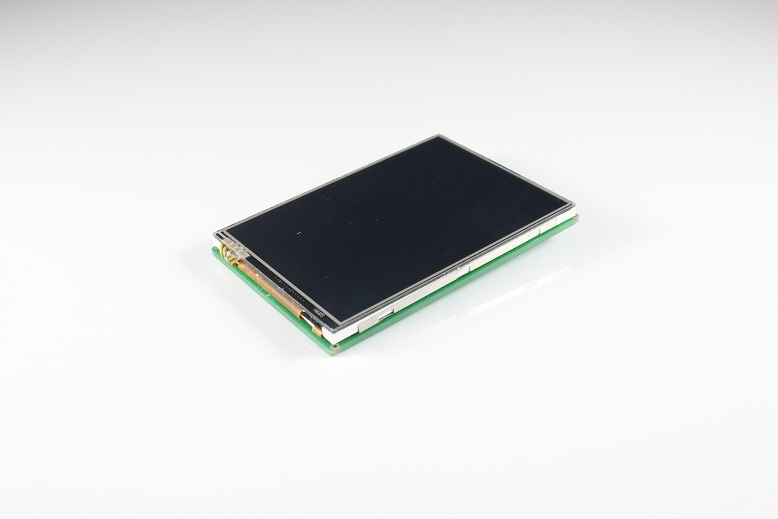
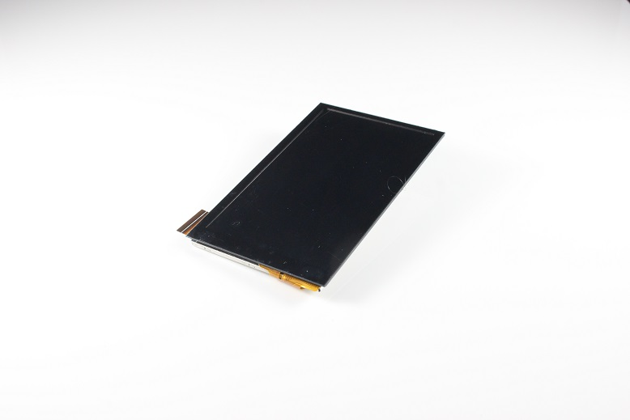
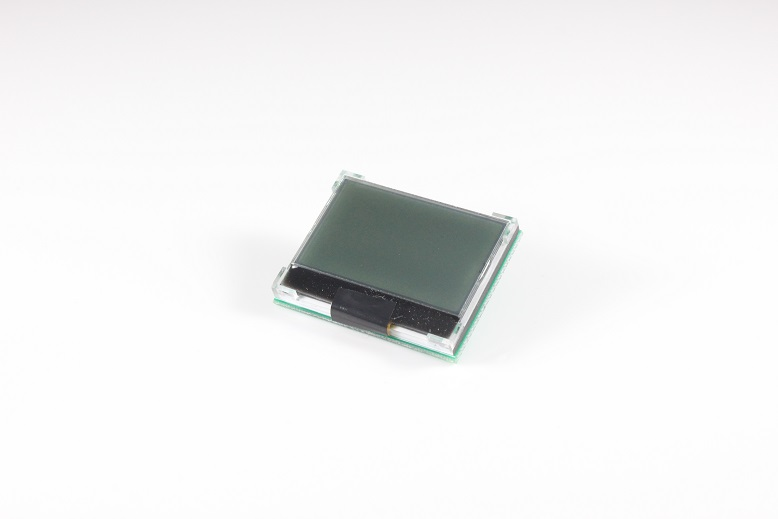
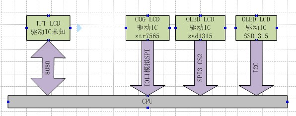
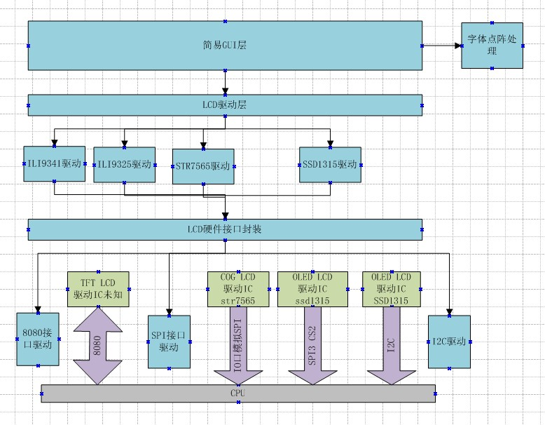
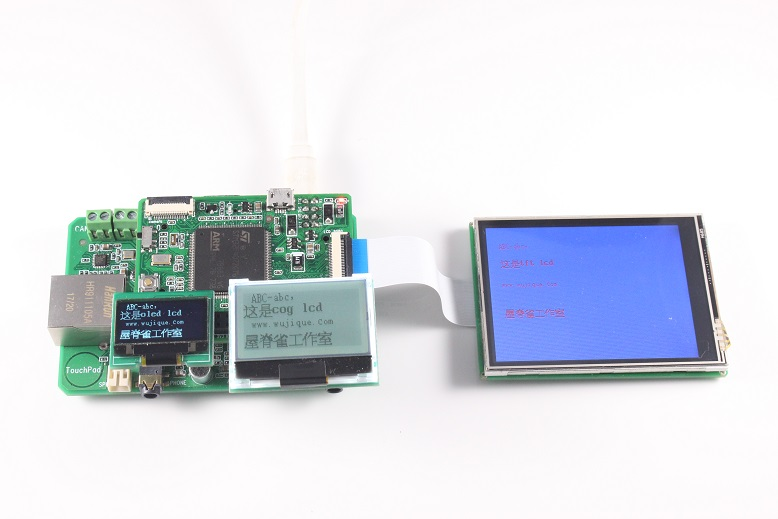

# LCD驱动应该怎么写？
>**够用的硬件**
>
>**能用的代码**
>
>**实用的教程**
>
>屋脊雀工作室编撰 -20190101
>
>愿景：做一套能用的开源嵌入式驱动（非LINUX）
>
>官网：www.wujique.com
>
>github: https://github.com/wujique/stm32f407
>
>淘宝：https://shop316863092.taobao.com/?spm=2013.1.1000126.2.3a8f4e6eb3rBdf
>
>技术支持邮箱：code@wujique.com、github@wujique.com
>
>资料下载：https://pan.baidu.com/s/12o0Vh4Tv4z_O8qh49JwLjg
>
>QQ群：767214262
---

网络上配套STM32开发板有很多LCD例程，主要是TFT LCD跟OLED的。
从这些例程，大家都能学会如何点亮一个LCD。
但是不知道有多少人会直接使用这些代码，至少我不用，不是不用，而是用不了。
因为这些代码都有下面这些问题：
>1 分层不清晰，通俗讲就是模块化太差。
2 接口乱。其实只要接口不乱，分层就会好很多了。
3 可移植性差。
4 通用性差。

为什么这样说呢？如果你已经了解了LCD的操作，请思考如下情景：
>1 代码空间不够，只能保留9341的驱动，其他LCD驱动全部删除。能一键（一个宏定义）删除吗？删除后要改多少地方才能编译通过？
2 有一个新产品，收银设备。系统有两个LCD，一个叫做主显示，收银员用；一个叫顾显，顾客看金额。怎么办？这些例程代码要怎么改才能支持两个屏幕？复制一套然后改函数名称？这样确实能完成任务，只不过程序从此就进入**恶性循环**了。文艺点说，就是程序变得不美了。
3 一个OLED，原来接在SPI，后来改到I2C，容易改吗？
4 原来只是支持中文，现在要卖到南美，要支持多米尼加语言，好改吗？

大家慢慢想。

## LCD种类概述
在讨论怎么写LCD驱动之前，我们先大概了解一下嵌入式常用LCD。
只是概述一些跟驱动架构设计有关的概念。至于原理跟细节，在此不做深入讨论，会有专门文章介绍，或者参考网络文档。
#### TFT lcd
TFT LCD，也就是我们常说的彩屏。
通常像素较高，例如常见的2.8寸，320X240像素。4.0寸的，像素800X400。
这些屏通常使用并口，也就是8080或6800接口（STM32 的FSMC接口）；
或者是RGB接口，STM32F429等部分较贵的芯片支持。
其他例如手机上使用的有MIPI接口。
也有一些支持SPI接口的，不过除非是比较小的屏幕，否则不建议使用SPI接口，速度慢，刷屏闪屏。
玩STM32常用的TFT lcd屏幕驱动IC通常有：ILI9341/ILI9325等。
2.8寸 tft lcd

4寸 IPS


#### COG lcd
很多人可能不知道COG LCD是什么，我觉得跟现在开发板销售方向有关系，大家都出大屏，玩酷炫界面。
使用单片机的产品，COG LCD其实占比非常大。
所谓的COG LCD，

>COG是Chip On Glass的缩写，就是驱动芯片直接绑定在玻璃上，透明的。

实物像下图：

这种LCD通常像素不高，常用的有128X64，128X32。
一般只支持黑白显示，也有灰度屏，我没怎么用过。
接口通常是SPI，I2C。也有号称支持8位并口的，不过基本不会用，3根IO能解决的问题，没必要用8根吧？
常用的驱动IC：STR7565。

#### OLED lcd
买过开发板的应该基本用过。新技术，大家都感觉高档，在手环等产品常用。OLED目前屏幕较小，大一点的都很贵。
在控制上跟COG LCD类似，区别是两者的显示方式不一样。从我们程序角度来看，最大的差别就是，OLED LCD，不用控制背光。。。。。
实物如下图，

常见的是SPI跟I2C接口。
常见驱动IC：SSD1615。

## 硬件场景
接下来的讨论，都基于以下硬件信息：
1 有一个TFT屏幕，接在FSMC接口，什么型号屏幕？不知道。
2 有一个COG LCD，接在几根IO口上，驱动IC是STR7565，128X32像素。
3 有一个OLED LCD，接在硬件SPI3和几根IO口上，驱动IC是SSD1315，128x64像素。
4 有一个OLED LCD，接在I2C接口上，驱动IC是SSD1315，128x64像素


## 预备知识
在进入讨论之前，我们先大概说一下下面几个概念，对于这些概念，如果你想深入了解，请GOOGLE。
#### 面向对象
面向对象，是编程界的一个概念，常在C++中出现。
什么叫面向对象呢？
编程有两种要素：程序（方法），数据（属性）。
例如：一个LED，我们可以点亮或者熄灭它，这叫方法。
LED什么状态？亮还是灭？这就是属性。
我们通常这样编程：
```c
u8 ledsta = 0;

void ledset(u8 sta)
{

}
```
这样的编程有一个问题，假如我们有10个这样的LED，怎么写？
最简单粗暴的方法就是用10个函数。不过只要是做过一点程序的人都会觉得这个方法太蠢。
至少，大家都会在函数增加一个参数，然后在函数里面用if-else或者switch语句处理不同LED。
其实，更高级一点的是用面向对象，将方法和属性分开。
我们可将每一个LED封装为一个对象。可以这样做：
```c

/*
定义一个结构体，将LED这个对象的属性跟方法封装。
这个结构体就是一个对象。
但是这个不是一个真实的存在，而是一个对象的抽象。
*/
typedef struct
{
	u8 sta;
	void (*setsta)(u8 sta);
}LedObj;

/*
	声明一个LED对象，名称叫做LED1，
	并且实现它的方法drv_led1_setsta
*/
void drv_led1_setsta(u8 sta)
{

}

LedObj LED1={
		.sta = 0,
		.setsta = drv_led1_setsta,
	};

/*
	声明一个LED对象，名称叫做LED2，
	并且实现它的方法drv_led2_setsta
*/
void drv_led2_setsta(u8 sta)
{

}

LedObj LED2={
		.sta = 0,
		.setsta = drv_led2_setsta,
	};

/*
	操作LED的函数，参数指定哪个led
*/
void ledset(LedObj *led, u8 sta)
{
	led->setsta(sta);
}
```
>抛砖引玉，很多地方不正确，但是不想展开，大家自己搜索资料学习。

是的，在C语言中，**实现面向对象的手段就是结构体的使用**。
上面的代码，对于API来说，就很友好了。
操作所有LED，使用同一个接口，只需告诉接口哪个LED。
大家想想，前面说的LCD硬件场景。
4个LCD，如果不面向对象，显示汉字的接口是不是要实现4个？每个屏幕一个？

#### 驱动与设备分离
>如果要深入了解驱动与设备分离，请看LINUX驱动的书籍。

什么是设备？
设备就是属性，就是参数，就是驱动程序要用到的数据和硬件接口。
那么驱动就是控制这些数据和接口的**代码过程**。
通常来说，如果LCD的驱动IC相同，就用相同的驱动。有些不同的IC也可以用相同的，例如SSD1315跟STR7565，除了初始化，其他都可以用相同的驱动。
例如一个COG lcd:
>驱动IC是STR7565
128*64像素
用SPI3
背光用PF5
命令线用PF4
复位脚用PF3

上面所有的信息综合，就是一个设备。
驱动就是STR7565的驱动。

为什么要驱动跟设备分离，因为要解决下面问题：
>有一个新产品，收银设备，系统有两个LCD，一个叫做主显示，收银员用，一个叫顾显，顾客看金额使用。怎么办？这些例程代码要怎么改才能支持两个屏幕？复制一套然后改函数名称？这样确实能完成任务，只不过程序从此就进入恶性循环了。

这个问题，两个设备用同一套程序控制才是最好的解决办法。

驱动与设备分离的手段：
>在驱动程序接口中增加设备参数，驱动用到的所有资源从设备参数传入。

驱动如何跟设备绑定呢？通过设备的驱动IC型号。

#### 模块化
模块化就是将一段程序封装，提供一套相同接口，给不同的驱动使用。
不模块化就是，在不同的驱动中都实现这段程序。
例如字库处理，在显示汉字的时候，我们要找点阵，在打印机打印汉字的时候，我们也要找点阵，你觉得程序要怎么写？
把点阵处理做成一个模块，就是模块化。

非模块化的典型特征就是一根线串到底，没有任何层次感。

## LCD到底是什么
前面我们说了面向对象，想要对LCD进行抽象，得出一个对象，就需要知道LCD到底是什么。
我们问自己下面几个问题：
1 LCD能做什么？
2 要LCD做什么？
3 谁想要LCD做什么？

刚刚接触嵌入式的朋友可能不是很了解，可能会想不通。我们模拟一下LCD的功能操作数据流。
APP想要显示一个汉字。
>1 首先，需要一个显示汉字的接口，APP调用这个接口就可以显示汉字了。假设接口叫做lcd_display_hz。
2 汉字从哪来？从点阵字库来，所以在lcd_display_hz函数内就要调用一个叫做find_font的函数获取点阵。
3 获取点阵后要将点阵显示到LCD上，那么我们调用一个ILL9341_dis的接口，将点阵刷新到驱动IC型号为ILI9341的LCD上。
4 ILI9341_dis怎么将点阵显示上去？调用一个8080_WRITE的接口。

好的，这个就是大概过程，我们从这个过程去抽象LCD功能接口。
汉字跟LCD对象有关吗？无关。在LCD眼里，无论汉字还是图片，都是一个个点。
那么前面问题的答案就是：
>1 LCD可以一个点一个点显示内容。
2 要LCD显示汉字或图片-----转化后就是显示一堆点
3 APP想要LCD显示图片或文字。

结论就是：
所有LCD对象的功能就是显示点。
那么驱动只要提供显示点的接口就可以了，显示一个点，显示一片点。
抽象接口如下：
```c
/*
	LCD驱动定义
*/
typedef struct  
{
	u16 id;

	s32 (*init)(DevLcd *lcd);
	s32 (*draw_point)(DevLcd *lcd, u16 x, u16 y, u16 color);
	s32 (*color_fill)(DevLcd *lcd, u16 sx,u16 ex,u16 sy,u16 ey, u16 color);
	s32 (*fill)(DevLcd *lcd, u16 sx,u16 ex,u16 sy,u16 ey,u16 *color);
	s32 (*onoff)(DevLcd *lcd, u8 sta);
	s32 (*prepare_display)(DevLcd *lcd, u16 sx, u16 ex, u16 sy, u16 ey);
	void (*set_dir)(DevLcd *lcd, u8 scan_dir);
	void (*backlight)(DevLcd *lcd, u8 sta);
}_lcd_drv;
```
上面的接口，也就是对应的驱动，包含了一个驱动id号。
>1 id，驱动型号
2 初始化
3 画点
4 将一片区域的点显示某种颜色
5 将一片区域的点显示某些颜色
6 显示开关
7 准备刷新区域（主要彩屏直接DMA刷屏使用）
8 设置扫描方向
9 背光控制

## LCD驱动框架
我们设计了如下的驱动框架

从上到下分别是：

1. GUI层：如果不使用GUI，普通的划线，画圆等，也算GUI。
2. LCD驱动层：主要是封装下一层驱动IC层的接口，以便GUI层用一套接口操作多种LCD。
3. 驱动IC驱动层，实现不同的LCD控制，对上提供同样的接口（前面说的_lcd_drv结构体）
4. 对不同的硬件接口封装，以便一种驱动使用多种接口，例如SSD1315驱动可以用I2C，也可以用SPI。
5. 接口层，例如SPI驱动，其实不算LCD功能范畴。

## 代码分析
代码分四层：
1. GUI和LCD驱动层，代码在下面两个文件
dev_lcd.c
dev_lcd.h
2. 显示驱动IC层
dev_str7565.c & dev_str7565.h
dev_ILI9341.c & dev_ILI9341.h
3. LCD接口封装层
dev_lcdbus.c&dev_lcdbus.h
3. 接口层
mcu_spi.c & mcu_spi.h
mcu_i2c.c & mcu_i2c.h
stm324xg_eval_fsmc_sram.c & stm324xg_eval_fsmc_sram.h

#### GUI和LCD层
这层主要有3个功能
**1 设备管理**
首先定义了一堆LCD参数结构体，结构体包含ID，像素。
并且把这些结构体组合到一个list数组内。
```c
/*
	各种LCD的规格参数
*/
_lcd_pra LCD_IIL9341 ={
		.id	  = 0x9341,
		.width = 240,	//LCD 宽度
		.height = 320,	//LCD 高度
};
...
/*各种LCD列表*/
_lcd_pra *LcdPraList[5]=
			{
				&LCD_IIL9341,		
				&LCD_IIL9325,
				&LCD_R61408,
				&LCD_Cog12864,
				&LCD_Oled12864,
			};
```
然后定义了所有驱动list数组，数组内容就是驱动，在对应的驱动文件内实现。
```c
/*
	所有驱动列表
	驱动列表
*/
_lcd_drv *LcdDrvList[] = {
					&TftLcdILI9341Drv,
					&TftLcdILI9325Drv,
					&CogLcdST7565Drv,
					&OledLcdSSD1615rv,
```
定义了设备树，即是定义了系统有多少个LCD，接在哪个接口，什么驱动IC。
如果是一个完整系统，可以做成一个类似LINUX的设备树。
```c
/*
	设备树定义
	指明系统有多少个LCD设备，挂在哪个LCD总线上。
*/
#define DEV_LCD_C 4//系统存在3个LCD设备
LcdObj LcdObjList[DEV_LCD_C]=
{
	{"i2coledlcd",  LCD_BUS_I2C,  0X1315},
	{"vspioledlcd", LCD_BUS_VSPI, 0X1315},
	{"spicoglcd",   LCD_BUS_SPI,  0X7565},
	{"tftlcd",      LCD_BUS_8080, NULL},
};
```
**2 接口封装**
```c
void dev_lcd_setdir(DevLcd *obj, u8 dir, u8 scan_dir)
s32 dev_lcd_init(void)
DevLcd *dev_lcd_open(char *name)
s32 dev_lcd_close(DevLcd *dev)
s32 dev_lcd_drawpoint(DevLcd *lcd, u16 x, u16 y, u16 color)
s32 dev_lcd_prepare_display(DevLcd *lcd, u16 sx, u16 ex, u16 sy, u16 ey)
s32 dev_lcd_display_onoff(DevLcd *lcd, u8 sta)
s32 dev_lcd_fill(DevLcd *lcd, u16 sx,u16 ex,u16 sy,u16 ey,u16 *color)
s32 dev_lcd_color_fill(DevLcd *lcd, u16 sx,u16 ex,u16 sy,u16 ey,u16 color)
s32 dev_lcd_backlight(DevLcd *lcd, u8 sta)
```
大部分接口都是对驱动IC接口的二次封装。有区别的是初始化和打开接口。
初始化，就是根据前面定义的设备树，寻找对应驱动，找到对应设备参数，并完成设备初始化。
打开函数，根据传入的设备名称，查找设备，找到后返回设备句柄，后续的操作全部需要这个设备句柄。

**3 简易GUI层**
主要是一些简单的显示字符函数。
```c
s32 dev_lcd_put_string(DevLcd *lcd, FontType font, int x, int y, char *s, unsigned colidx)
```
其他划线画圆的函数目前只是测试，后续会完善。

#### 驱动IC层
驱动IC层主要完成不同的显示IC驱动，也就是实现下面这个结构体内的所有函数，例如STR7565驱动：
```c
_lcd_drv CogLcdST7565Drv = {
	.id = 0X7565,

	.init = drv_ST7565_init,
	.draw_point = drv_ST7565_drawpoint,
	.color_fill = drv_ST7565_color_fill,
	.fill = drv_ST7565_fill,
	.onoff = drv_ST7565_display_onoff,
	.prepare_display = drv_ST7565_prepare_display,
	.set_dir = drv_ST7565_scan_dir,
	.backlight = drv_ST7565_lcd_bl
	};
```
#### 接口封装层
为了上一层驱动IC层能用于不同的接口，需要对接口进行统一抽象封装。
抽象接口如下：
```C
/*
	LCD接口定义
*/
typedef struct  
{
	char * name;

	s32 (*init)(void);
	s32 (*open)(void);
	s32 (*close)(void);
	s32 (*writedata)(u8 *data, u16 len);
	s32 (*writecmd)(u8 cmd);
	s32 (*bl)(u8 sta);
}_lcd_bus;
```
接口包含：初始化，打开，关闭，写数据，写命令，背光控制。
***当前没有将8080封装，接口抽象没有读数据***

实现3个接口封装：SPI、VSPI、I2C：
```c
_lcd_bus BusSerialLcdSpi={
		.name = "BusSerivaLcdSpi",
		.init =bus_seriallcd_spi_init,
		.open =bus_seriallcd_spi_open,
		.close =bus_seriallcd_spi_close,
		.writedata =bus_seriallcd_spi_write_data,
		.writecmd =bus_seriallcd_spi_write_cmd,
		.bl =bus_seriallcd_spi_bl,				
};

_lcd_bus BusSerialLcdVSpi={
		.name = "BusSerivaLcdVSpi",
		.init =bus_seriallcd_vspi_init,
		.open =bus_seriallcd_vspi_open,
		.close =bus_seriallcd_vspi_close,
		.writedata =bus_seriallcd_vspi_write_data,
		.writecmd =bus_seriallcd_vspi_write_cmd,
		.bl =bus_seriallcd_vspi_bl,				
};

_lcd_bus BusSerialLcdVI2C={
		.name = "BusSerivaLcdVI2C",
		.init =bus_seriallcd_vi2c_init,
		.open =bus_seriallcd_vi2c_open,
		.close =bus_seriallcd_vi2c_close,
		.writedata =bus_seriallcd_vi2c_write_data,
		.writecmd =bus_seriallcd_vi2c_write_cmd,
		.bl =bus_seriallcd_vi2c_bl,				
};
```

#### 接口层
8080层比较简单，用的是官方接口。
SPI、VSPI、I2C接口参考其他章节。

#### 总体流程
前面说的几个模块时如何联系在一起的呢？
请看下面结构体：
```c
/*
	初始化的时候会根据设备数定义，
	并且匹配驱动跟参数，并初始化变量。
	打开的时候只是获取了一个指针
*/
struct _strDevLcd
{
	s32 gd;//句柄，控制是否可以打开

	LcdObj	 *dev;
	/* LCD参数，固定，不可变*/
	_lcd_pra *pra;

	/* LCD驱动 */
	_lcd_drv *drv;

	/*驱动需要的变量*/
	u8  dir;	//横屏还是竖屏控制：0，竖屏；1，横屏。
	u8  scandir;//扫描方向
	u16 width;	//LCD 宽度
	u16 height;	//LCD 高度

	void *pri;//私有数据，黑白屏跟OLED屏在初始化的时候会开辟显存
};

```
每一个设备都会有一个这样的机构体，这个结构体在初始化LCD时初始化。
- 成员dev指向设备树，从这个成员可以知道设备名称，挂在哪个LCD总线，设备ID。
```c
typedef struct
{
	char *name;//设备名字
	LcdBusType bus;//挂在那条LCD总线上
	u16 id;
}LcdObj;
```
其中LcdBusType定义如下：
```c
/*
系统总共有三种LCD总线
*/
typedef enum{
	LCD_BUS_NULL = 0,
	LCD_BUS_SPI,
	LCD_BUS_VSPI,
	LCD_BUS_I2C,//OLED使用，只要两根线，背光也不需要控制，复位也不需要
	LCD_BUS_8080,
	LCD_BUS_MAX
}LcdBusType;
```

-成员pra指向LCD参数，可以知道LCD的规格。
```c
typedef struct
{
	u16 id;
	u16 width;	//LCD 宽度  竖屏
	u16 height;	//LCD 高度    竖屏
}_lcd_pra;
```
-成员drv指向驱动，所有操作通过drv实现。
```c
typedef struct  
{
	u16 id;

	s32 (*init)(DevLcd *lcd);

	s32 (*draw_point)(DevLcd *lcd, u16 x, u16 y, u16 color);
	s32 (*color_fill)(DevLcd *lcd, u16 sx,u16 ex,u16 sy,u16 ey, u16 color);
	s32 (*fill)(DevLcd *lcd, u16 sx,u16 ex,u16 sy,u16 ey,u16 *color);

	s32 (*prepare_display)(DevLcd *lcd, u16 sx, u16 ex, u16 sy, u16 ey);

	s32 (*onoff)(DevLcd *lcd, u8 sta);
	void (*set_dir)(DevLcd *lcd, u8 scan_dir);
	void (*backlight)(DevLcd *lcd, u8 sta);
}_lcd_drv;
```
- 成员dir、scandir、	width、	height是驱动要使用的通用变量。因为每个LCD都有一个结构体，一套驱动程序就能控制多个设备而互不干扰。
- 成员pri是一个私有指针，某些驱动可能需要有些比较特殊的变量，就全部用这个指针记录，通常这个指针指向一个结构体，结构体由驱动定义，并且在设备初始化时申请变量空间。
目前主要用于COG LCD跟OLED LCD显示缓存。

整个LCD驱动，就通过这个结构体组合在一起。
具体如下：
1 初始化，根据设备树LcdObjList，找到驱动跟参数，然后初始化结构体DevLcdList。
2 要使用LCD前，调用dev_lcd_open函数。打开成功就返回一个DevLcd结构体指针。
3 调用dev_lcd_drawpoint函数显示一个点
```c
s32 dev_lcd_drawpoint(DevLcd *lcd, u16 x, u16 y, u16 color)
{
	if(lcd == NULL)
		return -1;

	return lcd->drv->draw_point(lcd, x-1, y-1, color);
}
```
第一个参数Lcd就是打开LCD是得到的指针，函数通过指针调用对应驱动的draw_point函数。
加入是str7565驱动，就是执行下面函数
```c
static s32 drv_ST7565_drawpoint(DevLcd *lcd, u16 x, u16 y, u16 color)
```
在这个函数前面有两行代码，这两行代码的作用是根据传入的总线类型，找到对应LCD总线的操作函数。
```c
	_lcd_bus *LcdBusDrv;
	LcdBusDrv = dev_lcdbus_find(lcd->dev->bus);
```
加入lcd->dev->bus是LCD_BUS_VSPI，LcdBusDrv将指向BusSerialLcdSpi，
那么最后的几句代码，就是执行BusSerialLcdSpi内的函数。
```c
/*效率不高*/
	LcdBusDrv->open();
    LcdBusDrv->writecmd (0xb0 + page );   
    LcdBusDrv->writecmd (((colum>>4)&0x0f)+0x10);
    LcdBusDrv->writecmd (colum&0x0f);    
    LcdBusDrv->writedata( &(gram->gram[page][colum]), 1);
	LcdBusDrv->close();
```
BusSerialLcdSpi内的函数将直接操作对应SPI的接口操作硬件。
## 用法和好处
- 好处1

请看测试程序
```c
void dev_lcd_test(void)
{
	DevLcd *LcdCog;
	DevLcd *LcdOled;
	DevLcd *LcdTft;

	/*  打开三个设备 */
	LcdCog = dev_lcd_open("coglcd");
	if(LcdCog==NULL)
		uart_printf("open cog lcd err\r\n");

	LcdOled = dev_lcd_open("oledlcd");
	if(LcdOled==NULL)
		uart_printf("open oled lcd err\r\n");

	LcdTft = dev_lcd_open("tftlcd");
	if(LcdTft==NULL)
		uart_printf("open tft lcd err\r\n");

	/*打开背光*/
	dev_lcd_backlight(LcdCog, 1);
	dev_lcd_backlight(LcdOled, 1);
	dev_lcd_backlight(LcdTft, 1);

	dev_lcd_put_string(LcdOled, FONT_SONGTI_1212, 10,1, "ABC-abc，", BLACK);
	dev_lcd_put_string(LcdOled, FONT_SIYUAN_1616, 1, 13, "这是oled lcd", BLACK);
	dev_lcd_put_string(LcdOled, FONT_SONGTI_1212, 10,30, "www.wujique.com", BLACK);
	dev_lcd_put_string(LcdOled, FONT_SIYUAN_1616, 1, 47, "屋脊雀工作室", BLACK);

	dev_lcd_put_string(LcdCog, FONT_SONGTI_1212, 10,1, "ABC-abc，", BLACK);
	dev_lcd_put_string(LcdCog, FONT_SIYUAN_1616, 1, 13, "这是cog lcd", BLACK);
	dev_lcd_put_string(LcdCog, FONT_SONGTI_1212, 10,30, "www.wujique.com", BLACK);
	dev_lcd_put_string(LcdCog, FONT_SIYUAN_1616, 1, 47, "屋脊雀工作室", BLACK);

	dev_lcd_put_string(LcdTft, FONT_SONGTI_1212, 20,30, "ABC-abc，", RED);
	dev_lcd_put_string(LcdTft, FONT_SIYUAN_1616, 20,60, "这是tft lcd", RED);
	dev_lcd_put_string(LcdTft, FONT_SONGTI_1212, 20,100, "www.wujique.com", RED);
	dev_lcd_put_string(LcdTft, FONT_SIYUAN_1616, 20,150, "屋脊雀工作室", RED);

	while(1);
}
```
使用一个函数dev_lcd_open，可以打开3个LCD，获取LCD设备。
然后调用dev_lcd_put_string就可以在不同的LCD上显示。
其他所有的gui操作接口都只有一个。
这样的设计对于APP层来说，就很友好。
显示效果



- 好处2

现在的设备树是这样定义的
```c
LcdObj LcdObjList[DEV_LCD_C]=
{
	{"oledlcd", LCD_BUS_VSPI, 0X1315},
	{"coglcd", LCD_BUS_SPI,  0X7565},
	{"tftlcd", LCD_BUS_8080, NULL},
};
```
某天，oled lcd要接到SPI上，只需要将设备树数组里面的参数改一下，就可以了，当然，在一个接口上不能接两个设备。
```c
LcdObj LcdObjList[DEV_LCD_C]=
{
	{"oledlcd", LCD_BUS_SPI, 0X1315},
	{"tftlcd", LCD_BUS_8080, NULL},
};
```

## 字库
暂时不做细说，例程的字库放在SD卡中，各位移植的时候根据需要修改。
具体参考font.c

## 总结
本章节之后 ，一个LCD驱动的雏形，基本完成了。
也基本上将LCD驱动框架的实现思想说明了。
但是还有很多需要改进优化的地方。
最终的软件架构，请参考github仓库最新代码。
或参考《产品手册（软件）.pdf》

---
end
---
