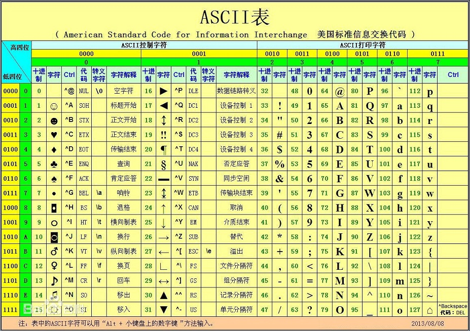
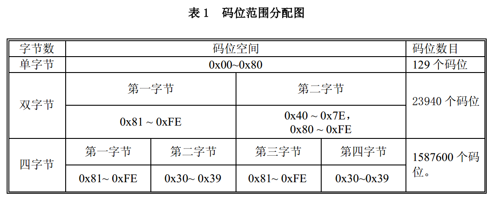
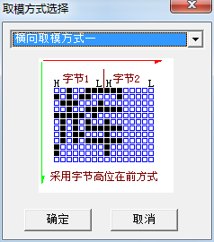
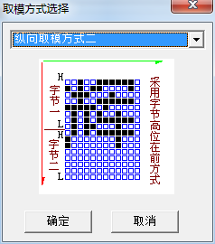
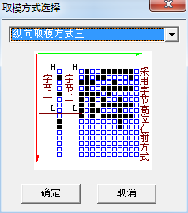
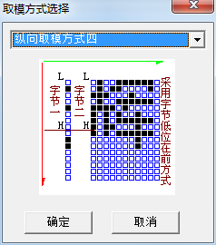
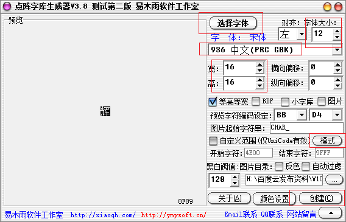

# 汉字点阵字库模块
>**够用的硬件**
>
>**能用的代码**
>
>**实用的教程**
>
>屋脊雀工作室编撰 -20190101
>
>愿景：做一套能用的开源嵌入式驱动（非LINUX）
>
>官网：www.wujique.com
>
>github: https://github.com/wujique/stm32f407
>
>淘宝：https://shop316863092.taobao.com/?spm=2013.1.1000126.2.3a8f4e6eb3rBdf
>
>技术支持邮箱：code@wujique.com、github@wujique.com
>
>资料下载：https://pan.baidu.com/s/12o0Vh4Tv4z_O8qh49JwLjg
>
>QQ群：767214262
---

前面几个小节，我们已经点亮了多种LCD，实现英文显示功能。
现在，我们开始添加汉字点阵功能。
汉字显示原理和英文一样，都是在LCD上描点。区别是，英文只有26个字母，算上大小写和其他字符，也就128个字符，就是ASC编码范围。
字符如何描点，只要在程序内保存字符点阵数据，也就是128个点阵数据。
汉字就不一样了，汉字有几千几万个，但是也没有办法，只能一个汉字做一个点阵数据，所有的点阵数据组成一个点阵字库。

## 汉字编码标准
#### 编码标准
在讨论点阵字库前，先要了解字符编码。
英文的字符编码，就是ASC字符编码。
>ASCII（American Standard Code for Information Interchange，美国信息交换标准代码）是基于拉丁字母的一套电脑编码系统，主要用于显示现代英语和其他西欧语言。它是现今最通用的单字节编码系统，并等同于国际标准ISO/IEC 646。

下图就是ASC码表

英文字符少，只需要一个字节编码。汉字那么多字符，通常用2字节编码，部分字符还用了4字节编码（这些字一般人都不认识）。

常用的汉字内码标准有GB2312、GBK、GB18030、BIG5、UNICODE。

* 大陆编码

>GB=国标
GB2312包含7000多字符，GBK包含2万1左右字符，GB18030包含2万7千左右字符。
3者向下兼容，也即是说，GBK是GB2312的扩展，GB18030则是GBK的扩展。

在标准中，还有一个区位码和内码的概念。
区位码，表示这个汉字在编码标准中的位置，区位码从1开始编码。
但是，由于国际通用标准ASC编码时0到128，因此在保存文件时，汉字不能用，所以，保存时，需要偏移，
偏移后的编码叫机内码，俗称内码。在编程中，我们都是用内码，因为保存文件都是用内码的。
在取点阵时，就需要根据内码算出区位码，根据区位码到点阵字库取点阵数据。

更多细节请参考《**汉字编码字符gb18030.pdf**》。
下图是国标编码标准


* 台湾编码

BIG5是台湾汉字编码标准，主要是繁体。

* 国际编码

UNICODE编码。

## 字库概念
#### 点阵字库
点阵字库，也就是包含很多点阵字体的一个文件。
点阵字体也叫位图字体，其中每个字形都以一组二维像素信息表示。
点阵字体优点是显示速度快，不像矢量字体需要计算；其最大的缺点是不能放大，一旦放大后就会发现文字边缘的锯齿。

* 大小

汉字最小一般是12x12，还有16x16，20x20，24x24，32x32，48x48。
一个16x16的GB18030字库，大概750K。

* 取模方式

大方向有两种：纵向取模、横向取模。
字节顺序有多种。
两者配合起来就有很多种取模方式了。
下面是取模软件的4种方式：



* 取点阵算法

不同的字库取点阵算法会有差异。请根据使用的点阵设计算法。
我们自己生成的汉字点阵算法比较简单：

```c
addr = (hcode-0x81)*190;
if(lcode<0x7f)
{
	addr = addr+lcode-0x40;
}
else
{
	addr = addr+lcode-0x41;
}
addr = addr*FontList[type]->size;
```
> hcode是汉字内码高字节，lcode是汉字内码低字节，经过计算后，得到汉字在点阵中的偏移addr。
其中size是一个汉字点阵的字节数，一个16*16的汉字，通常是32字节。
**本算法没有处理4字节内码的汉字**

#### 矢量字库
>矢量字库保存的是对每一个汉字的描述信息，比如一个笔划的起始、终止坐标，半径、弧度等等。在显示、打印这一类字库时，要经过一系列的数学运算才能输出结果，但是这一类字库保存的汉字理论上可以被无限地放大，笔划轮廓仍然能保持圆滑，打印时使用的字库均为此类字库。

因为LCD是一个点一个点显示的，矢量字库通过处理后，最后还是一堆点阵数据，才能在LCD上显示。

## 制作点阵字库

#### 字库版权
字体是有版权的，通过字模软件获取点阵，理论上是侵权的。大家可以看方正官网
http://ifont.foundertype.com/index/embedfont.html
>5、从Windwos系统复制出的字体是否可以免费使用吗？
        从操作系统和各类网站上都可以找到字库。如果认为这些字体都可以任意的免费使用就错了。字库是知识产权产品，字库的 著作权属于字库的设计开发者。根据相关法律，必须在获得版权人的授权后才可以使用。
    6、用工具从TTF字库中生成的点阵字库是否可以使用？
        网站上有许多“点阵字库生成工具”。这些工具的主要作用就是用TTF字库生成任意尺寸的点阵字库。
        点阵字库是TTF字库的一部分。许多TTF字库为了使小字是显示清晰，都内嵌了点阵字库。所以未经字库版权人授权从TTF字库 中生成点阵字库在产品中使用的行为实际上是盗版行为。

当然，既然有开源软件，肯定就有开源字体
为了长远着想，我们要找一款开源字体做点阵字库。
关于字体授权，大家可以参考知乎的一个话题：https://www.zhihu.com/question/19727859

#### 思源宋体
经过长达一点年半的研发，Adobe 联合 Google 于 2017 年 4 月 3 日发布了思源宋体（ Source Han Serif，Google 称 Noto Serif CJK）。和思源黑体一样，思源宋体以 “SIL 开放字体许可证” 开源发行，且同样含简繁日韩四种汉字写法和七种粗细字重给出。

先在电脑上安装思源汉字字体，安装方法可以参考
https://baijiahao.baidu.com/s?id=1563997223669087&wfr=spider&for=pc

#### 制作字库
易木软件工作室开发了一个点阵生成软件。
选择字体，选择编码标准，设置点阵宽高，在调整字体大小。

其中，字体取模方式如下：

点击生成即可。
我们用软件生成思源字体的点阵字库shscn1212.DZK、shscn1616.DZK。

>生成的字库可能不包含四字节内码汉字。

## 应用点阵字体

#### 存储
字库较大，1212的561K，1616的748K。不可能保存在单片机内。
只能保存在外部储存上。最好是保存在核心板上的FLASH。
但是目前我们还没有在FLASH上做好文件系统，就暂时放在TF卡上。
通过FATFS文件系统读取字库，速度可能会慢一点，等FLASH管理处理好后，再搬移到核心板上的FALSH上。

前面调试USB时已经移植好文件系统，在main函数初始化硬件后挂载SD卡。
```c
s32 fun_mount_sd(void)
```
SD卡中包含以下字体文件：
>songti1616.DZK
songti1212.DZK
shscn1616.DZK
shscn1212.DZK

其中前面两个字体是宋体，有一定版权风险，仅供测试。
后面两个是思源字体，开源。

ASC字体内嵌在代码中，\Utilities\font文件夹中的三个文件就是：
>font_6x12.c、font_8x8.c、font_8x16.c

#### 接口
提供两个接口，一个获取asc点阵，一个获取汉字点阵。
```c
extern s32 font_get_asc(FontType type, char *ch, char *buf);
extern s32 font_get_hz(FontType type, char *ch, char *buf);

```
其中第一个参数type为枚举类型，后续增加新字体，可以增加。
```c
/*
	字体类型定义
*/
typedef enum{
	FONT_SONGTI_1616 = 0,//1616字体，对应的ASC则是8*16
	FONT_SONGTI_1212,	//1212字体，对应的ASC是6*12
	FONT_SIYUAN_1616,
	FONT_SIYUAN_1212,
	FONT_LIST_MAX
}FontType;
```

在lcd中间层只增加了一个函数，最主要也是这个函数。
```c
s32 dev_lcd_put_string(DevLcd *lcd, FontType font, int x, int y, char *s, unsigned colidx)
```
汉字功能就添加完成了。

#### 使用
在代码中直接嵌入中文，文件保存中文用的就是内码，编译后就是一个内码字符串。
```c
dev_lcd_put_string(LcdOled, FONT_SONGTI_1212, 10,1, "ABC-abc，", BLACK);
dev_lcd_put_string(LcdOled, FONT_SIYUAN_1616, 1, 13, "这是oled lcd", BLACK);
dev_lcd_put_string(LcdOled, FONT_SONGTI_1212, 10,30, "www.wujique.com", BLACK);
dev_lcd_put_string(LcdOled, FONT_SIYUAN_1616, 1, 47, "屋脊雀工作室", BLACK);
```

## 总结
如何实现多国语言？

---
end
---
