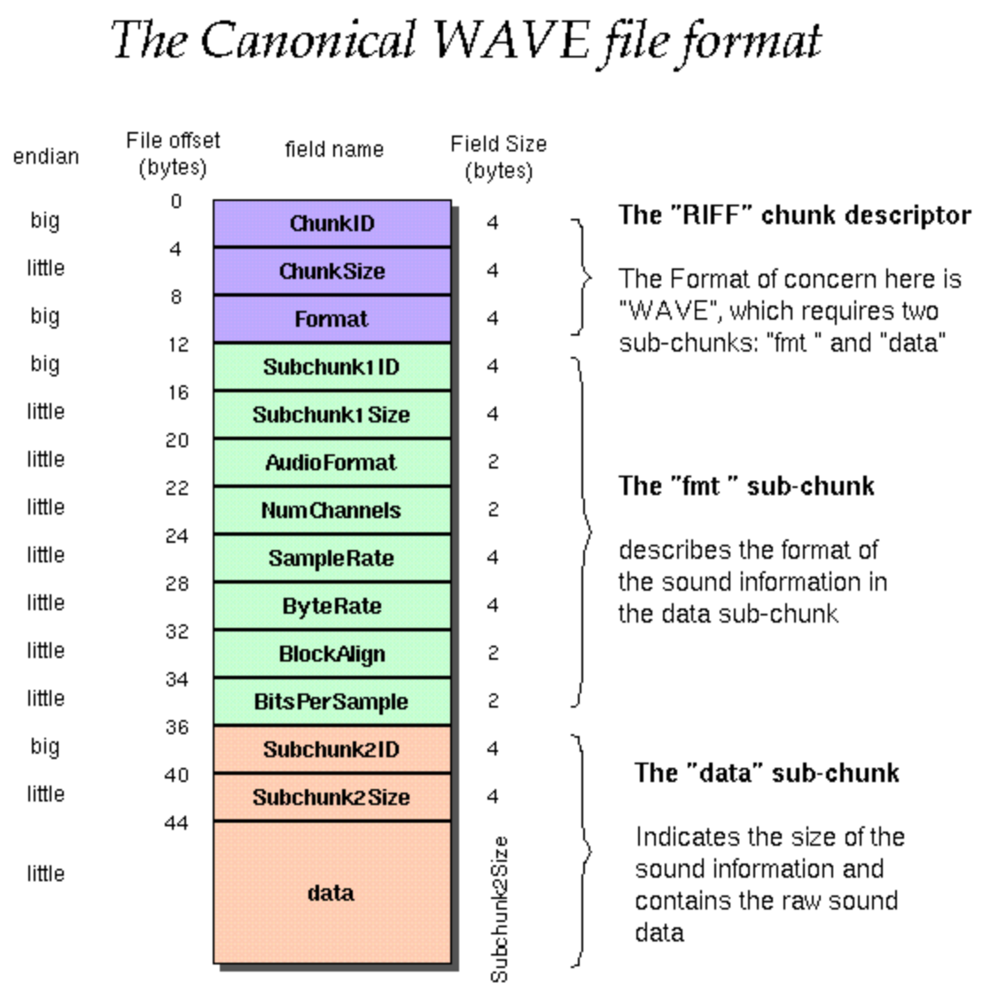
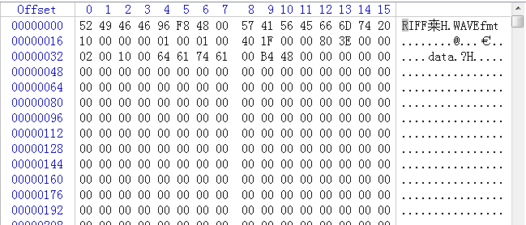

# wav文件播放
>**够用的硬件**
**能用的代码**
**实用的教程**
>屋脊雀工作室编撰 -20190101
愿景：做一套能用的开源嵌入式驱动（非LINUX）
官网：www.wujique.com
github: https://github.com/wujique/stm32f407
淘宝：https://shop316863092.taobao.com/?spm=2013.1.1000126.2.3a8f4e6eb3rBdf
技术支持邮箱：code@wujique.com、github@wujique.com
资料下载：https://pan.baidu.com/s/12o0Vh4Tv4z_O8qh49JwLjg
QQ群：767214262
---

前面硬件调试时，已经完成WM8978调试，由于当时没有文件系统支撑，没做音乐播放。
如今，FATFS已经使用，就让我们开始完成WAV播放功能。

## WAV格式
前面调试I2S和WM8978时，其实已经提到过WAV文件，当时只是将WAV文件转换为数组直接播放，并没有深入了解WAV文件的格式。
>WAV为微软公司（Microsoft)开发的一种声音文件格式，它符合RIFF(Resource Interchange File Format)文件规范，用于保存Windows平台的音频信息资源，被Windows平台及其应用程序所广泛支持，该格式也支持MSADPCM，CCITT A LAW等多种压缩运算法，支持多种音频数字，取样频率和声道，标准格式化的WAV文件和CD格式一样，也是44.1K的取样频率，16位量化数字，因此在声音文件质量和CD相差无几！

*在资料中包含了几个WAV格式说明文档*

#### WAV文件头


上图就是一个WAV文件的格式，在代码中我们如下面定义：

```c
/*wav 文件结构*/
typedef struct _TWavHeader
{          
	/*RIFF块*/
    int rId;    //标志符（RIFF）  0x46464952
    int rLen;   //数据大小,包括数据头的大小和音频文件的大小   (文件总大小-8)      
    int wId;    //格式类型（"WAVE"）   0x45564157

    /*Format Chunk*/
    int fId;    //"fmt " 带一个空格 0X20746D66     
    int fLen;   //Sizeof(WAVEFORMATEX)          
    short wFormatTag;       //编码格式，包括 1 WAVE_FORMAT_PCM，WAVEFORMAT_ADPCM等         
    short nChannels;        //声道数，单声道为1，双声道为2         
    int nSamplesPerSec;   //采样频率         
    int nAvgBytesPerSec;  //每秒的数据量         
    short nBlockAlign;      //块对齐          
    short wBitsPerSample;   //WAVE文件的采样大小         
    int dId;              //"data"     有可能是FACT块     
    int wSampleLength;    //音频数据的大小
    /*紧跟后面可能有一个fact 块，跟压缩有关，如果没有，就是data块*/
}TWavHeader;
```
int 型变量占用4字节空间，short型变量占用2字节空间。

我们可以通过**winhex**软件查看一个wav的格式，其中头部如下：


>前面4个字节就是RIFF标志。**程序中写的是0X46464952**，这是经常遇到的问题，读文件后保存到一个变量中，字节顺序是不一样的。


#### 音频数据排布
WAV文件有多种格式：单声道，双声道。8位、16位、24位。
文件中样点保存顺序是：左声道样点-右声道样点-左声道样点-右声道样点。单声道就只有一个声道的样点。
每个样点的数据顺序是：低字节-高字节。如果是8位，就只有一个字节，16位则有2字节，24位则有3字节。

## 中间层设计

音乐播放功能，不属于设备驱动，也不算应用程序。
我们通常把它叫做中间件。
所谓的中间件，就是将驱动设备接口进行二次封装，并完成一定的流程。向APP提供固定接口，屏蔽更多的底层细节。
前面我们做LCD时，LCD显示接口也可以算做中间件。

#### 接口设计
我们在做程序，要时刻考虑上下游，特别是上游，也就是应用工程师开始应用调用底层。
>* 驱动要提供什么给上层使用？
>* 中间层要封装什么样的流程？

音乐播放就是一个中间层。需要提供什么接口呢？
可以参考音乐播放器的功能：
>播放
停止
暂停
设置音量
下上一首
指定起始位置播放（快进快退）
歌词

这些功能都是音乐播放的功能，但是那些是中间层实现？提供什么接口？
1. 播放，中间层肯定要实现，但是只是播放指定文件，也就是输入一个文件名作为参数。
2. 停止/暂停也是中间层要实现。
3. 音量，中间层也需要提供接口。
4. 上下一首呢？由于中间层不管理播放列表，这个功能就不该中间层实现，而是由APP层通过播放接口实现。
5. 指定起始位置播放？APP层实现，但是中间层要提供接口：APP通过接口获取文件播放时长，再提供一个接口设置播放位置。

本次测试我们只做了下面几个接口，其他请大家自行完善。
```c
/**
 *@brief:      fun_sound_play
 *@details:    通过指定设备播放指定声音
 *@param[in]   char *name  
               char *dev   
 *@param[out]  无
 *@retval:     
 */
int fun_sound_play(char *name, char *dev)
/**
 *@brief:      fun_sound_get_sta
 *@details:    查询音乐播放状态
 *@param[in]   void  
 *@param[out]  无
 *@retval:     
 */
SOUND_State fun_sound_get_sta(void)
/**
 *@brief:      fun_sound_stop
 *@details:    停止音乐播放
 *@param[in]   void  
 *@param[out]  无
 *@retval:     
 */
s32 fun_sound_stop(void)

/**
 *@brief:      fun_sound_pause
 *@details:    暂停播放
 *@param[in]   void  
 *@param[out]  无
 *@retval:     
 */
s32 fun_sound_pause(void)

/**
 *@brief:      fun_sound_resume
 *@details:    恢复播放
 *@param[in]   void  
 *@param[out]  无
 *@retval:     
 */
s32 fun_sound_resume(void)

/**
 *@brief:      fun_sound_setvol
 *@details:    设置音量
 *@param[in]   u8 vol  
 *@param[out]  无
 *@retval:     
 */
s32 fun_sound_setvol(u8 vol)
```

#### 流程设计
流程设计基本按照前面WM8978实验中做的测试程序。
>双DMA缓冲。
在DMA中断中设置标志缓冲切换。
在主TASK中填充数据。

* 播放
```c {.line-numbers}
/**
 *@brief:      fun_sound_play
 *@details:    通过指定设备播放指定声音
 *@param[in]   char *name  
               char *dev   
 *@param[out]  无
 *@retval:     
 */
int fun_sound_play(char *name, char *dev)
{
	FRESULT res;
	unsigned int len;

	SoundSta = SOUND_BUSY;
	/*
		打开文件是否需要关闭？
		同时打开很多文件事发后会内存泄漏。
	*/
	res = f_open(&SoundFile, name, FA_READ);
	if(res != FR_OK)
	{
		SOUND_DEBUG(LOG_DEBUG, "sound open file err:%d\r\n", res);
		SoundSta = SOUND_IDLE;
		return -1;
	}

	SOUND_DEBUG(LOG_DEBUG, "sound open file ok\r\n");

	wav_header = (TWavHeader *)wjq_malloc(sizeof(TWavHeader));
	if(wav_header == 0)
	{
		SOUND_DEBUG(LOG_DEBUG, "sound malloc err!\r\n");
		SoundSta = SOUND_IDLE;
		return -1;
	}
	SOUND_DEBUG(LOG_DEBUG, "sound malloc ok\r\n");

	res = f_read(&SoundFile, (void *)wav_header, sizeof(TWavHeader), &len);
	if(res != FR_OK)
	{
		SOUND_DEBUG(LOG_DEBUG, "sound read err\r\n");
		SoundSta = SOUND_IDLE;
		return -1;
	}

	SOUND_DEBUG(LOG_DEBUG, "sound read ok\r\n");
	if(len != sizeof(TWavHeader))
	{
		SOUND_DEBUG(LOG_DEBUG, "read wav header err %d\r\n", len);
		SoundSta = SOUND_IDLE;
		return -1;
	}

	SOUND_DEBUG(LOG_DEBUG, "---%x\r\n", wav_header->rId);
	SOUND_DEBUG(LOG_DEBUG, "---%x\r\n", wav_header->rLen);
	SOUND_DEBUG(LOG_DEBUG, "---%x\r\n", wav_header->wId);
	SOUND_DEBUG(LOG_DEBUG, "---%x\r\n", wav_header->fId);
	SOUND_DEBUG(LOG_DEBUG, "---%x\r\n", wav_header->fLen);
	SOUND_DEBUG(LOG_DEBUG, "---wave 格式 %x\r\n", wav_header->wFormatTag);
	SOUND_DEBUG(LOG_DEBUG, "---声道      %x\r\n", wav_header->nChannels);
	SOUND_DEBUG(LOG_DEBUG, "---采样频率  %d\r\n", wav_header->nSamplesPerSec);
	SOUND_DEBUG(LOG_DEBUG, "---每秒数据量 %d\r\n", wav_header->nAvgBytesPerSec);
	SOUND_DEBUG(LOG_DEBUG, "---样点字节数 %d\r\n", wav_header->nBlockAlign);
	SOUND_DEBUG(LOG_DEBUG, "---位宽 :    %d bit\r\n", wav_header->wBitsPerSample);
	SOUND_DEBUG(LOG_DEBUG, "---data =    %x\r\n", wav_header->dId);
	SOUND_DEBUG(LOG_DEBUG, "---数据长度: %x\r\n", wav_header->wSampleLength);

	if(wav_header->nSamplesPerSec <= I2S_AudioFreq_16k)
	{
		SoundBufSize = DAC_SOUND_BUFF_SIZE2;
	}
	else
	{
		SoundBufSize = I2S_DMA_BUFF_SIZE1;
	}
	/*

	*/
	SoundBufP[0] = (u16 *)wjq_malloc(SoundBufSize*2);
	SoundBufP[1] = (u16 *)wjq_malloc(SoundBufSize*2);

	SOUND_DEBUG(LOG_DEBUG, "%08x, %08x\r\n", SoundBufP[0], SoundBufP[1]);
	if(SoundBufP[0] == NULL)
	{

		SOUND_DEBUG(LOG_DEBUG, "sound malloc err\r\n");
		SoundSta = SOUND_IDLE;
		return -1;
	}

	if(SoundBufP[1] == NULL )
	{
		wjq_free(SoundBufP[0]);
		SoundSta = SOUND_IDLE;
		return -1;
	}


	/*根据文件内容设置采样频率跟样点格式*/
	u8 format;
	if(wav_header->wBitsPerSample == 16)
	{
		format =	WM8978_I2S_Data_16b; 	
	}
	else if(wav_header->wBitsPerSample == 24)
	{
		format =	WM8978_I2S_Data_24b; 	
	}
	else if(wav_header->wBitsPerSample == 32)
	{
		format =	WM8978_I2S_Data_32b; 	
	}

	/*打开指定设备*/
	if(0 == strcmp(dev, "wm8978"))
	{
		dev_wm8978_open();
		dev_wm8978_dataformat(wav_header->nSamplesPerSec,
			WM8978_I2S_Phillips, format);
		mcu_i2s_dma_init(SoundBufP[0], SoundBufP[1], SoundBufSize);
		SoundDevType = SOUND_DEV_2CH;
	}

	playlen = 0;

	u32 rlen;

	/*音源单声道，设备双声道，对数据复制一份到另外一个声道*/
	if((wav_header->nChannels == 1) && (SoundDevType == SOUND_DEV_2CH))
	{
		rlen = SoundBufSize;
		f_read(&SoundFile, (void *)SoundBufP[0], rlen, &len);
		fun_sound_deal_1ch_data((u8*)SoundBufP[0]);
		f_read(&SoundFile, (void *)SoundBufP[1], rlen, &len);
		fun_sound_deal_1ch_data((u8*)SoundBufP[1]);

	}
	else
	{
		rlen = SoundBufSize*2;
		f_read(&SoundFile, (void *)SoundBufP[0], rlen, &len);
		f_read(&SoundFile, (void *)SoundBufP[1], rlen, &len);
	}

	playlen += rlen*2;

	if(0 == strcmp(dev, "wm8978"))
	{
		dev_wm8978_transfer(1);//启动I2S传输
	}

	SoundSta = SOUND_PLAY;

	return 0;
}
```
>函数参数包含文件名和音频设备。dev就是用来指定音频设备，用WM8978播放还是DACSOUND播放。
19~66行，读文件，并判断是不是WAV文件，如果是WAV文件，就将WAV文件头读出。
68~96，申请两个缓冲区。
99~112，设置格式
115~120，打开设备
127~144，准备数据，填满两个缓冲。
151，启动设备，开始播放。

* 流程
流程也是一个TASK函数，在main函数的while(1)中执行。
```c
/**
 *@brief:      fun_sound_task
 *@details:    声音播放轮询任务，执行间隔不可以太久，-
               否则声音会有杂音，也就是断续
 *@param[in]   void  
 *@param[out]  无
 *@retval:     
 */
void fun_sound_task(void)
{
	FRESULT res;
	unsigned int len;
	volatile s32 buf_index = 0;
	int rlen;
	u16 i;
	u8 *p;

	if(SoundSta == SOUND_BUSY
		|| SoundSta == SOUND_IDLE)
		return;

	buf_index = fun_sound_get_buff_index();
	if(0xff != buf_index)
	{
	    if(SoundSta == SOUND_PAUSE)//暂停
	    {
		for(i=0;i<SoundBufSize;i++)
		{
			*(SoundBufP[buf_index]+i)= 0x0000;
		}
	    }
	    else
	    {

		if((wav_header->nChannels == 1) && (SoundDevType == SOUND_DEV_2CH))
		{
		    rlen = SoundBufSize;
		    res = f_read(&SoundFile, (void *)SoundBufP[buf_index], rlen, &len);
		    fun_sound_deal_1ch_data((u8*)SoundBufP[buf_index]);
		}
		else
		{
		    rlen = SoundBufSize*2;
		    res = f_read(&SoundFile, (void *)SoundBufP[buf_index], rlen, &len);
		}

		//memset(SoundBufP[buf_index], 0, SoundRecBufSize*2);

		playlen += len;


		/*
		u盘有BUG，有时候读到的数据长度不对
		稳健的做法是用已经播放的长度跟音源长度比较。
		*/
		if(len < rlen)
		{
		    SOUND_DEBUG(LOG_DEBUG, "play finish %d, playlen:%x\r\n", len, playlen);
		    fun_sound_stop();

		}
	   }
    }

}

```
流程还比较简单，就是通过fun_sound_get_buff_index查看是否有缓冲空了，空了就填数据。

#### 测试
在SD卡中放几个WAV文件。
在main中，按下按键后调用下面函数播放
```c
/**
 *@brief:      fun_sound_test
 *@details:    测试播放
 *@param[in]   void  
 *@param[out]  无
 *@retval:     
 */
void fun_sound_test(void)
{
	SOUND_DEBUG(LOG_DEBUG, "play sound\r\n");
	fun_sound_play("1:/mono_16bit_8k.wav", "wm8978");		
}

```

## 总结
WAV的格式还是很简单的，加上上次已经基本上设计好了语音播放的程序架构，做一个WAV播放功能还是很容易的。
如何让DACSOUND设备也能播放WAV文件？

---
end
---
