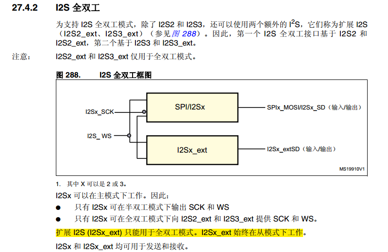
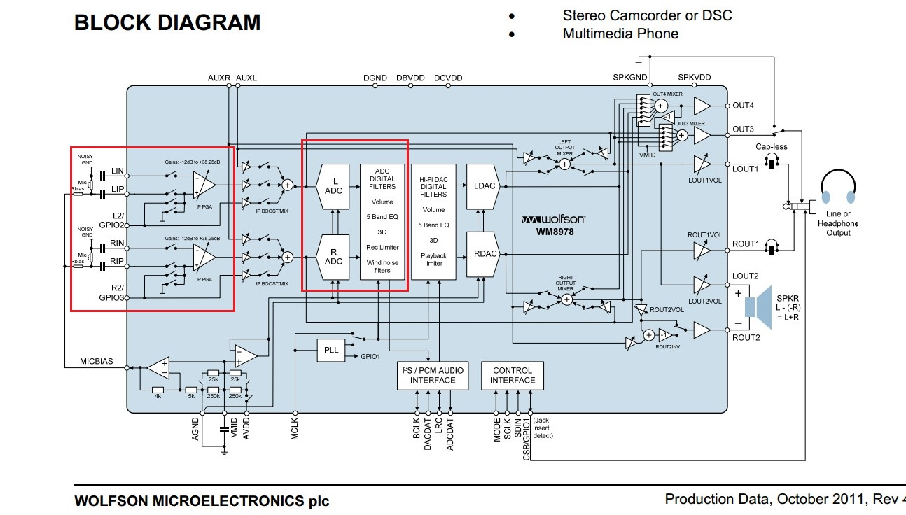
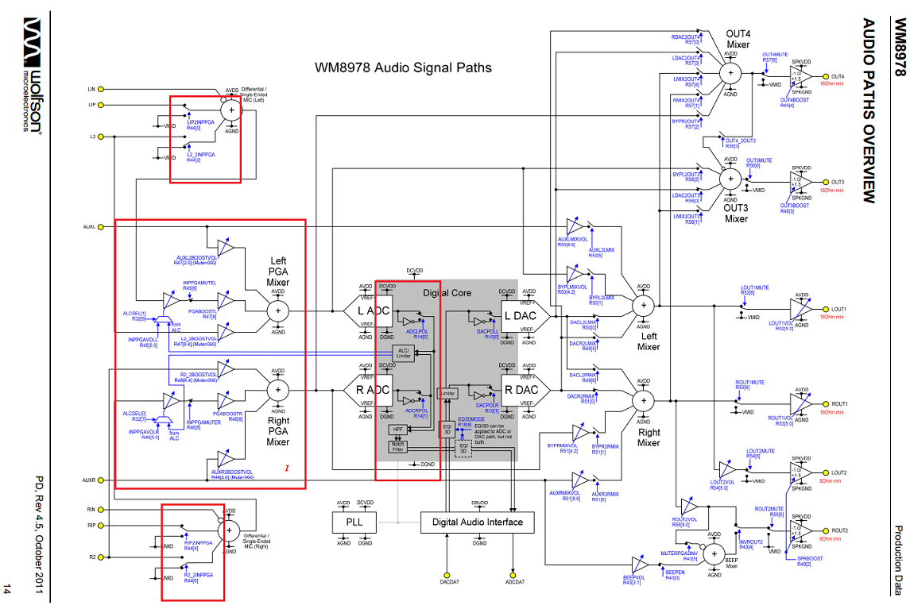

# I2SEXT-WM8978-录音
>**够用的硬件**
**能用的代码**
**实用的教程**
>屋脊雀工作室编撰 -20190101
愿景：做一套能用的开源嵌入式驱动（非LINUX）
官网：www.wujique.com
github: https://github.com/wujique/stm32f407
淘宝：https://shop316863092.taobao.com/?spm=2013.1.1000126.2.3a8f4e6eb3rBdf
技术支持邮箱：code@wujique.com、github@wujique.com
资料下载：https://pan.baidu.com/s/12o0Vh4Tv4z_O8qh49JwLjg
QQ群：767214262
---

在WM8978调试章节，我们提到过STM32的I2S_ext功能。
使用这个外扩的I2S，就能实现I2S全双工，就能实现录音功能。
现在让我们一起调试录音功能。
## I2S_ext
STM32的I2S支持全双工。如下说明。



>I2S_ext没有时钟，必须配合I2S使用。
通常，我们用I2S做主设备，输出时钟，发送I2S数据到外部设备。
I2S_ext也使用I2S的时钟，从外部设备接收I2S数据。

## WM8978录音配置
WM8978的驱动我们已经完成，现在只需要看看录音需要设置什么寄存器。
#### 硬件
下图是8978线路图。
WM8978支持左右声道两个MIC。板子太小，根本无法区分左右声道，因此将两个MIC连在一起。
只使用一个MIC电路。


#### 配置
录音功能涉及到WM8978的两个模块：
1. MIC模块。

MIC模块用于配置是否使用MIC输入的音源。只要配置好MIC模块，MIC输入的声音就可以从WM8978播放。

2. ADC模块。

MIC模块输入的是模拟信号，要通过I2S传输到STM32，需要经过ADC转换。

如下图，左边红框是MIC模块，中间红框是ADC模块。



对这两个模块的配置主要有一下：

> R45/R46、R47/R48，设置PGA增益，也就是MIC的输入增益。左边中间红框是设置增益的。
> R44，控制MIC是否输入到PGA。左边上下两个红框处。
> R14，配置ADC。中间红框。

*更多配置请查看代码*

## 驱动设计
底层驱动设计两部分：I2S_ext、WM8978。

#### I2S_ext
I2S_ext驱动类似I2S。
>同样需要配置I2S通信格式。
同样使用DMA传输。
同样使用双缓冲DAM模式。

* 配置

```c
void mcu_i2sext_config(u32 AudioFreq, u16 Standard,u16 DataFormat)
{  
	I2S_InitTypeDef I2S2ext_InitStructure;
	//I2S_FullDuplexConfig会进行转换
	I2S2ext_InitStructure.I2S_Mode = I2S_Mode_MasterTx;
	I2S2ext_InitStructure.I2S_Standard=Standard;//IIS标准
	I2S2ext_InitStructure.I2S_DataFormat=DataFormat;//IIS数据长度
	//主时钟输出,i2sext无效
	I2S2ext_InitStructure.I2S_MCLKOutput=I2S_MCLKOutput_Enable;
	I2S2ext_InitStructure.I2S_AudioFreq=AudioFreq;//IIS频率设置
	I2S2ext_InitStructure.I2S_CPOL=I2S_CPOL_Low;//空闲状态时钟电平
        //初始化I2S2ext配置
	I2S_FullDuplexConfig(I2S2ext, &I2S2ext_InitStructure);

	I2S_Cmd(I2S2ext, ENABLE);		//I2S2ext I2S EN使能.
}
```

* DAM设置

```c
/**
 *@brief:      mcu_i2sext_dma_init
 *@details:    设置I2S EXT DMA缓冲
 *@param[in]   u16* buf0  
               u16 *buf1  
               u32 len    
 *@param[out]  无
 *@retval:     
 */
void mcu_i2sext_dma_init(u16* buf0, u16 *buf1, u32 len)
{

	NVIC_InitTypeDef   NVIC_InitStructure;
	DMA_InitTypeDef  DMA_InitStructure;


	RCC_AHB1PeriphClockCmd(RCC_AHB1Periph_DMA1,ENABLE);//DMA1时钟使能

	DMA_DeInit(I2S2_EXT_DMA);
	while (DMA_GetCmdStatus(I2S2_EXT_DMA) != DISABLE){}//等待DMA1_Stream3可配置
        //清空DMA1_Stream3上所有中断标志
	DMA_ClearITPendingBit(I2S2_EXT_DMA,DMA_IT_FEIF3|DMA_IT_DMEIF3
		             |DMA_IT_TEIF3|DMA_IT_HTIF3|DMA_IT_TCIF3);

	/* 配置 DMA Stream */
	DMA_InitStructure.DMA_Channel = DMA_Channel_3;
	DMA_InitStructure.DMA_PeripheralBaseAddr = (u32)&I2S2ext->DR;
	DMA_InitStructure.DMA_Memory0BaseAddr = (u32)buf0;//DMA 存储器0地址
	DMA_InitStructure.DMA_DIR = DMA_DIR_PeripheralToMemory;//外设到存储器模式
	DMA_InitStructure.DMA_BufferSize = len;//数据传输量
	//外设非增量模式
	DMA_InitStructure.DMA_PeripheralInc = DMA_PeripheralInc_Disable;
	DMA_InitStructure.DMA_MemoryInc = DMA_MemoryInc_Enable;//存储器增量模式
	//外设数据长度:16位
	DMA_InitStructure.DMA_PeripheralDataSize = DMA_PeripheralDataSize_HalfWord;
	//存储器数据长度：16位
	DMA_InitStructure.DMA_MemoryDataSize = DMA_MemoryDataSize_HalfWord;
	DMA_InitStructure.DMA_Mode = DMA_Mode_Circular;// 使用循环模式
	DMA_InitStructure.DMA_Priority = DMA_Priority_High;
	DMA_InitStructure.DMA_FIFOMode = DMA_FIFOMode_Disable; //不使用FIFO模式		  
	DMA_InitStructure.DMA_FIFOThreshold = DMA_FIFOThreshold_1QuarterFull;
	DMA_InitStructure.DMA_MemoryBurst = DMA_MemoryBurst_Single;//外设突发单次传输
	//存储器突发单次传输
	DMA_InitStructure.DMA_PeripheralBurst = DMA_PeripheralBurst_Single;
	DMA_Init(I2S2_EXT_DMA, &DMA_InitStructure);//初始化DMA Stream
	//双缓冲模式配置
	DMA_DoubleBufferModeConfig(I2S2_EXT_DMA, (u32)buf0, DMA_Memory_0);
	//双缓冲模式配置
	DMA_DoubleBufferModeConfig(I2S2_EXT_DMA, (u32)buf1, DMA_Memory_1);

	DMA_DoubleBufferModeCmd(I2S2_EXT_DMA,ENABLE);//双缓冲模式开启

	DMA_ITConfig(I2S2_EXT_DMA,DMA_IT_TC,ENABLE);//开启传输完成中断

	SPI_I2S_DMACmd(I2S2ext, SPI_I2S_DMAReq_Rx, ENABLE);//I2S2ext RX DMA请求使能.

	NVIC_InitStructure.NVIC_IRQChannel = DMA1_Stream3_IRQn;
	NVIC_InitStructure.NVIC_IRQChannelPreemptionPriority =0x00;//抢占优先级0
	NVIC_InitStructure.NVIC_IRQChannelSubPriority = 0x00;//子优先级1
	NVIC_InitStructure.NVIC_IRQChannelCmd = ENABLE;//使能外部中断通道
	NVIC_Init(&NVIC_InitStructure);//配置

}

```
看注释基本明白要如何配置，跟播音的设置类似。
**要谨记的是，I2S_ext需要I2S配合输出时钟**

#### WM8978
WM8978的基本配置在播音例程已经配置好，只需要在OPEN的时候打开MIC输入。
```c
s32 dev_wm8978_open(void)
{
	dev_wm8978_inout(WM8978_INPUT_DAC|WM8978_INPUT_LMIC|WM8978_INPUT_RMIC|WM8978_INPUT_ADC,
					WM8978_OUTPUT_SPK|WM8978_OUTPUT_PHONE);
	return 0;
}
```
并且在配置数据格式的时候同时配置I2S_ext的数据格式。
```c
s32 dev_wm8978_dataformat(u32 Freq, u8 Standard, u8 Format)
{
	u16 standard;
	u16 dataformat;

	dev_wm8978_set_dataformat(Standard, Format);

        ...

	mcu_i2s_config(Freq, standard, dataformat);
	mcu_i2sext_config(Freq, standard, dataformat);

	return 0;
}
```
## 录音中间层设计
前面的I2S_ext驱动设计，跟I2S一样，都是使用双缓冲DMA格式，理所当然的我们都能想到：录音的中间层设计跟播音应该差不多。

#### 接口设计
要求和播音基本一致：
>开始录音
暂停
继续
停止。

本次测试我们不做暂停功能，只需要实现播放和停止即可。
* 开始录音

```c {.line-numbers}
/**
 *@brief:      fun_sound_rec
 *@details:    启动录音
 *@param[in]   char *name  
 *@param[out]  无
 *@retval:     
 */
s32 fun_sound_rec(char *name)
{
	FRESULT fres;
	u32 len;

	SOUND_DEBUG(LOG_DEBUG, "sound rec\r\n");
	RecWavSize = 0;
	SoundRecBufSize = SoundBufSize;

	/*  创建WAV文件 */
	fres=f_open(&SoundRecFile,(const TCHAR*)name, FA_CREATE_ALWAYS | FA_WRITE);
	if(fres != FR_OK)			//文件创建失败
	{
		SOUND_DEBUG(LOG_DEBUG, "create rec file err!\r\n");
		return -1;
	}

	recwav_header = (TWavHeader *)wjq_malloc(sizeof(TWavHeader));
	if(recwav_header == NULL)
	{
		SOUND_DEBUG(LOG_DEBUG, "rec malloc err!\r\n");
		return -1;
	}

	recwav_header->rId=0X46464952;
	recwav_header->rLen = 0;//录音结束后填
	recwav_header->wId = 0X45564157;//wave
	recwav_header->fId=0X20746D66;
	recwav_header->fLen = 16;
	recwav_header->wFormatTag = 0X01;
	recwav_header->nChannels = 2;
	//这个采样频率需要特殊处理，暂时不做。
	recwav_header->nSamplesPerSec = SOUND_REC_FRE;
	recwav_header->nAvgBytesPerSec =
		(recwav_header->nSamplesPerSec)*(recwav_header->nChannels)*(16/8);
	recwav_header->nBlockAlign = recwav_header->nChannels*(16/8);
	recwav_header->wBitsPerSample = 16;
	recwav_header->dId = 0X61746164;
	recwav_header->wSampleLength = 0;

	fres=f_write(&SoundRecFile,(const void*)recwav_header,
				sizeof(TWavHeader), &len);
	if((fres!= FR_OK)
		|| (len != sizeof(TWavHeader)))
	{

		SOUND_DEBUG(LOG_DEBUG, "rec write err!\r\n");
		wjq_free(recwav_header);
		return -1;		
	}
	else
	{
		SOUND_DEBUG(LOG_DEBUG, "create rec wav ok!\r\n");
	}

	/*  测试录音     */
	SoundRecBufP[0] = (u16 *)wjq_malloc(SoundRecBufSize*2);
	SoundRecBufP[1] = (u16 *)wjq_malloc(SoundRecBufSize*2);

	SOUND_DEBUG(LOG_DEBUG, "%08x, %08x\r\n", SoundRecBufP[0], SoundRecBufP[1]);
	if(SoundRecBufP[0] == NULL)
	{

		SOUND_DEBUG(LOG_DEBUG, "sound malloc err\r\n");
		return -1;
	}

	if(SoundRecBufP[1] == NULL )
	{
		wjq_free(SoundRecBufP[0]);
		return -1;
	}

	dev_wm8978_open();
	dev_wm8978_dataformat(SOUND_REC_FRE, WM8978_I2S_Phillips,
			WM8978_I2S_Data_16b);

	mcu_i2s_dma_init(RecPlayTmp, RecPlayTmp, 1);
	dev_wm8978_transfer(1);//启动I2S传输

	mcu_i2sext_dma_init(SoundRecBufP[0], SoundRecBufP[1], SoundRecBufSize);
	mcu_i2sext_dma_start();

	SOUND_DEBUG(LOG_DEBUG, "rec--------------------\r\n");

	return 0;
}
```
> 17~58，创建WAV文件。
61~76，准备双缓冲
78~85， 配置WM8978，启动录音。

* 停止录音

```c {.line-numbers}
/**
 *@brief:      fun_rec_stop
 *@details:    停止录音
 *@param[in]   void  
 *@param[out]  无
 *@retval:     
 */
s32 fun_rec_stop(void)
{
	u32 len;
	dev_wm8978_transfer(0);
	mcu_i2sext_dma_stop();

	recwav_header->rLen = RecWavSize+36;
	recwav_header->wSampleLength = RecWavSize;
	f_lseek(&SoundRecFile,0);

	f_write(&SoundRecFile,(const void*)recwav_header,
		sizeof(TWavHeader),&len);//写入头数据
	f_close(&SoundRecFile);

	wjq_free(SoundRecBufP[0]);
	wjq_free(SoundRecBufP[1]);
	wjq_free(recwav_header);
	return 0;
}
```
>停止录音，保存WAV文件，释放内存。

#### 流程
跟放音一样使用双缓冲，所以录音流程也基本一样。
```c
/**
 *@brief:      fun_rec_task
 *@details:    录音线程
 *@param[in]   void  
 *@param[out]  无
 *@retval:     
 */
void fun_rec_task(void)
{
	int buf_index = 0;
	u32 len;
	FRESULT fres;

	buf_index = fun_rec_get_buff_index();
	if(0xff != buf_index)
	{
		//uart_printf("rec buf full:%d!\r\n", buf_index);
		RecWavSize += SoundRecBufSize*2;

		fres = f_write(&SoundRecFile,(const void*)SoundRecBufP[buf_index],
				2*SoundRecBufSize, &len);
		if(fres != FR_OK)
		{
			SOUND_DEBUG(LOG_DEBUG, "write err\r\n");
		}

		if(len!= 2*SoundRecBufSize)
		{
			SOUND_DEBUG(LOG_DEBUG, "len err\r\n");
		}

	}
}
```
>在主任务循环中运行task函数，发送有缓冲满了，将数据读出来写到wav文件。

## 测试
增加下面两个函数，fun_rec_test录音，fun_play_rec_test播放录音得到的WAV文件。
```c

/**
 *@brief:      fun_rec_test
 *@details:    开始录音
 *@param[in]   void  
 *@param[out]  无
 *@retval:     
 */
void fun_rec_test(void)
{
	fun_sound_rec("1:/rec9.wav");
}

void fun_play_rec_test(void)
{
	fun_sound_play("1:/rec9.wav", "wm8978");
}
```

在main函数的while循环中，当按下按键，开始录音，松开按键，播放录音文件。
## 总结
在前期播音和WAV文件解码两个章节的基础上，实现I2S录音可以说不难。
要树立的概念就是I2S_ext必须使用I2S的时钟。
我们做的录音和播音，是两个单独的功能。
请问如果要在播音的时候能录音，程序要如果修改？

---
end
---
