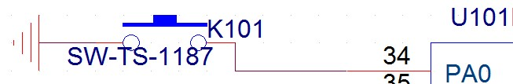
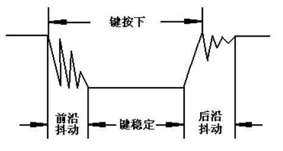
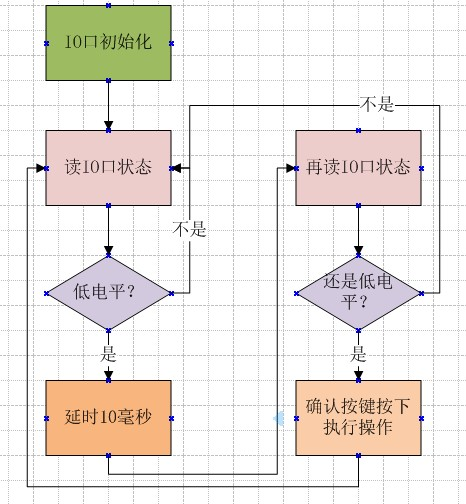
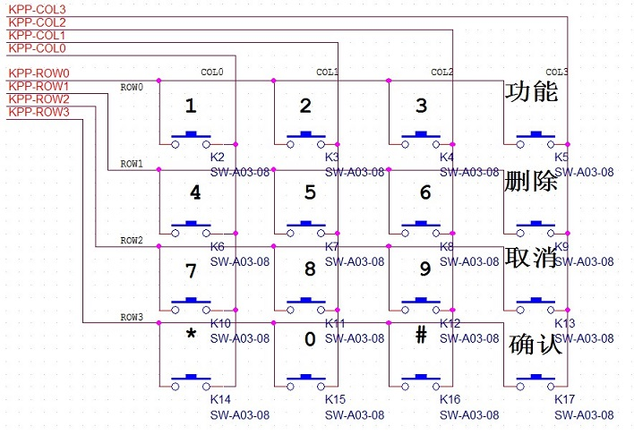

# **详解矩阵按键扫描**
>**够用的硬件**
>
>**能用的代码**
>
>**实用的教程**
>
>屋脊雀工作室编撰 -20190101
>
>愿景：做一套能用的开源嵌入式驱动（非LINUX）
>
>官网：www.wujique.com
>
>github: https://github.com/wujique/stm32f407
>
>淘宝：https://shop316863092.taobao.com/?spm=2013.1.1000126.2.3a8f4e6eb3rBdf
>
>技术支持邮箱：code@wujique.com、github@wujique.com
>
>资料下载：https://pan.baidu.com/s/12o0Vh4Tv4z_O8qh49JwLjg
>
>QQ群：767214262
---

按键输入是人接交互的一个重要输入途径。电脑键盘，就是一个最常见的矩阵按键。
在其他电子消费产品中，经常见到4*4矩阵按键。
用户按下按键，程序如何知道用户按下哪个键？
现在就让我们一起学习按键扫描的原理。

## 单键扫描

单键，并不是指一个按键，而是指一个IO口控制一个按键，原理图如下：

PA0这个IO口接到按键的一端，按键另外一端接到地。
当按键按下，两端短路，IO口就接到地，就是低电平。
那没按下时，IO口啥都没接，为啥是高电平呢？
因为IO口在芯片内部可以配置连接一个内部上拉电阻。
如果使用了没有内部上拉电阻的IO，就只能在外部接一个电阻将IO口上拉到高电平。

## 按键扫描方式

首先我们要记住的以下常识：
1. 芯片跑得很快。
从一个IO口读取输入电平，只是一瞬间的事情。
2. 手可能会抖动。
3. 机械按键可能会抖动。

用示波器抓按键的波形，可能如下图：


很明显，如果我们在抖动时间段读IO状态，得到的值将是**随机**的。
因此，按键扫描最重要的一个功能就是**去抖动**。
去抖动的原理很简单：
>间隔一定时间读几次，电平连续相同则认为状态是可靠的。

通常大家看到的教程，按键流程如下：

这样的单键扫描流程有以下问题：

>1. 去抖动通过硬延时实现。
>2. 只对按下去抖动，没有对松开去抖动。

硬延时在真正的项目开发中，是绝对不建议使用的，无论是按键扫描还是其他功能，都不应该用硬延时。
无论按下还是松开，都应该有去抖动功能。
就算一些没有抖动的按键，也要加上，毕竟产品销售出去后，环境变化，可能会受到外部干扰。
如果按键被干扰造成误动作，将是一个失败的产品。

那么如何优化掉硬延时呢？
在功能稍微复杂的单片机系统中，常用的是**轮询模式**。
轮询模式的**代码模式**大概如下：
```c
main(void)
{

	初始化

	while(1)
	{
		扫描按键();
		扫描串口();
		........
	}

}
```
在while循环中，轮流执行各个驱动的代码。
我们通常把这些函数叫做任务，TASK。
在这些任务函数中，一般都是检测状态或执行一些简单的代码，就会退出，不会在任务中卡太久。
如果某个任务卡太久，其他任务的响应时间就会很差。

但是很多驱动或者任务，经常是需要等待某种状态，或者是要延时一定时间再判断状态。
就像按键一样，要间隔一定时间再次去读IO状态。怎么做呢？
在轮询模式下，驱动常用的一种编码手段就是**步骤拆分**。什么叫步骤拆分？
假设轮询按键扫描的间隔是2毫秒（2毫秒执行一次扫描按键）。
那么我们就在按键扫描里面增加一个防抖计数和一个**步骤计数**。
```c
scan_key(void)
{
	第一步，检测按键是否按下

	第二步，防抖计数自加，判断防抖计数，
		记到5次，就到10毫秒了。
		再判断按键有没有按下
}
```
程序流程如上面的伪代码。每次进入scan_key这个函数，只会执行一个步骤。
这样，陷入scan_key函数的时间将会很短，仅仅执行几条代码，没有延时。
在while中需要轮询的其他功能就可以很快得到执行。

对于第二个问题：松开没有去抖动。
我们的解决方法并不是松开的时候也增加去抖动，而是将松开和按下合并处理。
这就牵涉到如何对某种事物进行抽象。
前面的做法，是将一个按键抽象为按下和松开两个状态（也可以叫两种变化，或两种事件）。
我们的做法是将按键抽象为一个电平变化的事件，无论按下还是松开，都是从一种电平变化为另外一种电平。
那么，按下和松开，就可以用同一种扫描方法，用同一段代码扫描。
得到变化事件后，在根据IO状态识别松开还是按下。

**这个小观念的转变，对代码架构有很大影响。
如果要总结为什么这样做，可以称之为“统一”。
将几种不同的东西，提取他们的共同点，编写一段代码共用。
延伸开说，也就是模块化。**

对于单键扫描的程序，在此就不展开了，大家可以根据原理自己尝试编写。

## 矩阵按键的扫描原理

单键模式有一个很大缺陷：当需要较多的按键时，需要的IO口就多。
例如16个按键的时候，就需要16个IO口。
如果使用矩阵按键，只需要8根IO。
下面的接法就叫做矩阵按键。


>**在8根IO上要串上限流电阻，上图没画出**。

从图上可以看出，只需要8根IO口，就可以实现16个按键的输入。
原理是什么呢？我们通过分析扫描方法解释原理。
矩阵按键扫描通常有两种方法：**交叉扫描**、**逐行扫描**。
* 交叉扫描速度快，程序简单，扫描结果通过**查表**获取。但是缺陷也多。
* 逐行扫描需要轮询所有行，程序也稍微复杂，但是可以识别键盘的多种状态。

通常我们说的按键扫描都是用逐行扫描。就像字面意思说的，逐行-逐行-扫描。
例如上面原理图：
>KPP-ROW0输出0，其他ROW输出1，读取4根COL IO的状态，就可得到第一行四个按键（1、2、3、功能）的状态了。（当然，还需要去抖动）。
然后KPP-ROW1输入0，其他ROW输出1，读4根COL IO的状态。。。。。。
。。。。
不断重复从ROW0到ROW3。

这就叫做矩阵按键逐行扫描。
上面仅仅说明原理，真正的逐行扫描当然没那么简单。
下面我们就用一个完整的逐行扫描说明程序应该如何写。

```c {.line-numbers}
/**
 *@brief:      dev_keypad_init
 *@details:    初始化矩阵按键IO口
 *@param[in]   void  
 *@param[out]  无
 *@retval:     
 */
s32 dev_keypad_init(void)
{
	/*
	c:PF8-PF11   当做输输入
	r:PF12-PF15  当做输出
	*/

	GPIO_InitTypeDef  GPIO_InitStructure;

	RCC_AHB1PeriphClockCmd(RCC_AHB1Periph_GPIOF, ENABLE);

	/* r */
	GPIO_InitStructure.GPIO_Pin = GPIO_Pin_12|GPIO_Pin_13|GPIO_Pin_14|GPIO_Pin_15;
	GPIO_InitStructure.GPIO_Mode = GPIO_Mode_OUT;
	GPIO_InitStructure.GPIO_OType = GPIO_OType_PP;
	GPIO_InitStructure.GPIO_Speed = GPIO_Speed_100MHz;
	GPIO_InitStructure.GPIO_PuPd = GPIO_PuPd_UP;
	GPIO_Init(GPIOF, &GPIO_InitStructure);

	/* c */
	GPIO_InitStructure.GPIO_Pin = GPIO_Pin_8|GPIO_Pin_9|GPIO_Pin_10|GPIO_Pin_11;
	GPIO_InitStructure.GPIO_Mode = GPIO_Mode_IN;
	GPIO_InitStructure.GPIO_PuPd = GPIO_PuPd_UP;
	GPIO_Init(GPIOF, &GPIO_InitStructure);

	GPIO_SetBits(GPIOF, GPIO_Pin_12|GPIO_Pin_13|GPIO_Pin_14|GPIO_Pin_15);

	u8 i;
	for(i = 0; i< KEY_PAD_ROW_NUM; i++)
	{
		KeyPadCtrl[i].dec = 0;
		KeyPadCtrl[i].oldsta = KEYPAD_INIT_STA_MASK;
		KeyPadCtrl[i].newsta = KEYPAD_INIT_STA_MASK;
	}

}
/**
 *@brief:      dev_keypad_scan
 *@details:    按键扫描，在定时器或者任务中定时执行
 *@param[in]   void  
 *@param[out]  无
 *@retval:     
 */
s32 dev_keypad_scan(void)
{
	u16 ColSta;
	u8 chgbit;
	static u8 scanrow = 0;
	u8 keyvalue;

	if(DevKeypadGd == -1)
		return -1;

	/*读输入的状态，如果不是连续IO，先拼成连续IO*/
	ColSta = GPIO_ReadInputData(GPIOF);
	ColSta = (ColSta>>8)&KEYPAD_INIT_STA_MASK;

	/*记录新状态，新状态必须是连续稳定，否则重新计数*/
	if(ColSta != KeyPadCtrl[scanrow].newsta)
	{
		KeyPadCtrl[scanrow].newsta = ColSta;
		KeyPadCtrl[scanrow].dec = 0;
	}

	/*如新状态与旧状态有变化，进行扫描判断*/
	if(ColSta != KeyPadCtrl[scanrow].oldsta)
	{
		uart_printf(" chg--");
		KeyPadCtrl[scanrow].dec++;
		if(KeyPadCtrl[scanrow].dec >= KEY_PAD_DEC_TIME)//大于防抖次数
		{
		    /*确定有变化*/
		    KeyPadCtrl[scanrow].dec = 0;
		    /*新旧对比，找出变化位*/
		    chgbit = KeyPadCtrl[scanrow].oldsta^KeyPadCtrl[scanrow].newsta;
		    uart_printf("row:%d, chage bit:%02x\r\n",scanrow,chgbit);

		    /*根据变化的位，求出变化的按键位置*/
		    u8 i;
		    for(i=0;i<KEY_PAD_COL_NUM;i++)
		    {
			if((chgbit & (0x01<<i))!=0)
			{
			    keyvalue = 	scanrow*KEY_PAD_COL_NUM+i;
			    /*添加通断（按下松开）标志*/
			    if((KeyPadCtrl[scanrow].newsta&(0x01<<i)) == 0)
			    {
				uart_printf("press\r\n");
			    }
			    else
			    {
				uart_printf("rel\r\n");
				keyvalue += KEYPAD_PR_MASK;
			    }
			    /**/
			    KeyPadBuff[KeyPadBuffW] =keyvalue+1;//+1，从1开始，不从0开始
			    KeyPadBuffW++;
			    if(KeyPadBuffW>=KEYPAD_BUFF_SIZE)
				KeyPadBuffW = 0;
			}
		    }

    		    KeyPadCtrl[scanrow].oldsta = KeyPadCtrl[scanrow].newsta;

		}
	}

	/*将下一行的IO输出0*/
	scanrow++;
	if(scanrow >= KEY_PAD_ROW_NUM)
		scanrow = 0;

	GPIO_SetBits(GPIOF, GPIO_Pin_12|GPIO_Pin_13|GPIO_Pin_14|GPIO_Pin_15);

	switch(scanrow)
	{
		case 0:
			GPIO_ResetBits(GPIOF, GPIO_Pin_12);
			break;
		case 1:
			GPIO_ResetBits(GPIOF, GPIO_Pin_13);
			break;
		case 2:
			GPIO_ResetBits(GPIOF, GPIO_Pin_14);
			break;
		case 3:
			GPIO_ResetBits(GPIOF, GPIO_Pin_15);
			break;
	}

}
```
1. dev_keypad_init初始化函数，完成IO口初始化，并初始化扫描过程用到的变量。
2. dev_keypad_scan就是扫描函数，这个函数可以放到定时器，也可以放在main函数的 while状态轮询，**轮询间隔会影响防抖效果**。
3. 62/63行，读取4根col的状态，如果你的col不是连续的IO，最好在这里拼成连续的，方便下面处理。
估计有同学会问，怎么没有输出对应的ROW就读COL状态？
前面我们说过步骤拆分，在这里就是将“对应ROW输出0电平”，“读COL”，拆分为两个步骤。
上一次退出扫描函数的时候，将下一行对应ROW输出0，等下一次进入扫描的时候才读取COL。为什么？
我们一直强调，CPU很快，如果你对应的ROW输出0，然后立马读COL，间隔很短，**IO口电平变化可是要时间的**。
有同学又会说了，我知道，IO口电平变化需要可能几百纳秒，那我输出0后，延时1us，再读，应该可以读到真正电平了吧？硬延时1us，通常也是可以接受的。
是的，很多情况下我们也可以这么做，但是，会有意外。
原因就是，电平变化时间除了跟CPU本身性能有关，还跟外部硬件有关，例如PCB板材，按键材料，PCB走线，甚至是环境温度湿度都会影响电平变化。
***曾经发生过换了PCB板厂，发到东北的产品发生按键无效事件。***
>IO电平变化时间由ns上升到us。
我们在上一轮扫描就将对应ROW输出0，下一次轮询的时候读COL状态，间隔通常是ms级的，可以避免上面问题。
4. 66-70行，意思就是不仅仅是跟上一次的稳定状态不一样（有变化），而且需要在防抖过程中多次读取的状态一样，不一样就重新开始去抖动计数。
5. 73行到113行就是去抖动跟按键识别。
6. 73-78，状态变化，而且连续变化次数达到去抖动计数，我们就认为是一个稳定的变化了。
7. 82，新旧状态异或，找出变化的位。（这样处理的好处就是，当同一行的两个按键同时按下时，我们都可以识别）
8. 87 行这个for循环的意思就是，每一个col的变化我们都要识别。
9. 91行，识别到变化按键的物理位置编码。
  >我们提供的是位置编码，能不能提供功能编码？例如，第一个键是按键`1`，最后一个键是`确认`。可以，不建议，而且是非常不建议。
	功能是谁的定义？谁关心？应用关心，那就让它去管，反正我按键扫描就告诉你，第一个按键按下，至于是`1`还是`确认`，你自己定。
	如果扫描给出的键值是功能键值，那就麻烦了，因为这个按键是什么功能，只要客户说一声，然后，改一下丝印。怎么的？要改改底层驱动？
10. 93-101行，判断是按下还是松开，并在键值上添加标志位。
11. 103-106，将键值填入缓冲。关于这个缓冲，又是一个**驱动设计的要点**。
>很多人写的按键扫描，都是直接通过return返回键值。我就问你，当一个系统比较复杂的时候，合适吗？
明显不合适，假如一个系统，有两个菜单，每个菜单都需要按键功能，难道这两个菜单都调用扫描函数？
这种现象叫什么？叫做耦合：两个不同模块扯在一起。
耦合，是大忌；解耦合才是正道。
解耦合的一个手段就是数据缓冲。
扫描模块扫到键值，丢入缓冲，至于谁要这个按键？I Don't care!
再提供一个函数用于读缓冲内的键值。谁想要谁读，按键扫描程序自己运行到天荒地老。
12. 115-135行，就是将下一ROW输出0。

一个按键矩阵按键扫描流程就是这样。
怎么用这个按键扫描呢？
这样用：
```c
main()
{
		dev_keypad_init();
		dev_keypad_open();
		其他初始化


		while(1)
		{
			dev_keypad_scan();
			其他轮询任务
			...。。。
			应用处理
			dev_keypad_read(&key,1);
			读到按键就处理。
		}
}
```

## 问题
这个矩阵按键的硬件设计是有缺陷的，会产生幽灵键。
当你按下124三个按键，按键5即使没按下，程序扫描出来的结果也是按下。
要解决这个问题，需要在所有按键上增加二极管。
通常我们会放弃三键按下这种情况，通过软件判断，将三件按下时产生幽灵键的情况抛弃。
具体可以参考文档《**矩阵式键盘的先天缺陷与解决方案.docx**》

## 总结
矩阵按键扫描曾是我毕业后第一个产品用到的程序。
在领导细心关怀下，花了两周时间才算想清楚各种细节。
我认为如果你能搞清楚矩阵扫描的各种细节，对其他驱动的编写，大有帮助。

---
end
---
