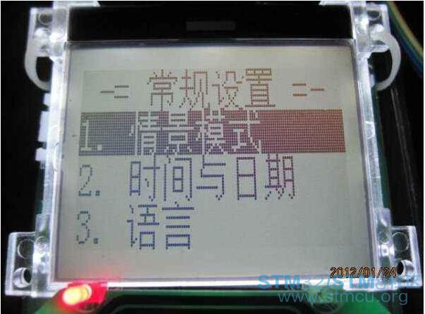
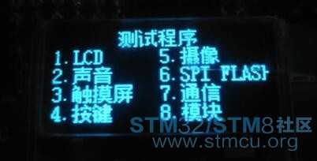
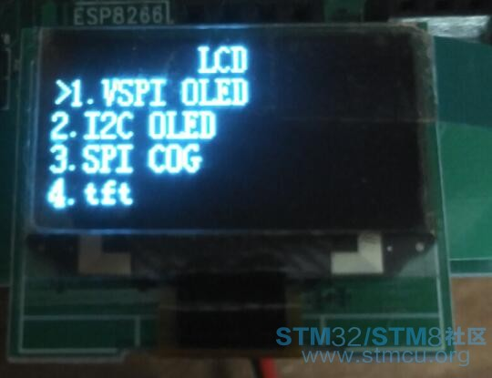
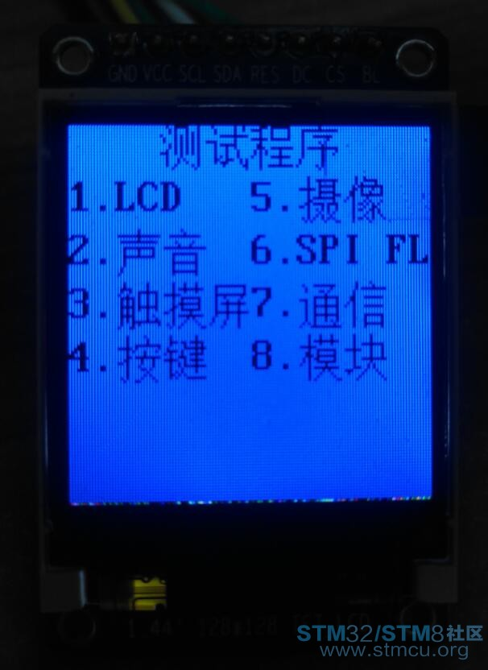
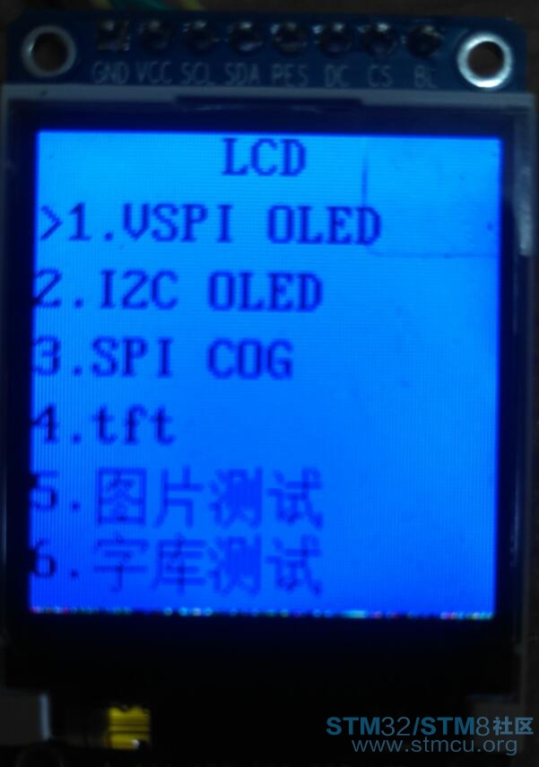
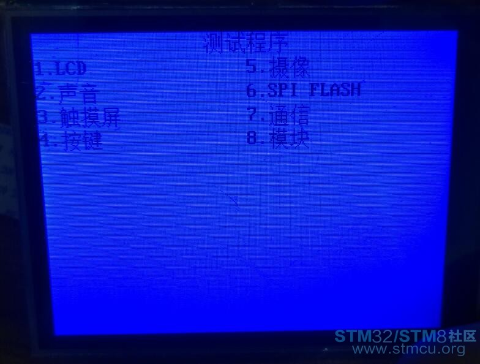
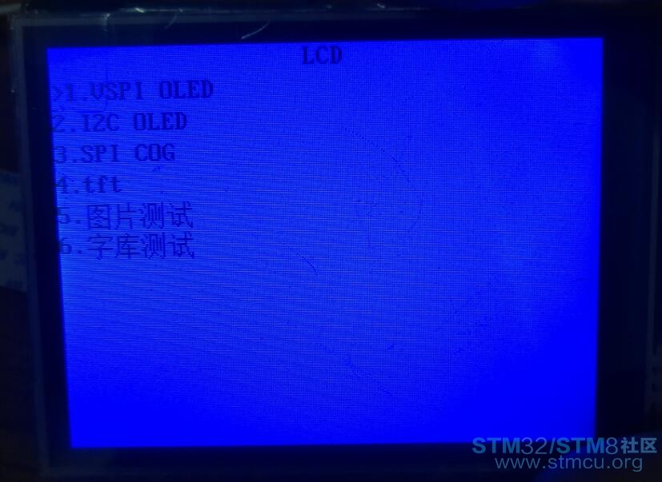

# **简易菜单**
>**够用的硬件**
>
>**能用的代码**
>
>**实用的教程**
>
>屋脊雀工作室编撰 -20190101
>
>愿景：做一套能用的开源嵌入式驱动（非LINUX）
>
>官网：www.wujique.com
>
>github: https://github.com/wujique/stm32f407
>
>淘宝：https://shop316863092.taobao.com/?spm=2013.1.1000126.2.3a8f4e6eb3rBdf
>
>技术支持邮箱：code@wujique.com、github@wujique.com
>
>资料下载：https://pan.baidu.com/s/12o0Vh4Tv4z_O8qh49JwLjg
>
>QQ群：767214262
---

声明：本处所说的菜单是用在128*64这种小屏幕的菜单，例如下面这种，不是彩屏上的GUI。



作为一个底层驱动工程师，驱动写完了，是要写硬件测试程序的。
这个测试程序，一般给测试部/硬件工程师用来测试硬件，
也会给工厂产线测试准成品。

开始的人偷懒，不想一秒就直接上，所有菜单都这样做，一层套一层
```c
void test_main(void)
{
        while(1)
        {
                get_key(&key);
                switch(key)
                {
                        case 1:
                                test_key();
                                break;
                        case 2:
                                test_lcd();
                                break;
                        ....
                }
        }
}

```
当菜单越来越多，就开始纠结了，这样写维护不便，看起来也不美，还浪费程序空间。

作为一个天天看《编程之美》的码农，决定改变现状。
酷狗百度一番，找到了两个参考：
《基于二叉树的多层的液晶菜单界面设计》
《基于节点编号的通用树状菜单设计方法与实现.pdf》
按照他们的设计方法，鼓捣了一个版本，能用，挺好，但是也纠结。
因为他们用了树这种数据结构。对于程序运行来说，非常好，效率高。
但是对于我来说，菜单代码是一次性的，但是菜单内容，却是会经常改的。
让我用人脑去维护一个包含几十个上百个菜单的树，不容易。

想来想去，这些菜单到底有什么不好？对于我来说，为什么不好用？
得出下面结论：
1. 管得太宽
菜单，你就管菜单切换就行了，到了最低一层，也就是实际的测试功能，就不要管了。
菜单切换是类似的，实际测试都是不同的。比如在菜单中，按键1，是进入第一个菜单。但是在测试中，按键1，功能都不一样。
如果菜单连这个也要管，相同动作功能太多，无法进行统一抽象，就很难模块化。
2. 出发点不一样
上面说到的菜单，出发点都是如何设计一个好的菜单数据结构，让程序快速，高效运行。
我想要的却是一个容易维护的菜单结构，至于菜单的代码有多乱多纠结，没关系，
而且，几百上千个菜单，就算用轮询的方法，也不过几百us吧，没关系。

根据需求，我重新设计了一个菜单结构体
```c
/**
 * @brief  菜单对象
*/
typedef struct _strMenu
{
    MenuLel l;     ///<菜单等级
    char cha[MENU_LANG_BUF_SIZE];   ///中文
    char eng[MENU_LANG_BUF_SIZE];   ///英文
    MenuType type;  ///菜单类型
    s32 (*fun)(void);  ///测试函数

} MENU;
```
是的，就这么简单，每一个菜单都是这个结构体
用这个结构体填充一个列表，就是我们的菜单了
```c

const MENU EMenuListTest[]=
{
        MENU_L_0,//菜单等级
        "测试程序",//中文
        "test",        //英文
        MENU_TYPE_LIST,//菜单类型
        NULL,//菜单函数，功能菜单才会执行，有子菜单的不会执行

                MENU_L_1,//菜单等级
                "LCD",//中文
                "LCD",        //英文
                MENU_TYPE_LIST,//菜单类型
                NULL,//菜单函数，功能菜单才会执行，有子菜单的不会执行
                        MENU_L_2,//菜单等级
                        "VSPI OLED",//中文
                        "VSPI OLED",        //英文
                        MENU_TYPE_FUN,//菜单类型
                        test_oled,//菜单函数，功能菜单才会执行，有子菜单的不会执行

                        MENU_L_2,//菜单等级
                        "I2C OLED",//中文
                        "I2C OLED",        //英文
                        MENU_TYPE_FUN,//菜单类型
                        test_i2coled,//菜单函数，功能菜单才会执行，有子菜单的不会执行


                MENU_L_1,//菜单等级
                "声音",//中文
                "sound",        //英文
                MENU_TYPE_LIST,//菜单类型
                NULL,//菜单函数，功能菜单才会执行，有子菜单的不会执行
                        MENU_L_2,//菜单等级
                        "蜂鸣器",//中文
                        "buzzer",        //英文
                        MENU_TYPE_FUN,//菜单类型
                        test_test,//菜单函数，功能菜单才会执行，有子菜单的不会执行

                        MENU_L_2,//菜单等级
                        "DAC音乐",//中文
                        "DAC music",        //英文
                        MENU_TYPE_FUN,//菜单类型
                        test_test,//菜单函数，功能菜单才会执行，有子菜单的不会执行

                        MENU_L_2,//菜单等级
                        "收音",//中文
                        "FM",        //英文
                        MENU_TYPE_FUN,//菜单类型
                        test_test,//菜单函数，功能菜单才会执行，有子菜单的不会执行


                MENU_L_1,//菜单等级
                "触摸屏",//中文
                "tp",        //英文
                MENU_TYPE_LIST,//菜单类型
                NULL,//菜单函数，功能菜单才会执行，有子菜单的不会执行

                        MENU_L_2,//菜单等级
                        "校准",//中文
                        "calibrate",        //英文
                        MENU_TYPE_FUN,//菜单类型
                        test_cal,//菜单函数，功能菜单才会执行，有子菜单的不会执行

                        MENU_L_2,//菜单等级
                        "测试",//中文
                        "test",        //英文
                        MENU_TYPE_FUN,//菜单类型
                        test_tp,//菜单函数，功能菜单才会执行，有子菜单的不会执行

                MENU_L_1,//菜单等级
                "按键",//中文
                "KEY",        //英文
                MENU_TYPE_FUN,//菜单类型
                test_key,//菜单函数，功能菜单才会执行，有子菜单的不会执行

        /*最后的菜单是结束菜单，无意义*/                        
        MENU_L_0,//菜单等级
        "END",//中文
        "END",        //英文
        MENU_TYPE_NULL,//菜单类型
        NULL,//菜单函数，功能菜单才会执行，有子菜单的不会执行
};
```

这个菜单列表有什么特点和要求呢？
1 需要一个根节点和结束节点
2 子节点必须跟父节点，类似下面结构
```c
-----------------------------------------------
根节点
        第1个1级菜单
                       第1个子菜单
                       第2个子菜单
                       第3个子菜单
        第2个1级菜单
                       第1个子菜单
                                     第1个孙菜单
                                     第2个孙菜单
                       第2个子菜单
                       第3个子菜单
        第3个1级菜单
        第4个1级菜单
        第5个1级菜单
结束节点
------------------------------------------------
```
第2个1级菜单有3个子菜单，子菜单是2级菜单，其中第1个子菜单下面又有2个孙菜单（3级菜单）。

维护菜单，就是维护这个列表，添加删除修改，非常容易。
那菜单程序怎么样呢？管他呢。
定义好菜单后，通过下面函数运行菜单，
```c
 emenu_run(WJQTestLcd, (MENU *)&WJQTestList[0], sizeof(WJQTestList)/sizeof(MENU), FONT_SONGTI_1616, 2);        
```
-第1个参数是在哪个LCD上显示菜单，
-第2个是菜单列表，
-第3个是菜单长度，
-第4个四字体，
-第5则是行间距

注意：
运行这个菜单需要有rtos，因为菜单代码是while(1)的，陷进去就不出来了。
需要有其他线程(TASK)维护系统，例如按键扫描。

代码托管在github：https://github.com/wujique/stm32f407/tree/sw_arch
相关文件：emenu.c、emenu.h、emenu_test.c

当前代码：
1实现了双列菜单，用数字键选择进入下一层。每页最多显示8个菜单（4*4键盘用1-8键）
2 实现了单列菜单，通过上下翻查看菜单，确认键进入菜单。
3 天顶菜单未实现，谁有兴趣可以加上。
3 基于LCD驱动架构，这个简易菜单自适应于多种LCD。

效果如下，有需要的尽管拿去，不用谢。

## 显示效果

#### 128*64 OLED


#### 128*128 tft lcd


#### 320*240 tft lcd



## 总结
类似菜单在我开发的产品上已经推广使用。
经测试，可以明显减少测试程序代码量，节省程序空间。
并且易于修改和维护。

---
end
---
