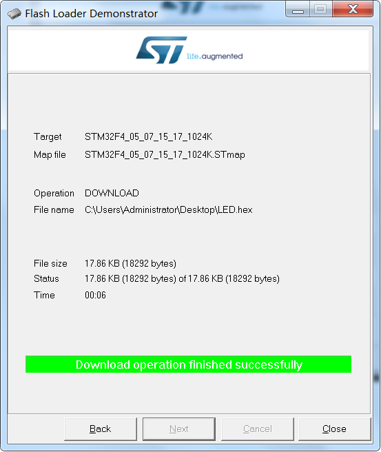
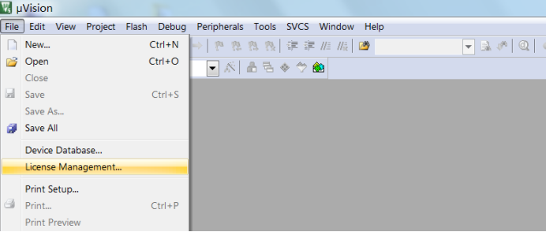

# **软硬件环境准备**
>**够用的硬件**
>
>*能用的代码
>
>实用的教程**
>
>屋脊雀工作室编撰 -20190101
>
>愿景：做一套能用的开源嵌入式驱动（非LINUX）
>
>官网：www.wujique.com
>
>github: https://github.com/wujique/stm32f407
>
>淘宝：https://shop316863092.taobao.com/?spm=2013.1.1000126.2.3a8f4e6eb3rBdf
>
>技术支持邮箱：code@wujique.com、github@wujique.com
>
>资料下载：https://pan.baidu.com/s/12o0Vh4Tv4z_O8qh49JwLjg
>
>QQ群：767214262
---

在项目开发中，当你拿到硬件提供的板子，第一步做什么呢？
如果理所当然的认为可以直接上电调试，你就错了，有时，会直接烧板的。
因为硬件工程师，不一定可信，而且很多公司的硬件工程师，不会对板子做基本验证，焊好就直接丢给软件用。

## 硬件检测
收到板子板后：
1. 先检查是否有明显焊接错误，了解板子的基本构成，查看各IC是否焊接正确。
2. 用万用表检测**GND**跟**VCC**、**V33**之间是否短路。
    >我们第一版底板VCC5V跟VCC3V3之间短路。
   分析解决：
   未贴片的PCB两者没有短路，PCB应该没有问题。
   查看原理图，发现CAN模块预留了两个0欧电阻，用来选择电压。
   只能焊接其中一个，样板两个都焊上了。
   焊下期中一个电阻即可解决问题。
3. 用USB线接上底板，上电测试。
    USB线插到带USB转串口芯片CP2140的 micro USB座子。
    底板红色电源灯亮，没闻到糊味，也没听到响声，更没看到青烟，开局良好。
    电脑提示安装驱动失败，USB转串口用的是CP2104芯片，需要安装驱动才能正常使用。
    到官网下载驱动：
https://www.silabs.com/products/development-tools/software/usb-to-uart-bridge-vcp-drivers

下载第一个默认的驱动CP210x_Windows_Drivers.zip
安装过程，根据系统选择X86或X64，然后一直点击下一步即可。

安装成功后重新插拔USB线，对开发板重新上电后，在**我的电脑**-->**设备管理**里面可以看到USB转的串口：
Silicon Labs CP210x USB to UART Bridge(COM6)(串口号由电脑自动分配)

4. 检测核心板
用万用表检测**GND**跟**VCC**、**V33**之间是否短路
 >我们第一版核心板VCC3V3与地线短路。
 分析解决：
 用万用表测试空PCB， 不短路。
 先分析原理图，看哪里可能会有问题，然后再对比焊接的PCB实物，看哪里焊错料。
 查原理图发现，画原理图的时候，SMT32F407的143PIN，PDR-ON，接了两个0R电阻，发正式版的时忘记修改了。
PDR-ON用法参考《STM32F407_数据手册.pdf》，5.1.6 Power supply scheme章节：

阅读2.2.15 16 等章节可以了解这个管脚的作用。
我们将PDR-ON接到VCC3V3, 去掉R1006电阻。

5. 核心板插上底板，万用表检测VCC5V跟VCC3V3、GND之间，没有短路。
6. 上电（USB线连CP2104接口），底板跟核心板电源灯都正常点亮。
没闻到糊味，也没听到响声，更没看到青烟，开局良好。

## 芯片测试
硬件电路经过检测后，可以上电测试了。
如何验证芯片电路正确呢？可以使用STM32官方下载工具，FLASHER-STM32，《en.flasher-stm32.zip》，将一段程序下载到芯片内，如果下载成功，则说明芯片的最小系统是可以使用的。
软件下载路径如下：
http://www.st.com/content/st_com/en/products/development-tools/software-development-tools/stm32-software-development-tools/stm32-programmers/flasher-stm32.html
解压后安装。
安装后运行，界面如下，串口选择开发板上的USB转串口。
***超时时间Timeout不要选太短，否则会擦除超时而失败，特别是STM32大容量型号，我们用的ZG就是1M flash的。***

如果现在点击next，下载软件卡一段时间后提示下图错误：

这是因为我们还没有让CPU进入下载模式。
阅读文档《STM32™ 微控制器系统存储器自举模式》，STM32有3种启动模式。

通常我们是将程序下载到FLASH中。
下载程序时，让芯片从系统存储器启动，运行芯片自带的BOOT。
下载完成后，让芯片从FLASH启动，运行下载的程序。
因此我们需要将BOOT0管脚接到高电平，BOOT1接低电平，芯片进入系统存储器启动。
在屋脊雀开发板上，只需要将BOOT0拨动开关拨动到1，BOOT1管脚电路上已经接到0。
启动模式设置好后，按核心板上的复位键复位芯片。
再点击next，next，就可以检测到芯片型号了，如下图。

随便选择一个.hex文件，测试是否能烧录。

烧录成功，说明硬件核心部分基本正常，可以开始调试软件了。

## 编译工具安装
开发STM32我们使用keil MDK 集成开发环境，MDK在持续更新，我们选用一个较新的稳定版本即可。
http://www2.keil.com/mdk5/524/
我们选择mdk524.exe，双击安装，选择安装路径，一路Next

软件安装结束后，弹出一个库配置界面

提示框说明了库配置信息

此处可暂时不配置。
MDK安装结束后，需要注册，否则只能编译不超出64K的代码。
打开MDK，在File菜单内查看注册情况

目前属于未注册状态，右上角有一个CID号

**可以通过CID获取到一个注册码，如何获取请自行百度**。

将注册码拷贝到MDK对话框下部New License ID Code框内，点击Add LIC，

注册成功

比较早的KEIL版本，只要安装好IDE，就可以正常工作了。
但是后来越来越多芯片，KEIL就分成两部分了，一部分是MDK IDE环境，另一部分是不同芯片的依赖包。
依赖包Pack下载

左边对话框内找到芯片
**(第一次安装MDK时，看不到芯片，只有ARM一个选项，请双击对应的内核，下载芯片支持列表)**

右边则是库说明与安装，我们暂时只选择前面3个芯片支持包，其他的扩展包暂时不使用。

点击安装后左下角有安装进度条

安装结束后，安装的Pack显示绿色棱形图标。

下载pack很慢，可以直接到http://www.keil.com/dd2/pack/#/eula-container，用下载工具下载。
在资料包内我们提供了407需要的包。
下载完成后，直接双击下载包就可以安装了。

## CMSIS DAP
前面我们测试芯片，是通过串口下载程序验证芯片是否正常工作。
这个方法有点麻烦，而使用调试器就相对简单。
调试器有很多种，有JLINK、STLINK等。
以前很多人都是使用盗版的JLINK，除了有版权问题，JLINK还经常会丢固件，固件丢失后JLINK就变砖头了。
现在多了一个选择，那就是CMSIS DAP（DAPLink）。
CMSIS DAP是ARM公司开源mbed项目的一个附属品，用于调试**Cortex**内核的芯片。
这个小工具除了能像JLINK一样下载调试程序外，还自带USB转串口功能。
**我们根据开源的CMSIS DAP，优化设计了一版本硬件，推出一款新的DAP，物美价廉**
一个小巧的DAP，可以替代JLINK+USB转串口+电源线，接线非常简洁，电脑桌也更少线缆了。
关于DAP，请查阅《CMSIS DAP产品手册》。
资料下载：
https://pan.baidu.com/s/1bHUVe6X6tymktUHk_z91cA

## 结束
到此，开发STM32需要的软硬件基本准备好。

---
end
---
