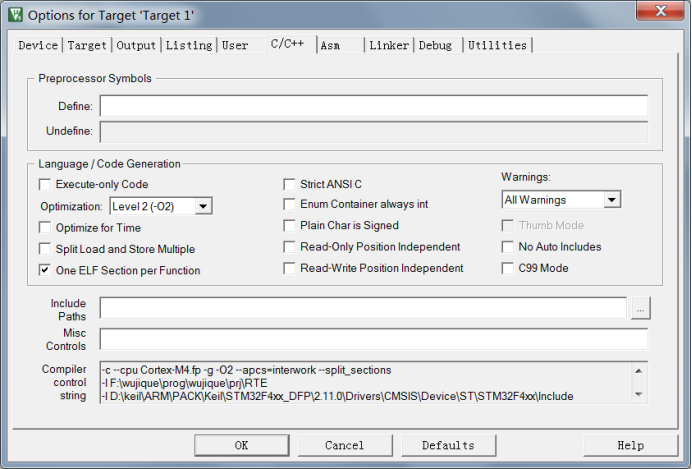
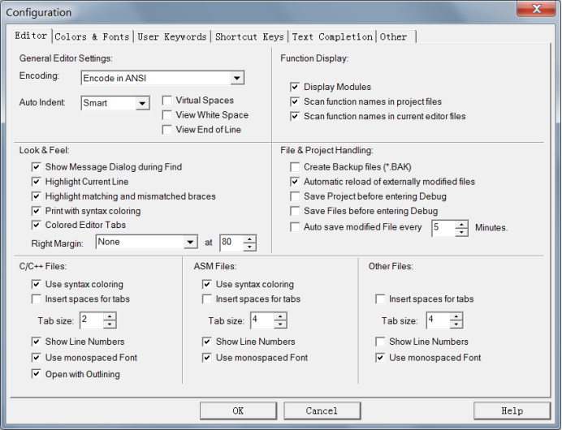

# **基于标准库建立工程模板**
>**够用的硬件**
>
>**能用的代码**
>
>**实用的教程**
>
>屋脊雀工作室编撰 -20190101
>
>愿景：做一套能用的开源嵌入式驱动（非LINUX）
>
>官网：www.wujique.com
>
>github: https://github.com/wujique/stm32f407
>
>淘宝：https://shop316863092.taobao.com/?spm=2013.1.1000126.2.3a8f4e6eb3rBdf
>
>技术支持邮箱：code@wujique.com、github@wujique.com
>
>资料下载：https://pan.baidu.com/s/12o0Vh4Tv4z_O8qh49JwLjg
>
>QQ群：767214262
---

前面几个小节，我们了解了基本的软件开发流程，配置好了开发环境，今天，我们正式开始软件开发。

## 建立工程
首先在电脑建立目录，保存工程文件，app文件夹用来存放用户代码，prj文件夹用来保存MDK工程文件。


打开MDK软件，创建新工程


根据实际情况选择选择芯片，我们使用407系列，Z系列，是ZGT。


点击OK后弹出一个组件选择界面，我们暂时不选择组件


点击OK，工程如图，左边就是工程文件目录

打开prj文件夹，内容如下，.uvprojx后缀的文件就是工程文件，以后可以直接双击这个文件打开工程。

建立好的工程，还需要进行一些个性化配置。
通过**Project下的Option菜单**配置。

弹出配置界面，点击**Target标签**：
晶振原来是12，改为8，也就是8MHZ外部晶振。
底下的片上FLASH（IROM1）跟RAM(IRAM1)暂时使用默认的，后续需要我们再修改。
左边的**Use MicroLIB**在某些情况下也会用到，当前暂时不勾。


>LIB，库文件。
在源码中，我们经常看到#include <stdio.h>等语句，
这就是包含库文件的意思。
库文件是一些通用的，标准的功能函数，例如一些常见的数学方法。
MicroLIB是一个精简的库，当空间不够时可以选择使用。
但是相对标准的完整库，少很多功能。
在做一些大模块移植，例如二维码解码库时，可能会编译不过。
更多细节后续慢慢了解。

点击**Output标签**，勾上Create HEX File，也就是编译后生成HEX文件

点击**C/C++标签**
配置好代码优化等级Level1(-O1)。
**优化等级一定要在工程一开始就设置，如果在开发中途修改优化等级，所有代码必须重新测试，修改优化等级会造成很多莫名奇妙的问题。**
底部Include Paths是头文件路径，后续添加文件夹时需要在这里添加对应目录路径，否则编译会出现错误。

配置完Option后，设置**Edit下的Configuration**

主要是把右边中间File&Project Handling下的Automatic reload of externally modified files勾上，
意思就是当文件被其他编辑器修改的时候，自动加载最新的。
为啥要勾上这个呢？因为基本上所有的IDE编辑功能都不好用，编写代码我们将使用另外一个软件。

到此为止，编译工具MDK基本配置完成。

## STM32标准库
为了大力推广STM32，ST公司编写了STM32芯片的标准库。
以前，我们使用一个芯片，都是自己控制芯片的寄存器。
非常繁琐，ST推出标准库后，解放了码农，不再需要关心芯片底层寄存器，更加专注于上层驱动和应用开发。
**不推荐大家再使用寄存器的方式写程序，如果要学习操作寄存器，直接看ST的库吧。**

ST以前推行标准库，现在推HAL库跟LL库，新出的型号已经不再支持标准库。

三种库之间的关系请参考：
http://blog.csdn.net/zcshoucsdn/article/details/54613202
针对F407，我们依然使用标准库进行开发。后续429、726等高级型号再考虑使用HAL库。
*用标准库的一个原因是我们后面可能会转到GCC环境编译*

**官方库地址：**
http://www.st.com/content/st_com/zh/products/embedded-software/mcus-embedded-software/stm32-embedded-software/stm32-standard-peripheral-libraries/stsw-stm32065.html
官网下不了，可以从STMCU下：
http://www.stmcu.org/document/detail/index/id-213641

下载后得到一个压缩文件en.stm32f4_dsp_stdperiph_lib.zip，解压后目录如下

目录树如下：


如何使用标准库，请参考官方文档。除了库代码，更重要的是里面的Examples例程。里面的例程可以说是非常全面。在开发过程中可以参考。特别是USB，ETH等外设的例程。
**参考官方例程，是软件开发过程的一个重要手段。**


## 工程模板
前面我们已经建立了一个工程，但是到目前为止，这个工程还是一个空工程。
下面我们将ST的库添加到工程中。
1. 建立文件夹StLib，专门用于保存ST官方提供的库，目前我们使用了**标准外设库**，后面还会使用**USB库**，**网络ETH库**。

2. 在StLib内建立文件夹core


3. 将STM32F4xx_DSP_StdPeriph_Lib_V1.8.0\Libraries\STM32F4xx_StdPeriph_Driver文件夹拷贝到StLib目录下


4. STM32F4xx_DSP_StdPeriph_Lib_V1.8.0\Libraries\CMSIS\Device\ST\STM32F4xx\Source\Templates\arm内的启动代码startup_stm32f40_41xxx.s拷贝到StLib\core
5. 从STM32F4xx_DSP_StdPeriph_Lib_V1.8.0\Libraries\CMSIS\Include内拷贝四个头文件到StLib\core
>core_cm4.h
core_cmFunc.h
core_cmInstr.h
core_cmSimd.h

StLib\core文件夹如下：


6. 从STM32F4xx_DSP_StdPeriph_Lib_V1.8.0\Libraries\CMSIS\Device\ST\STM32F4xx\Include拷贝两个头文件到app文件夹
>stm32f4xx.h
system_stm32f4xx.h

7. 从STM32F4xx_DSP_StdPeriph_Lib_V1.8.0\Project\STM32F4xx_StdPeriph_Templates拷贝以下文件到app文件夹
>main.c
main.h
stm32f4xx_conf.h
stm32f4xx_it.c
stm32f4xx_it.h
system_stm32f4xx.c

拷贝完成后app目录如下


8. 将文件添加到工程
右键点击Target1进入Manage Project Items


修改文件夹结构，对Groups命名，并且将源文件添加到对应Groups。
（HAL库里面有一个stm32f4xx_fmc.c文件是STM32F42&STM32F43系列才需要，F407不需要添加）


>mdk的源码管理比较弱，只能做一层Groups，无法做成树状的文件目录管理。
IAR可以。

启动代码是汇编文件，添加时要注意文件类型要选择ALL files


9. 添加完成后工程如下


10. 设置头文件路径
在option中的C/C++菜单下添加头文件路径。

添加完成后如下


11. 按F7进行编译
提示错误，没定义芯片型号，根据错误提示在stm32f4xx.h文件夹内定义宏
>*** Using Compiler 'V5.06 update 1 (build 61)', folder: 'D:\keil\ARM\ARMCC\Bin'
Build target 'wujique'
compiling stm32f4xx_it.c...
..\app\stm32f4xx.h(124): error:  #35: #error directive: "Please select first the target STM32F4xx device used in your application (in stm32f4xx.h file)"
   #error "Please select first the target STM32F4xx device used in your application (in stm32f4xx.h file)"
..\app\stm32f4xx_it.c: 0 warnings, 1 error

**很多教程将这个宏定义在MDK内，个人不建议这样做，我认为所有定义应该都尽量定义在源文件内，以便后续移植修改。那天我们要讲代码换一个编译器，例如IAR时，可以避免出错**

左键双击错误，源码窗口弹到错误的地方120行，可以看到，原因是我们没有定义芯片。

```c
#if !defined(STM32F40_41xxx) && !defined(STM32F427_437xx) && !defined(STM32F429_439xx) && !defined(STM32F401xx) && !defined(STM32F410xx) && \
    !defined(STM32F411xE) && !defined(STM32F412xG) && !defined(STM32F413_423xx) && !defined(STM32F446xx) && !defined(STM32F469_479xx)
 #error "Please select first the target STM32F4xx device used in your application (in stm32f4xx.h file)"
#endif /* STM32F40_41xxx && STM32F427_437xx && STM32F429_439xx && STM32F401xx && STM32F410xx && STM32F411xE && STM32F412xG && STM32F413_23xx && STM32F446xx && STM32F469_479xx */
```

往上拉，从68行开始看，找到对应型号，打开对应型号前面的宏。我们使用的型号是STM32F407ZG，我们就打开#define STM32F40_41xxx这个宏。
```c
#if !defined(STM32F40_41xxx) && !defined(STM32F427_437xx) && !defined(STM32F429_439xx) && !defined(STM32F401xx) && !defined(STM32F410xx) && \
    !defined(STM32F411xE) && !defined(STM32F412xG) && !defined(STM32F413_423xx) && !defined(STM32F446xx) && !defined(STM32F469_479xx)
  #define STM32F40_41xxx    /*!< STM32F405RG, STM32F405VG, STM32F405ZG, STM32F415RG, STM32F415VG, STM32F415ZG,
                                      STM32F407VG, STM32F407VE, STM32F407ZG, STM32F407ZE, STM32F407IG, STM32F407IE,
                                      STM32F417VG, STM32F417VE, STM32F417ZG, STM32F417ZE, STM32F417IG and STM32F417IE Devices */

```
因为我们使用了标准外设库，我们还需要打开131行的宏
```c
#if !defined  (USE_STDPERIPH_DRIVER)
/**
 * @brief Comment the line below if you will not use the peripherals drivers.
   In this case, these drivers will not be included and the application code will
   be based on direct access to peripherals registers
   */
  #define USE_STDPERIPH_DRIVER
#endif /* USE_STDPERIPH_DRIVER */
```

重新编译，DONE，编译成功，标准库模板完成。
>compiling stm32f4xx_spi.c...
compiling stm32f4xx_tim.c...
compiling stm32f4xx_usart.c...
compiling stm32f4xx_wwdg.c...
linking...
Program Size: Code=1188 RO-data=424 RW-data=20 ZI-data=1652  
FromELF: creating hex file...
".\Objects\wujique.axf" - 0 Error(s), 0 Warning(s).
Build Time Elapsed:  00:00:23

## 晶振配置
1. 根据硬件，修改外部晶振，
在stm32f4xx.h中，将原来宏定义
HSE_VALUE    ((uint32_t)25000000)
根据实际硬件修改，屋脊雀开发板用的是8M晶振，改为
HSE_VALUE    ((uint32_t)8000000)

```c
/**
 * @brief In the following line adjust the value of External High Speed oscillator (HSE)
   used in your application

   Tip: To avoid modifying this file each time you need to use different HSE, you
        can define the HSE value in your toolchain compiler preprocessor.
  */           
#if defined(STM32F40_41xxx) || defined(STM32F427_437xx)  || defined(STM32F429_439xx) || defined(STM32F401xx) || \
    defined(STM32F410xx) || defined(STM32F411xE) || defined(STM32F469_479xx)
 #if !defined  (HSE_VALUE)
  #define HSE_VALUE    ((uint32_t)8000000) /*!< Value of the External oscillator in Hz */
 #endif /* HSE_VALUE */
#elif defined (STM32F412xG) || defined(STM32F413_423xx) || defined(STM32F446xx)
 #if !defined  (HSE_VALUE)
  #define HSE_VALUE    ((uint32_t)8000000) /*!< Value of the External oscillator in Hz */
 #endif /* HSE_VALUE */
#endif /* STM32F40_41xxx || STM32F427_437xx || STM32F429_439xx || STM32F401xx || STM32F411xE || STM32F469_479xx */
```
2. 修改PLL配置
在system_stm32f4xx.c文件中，371行，原来#define PLL_M 25，修改为#define PLL_M 8，关于时钟的详细配置，后续章节再做介绍。
```c
/************************* PLL Parameters *************************************/
#if defined(STM32F40_41xxx) || defined(STM32F427_437xx) || defined(STM32F429_439xx) || defined(STM32F401xx) || defined(STM32F469_479xx)
 /* PLL_VCO = (HSE_VALUE or HSI_VALUE / PLL_M) * PLL_N */
 #define PLL_M      8
#elif defined(STM32F412xG) || defined(STM32F413_423xx) || defined (STM32F446xx)
 #define PLL_M      8
#elif defined (STM32F410xx) || defined (STM32F411xE)
 #if defined(USE_HSE_BYPASS)
  #define PLL_M      8    
 #else /* !USE_HSE_BYPASS */
  #define PLL_M      16
 #endif /* USE_HSE_BYPASS */
#else
#endif /* STM32F40_41xxx || STM32F427_437xx || STM32F429_439xx || STM32F401xx || STM32F469_479xx */
```

## 结束
到此，STM32F407开发环境配置完成，正式进入软件开发阶段。后面的教程，将基于本模板，慢慢添加各个外设的驱动。

---
end
---
