# 屋脊雀STM32F407开发板产品手册
---
>**够用的硬件**
>
>*能用的代码
>
>实用的教程**
>
>官网：www.wujique.com
>
>github:<https://github.com/wujique/stm32f407>
>
>资料下载：<https://pan.baidu.com/s/12o0Vh4Tv4z_O8qh49JwLjg>
>
>2018.11.28
---

## 硬件
#### 整体产品图
使用核心板与底板设计方式，整体长宽只有一张卡片大小。
底板按照功能进行模块设计，接口全部按照功能分组引出，用户可按照接口自行开发其他芯片核心板。
结构设计精巧，多处进行隐藏性设计。
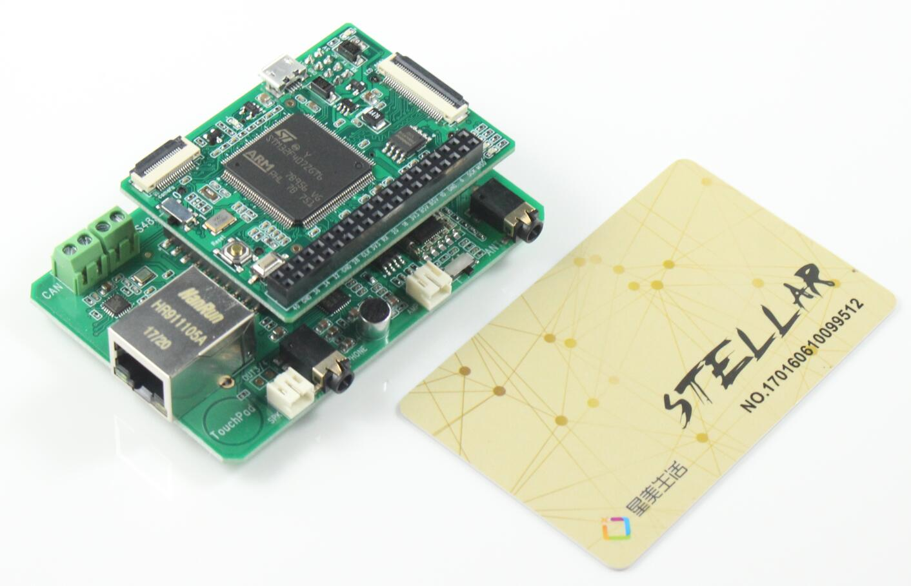
#### 核心板顶面
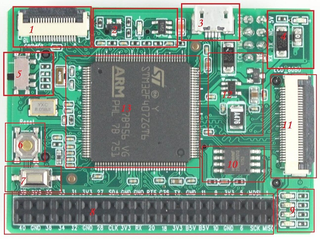
>1. 摄像头接口。
>2. USB电源控制电路，实现HOST和DEVICE两种工作状态切换。
>3. usb接口，做HOST时通过OTG转接线转接。
>4. 调试口电源和电源指示灯。
>5. BOOT0选择。拨到下方1状态，进入ISP下载模式，也即是系统区启动。拨到上方0，则从用户FLASH控件启动。
BOOT1通过跳线电阻控制，焊接R105，则连接到高电平；焊接R103则连接到低电平。默认焊接R103，不焊R105。
>6. 复位按键
>7. 用户按键
>8. 外扩接口
>9. LED灯
>10. SPI FLASH
>11. LCD接口，包含触摸屏信号。
>12. 电源电路
>13. 主芯片

#### 核心板底面
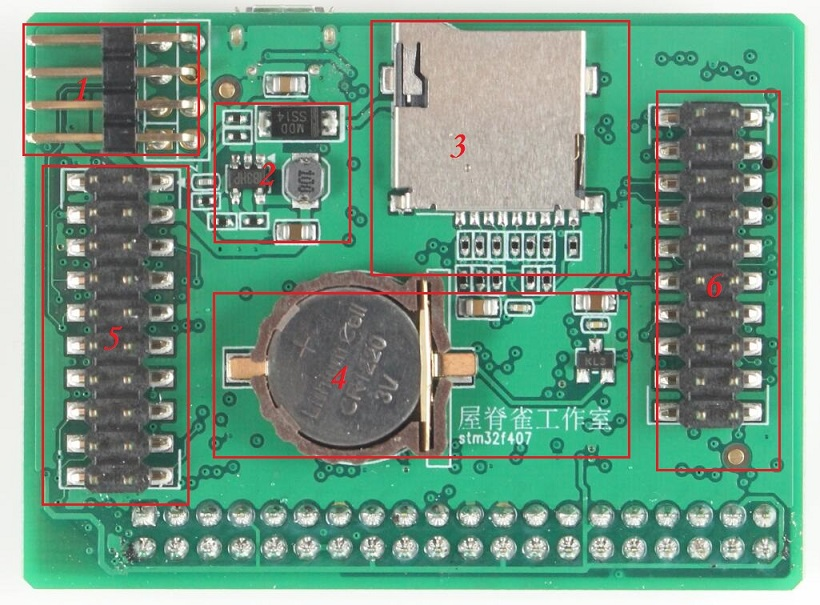
>1. 调试口接口，包含SW调试信号，串口，电源。
>2. 5V升压电路。
>3. TF卡座。
>4. 纽扣电池
>5. 与底板接口
>6. 与底板接口

#### 底板
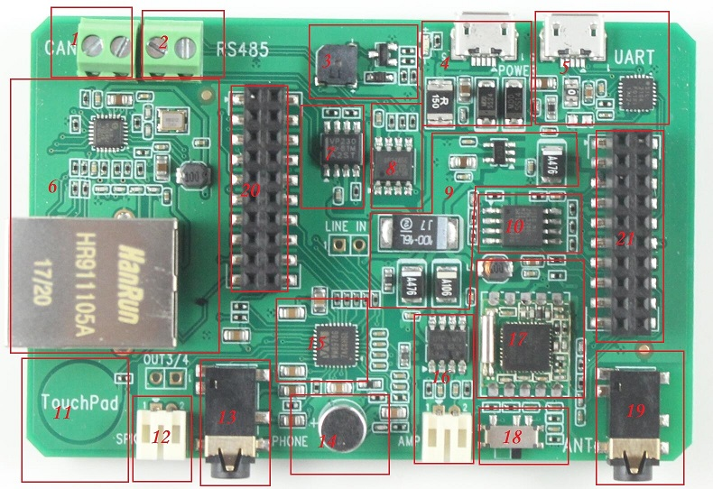
>1. CAN座子，左边是CANL，右边是CANH。
>2. RS485座子，左边是A，右边是B。
>3. 蜂鸣器
>4. 电源输入，使用MICOR USB接口，保险为1.5A，可直接用手机充电器供电。
>5. USB转串口，同时可做电源输入，保险为1A。
>6. 网口与网络电路。
>7. can芯片
>8. RS485芯片。
>9. 电源电路
>10. SPI FLASH
>11. 触摸按键
>12. 语音芯片喇叭接口
>13. 语音芯片耳机接口
>14. 语音芯片MIC
>15. 语音芯片WM8978
>16. 功放和喇叭接口。
>17. 收音机芯片TEA5767
>18. 功放音源选择，选择DAC语音或收音机声音做为输入。
>19. 收音机天线座子
>20. 与核心板接口
>22. 与核心板接口

#### 关键器件规格参数
- 核心板

|-|型号|规格|
|-|-|-|
|CPU|STM32F407ZG|1M FLASH，128K+64K RAM, |
|5V升压|MP1541|500MA|
|LDO|aic1733-33pvt|500ma， 3.3V，700ma关断|
|SPI FLASH|W25Q64FVSI|64MBit，8MByte|

- 底板

|-|型号|规格|
|-|-|-|
|LDO|aic1733-33pvt|500ma， 3.3V，700ma关断|
|SPI FLASH|MX25L3206EM2I-12G|32MBit|
|usb-uart|CP2104|-|
|网络|LAN8720A|-|
|音频|WM8978|-|
|CAN|SN65HVD230DR|3.3V|
|485|SP3485E|-|
|收音机|TEA5767|-|
|音频功放|TDA2822G|-|

#### 接口说明
- 液晶接口
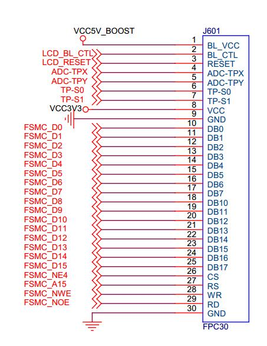
>1. LCD接口为8080接口，16位总线。
>2. 有两根电源线，电压分别是5V和3.3V，5V由升压芯片提供。
>3. 包含4根触摸屏控制信号，如果使用XPT2046，则用作模拟SPI，
如果使用ADC转换检测触摸屏，则作为ADC和IO.

- 摄像头接口
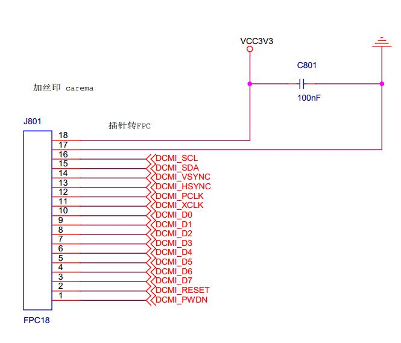
>标准通用的DCMI接口摄像头。

- 核心板接口
*下图是核心板的信号接口，实物上排针是放在底面，需要做镜像处理，细节请查看位号图和信号说明图*
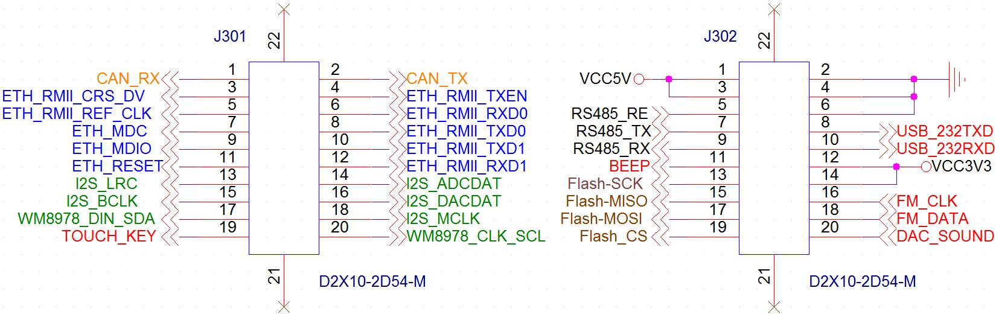

- 调试接口
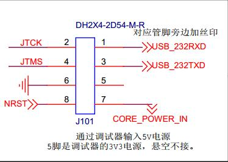
>1. 包含SW调试信号，串口，5V电源。
>2. 兼容屋脊雀设计的CMISIS DAP、DAPLink。
>3. 调试串口同时通过底板经过CP2104转换后经USB输出。

- 外扩接口
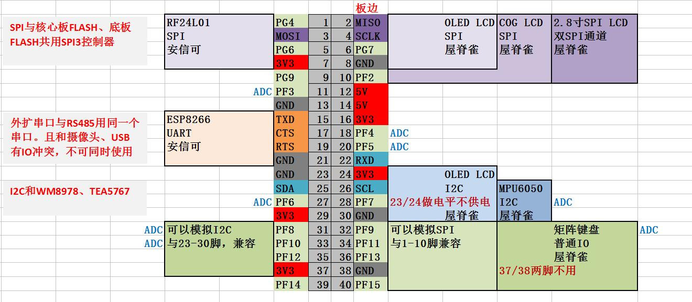
**精心设计**
1. 主要包含4个功能区域：SPI、串口、I2C、普通IO。
2. SPI区域可以直接接安信可RF24L01、OLED LCD(spi)、COG LCD、2.8寸SPI TFTLCD。图上的方向就是模块方向，例如RF24L01，就是PCB朝核心板内插。
3. 外扩串口可以直接插安信可的ESP8266模块。
4. I2C可接OLED LCD(i2c)，管脚跟SPI兼容，也就是说，你买一个我们的OLED LCD模块，这个模块通过跳线电阻选择是SPI接口还是I2C接口，然后就可以接到这个外扩接口的I2C或者是SPI接口上。
5. 外扩普通IO，布局和SPI/I2C兼容，意味着可以使用这些IO模拟SPI或者是I2C。我们的模块就可以接到这个模拟的接口上。
做普通IO口使用，可以接我们的4*4矩阵按键。

**外扩接口具体使用方法请查看《基本使用手册》**

- 串口

在外扩接口上有一个外扩串口，但是跟USB、摄像头共用了几个IO。
如果你希望使用一个串口，并且使用摄像头，例如：使用一个摄像头并且用串口接ESP8266模块。
可以这样：
>1. 不使用调试口上的调试串口。
>2. 用杜邦线将ESP8266模块串口接到调试串口。
>3. 其他控制IO用外扩普通IO。
>4. 禁止掉程序的所有调试信息。

-

#### 电源总图
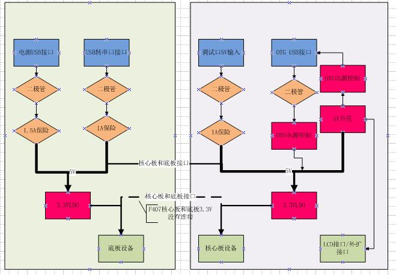
上图是核心板和底板电源树。
左边是底板，右边是核心板。
底板将5V和3V3通过接口向核心板提供连接。
我们的F407核心板只是连接5V，3V3没有接。核心板使用自己LDO将5V转为3V3。

1. 底板有两路电源输入，都是USB MICRO接口。其中一路是独立电源输入，串1.5A保险，可以用手机充电器供电。另外一路是USB转串口，在用串口时，也可以对系统供电，串的保险是1A。
2. 底板有3V3 LDO，理论提供500ma电流，实际上是700ma关断。
3. 核心板同样有两路电源输入，一路是OTG USB，另外一路是调试口输入。调试接口这路加有二极管和1A保险。OTG USB口输入电源只有二极管没有保险丝。
4. 调试电压输入是通过CMSIS DAP或者DAPLink接入的5V，这个5V通常也是由电脑提供，通常只能提供500ma电流。
5. 为了实现OTG，核心板除输入电源转3.3V外，还有两个电源模块：一个是将输入电源升压到5V；另外就是OTG电源输入输出切换电路。
6. 5V升压理论能提供500ma电流，目前除了提供给USB外，还连接到外扩接口和LCD接口。屋脊雀的LCD模组带LDO，因此通常使用的是升压后的5V供电。
7. 四路电源输入全部是5V输入，可以随便接。也可以同时接多个，多个能提供更多电流，不会造成倒灌。

#### 常用模块功耗
一些列表为一些常用模块功耗，如果使用中发现LCD屏幕背光抖动，或者其他异常，可能是电源不足，压降太大，请将底板的1.5A电源接上。
- 以下电流都是以工作电压测量，如有必要，请自行转换为5V输入端电流。

|模块|工作电压|电流|
|-|-|-|
|COG LCD |3.3V|60ma，背光亮|
|OLED LCD |3.3V|20ma，全屏点亮|
|2.8 tft LCD |3.3V|100ma，全屏点亮，其中背光80ma|
|RF24L01|3.3V|-|
|407核心板空载|3.3V|60ma|
|底板|3.3V|200ma|

#### 注意事项

* USB口电源切换问题

为了实现OTG用一个micro接口，我们设计了一个电源切换电路。
  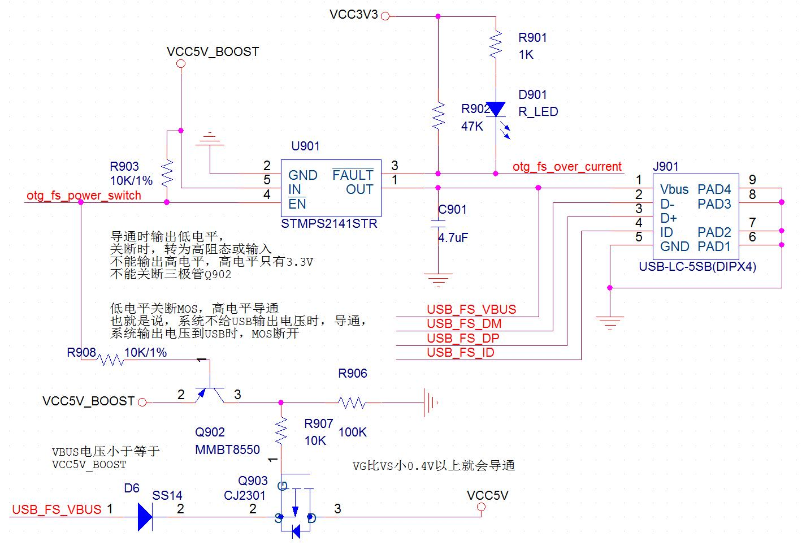

`接U盘，STM32作为HOST`，otg_fs_power_switch输出低电平，升压得到的5V通过U901输出，供电给U盘，同时Q903 MOS管关断，防止USB_FS_VBUS反向倒灌到系统5V电源。
`接电脑，STM32作为DEVICE`，otg_fs_power_switch转输入或者高阻态，U901关断，Q903导通，USB_FS_VBUS供电给核心板使用。
电路没加保险丝，也没有二极管保护。当LCD，摄像头等都接上时，电流可能大于500ma，直接接电脑可能会过流，建议通过带电源的HUB接到电脑。

- RS485 IO共用问题

在进行硬件设计时，尽可能的少造成IO复用。为了提供一个干净的串口用于调试、命令行交互。只好将485和外扩接口共用，并且和USB、摄像头IO口有复用。
复用细节在原理图有标注。
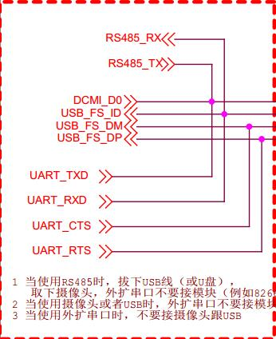

|-|RS485|外扩串口|摄像头|USB|
|-|-|-|-|-|
|RS485|-|冲突|冲突|冲突|
|外扩串口|冲突|-|冲突|冲突|
|摄像头|冲突|冲突|-|-|
|USB|冲突|冲突|-|-|

* FM性能

1. 板载的TEA5767毕竟是一个小模组而已，性能无法和收音机相比。
2. 电脑电源会带来干扰，降低收音机灵敏度，用充电宝供电并且断开与电脑所有连接，效果会提升不少。
3. 配套的天线只能做功能测试，如果效果不好，可以在天线尾端接一段导线，并且将导线挂到高处。导线并不是越长越好，太长反而会引入其他干扰。按照FM的波长，天线总长65厘米左右，实测接一段60厘米的导线效果不错。
4. 空旷处（窗户边）肯定比室内效果要好。
5. 网络、摄像头、USB、SD卡、TFT LCD屏等，在运行时，都会发射干扰，降低收音机灵敏度。如要解决这个问题，需要增加屏蔽措施，考虑毕竟只是一块开发板，决定不做如此复杂,而且经过测试，在收音机信号良好的情况下，干扰影响不大。
6. 通过WM8978播放收音比TDA2822效果要好（工作室没能力调音，TDA2822单声道，WM8978立体声）。

* 核心板插拔
本开发板布局比较紧密，很多器件都靠板边。在插拔式如不注意，可能会造成损坏。
建议插拔时：
1 先取下核心板周围的所有附件，例如摄像头、TFT lcd、USB线、外扩IO口上的所有器件。
2 从底部往上顶，慢慢取出核心板。
3 核心板左边的BOOT拨动开关、上边沿的miscro USB接口，禁止受力。
4 拔核心板时，两个排针要慢慢轮流拔出，不要一下子拔出一边，否则排针将**变歪**。

---
end
---
